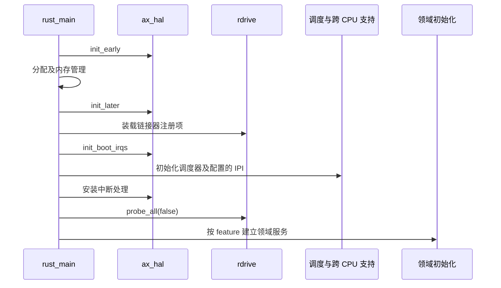

# 系统启动与驱动集成

系统集成连接平台初始化、设备发现和领域服务。ArceOS 的 `ax-runtime` 组织主要宿主启动流程，StarryOS 提供用户态设备语义，Axvisor 区分宿主资源与 guest 模型。集成层不重新实现设备描述符或领域调度算法。

## 1. 启动依赖

`os/arceos/modules/axruntime/src/lib.rs` 的 `rust_main()` 是主启动顺序的依据。内存、平台 IRQ 和调度基础设施需要在相应消费者使用之前就绪。

### 1.1 早期与平台初始化

`rust_main()` 先调用 `ax_hal::init_early()`，完成内存相关初始化后调用 `ax_hal::init_later()`。若 `rdrive` 已初始化，随后装载链接器注册项并调用 `ax_hal::irq::init_boot_irqs()`；未初始化时记录跳过相应阶段的警告。

`registers.rs` 的 `append_linker_registers()` 读取注册项链接区间，不能把它及全部早期 probe 都笼统归入平台 `init_later()`。早期资源发现与具体 HAL 路径见[探测与初始化](probe.md)。

### 1.2 调度与普通设备

平台准备后初始化调度器，释放 bootstrap 抢占状态，按 feature 安装 IPI 跨 CPU 同步回调，再初始化中断处理并执行 `devices::probe_all_devices()`。

```mermaid
sequenceDiagram
    participant Main as rust_main
    participant HAL as ax_hal
    participant Registry as rdrive
    participant Tasks as 调度与跨 CPU 支持
    participant Domain as 领域初始化
    Main->>HAL: init_early
    Main->>Main: 分配及内存管理
    Main->>HAL: init_later
    Main->>Registry: 装载链接器注册项
    Main->>HAL: init_boot_irqs
    Main->>Tasks: 初始化调度器及配置的 IPI
    Main->>HAL: 安装中断处理
    Main->>Registry: probe_all(false)
    Main->>Domain: 按 feature 建立领域服务
```

`probe_all(false)` 仍可能返回发现后端错误。领域初始化的缺设备行为也不同，不能把“个别 probe 允许失败”扩大为启动过程忽略所有错误。

## 2. 宿主领域接入

集成代码获取设备并转换资源，领域运行时维护后续状态。各功能具有自己的初始化条件，不必经过同一个工厂。

### 2.1 消费入口

`devices.rs` 组织显示、输入、网络及 vsock 接入，串口具有独立 `serial/` 路径，存储服务由文件系统领域消费。平台 provider 则供 HAL 和其他绑定查询。

| 领域 | 接入操作 | 交付后的职责 |
| --- | --- | --- |
| 串口 | `serial::init()` 与控制台交接 | 字节、日志、控制请求及紧急输出 |
| 显示 | take 后构造 `RdifDisplayDevice` | 帧缓冲、flush 及显示事件 |
| 输入 | take 后构造 `RdifInputDevice` | 输入能力与事件 |
| 块 | IRQ 来源转换和 `BlockRuntime` | 请求、卷及文件系统 |
| 网络 | `collect_net_devices()`、prepare 与 builder | 帧端口及协议服务 |
| vsock | `ax_net::init_vsock()` | 连接及事件 |
| USB | 系统主机管理查询 `PlatformUsbHost` | 主机 init、枚举与设备视图 |

`rd-display`、`rd-input` 和 `rd-vsock` 不是当前统一运行时包名；显示输入包装位于各自 ArceOS 模块。服务内部状态见[领域服务](services.md)。

### 2.2 资源与默认策略

HAL IRQ 适配位于 `os/arceos/modules/axruntime/src/irq.rs`，把领域注册要求映射为平台 action。网络适配明确提供固定 CPU 合同，USB 与串口有自己的事件 handler 和 bridge，不能互相替换。

当前网络 `parse_network_config()` 返回默认配置，TX 选择 64 帧有界 FIFO；无物理网卡时建立空端口协议服务。显示输入也有空设备输入路径。根文件系统、控制台和网络配置的选择是不同策略，不由 `rdrive` 决定。

## 3. 系统消费边界

不同系统复用硬件能力，但保留不同用户接口、地址空间和生命周期。设备类别相同不能作为合并状态的理由。

### 3.1 StarryOS

StarryOS 复用宿主绑定和领域模块，在内核系统层提供文件描述符、设备节点与相应 ABI。USBFS 的 `manager.rs`、`tree.rs` 和 `irq.rs` 位于 `os/StarryOS/kernel/src/pseudofs/usbfs/`，管理主机、枚举视图和事件接入。

块卷与文件系统、输入事件与用户读取、显示帧缓冲与用户映射分别存在适配边界。硬件核心不直接操作 Linux 文件描述符，系统也不为同一资源另建竞争的注册身份。

### 3.2 Axvisor

Axvisor 宿主 HAL 可以按需要查询中断控制器等 provider，guest 模拟设备由 `virtualization/axdevice` 与 `virtualization/axdevice_base` 等组件实现。guest 设备不是 `probe_all()` 的普通宿主输出。

设备直通涉及原 owner、IRQ、DMA 和地址空间交接，不能仅从宿主注册表移除一个对象就认定安全。块领域的 `release_block_irqs_for_passthrough()` 和时钟 provider 的寄存器保护各自覆盖不同边界。

## 4. 外部平台

外部平台需要提供设备描述与基础资源能力，框架不能从软件包 feature 推导硬件布局。Static 来源用于显式接入，不放宽领域合同。

### 4.1 来源与 provider

FDT 或 ACPI 平台通过 `init_sources()` 建立发现后端，PCI 枚举依赖主控制器已发布。Static 回调构造设备时仍需真实 MMIO、DMA 和 IRQ 来源，不能复制其他板卡裸地址或中断数值作为通用配置。

时钟、复位、引脚和中断 provider 的启动顺序沿平台代码与 probe 核对。平台通用入口见[设备发现](../platform/devices.md)，资源描述由[平台资源](resources.md)维护。

### 4.2 执行能力与失败

固定路由、跨 CPU 同步、DMA domain、事件服务和定时等待都需要对应平台能力。某个 feature 可编译不保证全部领域运行时可以在该平台建立。

初始化日志应区分未链接、未匹配、资源失败、接管失败和服务失败。已注册 action 或硬件可访问的内存必须按[生命周期](lifecycle.md)处理，不能统一析构后继续报告可用。
