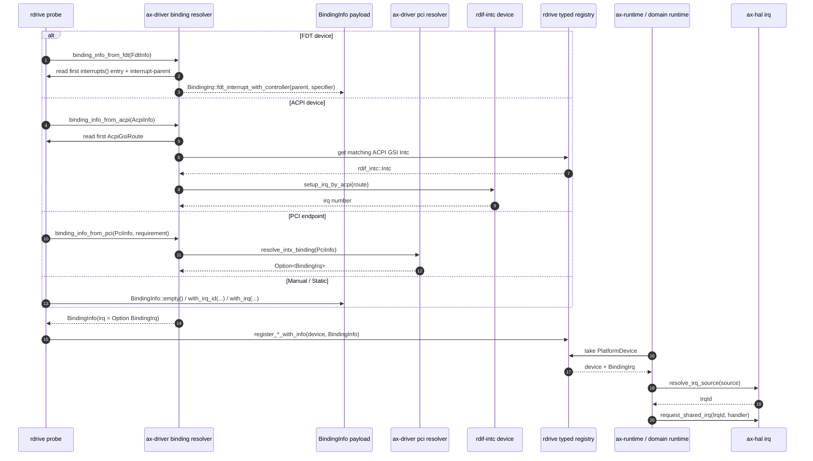
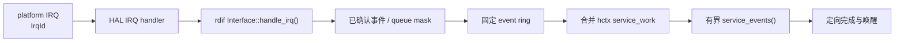

# IRQ 解析与注册

IRQ 路径使用 domain 化的 `IrqId` 作为运行时注册 key。FDT、ACPI、PCI、manual/static 注册都会先得到一个 `BindingInfo`，再经 `register_*_with_info` 注册到 `rdrive`。`rdrive` 只把 ACPI/FDT probe metadata 交给 resolver，不把平台 IRQ route/source 记录混进自己的设备 registry。

核心源码：

| 源码 | 职责 |
| --- | --- |
| `drivers/ax-driver/src/binding_info.rs` | `BindingInfo`、`BindingIrq`、`BindingIrqSource`、`PciIrqRequirement` |
| `drivers/ax-driver/src/binding_resolver.rs` | FDT/ACPI/PCI IRQ binding 解析入口 |
| `drivers/interface/rdif-base/src/irq.rs` | `IrqId`、`IrqSource` 类型 |
| `components/irq-framework/` | `AcpiGsiRoute`、IRQ domain 框架 |

## BindingInfo 模型

`BindingInfo` 是 probe 阶段携带的 IRQ 元数据，可以携带已经解析好的 `IrqId`，也可以携带待平台解析的 firmware source：

```rust
pub struct BindingInfo {
    irq: Option<BindingIrq>,
}

pub enum BindingIrq {
    Id(IrqId),                       // 已解析的 domain IRQ ID
    Source(BindingIrqSource),        // 待平台解析的 firmware source
}

pub enum BindingIrqSource {
    AcpiGsi(u32),                    // ACPI 裸 GSI
    AcpiGsiRoute(AcpiGsiRoute),      // ACPI GSI route（含 trigger/polarity/controller）
    FdtInterrupt(FdtIrqSpec),        // FDT interrupt specifier
}

pub struct FdtIrqSpec {
    pub controller: DeviceId,        // interrupt-parent 对应的 intc 设备
    pub cells: Vec<u32>,             // interrupt specifier cells
}
```

关键边界：generic driver probe 不调用 `rdif_intc::setup_irq_by_fdt()` 取得裸数字，避免把 GIC/PLIC/PCH 等控制器本地线号混进 legacy IRQ namespace。

## 解析时序



这个边界让平台 IRQ namespace 解析留在平台 resolver 侧：

## 各来源解析规则

### FDT 设备

FDT 设备读取第一个 `interrupts()` 项并连同 `interrupt-parent` 保存为 `BindingIrq::fdt_interrupt_with_controller(...)`。`FdtIrqSpec.controller` 是 interrupt-parent phandle 解析后对应的 `DeviceId`（已注册的 `rdif-intc` 设备），`cells` 是原始 interrupt specifier。运行时在注册 handler 前调用 `ax_hal::irq::resolve_irq_source(...)`，由平台 IRQ resolver 解析并执行 interrupt-controller setup。

### ACPI 设备

ACPI PCI INTx route 保存为 `BindingIrq::acpi_gsi_route(...)`，保留 trigger、polarity、controller 和 input 等元数据。x86 IOAPIC 等平台 resolver 使用这些信息执行控制器 setup，而不是把 route flatten 成裸 GSI。普通 ACPI 设备读取第一个 `AcpiGsiRoute`，先从 registry 查询匹配的 ACPI GSI Intc，调用 `setup_irq_by_acpi(route)` 取得 irq number。

### PCI endpoint

PCI 设备先在枚举阶段计算 INTx swizzle route，再由 `ax-driver::pci::resolve_intx_binding()` 按以下顺序返回 `BindingIrq`：

1. ACPI route（`_PRT` 表）
2. FDT `interrupt-map`
3. 已注册 legacy route
4. `interrupt_line` 配置空间 fallback

静态或未 domain 化平台仍可返回 legacy IRQ 作为兼容入口。PCI endpoint 的 IRQ 有 optional/required 之分：

```rust
pub enum PciIrqRequirement {
    Optional,   // 无中断也可注册为 None
    Required,   // 必须解析出 IRQ，否则 probe error
}
```

### Manual / Static

无中断的设备注册为 `BindingInfo::empty()`（`irq = None`）。静态平台可以直接使用 `BindingInfo::with_irq_id(IrqId)` 或 `with_irq(legacy_irq)` 携带已解析的 IRQ。

## 上层 IRQ 注册

`ax-runtime`、`ax-hal`、`ax-net-ng`、StarryOS usbfs 等上层以 `IrqId` 注册 handler。需要处理 firmware source 的地方应先经 `resolve_irq_source(...)`，不应自行做 `usize` 算术换算。

网络 IRQ 的 runtime 适配遵循同一方向。`ax-net-ng` 只暴露网络领域自己的 `EthernetIrqAction`、`EthernetIrqOutcome` 和注册错误类型，不再在公开 registrar trait 中泄漏 HAL IRQ 细节。`ax-runtime` 持有 HAL IRQ registration，并把 `EthernetIrqAction` 放入 boxed HAL callback；因此网络 runtime 只描述“是否需要唤醒 poll 方”，HAL 注册形态留在 ArceOS runtime 边界内。

设备独占移交不能只把 host action 设为 disabled。disabled action 仍在 IRQ descriptor 中参与 share mode、affinity 与 execution compatibility 检查，也仍表示一个 host owner。块设备 passthrough 因此使用线性 detached-action token：先 mask 设备 source、disable 并 drain host action，再从 descriptor 真正移除 action，同时把 move-only callback 保存在 opaque token 中。guest action 只有在 host action 已移除后才能注册；guest 退出时先撤销并释放 guest action，再把 host token 以 disabled 状态重新注册，随后运行 controller reinitialize，最后才 enable host action 与设备 source。detach/reattach 任一步失败都会保留唯一 token 或 action owner 并隔离设备，不能通过放宽共享或 affinity 规则继续运行。

## rdif 内部 IRQ 事件

部分 `rdif-*` 能力接口（如 `rdif-block`、`rdif-display`、`rdif-input`、`rdif-vsock`）提供 IRQ endpoint。这些 endpoint 只识别并确认中断源、生成稳定的 queue-local 事件，不做 OS wake、不阻塞、不持有 OS 锚，也不在中断上下文推进慢路径完成。

例如 `rdif-block` 的 `IrqSourceInfo { id, queues }` 描述该硬件事件 source 可能影响的 queue mask，它不是平台 FDT/PCI IRQ source，也不写入 `rdrive` 或 `BindingInfo`。IRQ action 把 `IrqOutcome` 中已经确认的事件写入固定 event ring，并从 hard IRQ 合并相应 hctx 的预分配 `service_work`。若驱动显式返回 deferred destructive acknowledgement，worker 必须先确认和分类该 source，再消费 completion state；普通 task path 不得重新读取或 W1C 全局 IRQ status。

`ax-runtime::block` 使用共享的 per-CPU high-priority worker pool执行 hctx work item，而不是为每条 queue 永久占用一个线程。每个 hctx 同时最多只有一个串行 work item，重复的 submit/IRQ/timeout/cancel cause 通过原子状态合并；单次 callback 至多处理固定 batch，剩余工作返回 requeue。watchdog 只与 terminal completion 竞争并触发恢复，不调用驱动探测 completion。

固定 event ring 溢出或 work admission 失败属于 controller 不变量破坏。block IRQ action 此时返回 `IrqReturn::QuenchAndWake`：IRQ framework 在本次 dispatch 返回前清除该 action 的 enabled gate，并立即屏蔽整条 backing line。共享 IRQ 的其他 action 保持逻辑 enabled，但在故障设备仍可能持续拉住电平时不能继续承受中断风暴。恢复 work 必须先成功执行设备 source mask，随后才能通过 action-owned `release_quench` 释放线路隔离；多个 action 同时 quench 时必须全部释放，peer 才重新获得线路。之后再完成 IRQ synchronize、DMA quiesce 和完整 reinitialize。该协议借鉴 Linux descriptor mask 与 deferred recovery 的所有权顺序，但把“设备源已屏蔽”作为显式 release 前置条件。

`rdif-serial` 同样把 hard IRQ 限制为固定 RX/TX/pass budget。`SerialIrqOutcome::budget_exhausted` 表示硬件或软件队列可能仍有工作，上层不能丢弃该状态：OS glue 应将它合并成 task-context 事件，再用 `SerialSoftWork::RESERVICE` 按固定批次继续推进。service thread 的单次 activation 也必须有固定事件批次上限；持续流量达到上限时保留 pending bit、显式 yield，再进入下一批。这样既不把 UART burst 变成无界 IRQ 或内核线程占用，也不会因为 controller EOI 或 level/edge 状态变化而遗失剩余数据。


