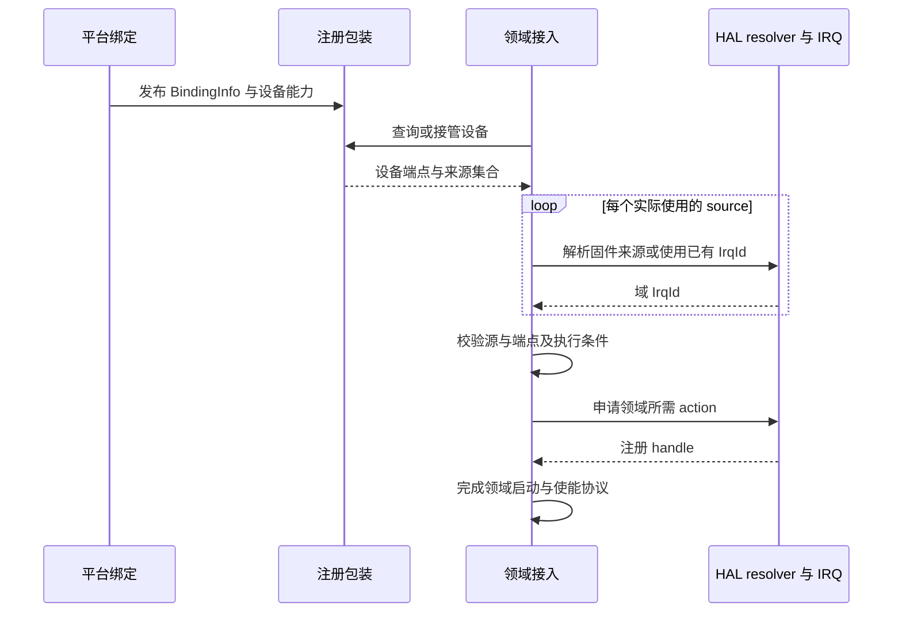

# 中断来源、注册与事件交付

IRQ 路径使用 domain 化的 `IrqId` 作为运行时注册标识。`ax-driver::BindingInfo` 保存驱动局部 source ID 与平台 IRQ 的映射；映射值可以是已解析的 `IrqId`，也可以是等待平台解析的固件来源。probe 注册设备时保留来源语义，运行时完成解析后再申请 HAL action。

## 1. 中断源模型

平台中断号、固件 specifier 和设备局部 source ID 具有不同作用域。`BindingIrqBinding` 将局部身份与平台来源关联，`NetHardIrqEndpoint` 等设备端点只引用自己的局部身份，不通过算术推导控制器线号。

平台来源、设备局部 source 与运行时 action 在不同阶段建立。设备事件由各领域解释，不能把网络 group 调度定义成所有驱动的中断模型。


### 1.1 多源绑定

`drivers/ax-driver/src/binding_info.rs` 使用一个映射向量保存完整中断拓扑。单个设备可以关联多个中断来源，多个端点也可以最终映射到同一个物理 `IrqId`。

```rust
pub struct BindingInfo {
    irqs: Vec<BindingIrqBinding>,
}

pub struct BindingIrqBinding {
    pub source_id: usize,
    pub irq: BindingIrq,
}

pub enum BindingIrq {
    Id(IrqId),
    Source(BindingIrqSource),
}
```

`BindingInfo::with_irq_sources()` 保存调用方提供的映射，不自动完成领域拓扑校验。网络运行时通过 `validate_and_collect_irq_sets()` 检查每个 endpoint 的 source 唯一匹配，并拒绝没有端点消费的映射项；`collect_net_devices()` 还检查 source ID 能否转换为 `NetIrqSourceId` 使用的 `u16`。

### 1.2 来源与查询

`BindingIrqSource` 保留 ACPI GSI、带控制器及触发属性的 ACPI route，以及带 interrupt-parent 的 FDT specifier。控制器编号和原始单元在解析前不折叠成通用裸整数。

| 类型或方法 | 语义 |
| --- | --- |
| `BindingIrqSource::AcpiGsi(u32)` | 兼容的裸 GSI 来源 |
| `BindingIrqSource::AcpiGsiRoute(AcpiGsiRoute)` | 保留 trigger、polarity、controller、input 等路由属性 |
| `BindingIrqSource::FdtInterrupt(FdtIrqSpec)` | 保存 `controller: DeviceId` 与原始 `cells: Vec<u32>` |
| `with_binding_irq(Some(irq))` | 建立 source 0 的单源映射 |
| `with_irq_id(Option<IrqId>)` | 保存已解析 ID；`None` 产生空映射 |
| `with_irq(Option<usize>)` | 经受检 legacy 转换构造映射，可能返回 `IrqError` |
| `irq_sources()` | 返回完整映射，供多源运行时消费 |
| `irq_for_source(source_id)` | 按明确 source 查询 |
| `irq()` | 优先 source 0，否则取第一项，仅供单源便利查询 |

`irq_num()` 只在 binding 可表示为 legacy number 时返回数字，不能代替 `irq_sources()` 或 `IrqId` 注册。`BindingInfo::empty()` 表示没有来源，能否工作由领域合同决定；网络和块完成路径的约束不能替代串口或输入已有的轮询策略。

## 2. 平台来源解析

`drivers/ax-driver/src/binding_resolver.rs` 将 FDT、ACPI 和 PCI probe 元数据转换成 `BindingIrq`。这些 helper 与运行时 `resolve_binding_irq()` 分工：前者保留设备来源，后者调用 HAL resolver 得到可注册的 domain IRQ。

### 2.1 FDT 来源

`binding_info_from_fdt()` 经 `resolve_fdt_irq()` 读取第一个 `interrupts()` 项，将 interrupt-parent 转换为已注册控制器的 `DeviceId`。`binding_irq_from_fdt_interrupt()` 检查对应 `rdif_intc::Intc` provider 存在，再保存原始 specifier，不在 generic probe 中调用控制器 setup 获得裸线号。

命名中断由 `binding_irq_from_named_fdt_interrupt()` 按 `interrupt-names` 选择对应项。多源设备需要显式组合各来源并调用 `with_irq_sources()`；单源 helper 不会因为底层使用向量就自动收集全部固件中断。

### 2.2 ACPI 来源

`binding_info_from_acpi()` 读取 `AcpiInfo::irq_route()`，`binding_info_from_acpi_route()` 接收显式 route；二者通过 `BindingIrq::from` 保留路由。当前 helper 不查询控制器后立即执行 `setup_irq_by_acpi()`，控制器配置留到平台 resolver 解析阶段。

ACPI PCI INTx 同样保留 `AcpiGsiRoute` 中的触发方式和极性。将 route 提前压成裸 GSI 会丢失控制器 setup 所需信息，也无法正确表达不同固件来源的 domain 关系。

### 2.3 PCI 与静态来源

`binding_info_from_pci()` 调用 `ax-driver::pci::resolve_intx_binding()` 获取 INTx binding。PCI 枚举和 resolver 处理 swizzle 与 ACPI/FDT 路由，probe 根据设备要求传入 `PciIrqRequirement`。

| 要求或来源 | 处理 |
| --- | --- |
| `PciIrqRequirement::Required` | 不能解析 IRQ 时返回 probe 错误 |
| `PciIrqRequirement::Optional` | 允许空 binding，由领域契约判断设备能否运行 |
| 已解析静态中断 | `BindingInfo::with_irq_id(Some(irq))` |
| 静态多源设备 | `BindingInfo::with_irq_sources()` 显式保存局部 ID 映射 |
| 不使用中断的设备 | `BindingInfo::empty()` |

静态来源和 legacy 入口不放宽网络的固定亲和要求。一个 `Optional` 来源能注册进设备 registry，并不保证 `NetworkRuntimeBuilder` 会接受缺失 endpoint 映射的物理网卡。


### 2.4 解析与注册时序

来源解析解决“哪一个域中的中断”，注册解决“哪一个 callback 在什么上下文执行”。二者之间还有领域端点校验，不能解析成功后就直接宣称设备可运行。


```mermaid
sequenceDiagram
    participant Probe as 平台绑定
    participant Registry as 注册包装
    participant Consumer as 领域接入
    participant HAL as HAL resolver 与 IRQ
    Probe->>Registry: 发布 BindingInfo 与设备能力
    Consumer->>Registry: 查询或接管设备
    Registry-->>Consumer: 设备端点与来源集合
    loop 每个实际使用的 source
        Consumer->>HAL: 解析固件来源或使用已有 IrqId
        HAL-->>Consumer: 域 IrqId
    end
    Consumer->>Consumer: 校验源与端点及执行条件
    Consumer->>HAL: 申请领域所需 action
    HAL-->>Consumer: 注册 handle
    Consumer->>Consumer: 完成领域启动与使能协议
```

这里不规定所有 action 都必须固定 CPU、共享或初始禁用。实际请求选项由消费者和 HAL 能力决定；网络固定 CPU builder 是其中一种具体实现。

## 3. 硬件事件与任务工作

callback 的操作范围由设备合同决定。公共限制是不能进入不满足 IRQ 上下文要求的操作，而不是禁止所有读取或完成处理。

### 3.1 块队列事件

`drivers/interface/rdif-block/src/irq.rs` 定义 `HardIrqHandler::ack()`、`IrqAck` 和队列掩码。`fs/ax-fs-ng/src/block/runtime/irq.rs` 根据 `Spurious`、`Cleared`、`MaskedNeedsRearm` 及控制事件发布 latch，再通过 IRQ-safe notify 唤醒维护者。

callback 不持有 `HardwareQueue`，队列维护者在已确认事件后调用 `drain_completions()`。存在队列目标时由目标完成 drain 再 rearm，避免控制器路径同时提前解除屏蔽；控制器专属事件使用对应回退目标。

### 3.2 串口事件

`rdif-serial::UartIrq::handle()` 返回有界 `SerialIrqReport`，包括事件和接收样本。IRQ 端点可以按合同取得硬件 RX 样本，但不调用运行时业务代码或写 TX FIFO；因此不能用网络“硬 IRQ 不复制帧”的规则禁止串口的有界接收报告。

IRQ 端点的 `mask()` 只处理 UART 局部源，不能关闭共享控制器线。任务侧 `UartPort::rearm()` 返回启用后已就绪的源，交给 `SerialWorker` 继续处理。

### 3.3 USB 与显示输入

xHCI `drivers/usb/usb-host/src/backend/kmod/xhci/host.rs` 的 `EventHandler` 使用锁保护 Event Ring 消费，更新 ERDP 并分发命令、传输和端口事件。事件消费是该 handler 的职责，不应写成“所有硬 IRQ 只能设置一个标志”。

显示的 `handled/changed` 与输入的 `handled/input_ready` 保存不同事件语义。`RdifDisplayDevice` 和 `RdifInputDevice` 由系统模块包装，是否有 IRQ、如何推进事件由各消费方决定，不自动构建块 hctx 或网络 group。

### 3.4 网络组事件

`NetHardIrqHandler::handle_irq()` 执行有界 mask、ack 和快照，返回 `Spurious`、`Schedule(snapshot)` 或 `ProbeDeferred`。当前 builder 对 Schedule 使用 group 级调度，不按 RX/TX 位进入不同协议路径；ProbeDeferred 交给 owner 后续检查。

callback 不排空网络 DMA 队列、不复制包、不执行 smoltcp，也不查全局注册表。`RuntimeNetIrqRegistrar` 将 `Unhandled/Handled/Wake` 转换为 HAL `IrqReturn`，队列预算和 rearm 位于[运行时与完成](runtime.md)。

## 4. 注册与共享

多个设备或端点可以映射到同一个物理中断，但局部 source、域 IRQ 和一次注册的 handle 仍是三种身份。共享还需要匹配执行与亲和条件。

### 4.1 请求条件

网络 `PinnedNetIrqRegistrar` 接收明确 `owner_cpu` 和可移动 action，HAL 适配使用 `NonReentrant`、`Shared`、`AutoEnable::No` 与固定亲和。builder 确认 worker 固定后注册全部 action，随后整体使能；不支持固定路由时拒绝交付。

块设备使用自己的 IRQ action 与目标集合，USB 的 `PlatformUsbHost` 提供 `take_binding_irq_handler()`，串口具有独立 IRQ bridge。它们的注册对象和状态不能替换成网络 lease 类型。

### 4.2 源与设备局部状态

共享线路触发不代表每个设备都有工作。Spurious 表示不属于当前端点或没有对应事件；Handled 和 Wake 也需要结合领域状态判断，不能把任意一次硬件中断记为请求完成。

| 身份 | 保存内容 | 不等同于 |
| --- | --- | --- |
| `source_id` | 驱动局部端点映射 | 硬件控制器输入线号 |
| FDT cells / ACPI route | 固件路由与属性 | 已申请 action |
| `IrqId` | 域化中断身份 | 独占使用权 |
| 注册 handle | 一次 callback 注册 | 设备完整生命周期 |
| 领域事件 | queue mask、字节、端口或 group 状态 | 上层操作已经终态完成 |

多源 helper 要保留完整映射，不能对最终 IRQ 数字去重后丢失设备局部端点关系。

## 5. 停止与故障定位

IRQ 撤销需要处理使能状态与正在执行的 callback；硬件停止还需处理 DMA、FIFO 或端点协议。同步完成不自动代表硬件已停止访问内存。

### 5.1 callback 生命周期

网络 `disable_and_synchronize()` 与 lease 析构分别处理同步和释放，失败时保留相关资源。其他领域需要依据各自 action 与任务状态确认撤销，不推导出全框架已有相同隔离实现。

`rdrive::get_list()` 会分配和获取全局锁，硬 IRQ 所需端点应在注册前发布。设备关闭时不能先释放 callback 引用的状态，再尝试禁用中断。完整资源关系见[生命周期](lifecycle.md)。

### 5.2 失败层次

日志需要区分 provider 未发布、命名中断缺失、源 ID 转换失败、路由不支持、注册亲和冲突以及同步失败。例如 FDT `<0x00 0xdd 0x04>` 需保留父控制器及全部单元，不能直接把 `0xdd` 当作最终 HAL 注册编号。

物理网络的 IRQ 缺失不能以轮询后备掩盖，块完成不得由周期扫描替代，输入和串口则有自己明确限定的推进策略。故障处理以领域合同为准，不能把任一设备类别的策略泛化到所有驱动。
