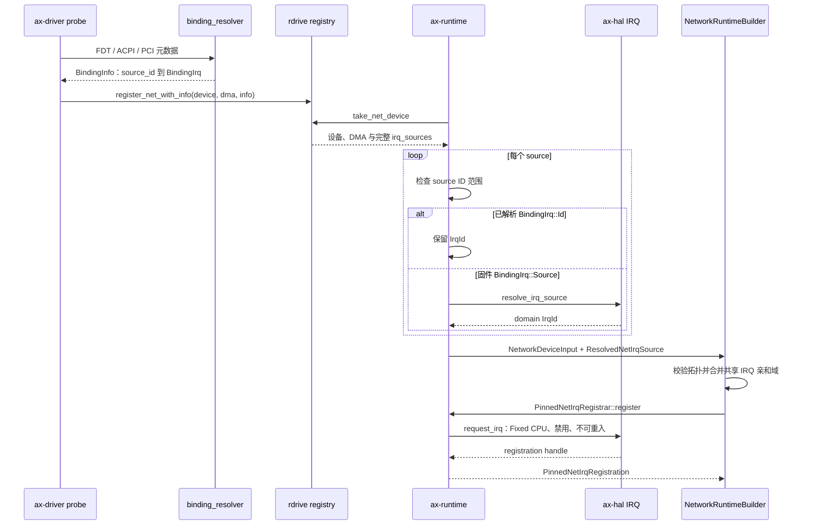

# IRQ 解析与注册

IRQ 路径使用 domain 化的 `IrqId` 作为运行时注册标识。`ax-driver::BindingInfo` 保存驱动局部 source ID 与平台 IRQ 的映射；映射值可以是已解析的 `IrqId`，也可以是等待平台解析的固件来源。probe 注册设备时保留来源语义，运行时完成解析后再申请 HAL action。

## 1. 中断源模型

平台中断号、固件 specifier 和设备局部 source ID 具有不同作用域。`BindingIrqBinding` 将局部身份与平台来源关联，`NetHardIrqEndpoint` 等设备端点只引用自己的局部身份，不通过算术推导控制器线号。

### 1.1 多源绑定

`drivers/ax-driver/src/binding_info.rs` 使用一个映射向量保存完整中断拓扑。单个设备可以关联多个中断来源，多个端点也可以最终映射到同一个物理 `IrqId`。

```rust
pub struct BindingInfo {
    irqs: Vec<BindingIrqBinding>,
}

pub struct BindingIrqBinding {
    pub source_id: usize,
    pub irq: BindingIrq,
}

pub enum BindingIrq {
    Id(IrqId),
    Source(BindingIrqSource),
}
```

`BindingInfo::with_irq_sources()` 保存调用方提供的映射，不自动完成领域拓扑校验。网络运行时通过 `validate_and_collect_irq_sets()` 检查每个 endpoint 的 source 唯一匹配，并拒绝没有端点消费的映射项；`collect_net_devices()` 还检查 source ID 能否转换为 `NetIrqSourceId` 使用的 `u16`。

### 1.2 来源与查询

`BindingIrqSource` 保留 ACPI GSI、带控制器及触发属性的 ACPI route，以及带 interrupt-parent 的 FDT specifier。控制器编号和原始单元在解析前不折叠成通用裸整数。

| 类型或方法 | 语义 |
| --- | --- |
| `BindingIrqSource::AcpiGsi(u32)` | 兼容的裸 GSI 来源 |
| `BindingIrqSource::AcpiGsiRoute(AcpiGsiRoute)` | 保留 trigger、polarity、controller、input 等路由属性 |
| `BindingIrqSource::FdtInterrupt(FdtIrqSpec)` | 保存 `controller: DeviceId` 与原始 `cells: Vec<u32>` |
| `with_binding_irq(Some(irq))` | 建立 source 0 的单源映射 |
| `with_irq_id(Option<IrqId>)` | 保存已解析 ID；`None` 产生空映射 |
| `with_irq(Option<usize>)` | 经受检 legacy 转换构造映射，可能返回 `IrqError` |
| `irq_sources()` | 返回完整映射，供多源运行时消费 |
| `irq_for_source(source_id)` | 按明确 source 查询 |
| `irq()` | 优先 source 0，否则取第一项，仅供单源便利查询 |

`irq_num()` 只在 binding 可表示为 legacy number 时返回数字，不能代替 `irq_sources()` 或 `IrqId` 注册。`BindingInfo::empty()` 表示没有来源，不意味着需要中断的物理设备可以自动切换到轮询。

## 2. 平台来源解析

`drivers/ax-driver/src/binding_resolver.rs` 将 FDT、ACPI 和 PCI probe 元数据转换成 `BindingIrq`。这些 helper 与运行时 `resolve_binding_irq()` 分工：前者保留设备来源，后者调用 HAL resolver 得到可注册的 domain IRQ。

### 2.1 FDT 来源

`binding_info_from_fdt()` 经 `resolve_fdt_irq()` 读取第一个 `interrupts()` 项，将 interrupt-parent 转换为已注册控制器的 `DeviceId`。`binding_irq_from_fdt_interrupt()` 检查对应 `rdif_intc::Intc` provider 存在，再保存原始 specifier，不在 generic probe 中调用控制器 setup 获得裸线号。

命名中断由 `binding_irq_from_named_fdt_interrupt()` 按 `interrupt-names` 选择对应项。多源设备需要显式组合各来源并调用 `with_irq_sources()`；单源 helper 不会因为底层使用向量就自动收集全部固件中断。

### 2.2 ACPI 来源

`binding_info_from_acpi()` 读取 `AcpiInfo::irq_route()`，`binding_info_from_acpi_route()` 接收显式 route；二者通过 `BindingIrq::from` 保留路由。当前 helper 不查询控制器后立即执行 `setup_irq_by_acpi()`，控制器配置留到平台 resolver 解析阶段。

ACPI PCI INTx 同样保留 `AcpiGsiRoute` 中的触发方式和极性。将 route 提前压成裸 GSI 会丢失控制器 setup 所需信息，也无法正确表达不同固件来源的 domain 关系。

### 2.3 PCI 与静态来源

`binding_info_from_pci()` 调用 `ax-driver::pci::resolve_intx_binding()` 获取 INTx binding。PCI 枚举和 resolver 处理 swizzle 与 ACPI/FDT 路由，probe 根据设备要求传入 `PciIrqRequirement`。

| 要求或来源 | 处理 |
| --- | --- |
| `PciIrqRequirement::Required` | 不能解析 IRQ 时返回 probe 错误 |
| `PciIrqRequirement::Optional` | 允许空 binding，由领域契约判断设备能否运行 |
| 已解析静态中断 | `BindingInfo::with_irq_id(Some(irq))` |
| 静态多源设备 | `BindingInfo::with_irq_sources()` 显式保存局部 ID 映射 |
| 不使用中断的设备 | `BindingInfo::empty()` |

静态来源和 legacy 入口不放宽网络的固定亲和要求。一个 `Optional` 来源能注册进设备 registry，并不保证 `NetworkRuntimeBuilder` 会接受缺失 endpoint 映射的物理网卡。

### 2.4 解析时序

网络初始化消费全部 source 映射，再按设备端点将来源解析结果交给 builder。`IrqSource` 的解析与 `IrqRequest` 的 action 注册是两个阶段，不能在图中合并成单一裸 IRQ 注册调用。


```mermaid
sequenceDiagram
    participant Probe as ax-driver probe
    participant Resolver as binding_resolver
    participant Registry as rdrive registry
    participant Runtime as ax-runtime
    participant HAL as ax-hal IRQ
    participant Builder as NetworkRuntimeBuilder
    Probe->>Resolver: FDT / ACPI / PCI 元数据
    Resolver-->>Probe: BindingInfo：source_id 到 BindingIrq
    Probe->>Registry: register_net_with_info(device, dma, info)
    Runtime->>Registry: take_net_device
    Registry-->>Runtime: 设备、DMA 与完整 irq_sources
    loop 每个 source
        Runtime->>Runtime: 检查 source ID 范围
        alt 已解析 BindingIrq::Id
            Runtime->>Runtime: 保留 IrqId
        else 固件 BindingIrq::Source
            Runtime->>HAL: resolve_irq_source
            HAL-->>Runtime: domain IrqId
        end
    end
    Runtime->>Builder: NetworkDeviceInput + ResolvedNetIrqSource
    Builder->>Builder: 校验拓扑并合并共享 IRQ 亲和域
    Builder->>Runtime: PinnedNetIrqRegistrar::register
    Runtime->>HAL: request_irq：Fixed CPU、禁用、不可重入
    HAL-->>Runtime: registration handle
    Runtime-->>Builder: PinnedNetIrqRegistration
```

平台 namespace 解析保留在 resolver 边界。网络只用 `NetIrqSourceId` 连接 driver endpoint 与已解析映射，用 `IrqId` 合并物理亲和域；FDT cells、ACPI route 和 PCI 配置空间不进入队列执行器。

## 3. 网络 action 与生命周期

`net/ax-net/src/queue_runtime/mod.rs` 定义网络注册契约，`os/arceos/modules/axruntime/src/irq.rs` 实现 HAL 适配。网络 runtime 负责指定 action 所有者、注册顺序与失败回滚，HAL 适配负责申请、使能、同步和释放平台中断。

### 3.1 固定 CPU 注册

`PinnedNetIrqAction` 持有只能移动的 `FnMut() -> PinnedNetIrqOutcome`。`PinnedNetIrqRegistrar::register()` 接收 `name`、`IrqId`、`owner_cpu` 和 action，返回初始禁用的 `PinnedNetIrqRegistration`。HAL 请求配置为 `IrqExecution::NonReentrant`、`ShareMode::Shared`、`AutoEnable::No`、`IrqAffinity::Fixed(CpuId(owner_cpu))`。

`assign_affinity_domains()` 将共享物理 IRQ 的轮询组归入同一 CPU。Builder 创建并确认固定 CPU worker 后注册全部 action，再逐项使能；不支持固定路由、共享 action affinity 冲突或 worker 固定失败时拒绝正常交付。不同组可以共享同一个 CPU 执行器，但硬中断只发布自身目标组。

### 3.2 硬中断返回

`NetHardIrqHandler::handle_irq()` 只执行有界 mask、ack 和状态快照。Builder 将端点移入 callback，不通过整机互斥锁调用收发接口。

| 端点返回 | 网络 action 结果与副作用 |
| --- | --- |
| `NetHardIrqResult::Spurious` | `Unhandled`，增加伪中断统计 |
| `NetHardIrqResult::Schedule(snapshot)` | 发布目标组调度状态并返回 `Wake` |
| `NetHardIrqResult::ProbeDeferred` | 记录延后检查并调度目标组，返回 `Wake` |

`RuntimeNetIrqRegistrar` 将网络 `Unhandled/Handled/Wake` 映射成 HAL `IrqReturn`。硬中断不能访问 DMA payload、排空队列、分配帧或运行协议代码。`NetPollIrqControl::rearm_and_check()` 在所有者 CPU 上重新使能并检查窗口内事件；具体队列状态与 deadline 行为由[网络驱动](network.md)定义。

### 3.3 同步与清理

`PinnedNetIrqRegistration` 提供 `owner_cpu()`、`enable()` 和 `disable_and_synchronize()`。`RuntimeNetIrqRegistration` 的同步操作调用 HAL disable 与 synchronize，析构调用 `free_irq()`。网络 builder 在中间失败或 runtime 停止时逆序处理已经取得的 registration。

`release_registrations()` 只有在全部 callback 同步成功后才释放 lease；失败时保留它们及关联运行时资源。同步成功后，固定 CPU 执行器取消事务并调用组的 `shutdown()`，确认 DMA 不再访问队列内存后才释放 backing。`IrqId`、注册 handle 和驱动 source ID 分别代表路由、一次注册和局部来源，生命周期不能互相替代。

## 4. 领域事件与平台来源

设备中断的业务事件不等于平台 IRQ 映射。`rdif-eth::NetIrqSnapshot` 和 `rdif-block::IrqAck` 描述设备内部工作，`BindingInfo` 描述端点从何处接收中断；两者不能共用一个未经解释的数字字段。

### 4.1 网络组事件

网络 `NetIrqSnapshot` 包含 RX、TX、ERROR 位。硬端点以 `NetIrqSourceId` 关联平台来源，返回 snapshot 后由运行时调度组；当前 callback 不将这些位解释为 socket 或协议层事件。`PollGroupState` 与队列局部状态负责保存后续任务所需的可观察条件。

### 4.2 块队列事件

块设备使用独立 boxed `HardIrqHandler::ack()`，返回 `Spurious`、`Cleared` 或 `MaskedNeedsRearm` 及 queue mask、控制事件。HAL callback 将已确认事件合并进预分配 latch，通过 IRQ-safe notify 激活维护线程；维护线程独占 `drain_completions()`，再发布完成订阅。


```mermaid
flowchart LR
    Source[平台 IrqId] --> Callback[HAL callback]
    Callback --> Ack[HardIrqHandler::ack]
    Ack --> Latch[原子 latch / queue mask]
    Latch --> Notify[IRQ-safe notify]
    Notify --> Owner[hctx 维护线程]
    Owner --> Drain[drain_completions]
    Drain --> Completion[发布完成订阅]
```

queue mask 表示 source 影响的硬件队列，不是 FDT interrupt specifier 或 PCI IRQ 编号。网络轮询组和块设备 hctx 都把硬中断限制为确认与通知，但各自的队列推进、预算和重新使能合同由领域接口定义，不能直接互换。
