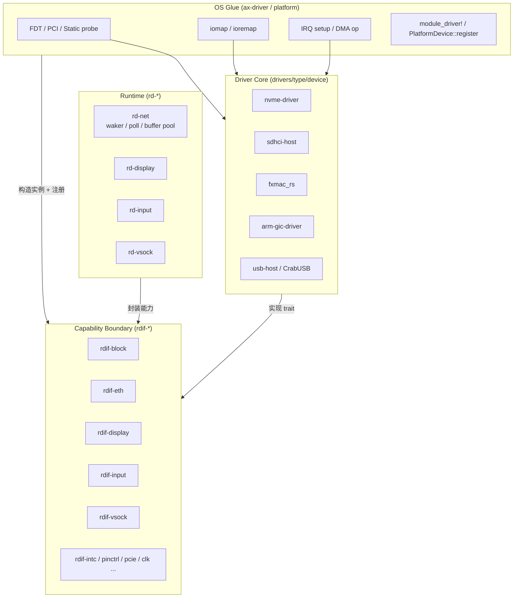

# 分层模型

驱动按四层拆分：Driver Core、Capability Boundary、OS Glue、Runtime。每层有明确的允许依赖和禁止依赖，层间通过 trait 契约交互。这种分层让硬件 driver core 可以在 ArceOS、StarryOS、Axvisor 之间复用，而 OS 相关 glue 限定在 probe、iomap、IRQ 注册和运行时适配层。

## 四层模型

| 层 | 位置 | 允许依赖 | 不允许 |
| --- | --- | --- | --- |
| Driver Core | `drivers/<type>/<device>` | `no_std`、寄存器/队列/描述符、`mmio-api`、`dma-api` 小边界 | `ax-driver`、`ax-hal`、`axplat-dyn`、`rdrive::PlatformDevice` |
| Capability Boundary | `drivers/interface/rdif-*` | `rdif-base`、小型错误和事件类型 | 平台、runtime、任务调度 |
| OS Glue | `drivers/ax-driver` 或平台 crate | `rdrive::module_driver!`、FDT/PCI probe、显式 Static probe、iomap、IRQ setup、DMA op | 上层 FS/NET 策略 |
| Runtime | `drivers/*/rd-*`，块设备除外 | `rdif-*`、waker、poll/blocking wrapper、buffer pool | probe、设备树、ACPI、平台选择 |

## Driver Core

Driver Core 只推进硬件状态机。它操作寄存器、队列、描述符，实现 DMA 传输和硬件协议，但不调用 `iomap`、`ioremap`、IRQ 注册、任务调度或任何 OS runtime API。Driver Core 只依赖 `no_std`、寄存器抽象、`mmio-api`、`dma-api` 这些小边界。

仓库中的 Driver Core crate 示例：

| 类别 | crate | 说明 |
| --- | --- | --- |
| 块设备 | `drivers/blk/nvme-driver/` | NVMe 协议 |
| 块设备 | `drivers/blk/sdhci-host/` | SD/SDIO/EMMC host |
| 块设备 | `drivers/blk/dwmmc-host/` | DW MMC host |
| 块设备 | `drivers/blk/sdmmc-protocol/` | SD/MMC command protocol |
| 网络 | `drivers/net/fxmac_rs/` | 飞腾 MAC 网卡 |
| 网络 | `drivers/net/eth-intel/` | Intel 系列网卡 |
| 中断控制器 | `drivers/intc/arm-gic-driver/` | ARM GIC |
| 中断控制器 | `drivers/intc/riscv_plic/` | RISC-V PLIC |
| PCIe | `drivers/pci/pcie/` | PCIe controller |
| USB | `drivers/usb/usb-host/` | xHCI host（CrabUSB） |
| AI 加速 | `drivers/npu/rockchip-npu/`、`drivers/tpu/sg2002-tpu/` | NPU/TPU |

Driver Core 实现对应 `rdif-*::Interface` trait（或被 OS Glue 包装后实现），但不直接注册到 `rdrive`。

## OS Glue

OS Glue 将硬件实例包装成 `rdif-*::Interface` 后通过 `PlatformDevice::register(...)` 注册。它负责：

- **probe**：从 FDT/ACPI/PCI/Static 发现设备，构造硬件实例。
- **iomap**：把物理地址映射为 MMIO region，交给 Driver Core。
- **IRQ setup**：解析 firmware IRQ source，调用 `ax_hal::irq::resolve_irq_source()` 取得 `IrqId`。
- **DMA op**：配置 DMA buffer、coherency。
- **注册**：通过 `module_driver!` 宏声明 `DriverRegister`，或手动 `register_add()`。

仓库内置 OS Glue 主要集中在 `drivers/ax-driver/`：

| 模块 | 职责 |
| --- | --- |
| `block/` | VirtIO-blk、ramdisk、NVMe、SDHCI、DW MMC、AHCI binding |
| `net/` | VirtIO-net、fxmac、intel-net、realtek、aic8800 binding |
| `display/` | VirtIO-gpu binding |
| `input/` | VirtIO-input binding |
| `vsock/` | VirtIO-socket binding |
| `virtio/` | VirtIO transport |
| `pci/` | PCI probe、BAR/window、INTx 解析 |
| `soc/` | Rockchip SoC glue |
| `usb/` | xHCI binding |
| `serial/` | 串口 binding |
| `binding_info.rs` | IRQ binding 元数据 |
| `binding_resolver.rs` | FDT/ACPI/PCI IRQ 解析 |
| `mmio.rs` | MMIO 映射 helper |
| `registration.rs` | `register_transport*()` helper |

部分平台相关 glue 也分布在 `platforms/axplat-dyn/src/drivers/`，例如 PCIe RC、clk、pinctrl。

外部自定义平台如果不走 FDT/ACPI/PCI 自动发现，可以在自己的平台初始化阶段调用 `rdrive::init(rdrive::Platform::Static)`，再通过 `rdrive::register_add(DriverRegister { probe_kinds: &[ProbeKind::Static { ... }], ... })` 注册平台私有 probe。probe 回调里可以直接构造硬件对象并调用 `PlatformDevice::register(...)`、领域 adapter 的 `*_with_info(...)`，或 `ax-driver` 暴露的显式 `register_transport*()` helper。`ax-driver` 本身不再提供静态平台自动注册 feature。

## Runtime

除块设备外，Runtime wrapper 从 `rdif-*::Interface` 构建领域运行时对象，供服务层和上层模块使用；块设备服务直接基于 `rdif-block` 的 submit/poll 能力边界组织 volume 和文件系统入口。

Runtime wrapper 职责：

- **waker / poll**：把 `rdif-*::Interface` 的同步能力包装成异步或阻塞 API。
- **buffer pool**：管理收发 buffer（如 `rd-net` 的 RX/TX queue）。
- **事件分发**：把 IRQ 事件转换成上层可消费的事件流。

典型 Runtime crate：

| crate | 说明 |
| --- | --- |
| `drivers/net/rd-net/` | 网卡 runtime：waker、buffer pool、IRQ 适配 |

## 文件拆分约束

已有大文件在迁移触及时必须拆分：

| 文件 | 当前问题 | 拆分方向 |
| --- | --- | --- |
| `platforms/axplat-dyn/src/drivers/pci/rk3588.rs` | 单文件超过 600 行 | RC init、ATU/window、MSI/IRQ、config space、FDT glue |
| `drivers/ax-driver/src/block/rockchip/sd/mod.rs` | 单文件超过 600 行 | probe/FDT、clock/tuning、card init、rdif-block adapter |
| `platforms/axplat-dyn/src/drivers/blk/mod.rs` | 容器、adapter、IRQ、FDT decode 混杂 | registry、adapter、irq、probe |
| `platforms/axplat-dyn/src/drivers/mod.rs` | 设备收集、iomap、DMA 混杂 | device collection、iomap、dma |

除测试外，新增或重构后的单个 `.rs` 文件不超过 600 行。`lib.rs` 只做模块声明和 re-export，不承载核心实现。
