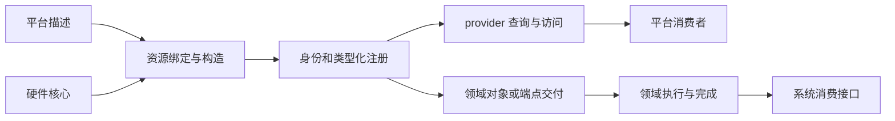

# 驱动代码与依赖分层

驱动分层以硬件机制、领域合同、平台绑定和执行策略的归属为依据。硬件核心解释寄存器和协议，能力层定义操作，绑定层提供资源，运行时保存请求与事件状态。目录名和 `no_std` 不能单独证明某个实现已经完全脱离操作系统依赖。

## 1. 职责与依赖

复用边界需要同时检查导入、状态所有者和调用上下文。不同领域可以共享内存或 IRQ 抽象，不应因此合并成一个拥有全部设备方法的大接口。

### 1.1 硬件机制与能力

`drivers/usb/usb-host/src/backend/kmod/xhci/` 实现环和上下文，UART 核心实现 FIFO 与事件，存储和网卡核心实现自己的描述符。硬件差异留在这些实现中，领域消费者不直接解释寄存器位。

`drivers/interface/` 定义时钟、复位、块请求、串口端点、显示输入等合同。能力层不解析整棵设备树、不选择挂载或路由，也不创建统一的操作系统 worker。

### 1.2 绑定与执行

`drivers/ax-driver/src/` 的回调匹配资源并构造、注册对象，运行时按领域需要直接调用、异步等待或创建维护者。固定 CPU 是部分执行器的明确要求，不是“存在绑定层”自然推出的属性。

图示表示职责，不要求每次调用经过四层虚函数。provider 可直接被 HAL 消费，USB 主机也可以在通用 Core 下继续发现设备。

## 2. 资源与所有权流向

编译依赖表示代码能使用哪些类型，运行时交付表示谁持有实际资源。一个模块依赖 `rdif-block` 不代表它持有块控制器，克隆句柄也不代表克隆硬件。

### 2.1 资源输入

平台通过 MMIO 和 DMA 能力注入内存资源，通过 provider 注入时钟、复位和引脚，通过绑定保留 IRQ 来源。`UsbKernel` 把 USB 需要的 DMA 操作转发给 `axklib`，具体后端不在 TRB 代码中猜测。

资源需要随相应对象保持有效；转换为裸指针并不解除映射长度和生命周期约束。具体地址域和同步条件由[平台资源](resources.md)定义。

### 2.2 领域交付

显示输入的 `TakeRegistered`、块和网络的专用 take、持续查询的 provider 使用不同模式。运行时取得对象后维护自己的状态，注册表不重复保存设备队列进度。

```mermaid
flowchart LR
    Description[平台描述] --> Binding[资源绑定与构造]
    Core[硬件核心] --> Binding
    Binding --> Registry[身份和类型化注册]
    Registry --> Borrow[provider 查询与访问]
    Registry --> Take[领域对象或端点交付]
    Borrow --> Platform[平台消费者]
    Take --> Execution[领域执行与完成]
    Execution --> Service[系统消费接口]
```

上层服务句柄通常不是注册句柄。卷视图、字节入口、帧端口和 USB 设备视图分别隐藏不同实现细节。

## 3. 不同实现的分层

实现复杂度和执行形态不同，不要求每个领域都有独立 runtime crate。源码位置应反映状态归属，而不是追求相同文件树。

### 3.1 provider 与领域包装

`rdif-clk`、`rdif-reset` 等 provider 由平台或其他驱动查询；显示输入则通过 ArceOS 模块中的 `rdif.rs` 转换领域接口。二者都不需要先构造网络式 poll group。

USB `Core` 保存 hub 拓扑，控制器后端保存硬件命令及端点状态，平台绑定保存 FDT PHY 与 MMIO。设备枚举逻辑可在不同 host 后端间复用，而 lane 与 GRF 配置仍属于具体平台。

### 3.2 队列与工作线程

块 `runtime/lifecycle/` 管理控制状态，`hctx/` 维护提交与完成，卷解析位于 `volume/`。串口 `SerialWorker` 管理字节、日志和控制命令，硬件端点不直接操作终端语义。

网络 `rd-net` 负责准备和队列包装，`ax-net::queue_runtime` 管理固定 owner 与令牌通道。`ax-net` 同时包含协议代码和 DMA 队列代码，因此不能把帧接口隐藏硬件扩大为整个 crate 不接触 IRQ 或 DMA。

## 4. 代码归属与维护

修改归属由受影响机制决定。寄存器布局、接口合同、平台资源、调度策略和用户 ABI 的修复应该落在相应所有者附近。

### 4.1 变更边界

相同设备的一次变更可能跨越多个层次，但每个文件仍应只保存明确职责。

| 变更对象 | 归属 |
| --- | --- |
| 描述符、FIFO、设备寄存器 | 硬件核心 |
| 请求失败归还、端点方法、错误类型 | 能力接口 |
| phandle、BAR、命名 IRQ、时钟复位 | 平台绑定 |
| 预算、软件队列、等待者、完成交付 | 领域运行时 |
| 根卷、协议状态、控制台选择 | 领域服务或系统策略 |
| Linux ioctl、用户态映射、guest 设备语义 | 对应操作系统或虚拟化层 |

现有 SoC 适配未必已经拆成独立核心软件包。分层图描述职责及维护边界，不替代对实际依赖的检查。

### 4.2 文件与生命周期

接口、绑定、事件和生命周期按状态组织，避免一个文件同时解析固件、处理硬 IRQ、管理协议和释放资源。拆分也不能使成功与失败路径失去可追踪关系。

文件长度不是架构正确性的证明。每个资源需要可以追踪到构造、发布、运行和停止条件；注册身份、执行过程与释放边界分别由[设备管理](rdrive.md)、[运行时与完成](runtime.md)和[生命周期](lifecycle.md)维护。
