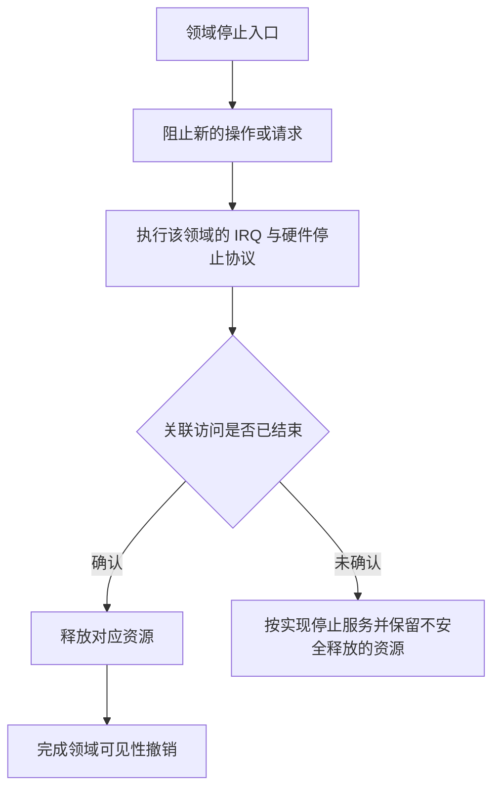
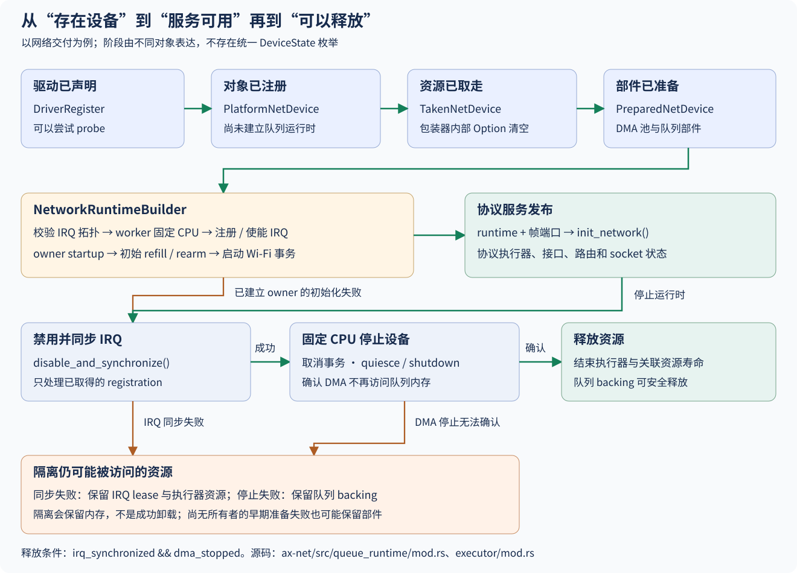

# 设备发布、停止与资源生命周期

设备生命周期跨越发现、资源构造、注册、接管、运行和关闭。`rdrive` 提供身份与发布机制，领域代码维护其硬件和请求状态；没有一个公共 `DeviceState` 枚举或自动卸载事务覆盖所有驱动。

## 1. 生命周期边界

已声明驱动、已注册实例、已交付能力和可安全释放是不同条件。文档中的阶段是对实际操作的归纳，不表示每种设备都必须走同一个 builder。

### 1.1 状态证据

每个检查点需要在持有该状态的对象上确认，不能仅通过注册表中仍存在一个 `DeviceId` 判断当前可用性。

平台 provider 可以持续通过句柄访问，领域包装可以一次性交付内部对象，USB 主机可以继续发现子设备。上述分支的资源和上层可见性不同。

### 1.2 发布条件

`drivers/rdrive/src/driver/mod.rs` 的 `register_with_fdt_child()` 校验关联后成对发布父子对象；普通 `register()` 不替后续任意运行时初始化建立全局事务。

`DeviceOwner` 保持注册包装存活，`Device<T>` 是弱句柄，访问守卫维持借用。网络、块和显示输入的 take 取走内部对象后，注册身份仍可存在；不能把第二次 take 失败解释为找不到设备身份。

## 2. 构造与接管失败

失败清理取决于哪些资源已经产生，以及硬件是否可能使用它们。纯内存对象、启用的时钟、已发布描述符和已注册 callback 需要不同处理。

### 2.1 分阶段资源

平台 probe 和领域构建分别承担自己的失败路径。`stop_if_fail = false` 只控制部分探测错误的继续策略，不使已创建资源自动回到初始状态。

| 阶段 | 已有对象 | 失败处理依据 |
| --- | --- | --- |
| 资源解析 | 节点、provider 引用 | 匹配与属性错误 |
| 映射及构造 | MMIO、DMA、控制器 | 已执行硬件操作与 backing 归属 |
| 注册发布 | `DeviceOwner`、子节点关系 | 注册一致性与类型规则 |
| 领域接管 | 已从包装移出的对象 | 领域持有者负责后续关闭 |
| 运行时建立 | worker、IRQ、通道 | 注册同步、任务终止和硬件停止 |
| 服务发布 | 卷、帧端口、设备视图 | 上层请求与可见性撤销 |

父子原子发布只保证对应注册操作，不撤销此前的所有时钟写入，也不负责现有 socket、挂载或用户设备节点。

### 2.2 恢复与停止服务

`rdif-serial::UartPort::startup()` 要求初始化失败后恢复已改变配置；`ConfigError::RegisterError` 表示不能证明硬件恢复，需要调用方停止正常服务。它不是可忽略的普通配置错误。

网络 `prepare_device()` 在拆出 parts 后准备失败时可能保留部件，以免在任意 CPU 上析构仍可能被硬件访问的对象。USB PHY 初始化的时钟、复位与等待也有各自返回路径，不能假定都有网络式隔离容器。

## 3. 请求完成与取消

上层停止等待不等于硬件停止访问。取消协议必须处理描述符、完成路由和请求终态，不能只删除 future 或等待者。

### 3.1 块与 DMA 请求

块队列的完成 sink 返回终态请求及 backing。控制器进入关闭时，已经交付的队列内存需保持有效直到 `ControllerState::Shutdown`；`advance()` 失败后仍要按已发布资源处理，不能直接释放所有请求。

`fs/ax-fs-ng/src/block/runtime/lifecycle/` 与 `hctx/` 分别保存控制器和队列状态。停止控制器、唤醒等待者、处理已接受前缀及释放 IRQ 不是一个无条件 `Drop` 就能代替的操作。

### 3.2 USB 端点

`drivers/usb/usb-host/src/backend/kmod/xhci/endpoint.rs` 的取消路径标记请求，并通过端点停止及 dequeue 恢复处理硬件状态。`StopEndpoint`、`SetTrDequeuePointer` 和完成路由替换属于控制器协议，不是普通容器删除。

`transfer.rs` 的 `replace_queues()` 更新关联端点的完成路由，`device.rs` 组织配置变化。旧完成不能发布到已经撤销或替换的队列，缓冲只有在满足终态条件后才能复用。

## 4. IRQ 与硬件停止

屏蔽设备中断、禁用 action、等待 callback 退出、停止 DMA 和停止任务是不同条件。顺序由领域合同决定，共享 provider 还可能被其他设备使用。

### 4.1 通用释放条件

涉及 IRQ 的对象需处理注册 handle 和正在运行的 callback，涉及 DMA 的对象需证明设备不再访问，任务持有的对象还需处理执行者结束。并非所有驱动都使用 DMA，也并非所有领域都实现同一套同步失败恢复。

图中保留是安全约束，不宣称每个领域都已有自动 quarantine 实现。provider 时钟或共享 IRQ 线路不能因一个消费者停止就无条件关闭。

### 4.2 网络停止实例

`NetworkQueueRuntime::drop()` 先停止无线命令入口，逆序禁用并同步 IRQ registration，再停止并 join 执行器。固定 CPU owner 通过 `NetPollIrqControl::shutdown()` 确认设备不会继续访问描述符和 buffer。

`release_registrations()` 在同步失败时保留 lease，`release_executor_resources()` 隔离仍可能被访问的组和无线状态。`backing_can_be_released()` 要求 `irq_synchronized && dma_stopped`；隔离保留内存，不是成功卸载。

### 4.3 串口与借用对象

串口紧急输出通过 `UartRegisterGate` 控制寄存器接管，紧急端点只提供有限发送能力；正常配置和 RX 不能绕过 gate。`discard_tx()` 也不保证正在移位的字节立即消失，接口将 FIFO 与发送器空闲明确区分。

显示帧缓冲的借用与领域包装持有的设备必须具有一致生命周期，输入事件源撤销需要系统层处理现有读者。当前能力接口没有承诺任意设备热拔插都会自动转换成完整的用户态错误传播。

## 5. 动态设备与系统撤销

注册表新增实例、总线枚举发现外设和系统热插拔服务是不同能力。已有实现只证明其明确维护的范围。

### 5.1 子树与身份

USB `Core::disconnect_port()` 处理断开端口及其后代，`ProbeChanges` 区分连接和断开集合。软件设备 ID、控制器 slot 和拓扑位置不能因为数值重复就代表原对象重新可用。

FDT 子节点发布维护固件与注册关联，PCI endpoint 枚举维护地址完成记录。它们不自动实现文件系统卸载或协议服务动态重建；当前物理网络仍是启动时一次性接管。

### 5.2 直通与上层状态

`fs/ax-fs-ng/src/block/runtime/lifecycle/mod.rs` 提供 `release_block_irqs_for_passthrough()`。该入口说明块领域有相应 IRQ 交接操作，不等于所有硬件具备统一直通关闭协议，也不解除共享时钟寄存器保护。

系统层需要分别处理设备可见性、未完成请求和地址空间归属。宿主驱动生命周期与 guest 模拟设备不同，接入位置由[系统集成](integration.md)说明。

## 6. 失败记录与验证

生命周期证据必须覆盖失败阶段、已接管资源和停止条件，而不只是正常启动日志。各领域测试以实际状态机为对象。

### 6.1 错误归属

网络 `InvalidParts`、`IrqUnavailable`、`DmaShutdownUnconfirmed` 分别涉及布局、事件条件和关闭；块错误涉及控制器及请求状态；USB 命令完成码涉及端点协议；串口配置恢复错误涉及是否还能继续服务。不得将这些统一吞掉后报告设备可用。

### 6.2 回归位置

块生命周期测试位于 `fs/ax-fs-ng/src/block/runtime/lifecycle/tests/`，网络执行器及拓扑测试位于 `net/ax-net/src/queue_runtime/`，USB 端点和串口 gate 也有对应测试。测试源码说明被断言的条件，不代表当前硬件已经执行该场景。

接管、启动失败、部分提交、取消、共享 IRQ 和无法确认停止都需要独立证据。文档与源码对应不替代具体目标的运行验证。
