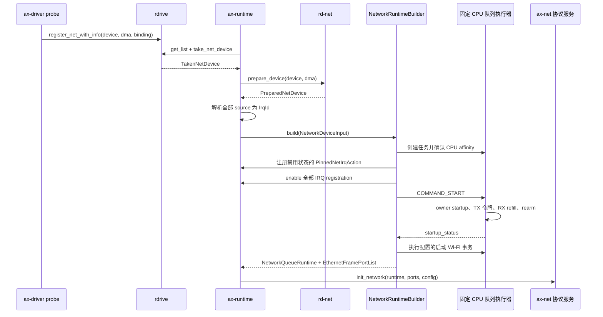
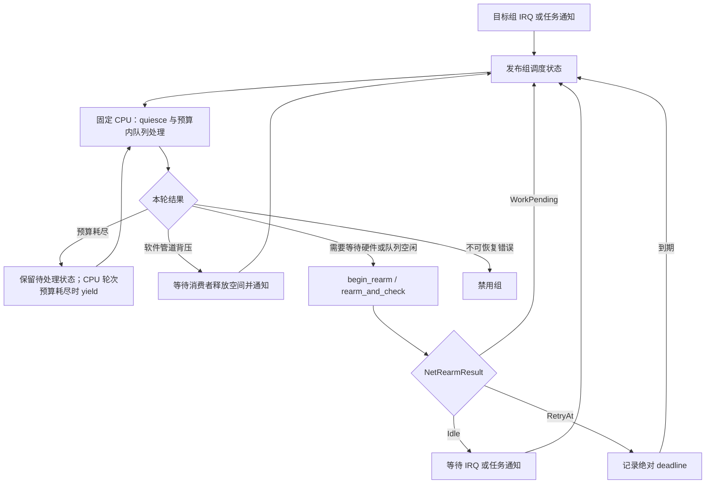
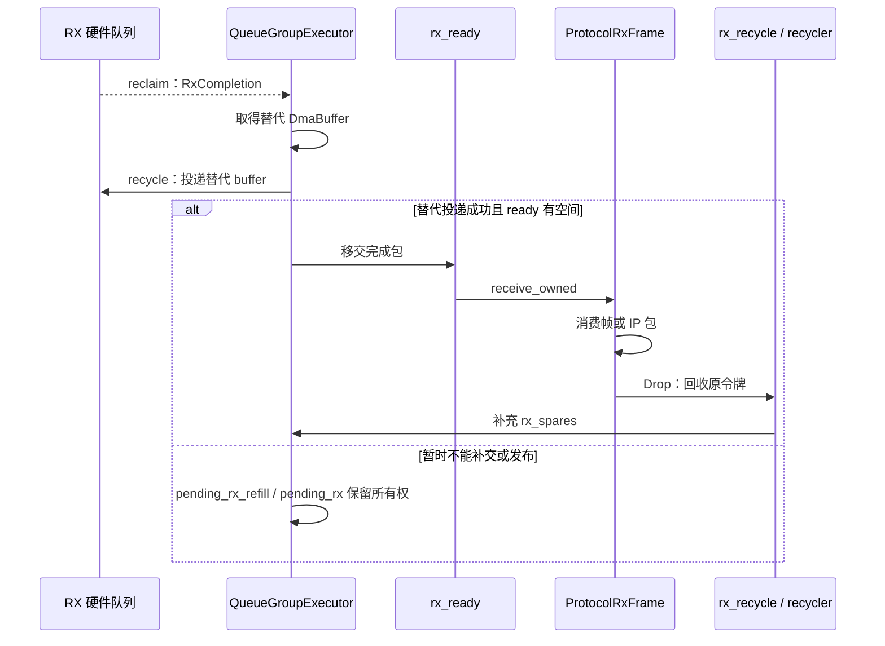
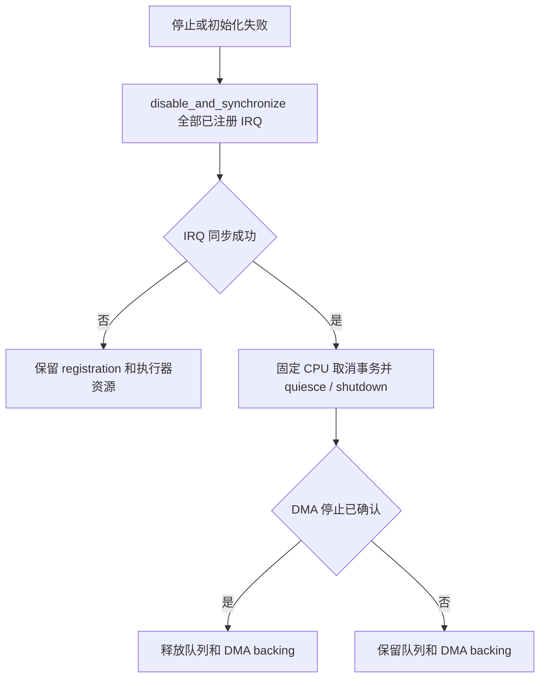

# 网络驱动

宿主物理 Ethernet 和 Wi-Fi 设备通过 `rdif-eth::NetDevice` 交付控制、队列和中断端点。`rd-net` 准备 DMA 池和队列包装，`ax-net::queue_runtime` 建立固定 CPU 的队列执行域，协议层通过 `EthernetFramePort` 消费帧。设备发现和 HAL 中断注册分别保留在 `ax-driver` 与 `ax-runtime`，协议接口、路由和 socket 状态由统一的 `ax-net` 管理。

## 1. 分层与执行域

网络设备交付包含初始化控制流和运行期数据流。`PlatformNetDevice` 只在注册表中保存待移交对象；`NetworkRuntimeBuilder::build()` 消费准备后的部件，返回 `NetworkQueueRuntime` 和协议端口，运行期不再通过注册表锁住完整网卡进行收发。

### 1.1 组件边界

网络相关组件按所持有的资源和执行责任分层。`rd-net` 是可移植的设备准备与队列包装层，不负责创建任务、分配 CPU 或注册 HAL 中断。

| 源码 | 对象与职责 |
| --- | --- |
| `drivers/interface/rdif-eth/src/lib.rs` | `NetDevice`、`NetDeviceParts`、`NetPollGroupParts` 定义拆分所有权；`ITxQueue`、`IRxQueue` 定义队列提交和完成 |
| `drivers/net/rd-net/src/lib.rs` | `prepare_device()` 校验部件并建立 DMA 池；`TxQueue`、`RxQueue` 封装同步和令牌计数 |
| `drivers/ax-driver/src/net/binding.rs` | `PlatformNetDevice` 保存设备、`DeviceDma` 和 `BindingInfo`；`take_net_device()` 只允许一次性交付 |
| `os/arceos/modules/axruntime/src/devices.rs` | `collect_net_devices()` 枚举、准备设备并解析完整 IRQ source 映射 |
| `os/arceos/modules/axruntime/src/irq.rs` | `RuntimeNetIrqRegistrar` 将固定 CPU 注册请求转换为 HAL `IrqRequest` |
| `net/ax-net/src/queue_runtime/mod.rs` | `NetworkRuntimeBuilder` 分配亲和域、建立管道、启动执行器并协调注册与回滚 |
| `net/ax-net/src/queue_runtime/executor/mod.rs` | `QueueGroupExecutor` 独占队列收发、预算、背压、rearm 和停止 |
| `net/ax-net/src/device/driver.rs` | `EthernetFramePort` 是协议帧端口；`ProtocolRxFrame` 保留 RX 令牌并在释放时回收 |
| `net/ax-net/src/lib.rs`、`poll_runtime.rs`、`service.rs` | 唯一协议执行器推进 smoltcp；`Service` 和 `NetControl` 管理接口、地址及路由控制面 |

`ax-net` 的协议帧边界隐藏设备寄存器和具体传输实现，但整个 crate 包含处理 DMA 令牌、`IrqId` 和任务调度的队列运行时。HAL callback 的注册、同步和释放实现仍位于 `ax-runtime`，不能将协议层隔离描述成整个 `ax-net` 不接触 DMA 或中断类型。

### 1.2 所有权布局

硬中断端点和队列执行器属于相同 `owner_cpu`，协议执行器拥有独立的固定 CPU 选择。静态布局图将初始化资源交付、同核中断延续和跨执行域令牌管道分别放置，避免把注册关系误认为包处理调用关系。

`assign_affinity_domains()` 将共享物理 `IrqId` 的轮询组合并为同一亲和域，包含通过多个 IRQ 间接相连的组；随后按域序号对在线 CPU 数取模。每个有队列组的 CPU 运行一个队列执行器，执行器可以管理多个组。`select_protocol_owner()` 选择队列组数量最少的 CPU，数量相同时选择编号较小者；协议 CPU 不要求与每个网卡的队列 CPU 相同。

## 2. 设备部件与 DMA

`NetDevice::into_parts(self: Box<Self>)` 消费完整网卡，成功返回后由不同所有者分别持有部件。`NetPollGroupParts` 对应一个共同屏蔽和重新使能域，而不是任意拼接的 RX/TX 队列集合。

### 2.1 部件契约

`NetDeviceParts` 保存静态设备信息、通用控制端点、可选无线控制端点和全部轮询组。设备、队列和 IRQ source 的标识符都是设备局部身份；物理中断身份由平台映射提供。

| 对象或字段 | 所有者及语义 |
| --- | --- |
| `NetDeviceInfo` | 保存驱动名称和初始 MAC 地址，不持有硬件队列 |
| `NetControlEndpoint` | 独占的通用控制端点；当前接口查询 MAC 地址 |
| `NetDeviceParts::wifi_control` | 可选 `Box<dyn WifiControl>`，由所属队列 CPU 推进无线控制事务 |
| `NetPollGroupParts::queues` | 一对独占 `ITxQueue`、`IRxQueue`，每个方向提供自己的 `NetQueueId` |
| `NetPollGroupParts::irq_control` | `NetPollIrqControl`，在所有者 CPU 上执行 `quiesce()`、`rearm_and_check()`、`shutdown()` |
| `NetPollGroupParts::owner_startup` | 可选 `NetOwnerStartup`，在队列正式启用前执行有限步启动状态机 |
| `NetPollGroupParts::irq_endpoints` | 一个或多个只能移动的 `NetHardIrqEndpoint`，各自携带 `NetIrqSourceId` |

`rd_net::validate_parts()` 拒绝空轮询组集合、重复组 ID、同一方向重复队列 ID、没有 IRQ endpoint 的组，以及小于 2 的 ring。TX 与 RX 的 ID 分别校验，因此不同方向可以使用相同数字。平台映射的缺项、重复匹配和未使用 source 则由 builder 的 `validate_and_collect_irq_sets()`、`resolve_endpoint_irq()` 拒绝。

### 2.2 缓冲区准备

`prepare_device()` 为每个组建立 `ToDevice` TX 池和 `FromDevice` RX 池。`QueueConfig` 决定 buffer 大小、对齐、ring 大小和 DMA 地址掩码；`queue_dma()` 使用设备约束与队列 `dma_mask` 中更严格的地址范围。`TxQueue::capacity()` 和 `RxQueue::capacity()` 均为 `ring_size - 1`，不能把 ring 大小直接作为可投递数量。

`DmaBuffer` 不可克隆，提交成功将令牌交给驱动，提交失败由 `SubmitError` 连同原因返还原令牌。`TxQueue::submit_with_options()` 在交付前执行设备侧同步；`RxQueue::reclaim()` 更新 `posted` 计数，并将 CPU 同步范围限制在报告长度、配置 buffer 大小和实际容量的最小值。原始报告长度仍保留，协议端可以识别并丢弃非法完成。

`prepare_device()` 不启动 worker，也不使能设备 IRQ。若 `into_parts()` 后校验或 DMA 池构造失败，当前实现保留设备部件而不是在任意 CPU 上析构可能已被硬件访问的描述符；此时尚未建立能够证明 DMA 停止的所有者上下文。

## 3. 初始化与平台映射

`ax-runtime::init_net()` 在发布协议服务前完成设备收集和队列运行时构造。物理网络使用启动阶段一次性交付模型；`rdrive` 支持注册设备并不等于 `ax-net` 已提供运行期网卡热插拔入口。

### 3.1 一次性交付

`collect_net_devices()` 遍历 `rdrive::get_list::<PlatformNetDevice>()`。`TakenNetDevice::prepared_device` 虽然名称包含 prepared，实际类型仍是待消费的 `Box<dyn NetDevice>`；调用 `rd_net::prepare_device()` 后才得到 `PreparedNetDevice`。

`NetworkRuntimeBuilder::build()` 的成功交付发生在所有 queue source 注册、队列初始化及配置的启动 Wi-Fi 事务完成之后，返回前还通过控制端点刷新端口 MAC。多个 HAL action 的注册和使能是顺序操作，不是硬件同时启用；事务性体现在任何阶段失败都不向协议层交付成功结果，并按已取得资源执行清理。

### 3.2 中断源映射

`BindingInfo` 使用 `Vec<BindingIrqBinding>` 保存 `source_id: usize` 与 `BindingIrq`。`collect_net_devices()` 将 source ID 检查转换为 `u16`，构造 `NetIrqSourceId`，再将每个 binding 解析成 `ResolvedNetIrqSource { source_id, irq }`。超过标识符范围、无法解析或无法唯一匹配的 source 都不能进入正常运行。

`with_binding_irq()`、`with_irq_id()` 等单源 helper 在有中断时写入 source 0。`irq()` 优先取 source 0，否则取第一项，属于单源便利查询；网络收集使用 `irq_sources()` 保留完整映射。固件来源与多源关系由 [IRQ 解析与注册](irq.md) 定义，网络端点不得用队列编号猜测平台 IRQ。

## 4. 中断与队列调度

队列处理遵守“硬中断确认并发布状态，固定 CPU 任务推进队列”的分工。`NetworkQueueRuntime` 持有注册 lease 和执行器，`PollGroupState` 保存组状态、通知对象及统计，不通过全局网卡遍历处理某个设备的中断。

### 4.1 固定亲和注册

`PinnedNetIrqRegistrar::register(name, irq, owner_cpu, action)` 只接受明确 CPU。`RuntimeNetIrqRegistrar` 使用 `NonReentrant`、`ShareMode::Shared`、`AutoEnable::No` 和 `IrqAffinity::Fixed(CpuId(owner_cpu))` 构造 HAL 请求。共享物理 IRQ 的 affinity 冲突、CPU 不可用或固定路由不支持均使初始化失败。

硬 callback 独占移入的 `NetHardIrqEndpoint`，调用 `handle_irq()` 后将结果映射为网络注册返回值。

| 驱动结果 | 运行时动作 | HAL 对应结果 |
| --- | --- | --- |
| `Spurious` | 增加 `spurious` 统计，不调度组 | `Unhandled` |
| `Schedule(snapshot)` | 发布目标组调度状态，通知所属 CPU 执行器 | `Wake` |
| `ProbeDeferred` | 增加 `probe_deferred`，交由所属 CPU 继续处理 | `Wake` |

`NetIrqSnapshot` 定义 RX、TX 和 ERROR 位。当前 builder 的 callback 对 `Schedule` 使用组级调度，不按 snapshot 位选择单独的 RX/TX 协议路径。硬中断不能排空 DMA 队列、复制包、运行 smoltcp 或调用任意协议 waker；`ProbeDeferred` 允许不能在硬中断中无等待检查的传输延后处理。

### 4.2 预算与重新使能

`QueueGroupExecutor::poll()` 先调用 `quiesce()`，再处理 TX 完成、TX 提交、RX 回收和 RX 完成。`QUEUE_BUDGET = 64` 限制各工作类别，`CPU_ROUND_BUDGET = 256` 限制同 CPU 一轮工作量；这些值是工作预算，不是网卡 ring 深度或吞吐保证。

`finish_idle()` 在重新使能窗口发现工作时立即调度同一组，并增加 `rearm_race`。`RetryAt { deadline_nanos }` 由驱动状态机提供，执行器只等待该期限或通知；它不是周期扫描设备的后备路径。设备 IRQ 缺失时不能通过定时轮询替代固定中断契约。

## 5. 帧传输与协议边界

队列执行器和协议执行器通过预分配 SPSC 环传递令牌。`EthernetFramePort` 聚合一个设备的一个或多个轮询组，`Router` 再聚合多个逻辑设备。物理队列数量与协议核心数量没有一一对应关系。

### 5.1 RX 所有权

`QueueGroupExecutor` 从 RX 队列取出 `RxCompletion` 后，先准备并投递替代 buffer，再发布完成包。`pending_rx_refill` 保存尚未成功补交的替代令牌和完成包，其长度受 RX 队列容量限制；补交失败时不能丢失其中任一所有权。

无法取得替代 buffer 时，执行器丢弃该包、记录 RX drop，并将原令牌重新投递，而不是等待没有通知来源的分配器唤醒。`RxRecycler` 还保留有界管道之外的回收暂存状态；协议对象释放不会把 DMA 令牌直接交给硬件，中间仍经过队列所有者。

### 5.2 TX 策略与通知

协议侧从 `tx_free` 取得可写 TX buffer，将帧及 `TxSubmitOptions` 发布到 `tx_ready`。队列所有者提交给设备，完成后通过 `tx_free` 返还令牌。`SubmitError` 保留被拒绝的 buffer；`Retry` 和 `LinkDown` 的重试必须有后续队列或链路事件驱动。

| 接口或配置 | 行为 |
| --- | --- |
| `TxQueueDiscipline::NoQueue` | 协议侧不额外保留软件 FIFO，底层忙时返回 `Again` |
| `TxQueueDiscipline::Fifo { max_frames }` | 在底层忙时有界保留帧并保持提交顺序；系统集成当前使用 64 帧 |
| `TxChecksumCapabilities` | 表达 IPv4/IPv6 与 TCP/UDP 组合；设备端口取全部 TX 队列能力的交集 |
| `TxSubmitOptions::checksum` | 指定可选 transport checksum offload；未指定时保留调用者提供的 checksum |
| `TxNotify::Deferred` | 允许延迟设备通知；`ITxQueue::flush()` 在批次边界发布已接受提交 |

`ITxQueue::submit_with_options()` 的默认实现拒绝 checksum offload 请求，否则退回普通 `submit()`，因此默认实现不保证批量通知优化。驱动接受的硬件能力、协议端聚合能力和实际提交选项必须一致；`flush()` 只发布通知，不等待发送完成。

### 5.3 唯一协议执行器

`ax-net` 使用一个 smoltcp `Interface` 和全局 `SocketSet`，通过 `Router` 汇聚 Ethernet、loopback 等逻辑设备。`start_protocol_executor()` 固定唯一协议任务的 CPU，`ProtocolPollRuntime` 用 requested/completed 代际及 scheduled 状态合并请求。socket 方法提交 `request_poll()`，不在调用线程成为第二个协议轮询者。

`Service` 和 `NetControl` 保存接口、地址、路由、DHCP 和 DNS 状态。`ax-runtime::parse_network_config()` 当前返回 `NetworkConfig::default()`；普通未匹配 NIC 默认使用 DHCP，不代表已有系统配置文件解析。无线初始策略通过 `WifiLinkPolicy` 应用到协议控制面，Unix domain socket 与可选 vsock 使用各自传输，不经过物理网卡 DMA 队列。

## 6. 无线控制与停止

无线设备既有帧数据面，也有固件启动和控制事务。AIC8800 将这些工作纳入同一队列所有者域，避免控制调用线程直接操作 SDIO 总线或与数据队列竞争设备状态。

### 6.1 启动和控制事务

`drivers/ax-driver/src/net/aic8800/mod.rs` 解析并映射平台资源、配置 `DeviceDma`，构造 `AicRdifDevice` 后注册 `wlan0`。`drivers/net/aic8800/src/rdif/device/endpoints/device.rs` 的 `into_parts()` 交付 `AicOwnerStartup`、无线控制端点、队列和硬中断端点。

SDIO host 的 `into_parts()` 进一步分离 `bus`、`card_irq` 和硬中断 `irq`。`AicOwner` 持有总线、卡中断控制及队列端口；`AicHardIrq` 独占实现 `SdMmcIrqHandle` 的端点，把 host event 发布到 `IrqLatch`，将错误映射为 ERROR、卡中断映射为 RX，其余有效事件映射为队列工作。硬中断不执行 SDIO FIFO 排空或固件命令，这些工作由所有者状态机继续推进。

`QueueGroupExecutor::initialize()` 在固定 CPU 和已注册、已使能的 IRQ 条件下调用 `NetOwnerStartup::start()`。`Ready` 才允许分配初始 TX 令牌、补充 RX 队列并激活正常收发；等待期间仅推进启动状态机。

| 状态机结果 | 推进条件 |
| --- | --- |
| `Ready` / `Complete` | 分别表示设备启动完成或无线事务完成 |
| `WaitForInterrupt` | 等待目标所有者域硬件通知后调用 `advance()` |
| `WaitForInterruptUntil` | 硬件通知或绝对期限到达后推进，用期限识别缺失中断或超时 |
| `RetryAt` | 到达驱动要求的绝对单调时间后再次推进 |

`WifiControlQueue` 将 `WifiTransaction` 交给 `WifiExecutorSlot`，调用者提交事务而不直接访问设备。`WifiControl` 的 `start()`、`advance()`、`cancel()` 表达有限步操作；builder 在返回端口前执行配置的启动事务并保存初始链路策略。控制事务运行机制位于 `net/ax-net/src/queue_runtime/executor/wifi.rs`。

### 6.2 停止与资源隔离

`NetworkQueueRuntime::drop()` 先停止无线命令队列，再逆序禁用并同步 IRQ registration，随后停止并 join 队列执行器。正常清理要求固定 CPU 上的 `shutdown()` 证明设备不会继续访问描述符和已提交 buffer；仅屏蔽中断不足以释放 DMA 内存。

`release_registrations()` 在同步失败时保留注册 lease，`release_executor_resources()` 将仍可能被访问的组与无线状态隔离。`backing_can_be_released()` 要求 `irq_synchronized && dma_stopped`；不能用日志后继续释放代替该条件。隔离会保留内存，是当前不能证明硬件停止时的安全边界，不是成功卸载。

## 7. 驱动实现与观测

不同设备将 `rdif-eth` 适配放在驱动核心或 OS glue 中，但都向运行时交付同一组所有权类型。源码存在和 feature 可选只说明实现接入位置，不代表所有目标板卡和功能组合均完成硬件验证。

### 7.1 实现入口

网卡实现通过 `NetDevice::into_parts()` 接入，FDT、PCI 和传输资源处理留在相应 probe。Loongson GMAC 的硬件实现当前位于 `ax-driver` 内，并非独立的 `drivers/net` 软件包。

| 设备 | 拆分实现 | 平台接入 |
| --- | --- | --- |
| VirtIO-net | `drivers/ax-driver/src/virtio/net.rs` 的 `VirtIoNetDevice` | 同文件中的传输构造和 probe |
| Intel E1000 | `drivers/net/eth-intel/src/e1000/mod.rs` | `drivers/ax-driver/src/net/intel.rs` |
| RTL8125 | `drivers/net/realtek-rtl8125/src/lib.rs` | `drivers/ax-driver/src/net/realtek.rs` |
| Phytium Fxmac | `drivers/ax-driver/src/net/fxmac.rs` 的 `FxmacNet` | 同文件包装 `fxmac_rs` |
| Loongson GMAC | `drivers/ax-driver/src/net/loongson_gmac.rs` | `ls2k1000-gmac` feature |
| AIC8800 | `drivers/net/aic8800/src/rdif/device/endpoints/device.rs` | `drivers/ax-driver/src/net/aic8800/` |

### 7.2 统计与回归位置

`NetworkQueueRuntime::stats()` 返回每组 `NetQueueStats` 快照。`owner_cpu`、`last_irq_cpu`、`last_poll_cpu` 记录所有者与实际执行 CPU；`irq_to_poll_remote_wake`、`missed`、`budget_exhaustion`、`probe_deferred`、`rearm_race` 分别描述跨核唤醒、调度交错、预算和重新使能窗口等观测结果。这些计数不替代 CPU affinity 和生命周期契约。

`net/ax-net/src/queue_runtime/tests.rs` 保存运行时拓扑等测试，`executor/queue_tests.rs` 保存收发背压和令牌处理回归，`poll_runtime.rs` 保存协议调度测试；`drivers/net/rd-net/src/lib.rs` 保存 DMA 准备与队列包装测试。测试源码说明被覆盖的不变量，不构成当前硬件运行结果。
