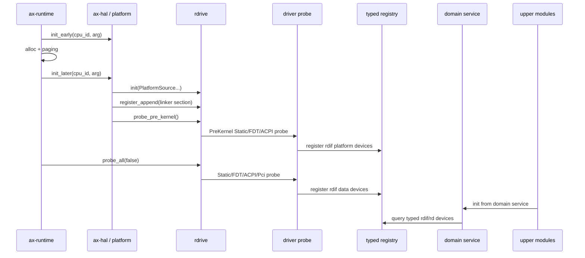
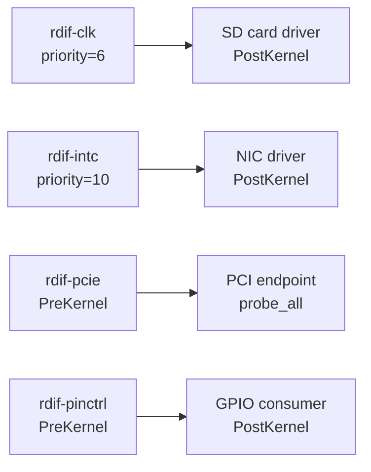

# 探测与初始化

本文描述 `rdrive + rdif` 驱动框架从平台初始化到设备 probe 完成的完整时序。初始化顺序固定，分两个 probe level：内核前（PreKernel）初始化平台基础设施，内核后（PostKernel）初始化普通设备和 PCI endpoint。

## 初始化时序

初始化顺序固定为：

1. `ax_hal::init_early(cpu_id, arg)` 只记录 boot arg / DTB，初始化 early trap、console、time 等最低层能力，不 probe 宿主设备。
2. allocator 和 paging 初始化完成后，`ax_hal::init_later(cpu_id, arg)` 或平台 post-paging 阶段执行 `rdrive::init(...)`、`rdrive::register_append(...)`、`rdrive::probe_pre_kernel()`。
3. `probe_pre_kernel()` 只初始化后续平台依赖：interrupt controller、clock、timer、systick、pinmux、PCIe root complex。
4. 平台 later init 完成后，`ax-runtime` 调用 `rdrive::probe_all(false)`。
5. FS、NET、display、input、vsock、StarryOS、Axvisor 通过领域 service 或 `rdif-*` 能力接口消费设备。



`ax-runtime` 不再拆 `AllDevices.block/net/display/input/vsock` 后逐个传给模块。它只触发 probe 和领域 service 初始化。

## Probe Level 与 Priority

| Level | 时机 | 典型设备 |
| --- | --- | --- |
| `PreKernel` | allocator/paging 就绪后、runtime 设备初始化前 | intc、clk、timer、systick、pinctrl、PCIe RC |
| `PostKernel` | `probe_all()` 阶段 | block、net、display、input、vsock、PCI endpoint |

同 level 内按 `ProbePriority` 升序排列，值小者优先：

- `ProbePriority::CLK(6)`：时钟控制器最优先，几乎所有其它设备都需要 clk。
- `ProbePriority::INTC(10)`：中断控制器次优先，IRQ 解析依赖 intc 已注册。
- `ProbePriority::DEFAULT(256)`：普通设备默认优先级。

`probe_pre_kernel()` 只运行 `ProbeLevel::PreKernel` 注册的驱动。`probe_all(stop_if_fail)` 运行 `PostKernel` 注册的驱动，再执行 PCI endpoint 枚举。`stop_if_fail = false` 表示单个设备 probe 失败不中断整体流程，便于在多设备平台上尽力初始化可用设备。

## Static backend

外部自定义平台应优先提供 FDT、ACPI 或 PCI 可发现的设备描述，再通过对应 probe 注册驱动或设备。没有固件描述的板级 glue 仍可使用 `rdrive::Platform::Static` / `PlatformSource::Static` 和 `ProbeKind::Static` 显式注册设备：

```rust
rdrive::init(rdrive::Platform::Static).expect("rdrive init");
rdrive::register_add(DriverRegister {
    name: "my-platform-device",
    level: ProbeLevel::PostKernel,
    priority: ProbePriority::DEFAULT,
    probe_kinds: &[ProbeKind::Static { on_probe: my_probe }],
});
```

probe 回调里可以直接构造硬件对象并调用 `PlatformDevice::register(...)`、领域 adapter 的 `*_with_info(...)`，或 `ax-driver` 暴露的显式 `register_transport*()` helper。

这里的 `Static` 只是驱动 probe 来源，不等同于旧的 `myplat` / `defplat` Cargo feature 平台选择路径。`ax-driver` 本身不再提供旧式平台私有自动注册 feature。仓库默认的设备发现驱动器 `somehal` 走 FDT/ACPI 自动发现，详见[设备发现](../platform/devices.md)。

## FDT backend

`probe::fdt` 从 Flattened Device Tree 解析设备并按 `compatible` 字符串匹配驱动。FDT backend 拥有独立 `System`：

```rust
struct System {
    fdt: Fdt,
    phandle_map: ...,
    probed: ...,
}
```

FDT probe 流程：

1. 遍历 device tree node，读取 `compatible`、`status`、`reg`、`interrupts`、`interrupt-parent`、`clocks`、`resets`、`pinctrl-*` 等属性。
2. 按 `compatible` 匹配已注册 `DriverRegister` 的 `ProbeKind::Fdt { compatibles }`。
3. 匹配成功的 node 构造 `FdtInfo`（携带 node 引用、reg、interrupts 等），传入 probe 回调。
4. probe 回调构造硬件实例，解析 IRQ/clock/pinctrl 依赖后注册设备。

FDT 不是唯一或默认平台抽象，而是与 Static、ACPI 并列的来源。

## ACPI backend

`probe::acpi` 处理 ACPI 平台。ACPI 第一版提供 MCFG、GSI controller routing、PCI `_PRT` 和普通设备 IRQ metadata。ACPI backend 的 `System`：

```rust
struct System {
    root: AcpiRoot,
    routing: ...,   // GSI controller routing
    pci: ...,       // MCFG + _PRT
    probed: ...,
}
```

ACPI probe 按 HID/CID（Hardware ID / Compatible ID）匹配驱动。ACPI source 初始化解析 MCFG 表定位 PCIe config space，建立 GSI controller routing，解析 PCI `_PRT` 映射 INTx 到 GSI。

仓库尚无 Linux-style ACPI pinctrl state parser 时，probe glue 必须返回明确的 `PinctrlError::UnsupportedFirmware(FirmwareKind::Acpi)`，不能静默 fallback 或保留“以后补”的占位路径。

## PCI backend

`probe::pci` 是二阶段枚举：

1. **第一阶段**：PCIe controller（root complex）在 PreKernel 阶段通过 FDT 或 Static 注册为 `rdif-pcie::PcieController`。
2. **第二阶段**：`probe_all()` 触发 PCI endpoint 枚举。PCI backend 遍历所有已注册 controller，扫描 bus/device/function，读取 vendor/device/class，按已注册 `ProbeKind::Pci` 匹配驱动。

PCI endpoint 依赖 controller 已注册，因此不能在 PreKernel 阶段触发。PCI endpoint 的 INTx IRQ 解析见 [IRQ 解析与注册](irq.md)。

## 设备依赖解析

某些设备 probe 时需要查询已注册的其它设备。例如：

- SD 卡驱动 probe 时需要查询 `rdif-clk` 获取时钟频率。
- GPIO 外设 probe 时需要查询 `rdif-pinctrl` 配置 pin mux。
- PCI endpoint probe 时需要查询 `rdif-pcie` 获取 BAR 资源。

这种依赖通过 `ProbePriority` 和 `ProbeLevel` 显式表达：被依赖设备（clk、intc、pcie controller）使用更小的 priority 或 PreKernel level，保证在依赖方 probe 前已注册。probe 回调内部可以通过 `rdrive::get_device::<T>(id)` 查询已注册设备。



如果 probe 回调查询的设备尚未注册，返回 `GetDeviceError::NotFound`，probe 应返回明确的错误而不是 panic。
