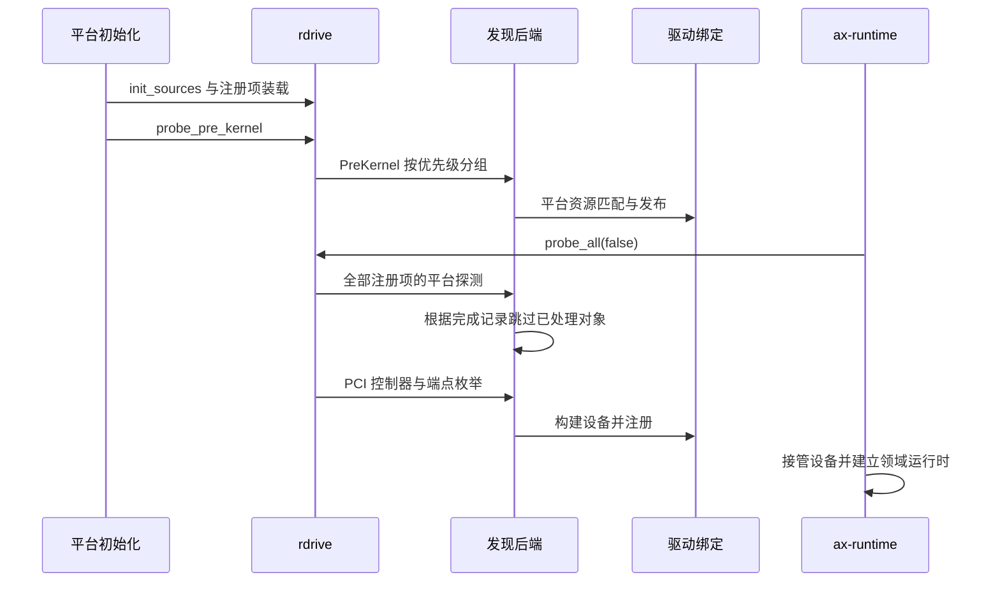
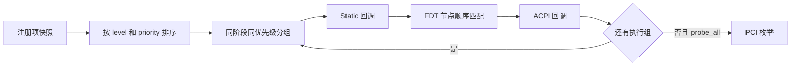

# 探测与初始化

设备探测把平台资源描述转换为可由领域消费的注册对象。`rdrive` 调度匹配与发布，驱动回调构建具体硬件对象；队列任务、协议状态和文件系统挂载不属于 probe 完成条件。阶段调度实现位于 `drivers/rdrive/src/lib.rs`，发现后端位于 `drivers/rdrive/src/probe/`。

## 1. 启动阶段

平台基础设施需要先于普通设备可用，但“优先级靠前”不能替代时钟、IRQ 域和内存映射实际初始化。平台负责选择发现来源，运行时负责在平台就绪后启动普通设备探测及领域初始化。

### 1.1 平台准备

`init()` 将单个 `Platform` 转为 `init_sources()` 输入。FDT 来源携带映射后的树地址，ACPI 来源携带根表信息，Static 来源用于没有可枚举固件节点的显式回调。平台地址的有效性必须在进入解析器前满足，不能把任意物理地址直接视为可解引用指针。

`os/arceos/modules/axruntime/src/registers.rs` 的 `append_linker_registers()` 读取 `__sdriver_register` 与 `__edriver_register` 之间的注册项，构造 `DriverRegisterSlice` 并调用 `register_append()`。feature 控制哪些回调进入最终镜像，平台来源控制哪些回调有匹配对象，两者是不同条件。

### 1.2 探测与运行时启动

`probe_pre_kernel_until()` 对注册项快照筛选 `PreKernel` 和优先级上限；`probe_pre_kernel()` 使用 `LAST` 与遇错停止策略。`probe_all()` 则取得全部注册项快照，执行平台后端，然后执行 PCI 枚举，并不是仅筛选 `PostKernel`。

```mermaid
sequenceDiagram
    participant Platform as 平台初始化
    participant Rdrive as rdrive
    participant Backend as 发现后端
    participant Glue as 驱动绑定
    participant Runtime as ax-runtime
    Platform->>Rdrive: init_sources 与注册项装载
    Platform->>Rdrive: probe_pre_kernel
    Rdrive->>Backend: PreKernel 按优先级分组
    Backend->>Glue: 平台资源匹配与发布
    Runtime->>Rdrive: probe_all(false)
    Rdrive->>Backend: 全部注册项的平台探测
    Backend->>Backend: 根据完成记录跳过已处理对象
    Rdrive->>Backend: PCI 控制器与端点枚举
    Backend->>Glue: 构建设备并注册
    Runtime->>Runtime: 接管设备并建立领域运行时
```

`probe_all()` 再次包含早期注册项，不代表已成功设备一定被重复创建。跳过规则保存在后端状态中；失败对象与成功对象的完成记录不能混为一谈。

## 2. 调度与匹配顺序

`Manager::unregistered()` 生成并排序注册项快照，`probe_system()` 按相同 `level` 和 `priority` 组成执行组。组内顺序直接影响资源提供者何时可被后续回调查询。

### 2.1 阶段和优先级

`ProbePriority` 是 `usize` 的包装类型，并非仅允许固定枚举值。`drivers/rdrive/src/register/mod.rs` 提供的常量表达常见平台依赖顺序。

| 常量 | 数值 | 用途 |
| --- | --- | --- |
| `CLK` | 6 | 时钟资源提供者 |
| `INTC` | 10 | 中断控制器 |
| `TIMER` | 20 | 定时能力 |
| `MSI` | 30 | 消息中断资源 |
| `EARLY_DEVICE` | 128 | 早期设备 |
| `DEFAULT` | 256 | 普通设备默认优先级 |
| `LAST` | `usize::MAX` | 早期阶段的无额外上限筛选 |

优先级只决定回调调度，不自动计算任意资源依赖图，也不保证跨不同平台的相同数字对应相同硬件初始化过程。依赖资源不存在时，回调仍需返回匹配或初始化错误。

### 2.2 同组后端顺序

`probe_priority_group()` 先逐注册项执行 Static，再以 FDT 节点顺序处理整个注册项组，最后逐注册项执行 ACPI。FDT 不是逐驱动完整遍历整棵树后再处理下一个驱动的简单模型。

```mermaid
flowchart LR
    Snapshot[注册项快照] --> Sort[按 level 和 priority 排序]
    Sort --> Group[同阶段同优先级分组]
    Group --> Static[Static 回调]
    Static --> FDT[FDT 节点顺序匹配]
    FDT --> ACPI[ACPI 回调]
    ACPI --> Next{还有执行组}
    Next -->|是| Group
    Next -->|否且 probe_all| PCI[PCI 枚举]
```

同组排序、节点占用记录和子设备发布共同影响实际匹配结果。将同一节点交给多个驱动时，必须检查 FDT 后端的已发布状态，而不是假定每个 compatible 都会生成一个实例。

## 3. 发现后端

各后端提供不同的定位方式，但回调最终都需要构建平台设备描述并注册领域对象。硬件专属的寄存器、DMA 和 IRQ 绑定由 `ax-driver` 等适配层完成。

### 3.1 Static 与 FDT

`ProbeKind::Static` 保存无固件节点匹配表的回调。Static 后端只在回调成功后记录注册名，适合显式板级设备，不能用它推导任意 FDT phandle 或 PCI 地址。

`ProbeKind::Fdt` 保存 `compatibles` 和回调。`FdtInfo` 携带实际节点；回调通过节点属性及 `probe::fdt` 的资源辅助函数处理寄存器、时钟、复位、中断和关联节点。不是每个 FDT 属性都由框架自动应用。

例如 `drivers/ax-driver/src/usb/dwc.rs` 的 `probe()` 明确检查 `dr_mode` 为 `host`，随后由 `collect_resources()` 解析 PHY、时钟和复位。即使 compatible 匹配 `snps,dwc3`，缺少 host 模式或所需资源也不会自动得到可用 USB 主机。

### 3.2 ACPI 与 PCI

ACPI 注册项通过 `ids` 和回调匹配设备。`AcpiWithoutAml` 与普通 ACPI 来源的能力边界不同，不能把无需 AML 的描述查询等同于完整 AML 方法执行。

PCI 路径在平台探测之后执行，因为枚举需要先取得 `rdif-pcie` 控制器。`drivers/rdrive/src/probe/pci/mod.rs` 的 `PcieEnumterator` 保存控制器句柄和 `probed` 地址集合；`ProbeKind::Pci` 本身没有 FDT 式 compatible 列表，厂商、设备及 class 筛选在回调中完成。

## 4. 资源发布与错误

匹配失败、驱动初始化失败、发现后端失败是不同结果。`stop_if_fail = false` 只控制部分错误的处理，不是忽略所有失败的总开关。

### 4.1 错误传播

`probe_backend_results()` 先解包后端结果，再逐项处理回调结果。外层 `ProbeError` 会直接通过 `?` 返回；内层 `OnProbeError::NotMatch` 始终忽略，其他内层错误才根据 `stop_if_fail` 返回或记录警告。

| 结果 | 处理 | 对调用方的意义 |
| --- | --- | --- |
| 后端未启用或不适用 | 跳过 | 不表示设备硬件错误 |
| `OnProbeError::NotMatch` | 继续匹配或探测 | 当前回调不接管对象 |
| 回调其他错误且停止策略开启 | 返回失败 | 当前阶段没有完整完成 |
| 回调其他错误且停止策略关闭 | 警告后继续 | 其余设备仍可尝试初始化 |
| 后端外层 `ProbeError` | 直接返回 | 不能由 `false` 屏蔽 |

`os/arceos/modules/axruntime/src/devices.rs` 的 `probe_all_devices()` 使用 `probe_all(false)`，但仍会处理其返回错误。文档和日志必须区分“个别设备不可用”和“全局探测阶段返回失败”。

### 4.2 发布边界

FDT 资源引用通过 phandle 或节点身份关联注册对象；依赖提供者没有发布时，不能以默认 IRQ、虚构时钟频率或固定映射地址替代缺失资源。`register_with_fdt_child()` 在发布复合设备前校验子节点，避免形成半发布状态。

probe 成功只证明回调返回并完成其注册工作。网络设备仍需 `prepare_device()`、IRQ 注册和队列启动；USB 主机还需异步初始化及设备枚举；块控制器还需运行时推进其控制状态。资源来源位于[平台资源](resources.md)，执行与交付边界分别位于[运行时与完成](runtime.md)、[领域服务](services.md)和[系统集成](integration.md)。
