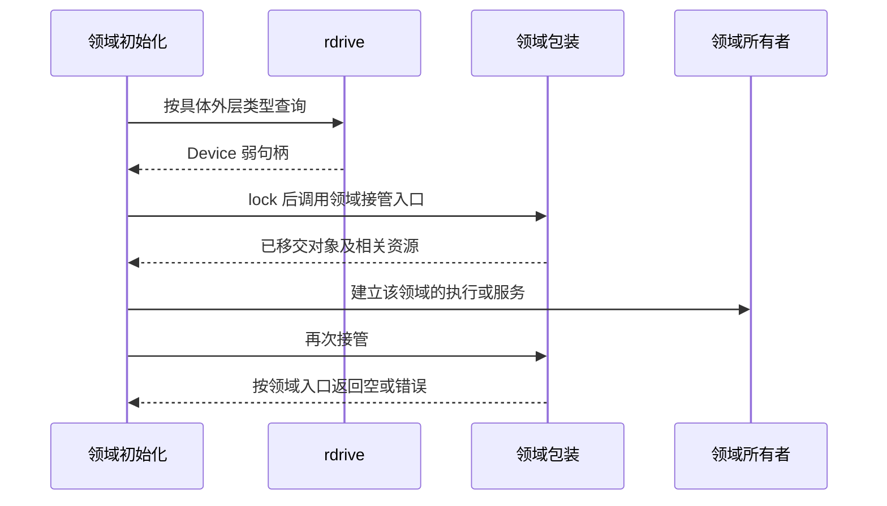

# 设备身份与注册管理

`rdrive` 保存驱动注册项、平台发现状态和已注册设备的身份。它不运行网络协议、文件系统请求队列或 USB 枚举任务；这些执行行为属于具体领域。管理入口位于 `drivers/rdrive/src/lib.rs`，设备容器位于 `manager.rs`，类型化句柄及独占访问位于 `lock.rs`。

## 1. 注册模型

驱动注册与设备注册是两种不同操作。`DriverRegister` 描述哪些回调可以匹配平台设备；`DeviceOwner` 持有回调实际创建的对象。链接了回调不等于平台上存在设备，设备注册成功也不等于上层运行时已经启动。

### 1.1 驱动注册项

`drivers/rdrive/src/register/mod.rs` 的 `DriverRegister` 不保存设备实例。管理器为探测生成注册项快照，再按阶段和优先级排序；不能将注册表本身描述为始终有序的容器。

| 字段 | 类型 | 行为 |
| --- | --- | --- |
| `name` | `&'static str` | 标识注册项，参与日志及 Static 后端完成记录 |
| `level` | `ProbeLevel` | 区分 `PreKernel` 与 `PostKernel` |
| `priority` | `ProbePriority` | 同阶段内数值较小者先执行 |
| `probe_kinds` | `&'static [ProbeKind]` | 保存 Static、FDT、ACPI 或 PCI 匹配规则与回调 |

`register_add()` 加入单个注册项，`register_append()` 接受 `&[DriverRegister]`。`DriverRegisterSlice::from_raw()` 用于将链接器区间解释为注册项切片，不是 `register_append()` 的独立参数类型。链接器区间的布局由注册宏和链接脚本共同约束。

### 1.2 设备实例

`Manager` 将注册项放入 `registers`，将已构建设备放入 `dev_container`。`DeviceContainer::devices` 的实际类型为 `BTreeMap<DeviceId, Vec<DeviceOwner>>`，一个设备身份可以关联多种外层对象类型。

相同 `DeviceId` 下可以注册不同类型，例如围绕同一硬件资源发布不同能力；相同身份和相同外层类型重复插入会触发断言。该规则不是按任意 trait 自动去重，也不是全局只能存在一个同类设备。

## 2. 身份与所有权

设备身份用于把固件描述、注册实例和消费者关联起来；资源所有权用于决定对象是否仍然存活。二者分开保存。`Descriptor` 的元数据可以随句柄保留，但元数据存在不能证明驱动核心仍可访问。

### 2.1 描述符

`drivers/rdrive/src/descriptor.rs` 的 `Descriptor` 保存 `device_id`、`name`、`irq_parent` 和可选的 `fdt_node`。`FdtNodeIdentity` 关联节点身份和路径，避免消费者用显示名称反向猜测固件节点。

| 查询或记录接口 | 关联对象 | 边界 |
| --- | --- | --- |
| `fdt_phandle_to_device_id()` | FDT phandle 与设备身份 | 依赖后端已记录对应关系 |
| `fdt_path_to_device_id()` | FDT 路径与设备身份 | 路径不是驱动类型 |
| `acpi_path_to_device_id()` | ACPI 路径与设备身份 | 不等于任意资源地址查询 |
| `acpi_resource_address_to_device_id()` | ACPI 资源地址与设备身份 | 与路径查找是不同入口 |
| `get::<T>(id)` | 身份下的具体注册类型 | 不扫描对象实现的所有能力 trait |

设备名用于日志与领域命名，不能替代 `DeviceId` 的唯一性约束。IRQ 父控制器身份也不能替代设备源编号或最终 `IrqId`。

### 2.2 句柄与访问守卫

`DeviceOwner` 持有 `Arc<LockInner>`；`Device<T>` 保存弱引用与类型化指针；访问时升级为持有强引用的 `DeviceGuard<T>`。下面的图同时表示注册所有权、借用和领域接管，接管后注册身份不随之删除。

`Device::lock()` 和 `try_lock()` 通过 `LockInner` 的借用状态实现独占访问，守卫析构时释放访问状态。克隆 `Device<T>` 不是复制硬件对象，也不允许两个可变访问同时存在。句柄升级失败、类型不匹配和借用冲突应按 `GetDeviceError` 处理。

## 3. 类型查询与资源接管

类型查询解决“哪个注册对象可以访问”，领域接管解决“谁负责之后的硬件运行”。两者使用不同机制，不能把查询成功等同于资源仍未被取走。

### 3.1 查询范围

`get_list::<T>()` 返回所有匹配外层注册类型的弱句柄；`get_one::<T>()` 取其中一个；`get::<T>(id)` 在指定身份下查询。`Device::downcast()` 使用实现提供的类型信息转换对象视图，不是动态发现任意 Rust trait 的能力反射机制。

`get_list()` 获取全局注册表锁并分配 `Vec`，源码明确规定它不适用于硬中断。IRQ 回调需要的设备端点、完成状态和通知句柄必须在注册 action 前发布，不能在每次中断中重新查找设备。

### 3.2 一次性移交

`drivers/ax-driver/src/registration.rs` 的 `TakeRegistered` 用于显示、输入和 vsock 包装，`take_registered_device()` 在访问守卫内调用 `take_registered()`。块和网络保留自己的接管入口，因为交付对象及错误处理不同。

| 消费模式 | 具体入口 | 注册后的状态 |
| --- | --- | --- |
| 持续查询 provider | `get()`、`get_one()` 与守卫 | 对象仍由注册所有者持有 |
| 取走领域对象 | `take_registered_device()` | 包装保留，内部 `Option` 清空 |
| 取走控制器或网卡 | 块 take、`take_net_device()` | 交付对象及对应资源来源 |
| 接管 USB 事件入口 | `take_event_handler()` | 主机对象保留，handler 不能重复取走 |

同一张注册表允许上述不同模式，不强制所有消费者走网络的 `prepare_device()` 或 builder。

注册描述符存在不表示内部对象尚未取走。接管失败的回滚由领域负责，`rdrive` 不会自动恢复 `Option`，也不提供通用热插拔卸载事务。生命周期见[设备发布与停止](lifecycle.md)。

## 4. 平台状态与子设备发布

`rdrive` 将设备容器与各发现后端的状态分开。初始化后端、记录已探测节点和发布设备实例发生在不同位置，避免把全部状态误认为 `Manager` 的字段。

### 4.1 平台来源

`Platform` 支持 `Static`、`Fdt`、`Acpi`、`AcpiWithoutAml`；`init_sources()` 支持来源切片，先校验并建立后端，再通过 `OnceLock` 建立管理器。它不是用于任意运行期替换现有平台和清空设备表的接口。

FDT 后端在 `drivers/rdrive/src/probe/fdt/mod.rs` 保存 `phandle_2_device_id`、`node_2_device_id`、`populated_paths`、`populated_nodes` 和 `child_owners`。Static 后端保存已成功探测的注册名，PCI 枚举器保存已处理的地址。后端完成记录决定再次探测时跳过哪些对象。

### 4.2 复合设备发布

`PlatformDevice::register_fdt_child()` 和 `register_with_fdt_child()` 处理由父设备管理的 FDT 子节点。后者先校验子设备发布条件，再一起发布父对象和子对象，避免父对象已经进入注册表而子节点绑定失败的半发布状态。

子节点校验失败应保留原注册状态，不以伪造 phandle 或重复注册父节点解决。普通设备发布、FDT 子节点发布和领域 `take` 是三个不同的生命周期操作。

## 5. 实现索引

源码边界按状态的归属划分，而不是按上层操作系统划分。平台初始化顺序由[探测与初始化](probe.md)说明，运行时接管由[生命周期](lifecycle.md)说明。

| 源码 | 核心对象 | 维护内容 |
| --- | --- | --- |
| `drivers/rdrive/src/lib.rs` | `init_sources`、`get_list`、`probe_all` | 全局入口和阶段调度 |
| `drivers/rdrive/src/manager.rs` | `Manager`、`DeviceContainer` | 注册项及设备所有者容器 |
| `drivers/rdrive/src/lock.rs` | `DeviceOwner`、`Device`、`DeviceGuard` | 类型、存活及独占访问 |
| `drivers/rdrive/src/descriptor.rs` | `Descriptor` | 设备身份和固件关联 |
| `drivers/rdrive/src/probe/fdt/mod.rs` | FDT `System` | 节点完成记录和资源提供者查找 |
| `drivers/rdrive/src/driver/mod.rs` | `PlatformDevice` | 注册对象和子节点发布 |
