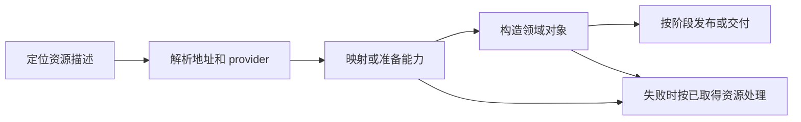

# 平台资源与设备绑定

平台资源层把固件描述和内核能力转换为驱动可使用的寄存器映射、DMA 上下文、时钟、复位、引脚和中断来源。`drivers/ax-driver/src/` 保存现有绑定实现，`memory/mmio-api/` 与 `memory/dma-api/` 提供内存资源抽象。绑定成功不自动保证所有设备状态已经就绪。

## 1. 来源与绑定

FDT 属性、ACPI 资源和 PCI 配置空间使用不同命名与地址空间。绑定层需要保留这些差异，领域运行时不应在接管后重新解析一套竞争的平台事实。

### 1.1 资源输入

`rdrive` 的 probe 上下文提供匹配设备和资源定位，具体回调决定消费哪些属性。板级 Static 回调需要显式提供等价资源，不能因为没有固件节点就跳过有效性检查。

图中的资源集合按设备需要构造，不存在要求所有驱动持有完全相同字段的 `BindingInfo`。当前 `BindingInfo` 主要保存 IRQ 映射，DMA 等对象由领域包装另外持有。

### 1.2 绑定输出

`BoundDevice` 关联注册对象与绑定信息，`register_bound_device()` 进入 `PlatformDevice` 发布路径。块、网络、显示输入和 USB 包装分别保存自己的能力对象。

| 资源 | 描述或能力 | 消费边界 |
| --- | --- | --- |
| MMIO | 地址窗口与映射对象 | 驱动寄存器访问 |
| DMA | `DeviceDma`、`DmaDeviceInfo` | 环、请求 backing、数据缓冲 |
| 时钟及复位 | provider 身份与局部资源 ID | 平台和设备初始化 |
| 引脚及 PHY | 状态、phandle、端口及 lane 配置 | SoC 与具体传输绑定 |
| IRQ | `BindingIrqBinding` | 域解析后注册 action |

`DeviceId`、资源 ID、CPU 地址和 IRQ 来源分别有作用域，不能靠数值相等认定两个资源相同。

## 2. 寄存器映射

映射建立 CPU 可访问窗口，寄存器布局解释窗口内偏移。映射成功不证明当前电源、时钟和复位状态允许访问所有寄存器。

### 2.1 地址转换

`drivers/ax-driver/src/mmio.rs` 的 `iomap()` 调用 `axklib::mmio::ioremap_raw()`，把映射错误转换为 probe 错误并返回非空指针。FDT 的子总线地址需要经过节点资源解析，PCI 的 BAR 也不是可直接解引用的 CPU 指针。

驱动核心接收映射后仍需满足长度、对齐和寄存器偏移要求。将一段 mapped MMIO 当作 DMA 缓冲，或把 DMA 地址当作普通 CPU 指针，均违反资源边界。

### 2.2 多窗口设备

`drivers/ax-driver/src/usb/dwc.rs` 分别映射 DWC3、USBDP PHY 和各 GRF。`Dwc3Regs::globals()` 再在控制器窗口上增加 `0xc100`，字段偏移相对该子区域，不能重复叠加全局偏移。

时钟和引脚 provider 也可能与多个设备共享寄存器区域。设备关闭或直通不代表可以任意释放或开放共享 provider 的映射；`rdif-clk` 的 `assignment_mmio_write_protection()` 就保留了共享控制状态的保护边界。

## 3. DMA 上下文

`memory/dma-api/src/lib.rs` 的 `DeviceDma` 保存平台 `DmaOp` 和 `DmaDeviceInfo`。上下文同时约束地址域、一致性和缓冲布局，不能用一个裸 `dma_mask` 表达全部行为。

### 3.1 地址域与约束

`memory/dma-api/src/def.rs` 定义 `DmaDomainId::Direct` 和 `Translated`，`DmaConstraints` 保存 `addr_mask`、`align`、`boundary` 和 `max_segment_size`。同一 CPU 地址不意味着可在不同设备域中直接复用映射。

`DeviceDma::with_constraints()` 从既有上下文派生资源约束，具体调用者需正确组合设备与队列限制。例如网络 `queue_dma()` 采用设备与队列更严格的地址范围；不能把该组合策略当作所有调用者自动完成的行为。

### 3.2 分配、映射与同步

DMA API 提供一致性数组、连续内存、streaming 映射和缓冲池。请求代码必须区分新分配的 backing 和既有内存的映射 handle，并在交接方向正确的区间执行同步。

| 操作 | 典型入口 | 约束 |
| --- | --- | --- |
| 创建描述符数组 | `coherent_array_zero()` | 类型布局、对齐及设备可达性 |
| 创建连续 backing | `contiguous_array_zero()` | 物理连续及设备约束 |
| 映射已有内存 | `map_streaming_slice()` | 域、方向和映射生命周期 |
| CPU/设备交接 | `DmaOp` 的同步操作 | 区间不能越过实际容量 |
| 释放或解映射 | 相应资源所有者 | 硬件已停止访问且引用已处理 |

一致性属性与描述符发布屏障不是同一个条件。xHCI TD 发布中的 `mb()` 不替代平台缓存同步，反过来也不能仅凭 coherent 分配推导所有字段对硬件的发布顺序。

### 3.3 设备约束实例

xHCI `Xhci::new()` 读取 AC64 并构造 DMA mask，使用传入一致性属性和 Direct domain。该实现不是按 RK3588 型号硬编码，也不能证明所有 xHCI 平台自动支持任意 IOMMU domain。

网络 `prepare_device()` 为 group 建立 `ToDevice` TX 池和 `FromDevice` RX 池，`QueueConfig` 决定大小、对齐和 ring 参数，可用容量为 `ring_size - 1`。`RxQueue::reclaim()` 的 CPU 同步范围限制为报告长度、配置大小与实际容量的最小值，同时保留原始长度供上层校验。

块运行时的 DMA 逻辑位于 `fs/ax-fs-ng/src/block/runtime/dma.rs`，owned 请求及完成归还合同位于 `rdif-block`。网络容量公式不能用于推导块队列或 USB 环深度。

## 4. 控制资源

时钟、复位、电源和引脚影响设备何时可以执行操作。框架提供查找和能力接口，设备回调仍需按真实硬件顺序使用它们。

### 4.1 provider 与阶段

`drivers/rdrive/src/probe/fdt/mod.rs` 提供 `clock_lines()`、`reset_lines()` 和 `apply_assigned_clocks()` 等入口，关联固件资源与注册 provider。控制器必须先可用，后续消费者才能执行操作；probe 优先级只提供调度顺序，不推导任意依赖图。

`rdif-reset::reset()` 默认只依次执行 assert 和 deassert，具体脉冲间隔由调用者或实现提供。电源域声明、时钟开启、复位释放和 PLL 锁定分别需要证据，不能互相替代。

### 4.2 PHY 与端口资源

DWC3 `collect_resources()` 聚合父节点、控制器及 PHY 时钟，`parse_phys()` 当前取前两项 phandle 为 USB2 与 USB3，`parse_resets()` 要求名称。USBDP 通过 alias 或节点名识别实例，并保存多个 GRF 和 lane 配置。

这些是具体绑定规则，不是所有 PHY 驱动都必须采用的通用属性顺序。`enable_clocks()` 跳过原始 ID 为零的条目，复位适配失败记录警告；不能把两者都描述成完全相同的返回错误机制。

## 5. IRQ 与资源交付

IRQ 来源属于绑定信息，action 属于运行时资源。多源设备需要保持源集合，不能只使用单源便利查询代表完整拓扑。

### 5.1 来源保留

`BindingIrqBinding` 将局部 `source_id` 关联到 `BindingIrq::Id` 或 `Source`，后者保留 FDT 控制器与 cells、ACPI GSI 或完整 route。PCI 回调还需表达 IRQ 是 Required 还是 Optional。

命名 FDT 中断通过 `binding_irq_from_named_fdt_interrupt()` 选择，普通单源 helper 不自动收集全部 interrupts。来源解析和 action 契约由[中断与事件](irq.md)维护。

### 5.2 准备与失败

资源准备可能在注册前，也可能在一次性接管之后。例如 USB probe 构造主机对象，网络 `prepare_device()` 在接管后准备 DMA；两者的失败清理对象不同。

图中失败处理不表示框架会自动逆转所有寄存器写入。网络准备失败可能保留部件，PHY 时钟已启用也不意味着任意失败分支都有完整回滚，具体条件由[生命周期](lifecycle.md)定义。
