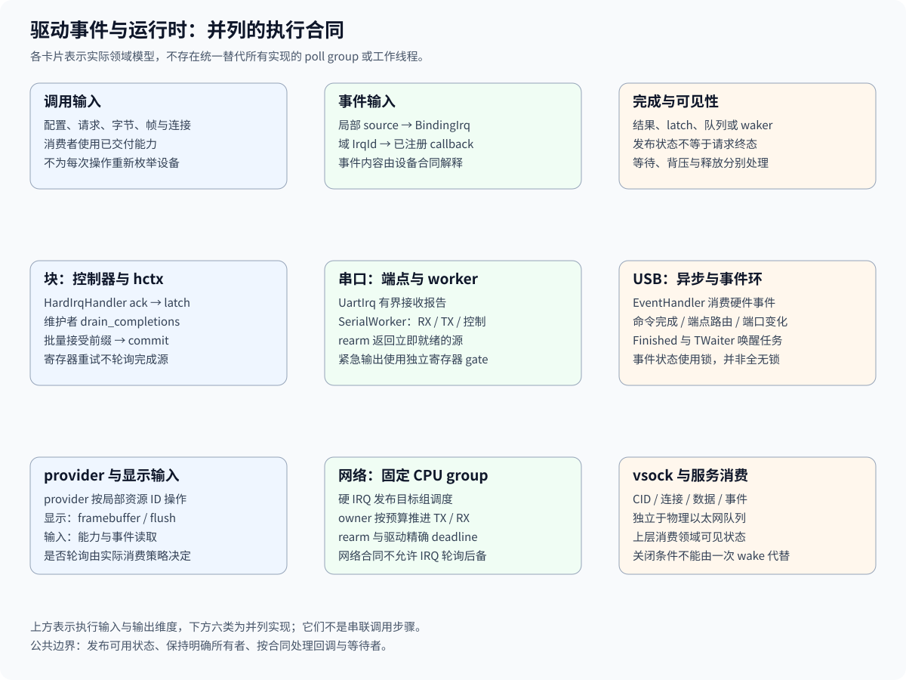
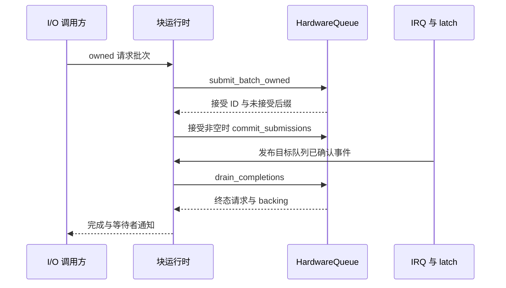
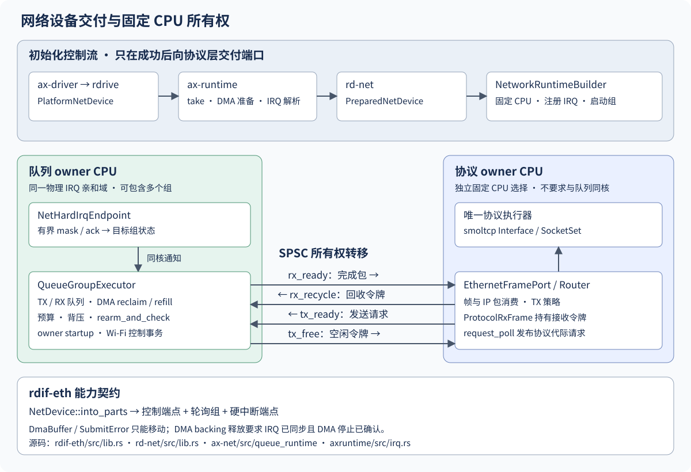
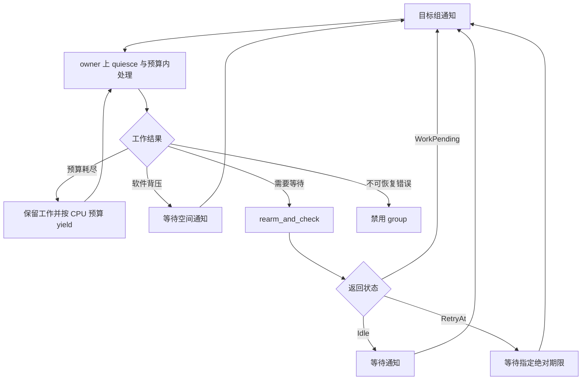
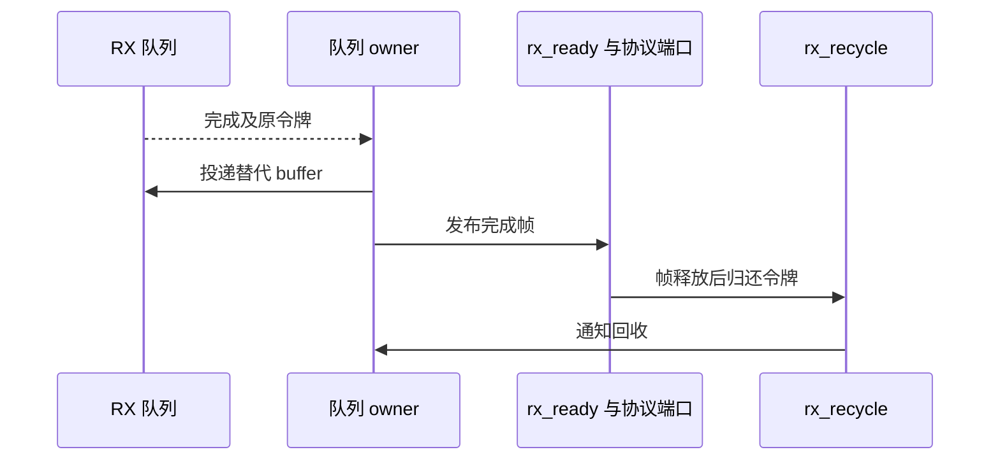

# 运行时、请求与完成

运行时为领域能力提供执行上下文、等待者、软件队列和完成交付。块设备维护硬件请求队列，串口推进字节与控制命令，USB 通过 future 等待控制器事件，显示输入保留领域调用，网络建立固定 CPU group。它们共享资源归属原则，不共享一个通用调度器或轮询规则。

## 1. 执行模型

注册查询定位设备，运行时决定设备操作何时执行。硬件 IRQ、任务通知、协议状态和软件空间释放是不同事件，不应都压成一次无条件全设备扫描。

### 1.1 上下文与所有者

执行对象的可变状态由相应 owner 保存；只读元数据、完成 latch 和通知端点可以按合同共享。`rdrive::get_list()` 会锁表和分配，不属于硬 IRQ 中动态查找队列的机制。

图中只有网络明确采用其固定 CPU 亲和域合同。串口和块设备的维护者、USB 的事件服务以及显示输入调用分别以自己的源码为依据。

### 1.2 触发与工作量

完成源、寄存器重试和软件队列变化需要区分。禁止块完成轮询不代表禁止 UART 的已定义 polling 模式，也不代表 USB future 不得检查状态。

| 领域 | 执行对象 | 主要触发与限制 |
| --- | --- | --- |
| 块 | 控制器维护与 hctx | 已确认 IRQ 后排空完成；定时器仅推进指定寄存器状态 |
| 串口 | `SerialWorker` | latch、控制命令、软件 TX/RX 与配置的 polling |
| USB | `Core`、端点 future、EventHandler | 端口变化、命令及传输事件、状态等待 |
| 显示与输入 | 领域适配对象 | 显示方法调用；输入 IRQ 通知与任务侧排水 |
| 网络 | `QueueGroupExecutor` | 目标 group 通知、预算、rearm 和精确 deadline |
| vsock | 连接接口 | 数据可用与连接事件 |

预算限制软件处理量，ring 深度限制硬件或环容量，FIFO 上限限制积压；三者不能通过一个“队列大小”参数表达。

## 2. 控制器与批量请求

块运行时位于 `fs/ax-fs-ng/src/block/runtime/`。`lifecycle/` 管理控制器与设备句柄，`hctx/` 维护队列提交，`completion.rs` 与 `waiters.rs` 关联完成和等待者。

### 2.1 提交与空间

`HardwareQueue::submit_batch_owned()` 从批次接收前缀，并同步报告请求 ID；运行时保留未接受请求。接受数非零时调用一次 `commit_submissions()`，包括部分接受后出现 Fatal 的情况。

序列中提交返回和完成返回不是同一事件。上层等待者只能在终态资源返回后使用相关 backing，不能以描述符已发布代替完成。

### 2.2 控制与 rearm

`BlockController::advance()` 的状态包括 `RegisterPending`、`WaitingForIrq`、`Ready` 和 `Shutdown`。队列也可以请求 `register_retry_after()`，但 `advance_register_retry()` 不得检查新的硬件完成源。

`runtime/irq.rs` 先向 queue latch 发布确认事件，再通知目标维护者。存在队列目标时，drain 与 rearm 由该目标承担，不再同时把同一 rearm 交给控制器维护者提前解除屏蔽；没有队列目标的控制事件才使用控制器路径。

## 3. 字符与领域调用

串口包含软件缓冲与长期维护线程，显示输入则保留领域接口的调用形态。二者不能因为都传递“小数据”就使用相同执行模型。

### 3.1 串口维护

`os/arceos/modules/axruntime/src/serial/worker.rs` 的 `SerialWorker` 保存 IRQ RX 消费端、输出生产端、待发送帧、日志游标、控制命令和 rearm 状态。`run()` 合并 latch，处理控制请求、RX 和 TX，再根据预算及等待条件继续或休眠。

`RX_BUDGET = 256`、`TX_BUDGET = 64` 是该实现的工作预算，不是 UART FIFO 深度。软件输出阻塞时保留 `pending_rx` 或发送游标，不能丢弃后半帧后仍宣称请求完整写入。

`UartPort::rearm()` 返回启用后已就绪并重新屏蔽的源，worker 继续处理这些立即事件，避免丢失边沿。紧急输出使用独立端点和寄存器 gate，不进入正常控制命令队列执行任意配置。

### 3.2 显示、输入与连接

`os/arceos/modules/axdisplay/src/rdif.rs` 将领域显示接口包装为 `DisplayDevice`，在 `need_flush()` 为真时执行 flush；构造时保存帧缓冲视图并由对象持有设备。这里没有自动创建网络式队列 owner。

`os/arceos/modules/axinput/src/rdif.rs` 转换事件和能力查询。Starry 的 `os/StarryOS/kernel/src/pseudofs/dev/event.rs` 由 `EventDev::handle_irq()` 确认设备事件并发布 `irq_notify`，`run_irq_service()` 在任务上下文调用 `drain_irq_events()`，先写入输入队列，再唤醒读者。后台服务不以用户等待者数量或最近一次 IRQ 的时间决定是否接收事件；IRQ 路由故障应在设备与平台链路修复，不通过周期轮询掩盖。

vsock 的 `poll_event()`、`send()` 和 `recv()` 围绕连接工作，不经过物理 Ethernet DMA 管道。连接与帧接口的服务边界见[领域服务](services.md)。

## 4. 异步请求与事件环

USB 主机运行时把拓扑、请求和硬件事件分开。`drivers/usb/usb-host/src/backend/kmod/kcore.rs` 的 `Core` 处理 hub 及设备变化，xHCI 端点和命令代码处理控制器协议。

### 4.1 请求发布与等待

`xhci/ring.rs` 的 `SendRing::enqueue_transfer_td()` 先让首 TRB 不可见，填写其余描述符并清理完成槽，屏障后发布首 TRB 的 cycle。一个请求可以使用多条 TRB，future 不等于每条 TRB 创建一个任务。

`queue.rs` 的 `Finished` 按总线地址预登记槽；`TWaiter::poll()` 先检查结果、注册 waker、再检查结果，覆盖登记期间到达的完成。原子槽的存在不意味着整个路径无锁，`EventHandlerState` 使用 `SpinLock`。

### 4.2 完成与拓扑推进

xHCI `EventHandler` 消费 Event Ring 并更新 ERDP，命令结果进入完成槽，传输结果由 `TransferResultHandler` 分发，端口变化唤醒枚举。新 hub 由 `Core` 加入拓扑后继续扫描下游。

`SpinWhile` 在条件未满足时自唤醒并返回 Pending，不自动提供截止时间。具体 PHY 锁定等待和 USB 取消状态需要按实现判断，不能把 async 关键字当作有界超时或取消安全的证明。完整机制见[USB 异步执行](usb/design.md)。

## 5. 固定 CPU 队列域

网络 `net/ax-net/src/queue_runtime/` 使用固定 CPU owner 推进 poll group。该模型是网络当前实现，不是所有设备的统一运行时。

### 5.1 分组与执行器

`assign_affinity_domains()` 将共享物理 `IrqId` 的组按传递关系合并为亲和域，再按域序号对在线 CPU 数取模。每个有组的 CPU 创建一个执行器，可管理多个组；`select_protocol_owner()` 选择组数最少的 CPU，相同时取编号较小者。

`NetworkRuntimeBuilder` 校验完整 source 映射和 worker 固定结果，禁用状态注册全部 action，然后使能并发起队列启动。只在启动、初始 refill/rearm 及配置的无线启动事务成功后交付端口；IRQ 不可用不增加轮询后备。

### 5.2 预算与重新使能

`QueueGroupExecutor::poll()` 先 quiesce，再处理 TX 完成、TX 提交、RX 回收和 RX 完成。`QUEUE_BUDGET = 64` 限制各类别，`CPU_ROUND_BUDGET = 256` 限制同 CPU 一轮总工作量；软件管道满时等待消费方释放空间。

`finish_idle()` 发现 rearm 窗口的新工作会重新调度并记录 `rearm_race`。`RetryAt` 来自设备状态机，不是任意周期扫描完成队列的许可。

### 5.3 控制事务

AIC 的 SDIO host 拆出 bus、card_irq 和硬 IRQ 端点；任务侧 `AicOwner` 保存总线与队列，`AicHardIrq` 发布 latch，不在硬 IRQ 中排空 FIFO 或执行固件命令。

`NetOwnerStartup` 在固定 CPU 和 IRQ 就绪后推进启动，返回 `Ready` 后才启用正常队列。`WifiControlQueue` 将 `WifiTransaction` 交给 `WifiExecutorSlot`，由 `start()`、`advance()`、`cancel()` 推进；等待中断、带期限等待及 `RetryAt` 具有不同唤醒条件。

## 6. 帧通道与背压

网络队列域和协议执行器通过预分配 SPSC 管道传递 DMA 令牌。这里的细节说明有界跨执行域交付如何实现，不把网络帧作为其他领域的统一数据单位。

### 6.1 接收令牌

`QueueGroupExecutor` 取得 `RxCompletion` 后先投递替代 buffer，再发布完成包。`pending_rx_refill` 保存未成功补交的替代令牌和完成包，容量受 RX 队列限制。

无法获得替代 buffer 时丢弃当前包并重新投递原令牌，而不是等待没有通知来源的分配器。`RxRecycler` 还保留有界回收暂存，协议帧析构不直接操作硬件队列。

### 6.2 发送令牌

协议侧从 `tx_free` 取得 buffer，经 `tx_ready` 交给 owner；硬件完成后令牌返回 `tx_free`。拒绝提交的令牌由 `SubmitError` 返回，`Retry` 和 `LinkDown` 的后续尝试需要明确事件来源。

| 选项 | 当前行为 |
| --- | --- |
| `NoQueue` | 不额外保留软件 FIFO，忙时返回 `Again` |
| `Fifo { max_frames }` | 有界保留并维持顺序，当前系统配置为 64 帧 |
| `TxChecksumCapabilities` | 端口使用全部 TX 队列能力的交集 |
| `TxSubmitOptions::checksum` | 显式可选 offload；无选项时保留提供的 checksum |
| `TxNotify::Deferred` | 可延迟通知，由 `flush()` 在批次边界发布 |

默认 `submit_with_options()` 可以拒绝 offload，并不保证批量通知优化。`flush()` 只发布通知，不等待发送完成；软件 FIFO 接受也不等于设备完成。

## 7. 观测与领域服务

请求推进统计解释特定执行模型，不能以计数归零代替 IRQ 同步或硬件停止确认。运行时的交付物还需由服务层转换为系统语义。

### 7.1 工作状态

网络 `NetworkQueueRuntime::stats()` 保存 owner、IRQ 和 poll CPU，以及 remote wake、missed、budget、deferred、rearm 等计数。回归位置包括 `queue_runtime/tests.rs`、`executor/queue_tests.rs` 及 `rd-net` 测试。块运行时有自己的 metrics、completion 和 waiter 状态，USB 使用命令码、完成地址及端点状态。

这些源码位置说明观测对象与测试覆盖，不证明当前目标运行已经通过。停止与隔离条件由[生命周期](lifecycle.md)定义。

### 7.2 协议与上层消费

网络的 `ProtocolPollRuntime` 用 requested/completed 代际合并唯一协议执行器请求，`Service` 和 `Router` 管理协议状态。socket 调用方不成为第二个硬件队列或协议 owner；协议配置细节属于网络子系统而非驱动公共机制。

块完成后由卷和文件系统消费，UART 字节由终端和控制台消费，USB 枚举结果由系统设备树消费。具体交付和系统调用位置见[领域服务](services.md)与[系统集成](integration.md)。
