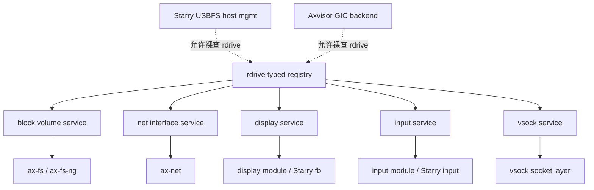

# 领域服务与上层消费

上层业务模块不直接处理 `AllDevices`，也不直接把 `rdrive` 当作全局设备篮子。每个领域有自己的 service，service 可以从 `rdrive` 查询 typed device 并整理成上层需要的能力集合。

## 领域 service 职责

| 领域 | 新 service 职责 | 上层边界 |
| --- | --- | --- |
| block | 枚举 disk，扫描 partition，生成 `BlockVolume`，根据 bootargs 选择 root candidate | FS 只拿 volume / FS block trait |
| net | 枚举 `rd-net`，建立 interface，处理 DHCP/static IP policy | NET/NET-NG 只拿 net interface |
| display | 枚举 `rdif-display` / `rd-display`，选择 primary display | display 模块和 Starry fb 只拿 display handle |
| input | 枚举 `rdif-input` / `rd-input`，建立 event stream | input 模块和 Starry input 只拿 event source |
| vsock | 枚举 `rdif-vsock` / `rd-vsock`，维护 connection/event API | vsock socket 层只拿 vsock device |

直接使用 `rdrive::get_*` 只允许出现在设备管理型或低层 HAL 型代码中，例如 Starry USBFS host 管理和 Axvisor AArch64 GIC backend。普通 FS、NET、display、input、vsock 上层模块不得裸查 `rdrive`。



## Block Volume 与分区扫描

分区扫描抽成唯一实现，位于独立 block volume 层，而不是 FS 层或旧块驱动接口路径。

目标数据模型：

```rust
pub struct BlockVolume {
    pub disk_id: DiskId,
    pub partition_id: Option<PartitionId>,
    pub region: BlockRegion,
    pub table_kind: PartitionTableKind,
    pub partuuid: Option<PartUuid>,
    pub partlabel: Option<PartLabel>,
}
```

block volume 层负责：

- 从 `rdif-block` 枚举 physical disk。
- 支持 GPT、MBR、raw disk。
- 产出稳定 volume metadata。
- 提供裁剪到 `BlockRegion` 的 block reader。

FS 负责：

- 根据 `root=/dev/sdXn`、`root=/dev/mmcblkXpY`、`PARTUUID=`、`PARTLABEL=` 选择 root volume。
- 检测 ext4、FAT 等 filesystem magic。
- 挂载选定 volume。

FS 不再 import `ax_driver::{AxBlockDevice, AxDeviceContainer, PartitionInfo, PartitionRegion, PartitionTableKind}`，也不调用 `ax_driver::scan_partitions`。

## 网络设备消费

`ax-net` 通过 `EthernetDriver` trait 对接网卡驱动，不直接依赖 FDT、PCI、MMIO、DMA 或平台 IRQ ABI。网络 service 从 `rd-net` 枚举设备，建立 interface，处理 DHCP/static IP policy。

详细网络消费模型见[网络栈 - 系统集成](../net/integration.md)。

## 平台设备消费

平台设备（intc、clk、pinctrl、pcie、timer、systick）的消费者主要是 HAL 和 SoC glue：

- `ax-hal` 的 IRQ subsystem 查询 `rdif-intc` 注册 handler。
- `ax-hal` 的 clock subsystem 查询 `rdif-clk` 设置频率。
- PCIe 枚举查询 `rdif-pcie` 获取 controller 和 config space。
- SoC glue 查询 `rdif-pinctrl` 配置 pin mux。

这些查询通常发生在 PreKernel probe 阶段（平台基础设施初始化），是允许直接使用 `rdrive::get_*` 的低层 HAL 场景。
