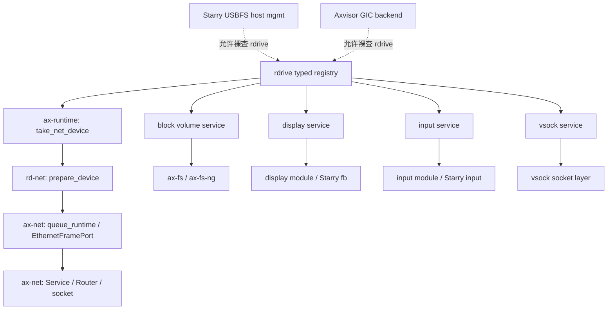

# 领域服务与上层消费

上层业务模块不直接处理 `AllDevices`，也不直接把 `rdrive` 当作全局设备篮子。每个领域有自己的 service，service 可以从 `rdrive` 查询 typed device 并整理成上层需要的能力集合。

## 领域 service 职责

| 领域 | 新 service 职责 | 上层边界 |
| --- | --- | --- |
| block | 枚举 disk，扫描 partition，生成 `BlockVolume`，根据 bootargs 选择 root candidate | FS 只拿 volume / FS block trait |
| net | `ax-runtime` 枚举并移交设备；`ax-net` 建立队列运行时、协议接口与 DHCP/static IP 状态 | 协议层通过 `EthernetFramePort` 收发；socket 层消费统一协议状态 |
| display | 枚举 `rdif-display` / `rd-display`，选择 primary display | display 模块和 Starry fb 只拿 display handle |
| input | 枚举 `rdif-input` / `rd-input`，建立 event stream | input 模块和 Starry input 只拿 event source |
| vsock | 枚举 `rdif-vsock` / `rd-vsock`，维护 connection/event API | vsock socket 层只拿 vsock device |

直接使用 `rdrive::get_*` 只允许出现在设备管理型或低层 HAL 型代码中，例如 Starry USBFS host 管理和 Axvisor AArch64 GIC backend。普通 FS、NET、display、input、vsock 上层模块不得裸查 `rdrive`。


```mermaid
flowchart TB
    Rdrive["rdrive typed registry"] --> BlockSvc["block volume service"]
    Rdrive --> NetTake["ax-runtime: take_net_device"]
    NetTake --> NetPrepare["rd-net: prepare_device"]
    NetPrepare --> NetSvc["ax-net: queue_runtime / EthernetFramePort"]
    Rdrive --> DispSvc["display service"]
    Rdrive --> InSvc["input service"]
    Rdrive --> VsSvc["vsock service"]

    BlockSvc --> Fs["ax-fs / ax-fs-ng"]
    NetSvc --> AxNet["ax-net: Service / Router / socket"]
    DispSvc --> Display["display module / Starry fb"]
    InSvc --> Input["input module / Starry input"]
    VsSvc --> Vsock["vsock socket layer"]

    Usbfs["Starry USBFS host mgmt"] -.->|"允许裸查 rdrive"| Rdrive
    AxvisorHal["Axvisor GIC backend"] -.->|"允许裸查 rdrive"| Rdrive
```

## Block Volume 与分区扫描

分区扫描抽成唯一实现，位于独立 block volume 层，而不是 FS 层或旧块驱动接口路径。

目标数据模型：

```rust
pub struct BlockVolume {
    pub disk_id: DiskId,
    pub partition_id: Option<PartitionId>,
    pub region: BlockRegion,
    pub table_kind: PartitionTableKind,
    pub partuuid: Option<PartUuid>,
    pub partlabel: Option<PartLabel>,
}
```

block volume 层负责：

- 从 `rdif-block` 枚举 physical disk。
- 支持 GPT、MBR、raw disk。
- 产出稳定 volume metadata。
- 提供裁剪到 `BlockRegion` 的 block reader。

FS 负责：

- 根据 `root=/dev/sdXn`、`root=/dev/mmcblkXpY`、`PARTUUID=`、`PARTLABEL=` 选择 root volume。
- 检测 ext4、FAT 等 filesystem magic。
- 挂载选定 volume。

FS 不再 import `ax_driver::{AxBlockDevice, AxDeviceContainer, PartitionInfo, PartitionRegion, PartitionTableKind}`，也不调用 `ax_driver::scan_partitions`。

## 网络设备消费

`os/arceos/modules/axruntime/src/devices.rs` 的 `collect_net_devices()` 从 `rdrive` 枚举 `PlatformNetDevice`，调用 `take_net_device()` 一次性取走网卡、DMA 能力和 IRQ 映射。`rd_net::prepare_device()` 准备队列及 DMA 池；`ax_net::NetworkRuntimeBuilder::build()` 成功后交付 `NetworkQueueRuntime` 和 `EthernetFramePortList`。`rd-net` 不承担设备枚举、任务创建或 HAL IRQ 注册。

`net/ax-net/src/device/driver.rs` 的 `EthernetFramePort` 是协议层收发边界，隐藏设备寄存器、描述符和传输实现。`ax-net::queue_runtime` 本身使用 DMA 令牌与 `IrqId`，负责固定 CPU 队列推进；HAL 注册形态由 `ax-runtime::RuntimeNetIrqRegistrar` 实现，不能把帧接口的隔离范围扩大到整个 `ax-net` crate。

`ax_net::init_network()` 建立逻辑接口、路由、DHCP 和 DNS 状态。`Service` 持有单个 smoltcp `Interface`，`Router` 汇聚多设备，唯一协议执行器通过 `ProtocolPollRuntime` 的代际请求推进全局 `SocketSet`。`NetControl` 返回控制面快照，系统调用或应用层不另建一份设备、路由和地址登记表。

驱动令牌和执行域由[网络驱动](network.md)定义；协议配置及系统接口由[网络栈系统集成](../net/integration.md)定义。Unix socket 与 vsock 使用独立传输，不能套用物理网卡 DMA 队列路径。

## 平台设备消费

平台设备（intc、clk、pinctrl、pcie、timer、systick）的消费者主要是 HAL 和 SoC glue：

- `ax-hal` 的 IRQ subsystem 查询 `rdif-intc` 注册 handler。
- `ax-hal` 的 clock subsystem 查询 `rdif-clk` 设置频率。
- PCIe 枚举查询 `rdif-pcie` 获取 controller 和 config space。
- SoC glue 查询 `rdif-pinctrl` 配置 pin mux。

这些查询通常发生在 PreKernel probe 阶段（平台基础设施初始化），是允许直接使用 `rdrive::get_*` 的低层 HAL 场景。
