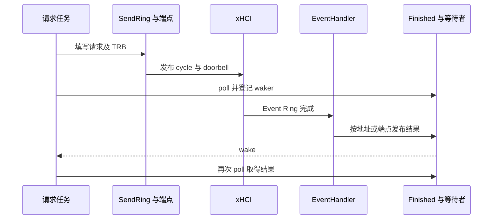

# USB 异步执行与完成交付

`crab-usb` 把主机管理、设备枚举和控制器传输分开。异步接口表示调用可以等待设备事件后继续，不表示每个 TRB 都创建一个任务，也不表示所有共享结构无锁。软件包源码位于 `drivers/usb/usb-host/`，内核后端位于 `src/backend/kmod/`。

该实现对应公共[运行时与完成](../runtime.md)中的异步请求模型，设备停止条件由[生命周期](../lifecycle.md)限定。

## 1. 主机执行模型

`USBHost` 持有后端对象，公开主机初始化、设备变化查询、设备打开及事件处理入口。`Core` 管理跨控制器复用的 hub 拓扑，xHCI、DWC2 和 EHCI 后端分别解释硬件请求。

### 1.1 平台与核心

`drivers/ax-driver/src/usb/mod.rs` 的 `PlatformUsbHost` 将 `USBHost` 与 `BindingInfo` 关联。`UsbKernel` 转发 DMA 分配、映射、同步及内核服务，USB 核心不直接从 FDT 取得这些能力。

`USBHost::create_event_handler()` 取得独立事件处理对象。平台包装提供 `take_event_handler()` 和带绑定来源的 handler 接管入口，避免把整个可变主机对象塞进 IRQ 回调。

### 1.2 异步调用范围

`src/host.rs` 的 `init()` 和 `open_device()` 等方法等待后端完成；`src/backend/kmod/kcore.rs` 的 `Core` 负责初始化根 hub、处理端口变化和创建已寻址设备。执行器由系统集成提供，USB future 本身不创建操作系统任务。

一个控制请求可以包含多个 TRB，一个 transfer descriptor 也可以由多条 TRB 组成。任务、请求、TD 和 TRB 不是一一对应关系，不能按 TRB 数量估计调度器任务数。

## 2. xHCI 请求发布

命令环、传输环和事件环具有不同生产者。`ring.rs` 保存 DMA TRB 存储和 cycle 状态，`cmd.rs` 组织命令，`endpoint.rs` 保存端点请求状态。

### 2.1 环与可见性

`Ring` 使用 `CoherentArray` 保存 TRB。带 Link TRB 的发送环将末槽保留给链接，回绕时改变 cycle 状态；`SendRing::usable_capacity()` 表达实际可提交容量，不能用分配槽数直接代替。

`SendRing::enqueue_transfer_td()` 组织同一 TD 的发布。数据内容、cycle bit 和 doorbell 的顺序决定硬件何时看到请求；只有填入软件数组而未满足发布顺序，不构成硬件接受的证据。

该方法先以不可见 cycle 写入首条 TRB，再填写其余 TRB 并清理各地址对应的旧完成槽；执行 `mb()` 后才将首条 TRB 改为可见 cycle。首条描述符承担整个 TD 的发布入口，不能先向硬件发布首条，再补写后续内容。空 TRB 切片直接返回空地址集合。

### 2.2 命令与数据完成

`SendRing` 按 TRB 总线地址关联 `Finished<R>`，命令完成返回到命令等待者，传输完成由 `TransferResultHandler` 按设备 slot 和端点路由。端点更换队列时使用 `replace_queues()` 更新完成路由，不能继续向旧队列发布新完成。

事件处理只交付硬件结果；请求任务继续执行描述符解析、枚举或上层数据操作。一次唤醒不保证每个请求都完成，任务仍须检查自己等待的对象。

## 3. 完成槽与唤醒

`src/backend/kmod/queue.rs` 预先建立 `BusAddr` 到完成槽的映射。每个 `FinishedData` 保存原子状态、结果和 `AtomicWaker`，避免把完成值和任务通知当作同一件事。

### 3.1 状态与访问

槽状态使用 `SLOT_EMPTY`、`SLOT_WRITING`、`SLOT_READY`、`SLOT_READING`。写方先取得写入状态，再发布结果；读方取得读取状态后消费结果并恢复空槽。`taken` 另外记录等待者是否被独占取得。

| 对象或方法 | 作用 | 限制 |
| --- | --- | --- |
| `Finished::new()` | 为已知总线地址建立槽 | 不是每次 IRQ 动态插入 |
| `try_set_finished()` | 向已登记地址发布完成 | 未登记地址返回失败 |
| `take_waiter()` | 取得独占 `TWaiter` | 同一槽重复取得会 panic |
| `get_finished()` | 取出已发布结果 | 不能绕过已交付 waiter 的访问规则 |
| `TWaiter::poll()` | 检查结果、登记 waker、再次检查 | 第二次检查用于覆盖登记期间到达的完成 |

`Finished` 的原子槽不代表整个 xHCI 路径无锁。`host.rs` 的 `EventHandlerState` 使用 `SpinLock`，共享寄存器对象使用 `RwLock`，端点还拥有任务侧可变状态。

### 3.2 事件环推进

`event.rs` 的 `EventRing::next()` 判断事件可见性并推进消费位置；`host.rs` 的 `EventHandler` 处理命令、传输和端口变化，并更新 ERDP。端口事件唤醒枚举相关状态，不直接把未知设备注册为用户态可打开对象。

事件环排空、ERDP 更新和 IRQ 确认构成控制器事件路径，不能只写“收到中断后 wake”而省略硬件消费位置维护。系统 IRQ 生命周期仍由集成层负责。

## 4. 取消与资源生命周期

future 不再被轮询，不等于控制器不再访问请求缓冲区。取消必须关联端点状态、硬件停止和请求终态交付。

### 4.1 端点取消

`endpoint.rs` 的 `cancel_request()` 标记已提交请求，并通过相应端点恢复路径处理停止和 dequeue 指针。代码包含 `StopEndpoint` 与 `SetTrDequeuePointer` 命令；这些操作属于控制器协议，不能用删除软件等待者替代。

端点切换还需要同步完成路由与队列资源。`transfer.rs` 的 `replace_queues()` 对一组端点路由进行替换，设备配置变化的发布流程位于 `xhci/device.rs`。

### 4.2 故障与验证边界

命令失败、端点停止、未找到完成路由和设备断开是不同错误。完成值必须返回到原请求或被明确处理，不能以一次统一唤醒掩盖请求资源仍由硬件持有的状态。

代码中的队列和端点测试覆盖特定生命周期行为，不等于所有控制器在任意执行器上均已验证。USB 系统集成需要同时核对事件服务、定时等待、DMA 后端和关闭路径；网络的固定 CPU owner 合同不能直接复制为 USB 的既有实现。
