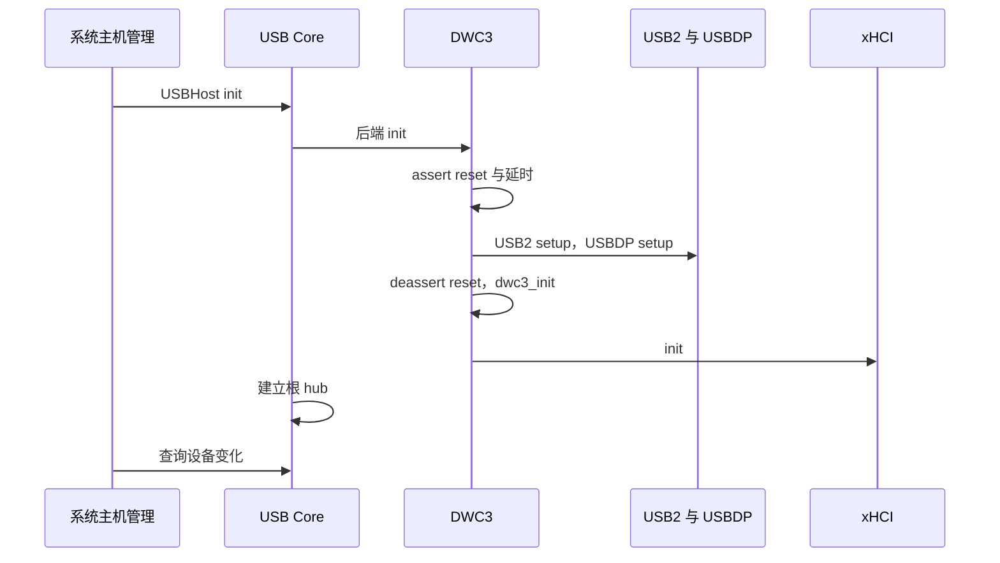
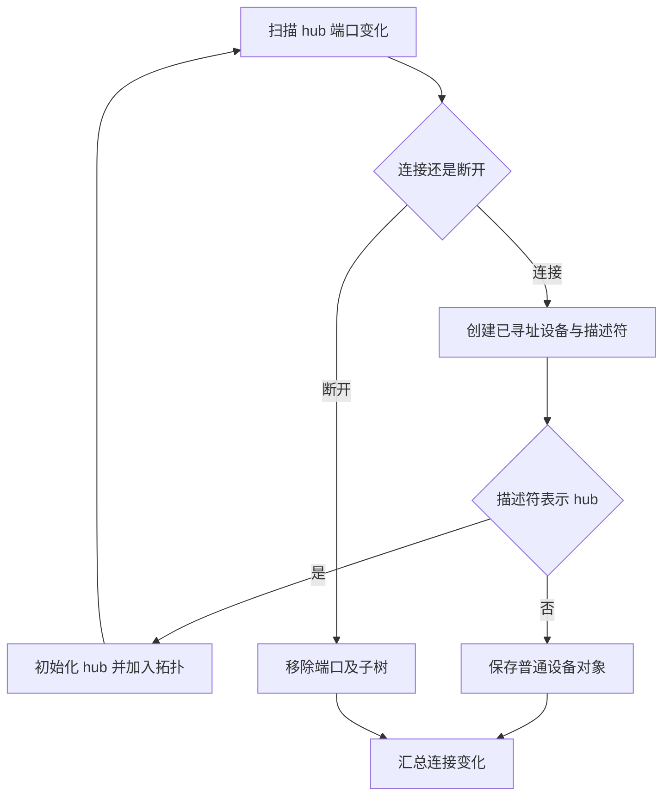

# RK3588 USB 主机发现与设备枚举

RK3588 USB 设备可用需要经过两层发现：`rdrive` 根据 FDT 创建 DWC3 主机，`crab-usb` 在主机启动后枚举根端口和外部 hub。前者发现控制器，后者发现总线外设，不能用一次 probe 成功代替完整 USB 枚举。

主机探测对应公共[探测与初始化](../probe.md)，主机之后的枚举对应[运行时与完成](../runtime.md)，二者在 USB 中连续发生但维护不同状态。

## 1. 控制器发现

平台绑定位于 `drivers/ax-driver/src/usb/dwc.rs`，注册项匹配 `snps,dwc3`，使用普通设备阶段和默认优先级。回调只接管明确声明 `dr_mode = host` 的节点。

### 1.1 模式与资源匹配

`probe()` 对其他模式以及缺失 `dr_mode` 的节点返回 `OnProbeError::NotMatch`。随后 `collect_resources()` 读取控制器寄存器、USB2 PHY、USBDP PHY、时钟、命名复位和 DWC 参数。

PHY 并不是由控制器地址推算出的固定伴随区域。USB2 资源经 PHY 端口和父节点查找 GRF，USBDP 资源使用多个 `rockchip,*-grf` phandle；依赖格式不满足时，probe 返回错误。

### 1.2 主机发布

`USBHost::new_dwc(DwcNewParams)` 构造 DWC 后端，`register_usb_host()` 发布 `PlatformUsbHost` 并记录 IRQ 来源。主机包装中存在事件 handler 与绑定信息，不等于主机已经扫描出设备。

`rockchip-dwc-xhci` feature 只决定该回调和依赖进入镜像。实际节点的模式、PHY 拓扑和资源提供者决定能否构造主机。

## 2. 主机初始化

主机初始化跨越 Rockchip PHY、DWC3 和 xHCI。`backend/kmod/dwc/mod.rs` 的 `_init()` 是当前执行顺序的依据，不能以旧调试记录或函数上方过时的顺序注释替代函数体。

### 2.1 PHY 与 DWC3

当前顺序为控制器复位置位、延时 1 ms、USB2 PHY setup、USBDP PHY setup、控制器复位释放、`dwc3_init()`。`dwc3_init()` 分配事件缓冲并调用 `core_init()`，后者包含 `phy_setup()` 和 host 模式配置。

USB2 `init()` 在解除 PHY suspend 配置后延时 2000 μs。USBDP `status_check()` 在 USB 模式等待 PLL 的 AFC 与 LOCK 位，并根据 lane 方向等待对应 CDR 锁定；这些等待不是“尚未实现”的功能。

### 2.2 xHCI 与根 hub

DWC3 初始化之后调用 `xhci.init()`，最后打印寄存器。`xhci/host.rs` 的 `_init()` 建立控制器运行所需寄存器与环状态；通用 `Core::init()` 调用后端初始化并建立 root hub。

DWC3 的 PHY 配置在当前函数体中发生于 `xhci.init()` 之前。这里记录实现顺序，不把历史文档中的相反建议声明为硬件规范。

## 3. 端口与设备枚举

`backend/kmod/kcore.rs` 的 `Core` 保存 hub 集合、拓扑位置和已初始化设备。枚举返回连接及断开变化，而不是简单返回一份永远有效的设备指针数组。

### 3.1 端口连接

`_probe_devices()` 遍历当前 hub，取得各自端口事件。连接事件交给 `connect_port()`；该方法先拒绝已占用拓扑位置，再构造 `DeviceAddressInfo`，由后端创建已寻址设备。

xHCI 后端分配 slot、填写设备上下文并使用控制端点读取描述符。`root_port_id`、`port_id`、`port_speed` 和父 hub 信息在这一步共同决定寻址输入；Route String 的计算见[xHCI 拓扑路由](xhci-route-string.md)。

### 3.2 hub 与普通设备

`HubDevice::is_hub()` 根据设备及配置描述符识别 hub。hub 分支创建并初始化 `HubDevice`、分配 `HubId`、保存 `child_hub`；普通设备分支将对象放入 `inited_devices`。二者均记录 `(parent_hub, port_id)` 的连接位置。

新 hub 会触发后续扫描，使枚举覆盖其下游设备。不能将直接连接根端口的成功结果扩大为多级 hub 或所有 USB 速度均已验证。

## 4. 系统消费与事件服务

控制器事件推进与用户态枚举视图相互关联，但不处于同一执行位置。IRQ 服务必须先能交付命令和传输完成，异步枚举才能从等待中继续。

### 4.1 打开设备

`src/host.rs` 的 `USBHost::open_device()` 请求后端取得设备对象，再初始化面向调用者的 `Device`。描述符快照用于识别设备，不拥有任意重开次数的硬件控制权。

StarryOS 的 `os/StarryOS/kernel/src/pseudofs/usbfs/manager.rs` 组织主机与设备管理，`tree.rs` 保存对外树结构，`irq.rs` 连接事件处理。Linux 用户态 USBFS 行为在系统层实现，不属于 DWC3 PHY 初始化。

### 4.2 断开与故障定位

`disconnect_port()` 处理连接位置及后代，枚举结果记录 disconnected 集合。上层需要撤销对应视图和请求，不能继续把旧软件 device ID 作为当前硬件存在的证明。

| 现象 | 首先对应的源码阶段 | 需要区分的状态 |
| --- | --- | --- |
| 未出现主机注册日志 | `dwc.rs::probe` | feature、模式匹配、资源解析 |
| 卡在 PHY 初始化 | `Usb2Phy::setup`、`Udphy::setup` | 时钟、复位、锁定位等待 |
| 命令等待不结束 | xHCI command 与 event 路径 | doorbell、DMA、IRQ 和完成地址 |
| 根端口有连接但无设备 | `connect_port`、xHCI `address` | 速度、EP0、上下文和描述符 |
| 外部 hub 下设备缺失 | hub 初始化和再次扫描 | hub 描述符、端口变化、拓扑深度 |
| 断开后仍出现旧设备 | `disconnect_port` 与系统视图 | 子树撤销和上层引用 |

早期文档以 U-Boot 的 `usb start` 命令调用链解释 RK3588；该命令不是当前 TGOSKits 的主机入口。U-Boot 对照的版本与证据边界单独记录在[初始化对照](rockchip/u-boot-comparison.md)。
