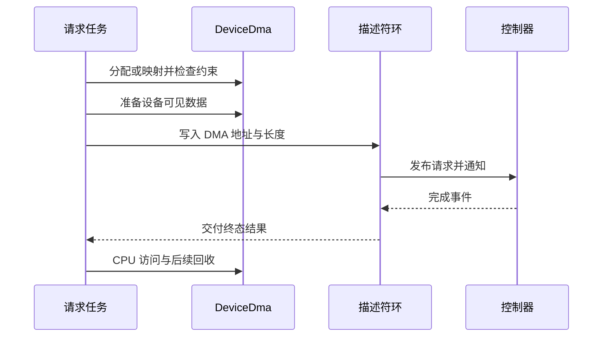

# xHCI DMA 寻址与一致性

USB DMA 的可用性由设备地址能力、DMA domain、分配约束、映射和缓存同步共同决定。当前 xHCI 构造路径读取控制器能力后创建 `DeviceDma`；不能仅凭 CPU 能访问某段内存，就把其地址直接写入 TRB。

寻址与同步对应公共[平台资源](../../resources.md)中的 DMA 上下文，xHCI 的 AC64 选择是具体实现而非所有驱动的固定约束。

## 1. 地址能力

`drivers/usb/usb-host/src/backend/kmod/xhci/host.rs` 的 `Xhci::new()` 读取 `HCCPARAMS1`，调用 `addressing_capability()` 获得 AC64，再选择 DMA mask。该选择依据实际寄存器，不按 RK3588 名字固定返回 32 位。

### 1.1 当前 mask 选择

构造器在 AC64 为真时使用 `u64::MAX as usize`，否则使用 `u32::MAX as usize`。这是当前实现表达的设备约束，不意味着 AC64 为真就保证所有平台总线与映射都支持任意 64 位地址。

| 构造输入 | 处理 | 约束含义 |
| --- | --- | --- |
| AC64 为假 | 32 位 mask | DMA 地址必须在约束范围内 |
| AC64 为真 | 按 `usize` 表达的 64 位 mask | 仍受目标指针宽度及 DMA 后端限制 |
| `coherency` | 写入 `DmaDeviceInfo` | 与寻址位宽独立 |
| DMA domain | 当前为 `DmaDomainId::Direct` | 不能据此声称已接入任意 IOMMU domain |

旧实验“低地址正常、高地址读零”可以作为特定测试现象，但未记录对应寄存器和映射时，不能推出所有 RK3588 控制器 AC64 恒为零。

### 1.2 地址空间区分

CPU 虚拟地址用于软件访问，物理地址用于平台映射，`BusAddr` 用于控制器 DMA。`DeviceDma` 和 DMA 分配返回值负责关联这些视图，而不是由 TRB 代码做恒等转换。

直接 domain 不免除检查 mask、对齐和完整区间。只检查缓冲区起点而忽略长度，不能证明设备访问范围全部有效。

## 2. DMA 能力传递

USB 核心通过内核适配取得 DMA 服务；设备能力随 `Kernel` 保存。分配与同步操作必须使用同一资源上下文，否则环和数据缓冲可能采用互相冲突的假设。

### 2.1 内核适配

`backend/kmod/osal.rs` 的 `Kernel` 保存 `DeviceDma` 与 `KernelOp`，后者继承 `DmaOp` 并提供延时。`drivers/ax-driver/src/usb/mod.rs` 的 `UsbKernel` 把连续分配、一致性分配、streaming 映射及同步转发到 `axklib::dma::op()`。

| 操作类别 | 平台适配入口 | 资源边界 |
| --- | --- | --- |
| 连续分配 | `alloc_contiguous()` | 返回满足布局与约束的 handle |
| 一致性分配 | `alloc_coherent()` | 由后端确定一致性实现 |
| streaming 映射 | `map_streaming()` | 将既有内存映射给设备 |
| CPU/设备同步 | `sync_alloc_for_*()`、`sync_map_for_*()` | 按方向和区间交接可见性 |
| 释放与解映射 | `dealloc_*()`、`unmap_streaming()` | 必须在设备不再使用后执行 |

方法名中的 coherent 不应被解释为任意平台上都不需要屏障。缓存可见性与描述符发布顺序是不同问题。

### 2.2 环与上下文

`xhci/ring.rs` 使用 `CoherentArray` 存储 TRB，`event.rs` 管理事件环及 segment 信息，`context.rs` 管理设备上下文。命令环、端点环、事件环和上下文都必须使用设备可达地址，不能只给普通数据缓冲施加 mask。

`SendRing::bus_addr()` 提供硬件地址，完成槽也以总线地址匹配。若提交地址与完成地址采用不同地址视图，硬件即使产生了事件，软件仍可能找不到等待者。

## 3. 可见性与生命周期

DMA 问题不仅表现为高地址失败，也可能表现为旧描述符、全零数据、错误完成地址或偶发超时。排查必须分开地址有效性与所有权交接。

### 3.1 发布与回收

发送前准备缓冲和 TRB，按 DMA API 同步并发布 ring 状态，然后通知控制器。收到终态完成后，软件才取得相应结果和可重新使用的缓冲。

图中“终态”是资源回收条件。取消 future 或上层超时并不自动使 DMA 停止，端点停止和 dequeue 恢复仍需完成。

### 3.2 故障边界

`endpoint.rs` 的取消与停止路径、`transfer.rs` 的完成路由、`host.rs` 的事件处理分别负责请求生命周期的不同部分。不能通过扩大 mask、直接清空完成槽或忽略未知完成地址来掩盖地址错误。

配置低地址分配区域可以满足较小 mask，但不能替代 DMA API 的约束检查。分配区域由平台 DMA 后端管理，USB 核心不自建专用 DMA32 内存池。

## 4. 观测与证据

同一故障记录需要关联实际控制器、能力位、DMA domain、地址区间和完成路径。历史平台比较表若没有版本与硬件资料，不能当作当前支持矩阵。

### 4.1 地址记录

有效记录包括 AC64 日志、选用 mask、CPU 地址与总线地址、缓冲长度、方向及一致性属性。高地址失败时还需要确认高的是 CPU 虚拟地址还是设备总线地址。

### 4.2 数据记录

命令完成码、TRB 总线地址、传输实际长度和缓冲内容共同证明传输行为。只看到描述符读取成功，不能推导长期传输、取消、多级 hub 或非一致性平台也正确。

当前代码验证地址能力的方式是运行期读取寄存器。不同控制器实例应分别记录能力值；平台支持矩阵需要同时包含源码配置、实际寄存器和对应目标的传输验证。
