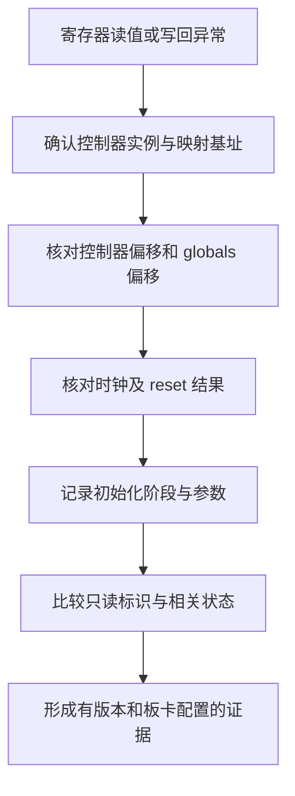

# DWC3 PHY 寄存器访问与诊断

DWC3 的 PHY 接口寄存器和 Rockchip GRF、PHY 模拟寄存器具有不同作用。当前代码同时操作这些区域；历史实验中 `GUSB2PHYCFG` 与 `GUSB3PIPECTL` 读零，不能证明 RK3588 不实现这些寄存器，更不能据此跳过全部 DWC3 PHY 配置。

寄存器诊断限定于 USB 平台实例，公共映射与 provider 边界由[平台资源](../../resources.md)维护。

## 1. 寄存器空间

`drivers/usb/usb-host/src/backend/kmod/dwc/reg.rs` 保存 DWC3 布局，USB2 和 USBDP 的 GRF 访问分别位于 `usb2phy.rs` 与 `udphy/`。各自基址由平台绑定传入。

### 1.1 DWC3 偏移

`Dwc3Regs::globals()` 在控制器基址上增加 `DWC3_GLOBALS_REGS_START = 0xc100`，再解释为 `Dwc3Registers`。结构体字段偏移是相对该全局区域的偏移，不能再次叠加完整控制器偏移。

| 寄存器 | 相对控制器偏移 | 相对 globals 偏移 |
| --- | --- | --- |
| `GCTL` | `0xc110` | `0x10` |
| `GUSB2PHYCFG0` | `0xc200` | `0x100` |
| `GUSB3PIPECTL0` | `0xc2c0` | `0x1c0` |

例如记录一个虚拟映射地址时，必须说明它是控制器基址还是 globals 基址。地址数值看起来合理不能排除双重加偏移或映射了错误实例。

### 1.2 GRF 与 PHY

`Usb2Phy::property_enable()` 使用 GRF 配置表和写掩码，`Udphy` 使用 PHY 寄存器与多个 GRF 对象。GRF 负责 SoC 集成配置，DWC3 字段负责控制器 PHY 接口配置；二者并存，不是二选一。

USBDP 的 PLL 或 CDR 已锁定，最多证明对应 PHY 状态，不能证明 DWC3 全局区域映射正确或所有接口配置位已生效。

## 2. 当前访问路径

`backend/kmod/dwc/mod.rs` 的 `core_init()` 和 `phy_setup()` 对 DWC3 PHY 寄存器执行读改写。当前实现没有“两个寄存器都读零就认定 RK3588 并跳过”的通用检测分支。

### 2.1 USB2 配置

`core_init()` 在复位后读取 PHY 寄存器并清除 USB2 `SUSPHY`。`hsphy_mode_setup()` 根据 UTMI 模式配置 `PHYIF` 和 `USBTRDTIM`；`phy_setup()` 继续处理 suspend、低功耗及 free clock 相关参数。

这些参数来自 `DwcParams` 和控制器 revision。不能仅因某次默认读值为零就推导它们全部无需设置，也不能用 GRF 写入代替代码中已有的 DWC3 访问。

### 2.2 USB3 配置

`phy_setup()` 读取 `gusb3pipectl0`，根据 revision 和 quirks 修改 `SUSPHY`、低功耗转换及相关字段，再写回。是否清除或设置某位取决于实际参数，不是所有 RK3588 实例共享一个无条件常量。

当前 `_init()` 中 `dwc3_init()` 先于 `xhci.init()`，`phy_setup()` 位于前者内部。文档将此记为实现事实，不以函数附近的历史说明推导另一条执行顺序。

## 3. 读零与写回异常

2025 年 12 月 30 日的历史记录曾描述两个 PHY 接口寄存器持续读零，同时部分全局寄存器有值。该观察没有完整绑定当前提交、实际 FDT、映射和启动状态，不能单独确定根因。

### 3.1 地址与资源检查

诊断先确认当前控制器身份、MMIO 映射长度和偏移，再检查时钟和复位。`dwc.rs` 的 `map_reg()`、`map_phandle_reg()` 与 `Dwc3Regs::globals()` 是地址链的关键边界。

在这些条件尚未确认前，不应添加基于读零的 SoC 自动识别。不同地址错误和未初始化状态可能产生相同观测，检测分支会把配置故障误判为正常硬件特性。

### 3.2 状态与写入语义

写回差异需要区分只读位、硬件自行变化的位、写掩码以及复位阶段。DWC3 的普通寄存器访问与 GRF 的高半字写使能采用不同语义，不能混用同一写值构造方式。

`UsbResetLine` 底层失败只记录警告，`Udphy::status_check()` 可能持续等待。诊断日志必须保留这些信息，不能因为外层 setup 的某条日志已输出就排除前面的资源失败。

## 4. 结论适用范围

寄存器快照应作为定位线索，不作为平台设计结论。修改访问顺序或跳过配置属于驱动行为变更，需要独立证据与回归验证。

### 4.1 当前可确认事实

源码明确存在 DWC3 PHY 寄存器配置、独立 Rockchip GRF 配置和 PHY 状态等待。旧文档“RK3588 所有 PHY 配置只在 GRF，DWC3 PHY 寄存器不可访问”的概括与当前实现不一致，不能继续作为架构说明。

### 4.2 尚需运行证据

具体板卡为何读零、某个 quirk 是否必须调整、某段访问是否应移动到 HCRST 前后，需要实际寄存器与平台资料确认。现有历史记录不足以确定这些问题的根因，也不足以支持改变当前寄存器顺序。
