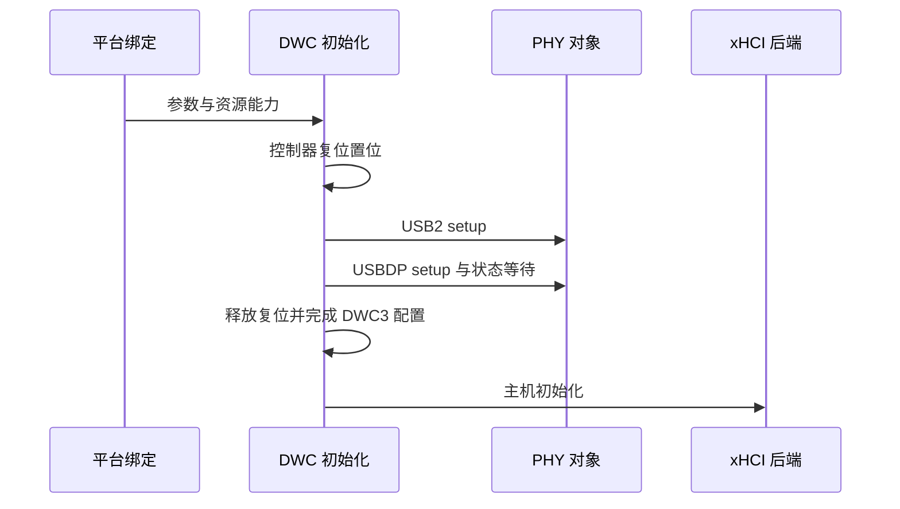

# U-Boot 与当前 PHY 初始化对照

U-Boot 对照用于比较明确版本中的资源操作和状态等待，不作为 TGOSKits 的执行入口。当前实现以 `drivers/ax-driver/src/usb/dwc.rs` 和 `drivers/usb/usb-host/src/backend/kmod/dwc/` 为准；旧文档列出的 2025 年 12 月 30 日分析不能继续作为“当前缺少某步骤”的证据。

对照属于平台实现证据，公共[驱动分层](../../layering.md)和[生命周期](../../lifecycle.md)不由外部项目的调用顺序替代。

## 1. 对照范围

对照需要固定外部版本和函数范围。不同 U-Boot 分支可能包含板厂补丁，不能只写一个版本号后引用另一个源码树的路径。

### 1.1 外部源码

对照限定为官方 U-Boot `v2025.01` 的 `drivers/phy/rockchip/phy-rockchip-usbdp.c`，使用其中 `rk3588_udphy_init()` 与 `rk3588_udphy_status_check()`。固定来源为 `https://raw.githubusercontent.com/u-boot/u-boot/v2025.01/drivers/phy/rockchip/phy-rockchip-usbdp.c`。

该范围只用于 USBDP 初始化与状态检查，不把它扩大为整条 U-Boot USB 命令、DWC3、xHCI 和设备枚举路径的完整等价性证明。旧记录中的 `v2023.04` 与无 `rockchip/` 子目录路径不属于该固定来源。

### 1.2 当前实现

TGOSKits 的 `Udphy::setup()`、`status_check()` 处理 USBDP，`Usb2Phy::setup()` 处理 USB2，`Dwc::_init()` 组织 PHY 与控制器顺序。`Core` 执行 USB 枚举，系统提供事件服务和执行上下文。

相同寄存器名称只表明可以逐项比较配置，不证明运行环境、时钟来源、错误处理和 DMA 后端相同。

## 2. USBDP 配置对应

两个实现均包含模式相关配置、初始化序列、lane 选择和锁定状态检查。需要核对的是具体参数与失败语义，而不是把当前已存在的代码继续列为缺失功能。

### 2.1 资源操作

U-Boot 的上述初始化函数包含 PMA/APB、初始化表及 lane 相关操作；当前对应实现集中在 `Udphy::setup()` 和 `udphy/config.rs`。TGOSKits 在平台绑定时准备 `UdphyParam`，不在 PHY 核心中解析整棵设备树。

| 当前对象 | 职责 | 需要比较的输入 |
| --- | --- | --- |
| `UdphyParam` | 接收映射和复位能力 | PHY 实例、GRF、lane mux |
| `RK3588_UDPHY_CFGS` | 保存寄存器及复位配置 | offset、mask、enable 值 |
| `Udphy::setup()` | 推进初始化 | mode、flip、复位名 |
| `dplane_enable()` | 配置 DP lane 数量 | lane 分配 |
| `dplane_select()` | 设置 lane 选择 | VO GRF 与实际映射 |

配置表值相同不能排除输入 PHY 实例错误。端口 0 和端口 1 的 GRF 或 alias 混用，会使表面一致的配置落到错误控制器。

### 2.2 状态等待

固定 U-Boot 文件的状态检查使用带超时的寄存器轮询。PLL 失败返回错误；CDR 失败记录错误后该函数仍到达成功返回，不能将所有锁定超时概括为同一传播规则。

当前 `Udphy::status_check()` 使用 `SpinWhile` 等待 PLL 的 AFC、LOCK 与所选 CDR 位，没有本地截止时间，也没有返回可区分的超时错误。该差异影响失败时的可观测性，不证明某一方的所有硬件行为更正确。

## 3. 当前启动顺序

USBDP 的相似性不决定 DWC3 和 xHCI 的全局顺序。当前函数体可以直接确定哪些步骤先执行，历史说明只能保留为曾经的分析背景。

### 3.1 PHY 与控制器

`Dwc::_init()` 当前执行控制器 reset assert、1 ms 延时、USB2 setup、USBDP setup、reset deassert、`dwc3_init()`、`xhci.init()` 和寄存器快照。`phy_setup()` 位于 `dwc3_init()` 内部的 `core_init()`，并未安排在 xHCI 初始化之后。

这张图仅描述 TGOSKits 当前执行，不声称固定 U-Boot 版本具有完全相同的跨模块顺序。移动 PHY 访问属于驱动行为变更，需要另行验证。

### 3.2 USB2 与错误通道

当前 USB2 `init()` 已包含 2000 μs 的 UTMI 稳定等待；USBDP 已包含 PLL/CDR 检查。因此旧文档“缺少 UTMI 等待”和“未检查 CDR”的判断不适用于当前代码。

`UsbResetLine` 把底层复位错误记录为警告，USB2 `power_on()` 当前为空。文档不能把 U-Boot 的电源、regulator 或错误返回路径自动视为当前已经实现的功能。

## 4. 对照证据的使用

移植对照需要保存外部固定版本、当前提交、实际设备树与板卡日志。没有这些输入的“与 U-Boot 完全一致”不具备可复核含义。

### 4.1 静态差异

可以静态核对函数调用、寄存器配置、等待条件和错误传播；无法仅通过源码相似性证明 PHY 锁定、电源稳定或数据传输成功。上述对应关系仅适用于所列代码范围，其他 U-Boot 版本或板厂树需要重新核对。

### 4.2 运行差异

同一板卡还需要比较实际时钟、复位状态、lane 配置、控制器能力及事件服务。TGOSKits 的异步等待依赖执行器继续 poll，U-Boot 的启动环境和等待机制不能直接替代这一条件。

静态对照不构成初始化、超时或复位行为的板卡验证。实际资源解析见[节点依赖](usb-at-fc400000-dependencies.md)，历史读零问题的证据限制见[PHY 寄存器](rk3588-phy-register-analysis.md)。
