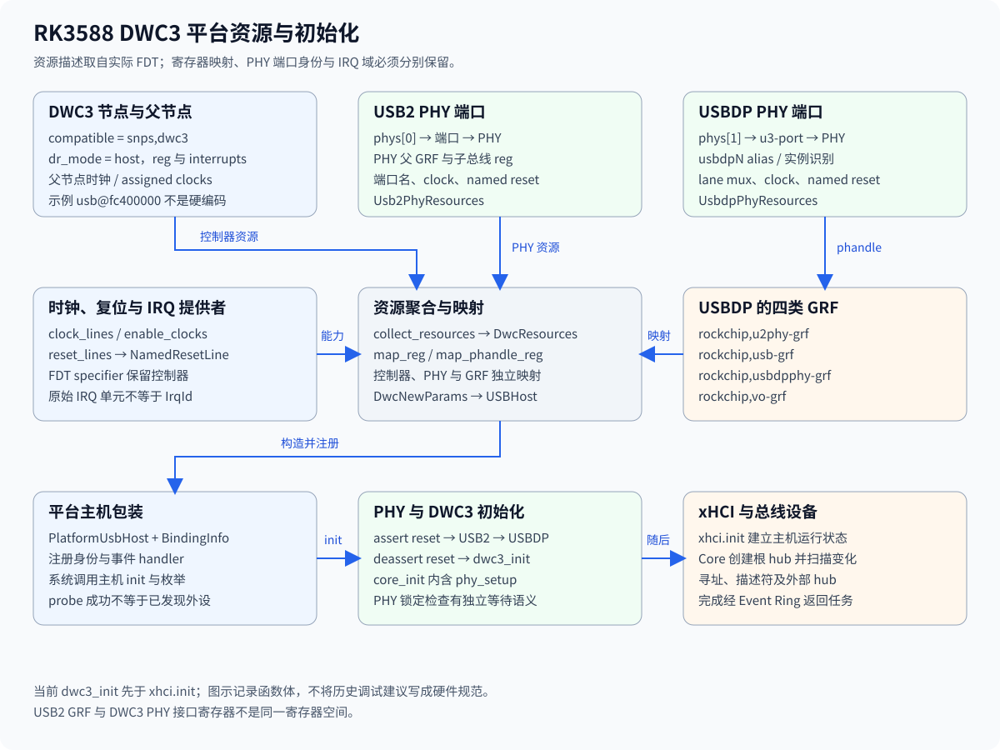
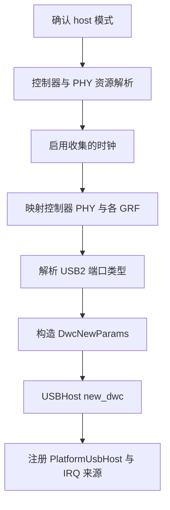

# usb@fc400000 节点与资源依赖

`usb@fc400000` 将 DWC3 控制器连接到时钟、复位、中断和 PHY 资源。具体示例来自 `os/axvisor/configs/vms/rk3588/linux-smp8.dts`；该文件是仓库中的 guest 配置，不能直接当作每次宿主启动实际收到的 FDT。当前宿主解析规则来自 `drivers/ax-driver/src/usb/dwc.rs`。

该节点实例补充公共[平台资源](../../resources.md)，IRQ specifier 的域解析由[中断与事件](../../irq.md)维护。

## 1. 节点身份

示例控制器位于 `/usbdrd3_1/usb@fc400000`，父节点和子节点承担不同描述职责。父节点声明总线窗口与部分时钟，子节点声明 DWC3 兼容性及 PHY 连接。

### 1.1 控制器属性

这些值是指定 DTS 的内容，不是绑定代码中的硬编码常量。运行期仍需对实际 FDT 执行地址转换和资源提供者查询。

| 属性 | 示例值 | 当前消费边界 |
| --- | --- | --- |
| `compatible` | `snps,dwc3` | probe 匹配 |
| `reg` | 基址 `0xfc400000`，长度 `0x400000` | `collect_resources()` 与 `map_reg()` |
| `dr_mode` | `host` | `probe()` 显式过滤 |
| `interrupts` | `<0x00 0xdd 0x04>` | 保留控制器与 specifier 后解析 |
| `reset-names` | `usb3-otg` | 命名复位包装 |
| `phys` | `<0x185 0x186>` | 当前按前两项读取 |
| `phy-names` | `usb2-phy`、`usb3-phy` | 描述顺序，当前解析器不按名称重排 |
| `phy_type` | `utmi_wide` | `parse_dwc_params()` |

原始 `0xdd` 单元不能直接标注为最终可注册的 IRQ 221。完整 specifier、interrupt-parent 和域解析共同决定 `IrqId`。

### 1.2 父节点资源

父节点 `usbdrd3_1` 保存 `ref`、`suspend`、`bus` 时钟。`collect_resources()` 查询父节点 assigned clocks 和 clock lines，再组合子节点及两个 PHY 的时钟集合。

`ranges` 与节点层次参与地址解释。仅将 `reg` 中某个整数复制为虚拟地址会绕过资源转换与 MMIO 映射，不能作为静态平台迁移方式。

## 2. PHY 连接

控制器引用的是 PHY 端口，不是所有情况下都直接引用 PHY 寄存器节点。当前 helper 明确依赖这一层次。

### 2.1 USB2 路径

`collect_usb2_phy()` 从端口 phandle 查找端口，再取得父 PHY 和 GRF 父节点。它保存 PHY `reg` 的子总线地址、端口名、GRF phandle、复位和时钟。

端口名交给 `Usb2PhyPortId::from_node_name()`，无法识别时 probe 返回错误。USB2 PHY 的寄存器选择与 GRF 映射分开，不能只凭 `reg` 看起来很小就当作无效物理地址。

### 2.2 USBDP 路径

示例的 `phy@fed90000` 映射长度为 `0x10000`，其 `u3-port` 对应控制器第二个 PHY 引用。该节点还具有 `dp-port`，USB 与 DP lane 分配需要结合 `rockchip,dp-lane-mux`。

USBDP 的 GRF 引用分别承担不同控制职责。示例 phandle 是该 DTS 的局部编号，不是跨设备树稳定 ABI，不能写入驱动作为全局常量。

## 3. GRF、时钟与复位

资源解析结果应保留提供者身份，硬件核心接收映射和能力对象，而不是再次解析设备树。`UsbdpPhyResources` 是二者之间的暂存结构。

### 3.1 GRF 映射

`collect_usbdp_phy()` 要求四个 GRF 属性存在，`map_phandle_reg()` 再查找目标节点寄存器并映射。缺少属性和映射失败是不同错误。

| 属性 | 参数字段 | 作用域 |
| --- | --- | --- |
| `rockchip,u2phy-grf` | `u2phy_grf` | USB2 相关 PHY 协同配置 |
| `rockchip,usb-grf` | `usb_grf` | USB 端口相关配置 |
| `rockchip,usbdpphy-grf` | `usbdpphy_grf` | USBDP PHY GRF 控制 |
| `rockchip,vo-grf` | `vo_grf` | DP lane 映射相关配置 |

USB2 路径另有其父 GRF 映射，不能因为字段名相近就把两个映射无条件合并。实际寄存器解释位于 `usb2phy.rs`、`udphy/mod.rs` 和配置表。

### 3.2 时钟及命名复位

示例 USBDP 时钟名为 `refclk`、`immortal`、`pclk`、`utmi`；复位名为 `init`、`cmn`、`lane`、`pcs_apb`、`pma_apb`。`Udphy::setup()` 按名字推进不同阶段，名字不是只用于打印的装饰信息。

`parse_resets()` 对没有名称的 reset 返回错误。`enable_clocks()` 跳过原始 ID 为 0 的条目，其他条目的启用错误直接返回；复位操作的适配接口则记录底层错误为警告，两个通道不能写成相同失败语义。

## 4. 解析与执行

解析完成后构造 `DwcNewParams`，后续异步初始化才操作 PHY 和控制器。分开这两个阶段可以定位失败发生在资源描述还是硬件状态。

### 4.1 绑定流程

`probe()` 的资源路径如下，所有地址均在交给核心前通过映射 helper 处理。

`power-domains` 在示例 DTS 中存在，但 `collect_resources()` 并未把所有任意电源域声明展开为一套通用自动上电流程。不能仅凭该属性和 `rockchip-pm` feature 声称每个域都在该函数中使能。

### 4.2 属性覆盖

`parse_dwc_params()` 明确处理若干 `snps,*` quirk，并对部分下划线与连字符拼写兼容。示例中出现的属性需要逐一检查该函数，不能以“已读取 FDT”推导所有属性均已生效。

例如示例中的 `snps,parkmode-disable-ss-quirk` 并未在当前函数中形成同名解析分支。此处记录绑定覆盖边界，不修改硬件参数或推导缺失分支一定导致当前故障。

## 5. 配置证据

设备依赖记录需要同时保存实际 FDT、最终 feature、源码版本和初始化日志。单独的 guest DTS 不能证明宿主板卡启动时具有相同模式、地址或电源状态。

### 5.1 静态核对

`reg`、PHY 端口层次、phandle、命名 reset 和时钟提供者可以与源码逐项对应。IRQ 核对必须保留原始三个单元及控制器身份，不能比较两个来源不同的裸整数。

### 5.2 动态核对

主机注册、PHY 锁定、xHCI 命令完成、设备描述符和实际数据传输属于不同检查点。地址与依赖都正确仍可能存在 DMA 一致性或事件服务问题，相关边界见[DMA 寻址](rk3588-dma-analysis.md)与[设备枚举](../rk3588-device-discovery.md)。
