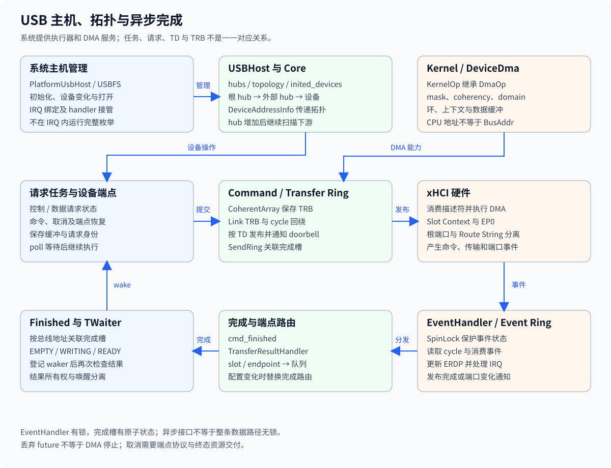
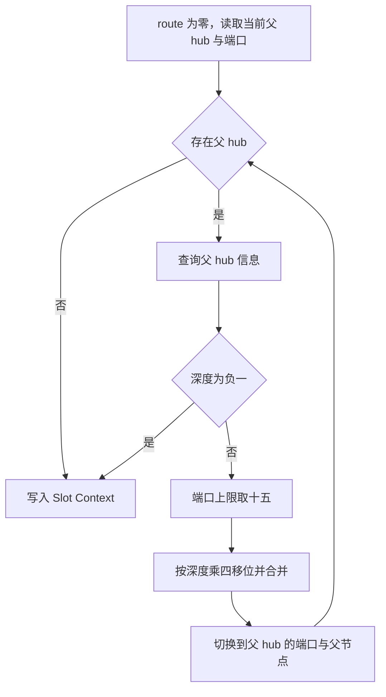

# xHCI 拓扑与路由编码

xHCI 设备寻址同时使用根端口、外部 hub 路径和设备 slot。当前路由计算位于 `drivers/usb/usb-host/src/backend/kmod/xhci/device.rs` 的 `address()`，拓扑来源位于 `backend/kmod/kcore.rs`。这些字段不能互相替代，也不能由设备枚举编号反推。

路由编码属于总线拓扑的具体实现，对应公共[设备管理](../rdrive.md)中的身份区分，不作为其他驱动的通用地址编码。

## 1. 拓扑身份

`Core` 为软件管理分配 hub 与 device 身份，xHCI 为控制器上下文使用 slot。`DeviceAddressInfo` 在创建已寻址设备时传递父 hub、端口、根端口和速度。

### 1.1 根端口与下游端口

`root_port_id` 单独记录设备最终连接到哪个 root hub 端口，`port_id` 表示当前父 hub 上的连接端口。设备直接连接根 hub 时没有外部 hub 路径，因此 Route String 保持零。

同一个外部 hub 下多个设备共享根端口，但使用不同下游端口路径。把 root port 再放入 Route String 会重复编码第一段连接关系。

### 1.2 软件身份与 slot

`kcore.rs` 的 `hubs` 保存 `HubId` 到 hub 对象的关系，`topology` 使用 `(HubId, u8)` 作为连接位置。`connect_port()` 分配软件 device ID，并把 `DeviceAddressInfo` 交给后端寻址。

xHCI slot 是控制器设备上下文的身份，不能直接拿软件 device ID 写入命令。设备重新连接后，连接位置可以相同，而软件身份和控制器资源已经发生变化。

## 2. 路由计算

`address()` 从当前设备的父 hub 向上遍历，利用每个父 hub 的 `hub_depth` 选择四位字段。根 hub 使用深度 `-1` 作为停止条件，不参加 Route String 累积。

### 2.1 计算规则

实际代码将超过 15 的端口值截为 15，再将该值左移 `hub_depth * 4` 位并与路由值按位或。随后沿父 hub 的 `port_id` 和 `parent` 继续向上。

这段计算依赖 `infos` 中存在引用的父 hub；源码在查询时使用 `unwrap()`。文档不能把任意损坏拓扑描述为已经具有完整错误恢复能力。

### 2.2 编码示例

示例使用当前算法计算结果，不表示某块板卡固定的外部连接。字段值来自外部 hub 端口，根端口独立保存。

| 连接拓扑 | 深度字段 | Route String |
| --- | --- | --- |
| 根端口 1 直接连接设备 | 无外部 hub | `0x0` |
| 根端口 1 连接 hub，设备在其端口 3 | 深度 0 为 3 | `0x3` |
| 第一层 hub 端口 2 连接第二层 hub，设备在端口 5 | 深度 0 为 2，深度 1 为 5 | `0x52` |
| 第二层端口值超过 15 | 深度 1 使用 15 | 在前例基础上为 `0xf2` |

最后一行只说明源码的截断分支，不表示所有超过该值的拓扑均已通过控制器验证。拓扑合法性仍需与上下文容量、hub 深度和设备协议共同判断。

## 3. 上下文发布

路由计算之后还需要建立 EP0 和 Slot Context。仅打印正确 Route String 不能证明寻址命令成功或设备描述符已经可读。

### 3.1 输入上下文

`address()` 通过 `with_empty_input()` 初始化输入上下文，设置 A0 和 A1，填写 Slot Context 及控制端点上下文。默认最大包长依据端口速度确定，控制环地址来自实际控制端点。

`set_route_string()` 与根端口字段分别写入，速度和 EP0 状态也是独立参数。故障定位需要同时记录这些输入，而不是只观察路由十六进制值。

### 3.2 地址与描述符

控制器命令完成经 `cmd.rs`、Event Ring 和完成槽返回任务上下文。设备后续通过控制传输取得描述符，必要时调整 EP0 的最大包长并更新上下文。

根端口状态、设备速度、Route String、slot 和命令完成码共同描述一次寻址尝试。只有其中一个字段正确，不能排除 DMA、端点上下文或端口复位错误。

## 4. 拓扑变化

外部 hub 连接和断开会改变其整个子树。`Core` 的端口变化处理需要与 xHCI 端点关闭及设备对象生命周期协作。

### 4.1 新 hub 发布

`connect_port()` 识别 hub 描述符后构造 `HubDevice`，初始化该 hub 并保存 `child_hub` 关系。枚举循环发现新 hub 后继续扫描，从而处理多级拓扑，而不是只列根端口上的设备。

### 4.2 子树撤销

`disconnect_port()` 沿拓扑处理断开的连接及后代，产出断开设备集合。旧路径的设备对象不能继续作为新连接的所有权凭据，端点完成路由也不能保留对已替换队列的引用。

枚举与打开设备的完整边界见[RK3588 设备发现](rk3588-device-discovery.md)，请求完成和取消见[USB 异步执行](design.md)。
