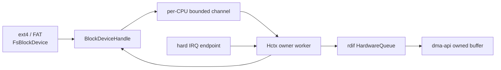

# 块存储运行时

`ax-fs-ng::block::runtime` 把 `rdif-block` controller/hardware queue 转换为文件系统可同步调用的 `BlockDeviceHandle`。它保留 owned DMA request、多硬件队列、IRQ 完成和 flush barrier，不让 ext4/FAT 持有 driver queue 或在调用线程中轮询设备。

## 1. 运行时边界

块运行时通过 `BlockDeviceHandle` 隔离同步文件访问和异步硬件队列，并通过 `ax-fs-ng::os` capability 隔离公共 crate 与 ArceOS 平台实现。文件系统、运行时和驱动之间只传递 typed request、completion 和 owner。

### 1.1 数据边界

数据路径从 `FsBlockDevice` 进入 per-CPU software channel，再由 Hctx owner 提交到 `rdif-block::HardwareQueue`。IRQ 只向对应 Hctx 发布事件，不把 queue ownership 交还调用任务。



`RdifBlockDevice` 携带一个 `BlockController` 和已由平台解析的 `BlockIrqSource`；`RdifBlockGroup` 表示一个共享 controller group 及多个 member device。runtime 不解析 FDT/ACPI/PCI，也不猜 IRQ 或 DMA 属性。

### 1.2 系统能力

`ax-fs-ng::os::install()` 一次性注入页、任务、DMA、IRQ 和时间能力。每个 provider 都有明确失败语义，未安装时不会回退到假地址、轮询或默认 IRQ。

| Capability | 文件系统用途 | ArceOS 实现 |
| --- | --- | --- |
| `FsPageProvider` | 页缓存 frame 与地址转换 | `ax-alloc` + `ax-hal::virt_to_phys` |
| `BlockRuntimeOps` | 当前 CPU、在线 CPU 数、是否可阻塞、notification、fixed-CPU thread | `ax-task` / `ax-hal::percpu` |
| `DmaOp` | owned DMA allocation/map/sync | `axklib::dma` |
| `BlockIrqRegistrar` | 固定 CPU shared IRQ 注册和同步释放 | `ax-hal::irq` |
| `BlockTimeProvider` | controller transition timeout | monotonic time |

provider 未安装时返回 `BadState`/`RuntimeUnavailable` 类错误，不回退到假地址、轮询或默认 IRQ。

## 2. 设备生命周期

设备生命周期包括 controller 启动、queue 发布、CPU channel 建立和 SMP 扩展。`BlockRuntime` 只有在这些资源全部可用后才发布 `BlockDeviceHandle`，失败则按相反顺序回收。

### 2.1 启动发布

`BlockRuntime::install_from_rdif_sources()` 分别处理独立设备和共享 controller group。启动序列把 IRQ enable 放在 queue、worker 和 handler 完成之后，最后用 Release 状态发布 READY。

```text
BlockRuntime::install_from_rdif_sources()
  -> 对每个独立 device 执行 BlockDeviceHandle::start()
  -> 对每个 group 启动 group controller 并生成 member handles
  -> controller worker 固定到 CPU0
  -> ControllerEvent::Start { target_queues: 1 }
  -> controller 发布 queue / IRQ endpoint / DeviceInfo epoch
  -> 创建 Hctx 和 software submission channels
  -> 注册 IRQ（auto-enable = No）
  -> queue、worker 和 handler 全部就绪后 enable
  -> state 从 STARTING Release 发布为 READY
  -> runtime OnceLock 发布 devices
```

初始化失败会停止已启动 controller、同步禁用 IRQ、关闭 channel、回收 queue/DMA owner，并且该设备不进入 runtime devices 列表。group 启动按整体资源处理，不能发布部分 member 后遗留共享 IRQ owner。

### 2.2 软件队列

每个在线 CPU 有一个 submission channel，映射到某个 Hctx。Hctx worker 是 hardware queue 的唯一 task-context owner，负责：

- 从一个或多个 CPU channel 取 request；
- 按 `QueueLimits` 验证和形成 bounded batch；
- 把 owned request 移交 `HardwareQueue::submit_batch()`；
- 在需要时调用 commit/doorbell；
- 处理 IRQ latch 和 task-side completion；
- 回收 DMA owner并完成 subscription；
- 按 endpoint contract rearm。

SMP online 后 runtime 可根据 controller 能力增加 queue/hctx 并重建 CPU channel 映射。调用方只按当前 CPU 选择 channel，不能保存永久 queue index 假设。

## 3. 请求推进

请求推进包括 admission、flush 排序、IRQ completion 和同步等待。owned request 在整个过程中保持唯一 owner，任何入队失败或 shutdown 都必须把原 request 交还可控路径。

### 3.1 提交协议

`submit_batch_owned()` 在进入 channel 前完成：

1. 检查 device `accepting`；
2. 取得当前 CPU channel 和最新 `DeviceInfo`；
3. 对每个 request 执行 `validate_owned_request()`；
4. 判断 `NOWAIT` admission；
5. 验证 flush 必须是唯一 request；
6. 进入 data 或 flush gate；
7. 预分配 completion pairs 和 submission deque；
8. 发送有界 channel；full/closed 时归还完整 request batch。

owned request 在提交失败时随错误返回，成功后由 runtime 持有直到 completion。DMA buffer 不通过裸指针在失败边界丢失。

### 3.2 阻塞语义

普通 task context 在 channel 或 barrier 暂不可用时可以等待 notification。`NOWAIT` 或 `BlockRuntimeOps::can_block() == false` 的路径不能睡眠，资源不足时返回 `Retry`/`WouldBlock`。中断和 atomic context 不允许通过同步文件系统接口等待块完成。

### 3.3 刷新屏障

flush 是 device-wide ordering point，而不是任一 queue 上的普通零长度 request：

```text
data submission
  -> active_data += request count
  -> dispatch / complete
  -> active_data -= completed count

flush submission
  -> 阻止新 data admission
  -> 等待 active_data == 0
  -> 单独提交 Flush
  -> 等待完成
  -> 解除 flush_active
  -> 唤醒 data gate waiters
```

多个 Hctx 存在时，这个 device-level gate 保证先前所有 queue 的写完成后才执行 flush，后续写在 flush 完成后才进入。把 flush 与 data 放在同一个 batch 或只在某个 Hctx 排队都会破坏持久化顺序。

### 3.4 中断完成

hard IRQ action 只调用 driver endpoint 取得结构化事件，写入预分配 latch，并使用 IRQ-safe notification 唤醒对应 worker。禁止在 hard IRQ：

- 分配 DMA/Vec；
- 等待 channel 或 completion；
- 执行文件系统 callback；
- 持有 sleepable lock；
- 直接做大批量 queue drain。

shared IRQ group 由一个 handler fan-out 到 member target；spurious 或 acknowledged-empty 事件不会无条件激活所有 worker。queue-coupled control bits 延迟到 Hctx owner 处理，保持 mask/ack/poll/rearm 的 CPU 和 owner 一致。

完成路径把 driver result 和原 request owner 组合成 completion，通过 `CompletionSubscription`/`CompletionGroup` 唤醒同步调用方。读请求在 completion 后才把 DMA 内容复制回文件系统 buffer；用户 buffer 仍由更上层在文件 cache 锁外处理。

## 4. 外部边界

文件系统还需要在分区地址、设备交接和运行时观测三个边界上保持一致。它们分别由 `RegionBlockDevice`、shutdown/passthrough 流程和累积统计对象维护。

### 4.1 分区范围

`NativeHandleBlockDevice` 将同步 read/write/flush 转换为 owned runtime request。`RegionBlockDevice` 再把文件系统相对 LBA 映射到物理磁盘：

```text
logical request [block_id, block_id + blocks)
  -> buffer length 必须是 logical block size 的整数倍
  -> end <= region.num_blocks()
  -> physical_lba = region.start_lba + block_id（checked add）
  -> submit to BlockDeviceHandle
```

读取 GPT/MBR 时使用全盘 handle；挂载具体分区后必须通过 region 裁剪。任何越界或整数溢出返回 typed error，不能让下层设备静默截断。

### 4.2 设备交接

最后一个 `BlockDeviceHandle` 引用释放或显式 passthrough 准备时执行 shutdown：停止 admission，等待/取消活动请求，quiesce Hctx，禁用并 synchronize IRQ，停止 worker/controller，最后释放 queue 和 DMA owner。

`release_block_irqs_for_passthrough()` 先关闭 group，再关闭独立 device，并返回释放的 IRQ 数。Axvisor 只能在文件系统写回与 shutdown 完成后把物理块设备交给 guest；不能仅 unregister VFS root 而保留 host IRQ/hctx owner。

### 4.3 运行时统计

`block_io_stats()` 按完成请求累计 read/write 次数和 512-byte sector 数，保持 `/proc/diskstats` 口径。`BlockBatchStats` 和 runtime metrics 记录 dispatch batch、commit、channel/backpressure 等内部事实，用于区分：

- 文件 cache 命中导致没有块请求；
- 请求进入 software channel 但未 dispatch；
- driver 接收但没有 IRQ completion；
- completion 正常但 flush barrier 未解除。

统计使用 Relaxed 原子，只用于观测，不承担 request 所有权或生命周期同步。运行时仍以 `BlockDeviceHandle` 作为文件系统唯一设备入口，以 owned request 保存 DMA 生命周期，以当前 `DeviceInfo` epoch 验证 queue limit，并让 IRQ 只执行 latch/notify。相关生命周期同时受[驱动 IRQ](../driver/irq.md)和[内存 DMA](../memory/dma.md)的能力契约约束。
