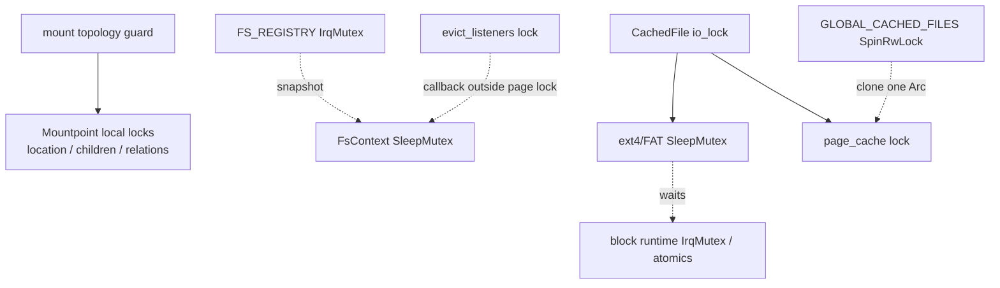

# 文件系统锁与并发

文件系统同时跨越 syscall/task、用户缺页、内存回收、块 worker 和 hard IRQ。锁的首要边界不是“读写哪个字段”，而是该路径是否可能睡眠、是否调用外部实现、以及回调会不会进入地址空间或文件系统。

## 1. 同步边界

文件系统根据执行上下文和阻塞能力选择 spin lock、IRQ-safe lock、sleep mutex 或原子。锁类型决定能否等待块完成或调用外部实现，锁域图则说明不同 owner 之间应当嵌套还是先 snapshot 后释放。

### 1.1 锁类型

公共 VFS、文件访问策略和块运行时使用不同同步原语。下表把每种原语的状态 owner 与禁止动作对应起来，避免仅按字段读写选择锁。

| 类型 | 文件系统中的用途 | 约束 |
| --- | --- | --- |
| `axfs-ng-vfs::Mutex`（`ax_sync::SpinLock`） | 短时 dentry cache、mount local relation/flags | 不能等待 I/O、不能调用可能睡眠的文件系统实现 |
| `ax-fs-ng::os::sync::IrqMutex` | provider registry、短时 runtime 状态、FS registry | IRQ-safe 短临界区，析构/回调移到 guard 外 |
| `SleepMutex` | `FsContext`、ext4/FAT state、cached-file I/O/page state | 可等待任务通知或块完成；不能在 hard IRQ 获取 |
| 原子 | length、generation、mount flags、runtime state/counter | 只发布明确事实，不替代复合事务锁 |
| topology mutation guard | mount tree/propagation 事务 | 不在 guard 内 flush 或执行 node/filesystem callback |

VFS 的节点 trait 可以由磁盘文件系统实现，因此即使 VFS 自身使用 spin lock，也必须先释放内部 guard 再调用 `ops.lookup()`、`ops.rename()`、`FilesystemOps::flush()` 等外部能力。

### 1.2 主要锁域

主要锁域覆盖 mount topology、任务 context、具体文件系统、页缓存和块运行时。图中的实线表示允许的局部获取方向，虚线表示必须在上游 guard 释放后再进入下游。



虚线表示必须先释放上游 guard 后再进入下游，而不是允许嵌套。

## 2. 名字空间并发

名字空间并发由 dentry generation、mount topology transaction 和 context registry snapshot 三种机制处理。它们分别防止旧 lookup 复活、挂载树部分提交和全局 IRQ lock 嵌套任务 sleep lock。

### 2.1 目录缓存

`DirNode::lookup_and_cache()` 不在 cache lock 下调用具体 `lookup()`。它用 `cache_generation` 检测慢 lookup 期间的并发 mutation：

```text
load generation (Acquire)
  -> short cache lookup under spin lock
  -> release lock
  -> ops.lookup() may sleep
  -> reacquire cache lock
  -> generation unchanged: publish result
  -> changed: return result without inserting stale entry
```

create/link/unlink/rename 先让底层名字空间操作成功，再更新 cache。跨目录 rename 不同时持有两个目录 cache lock；同目录则在同一个 lock 中删除 source/destination。递归 `forget()` 先从 parent cache 整体取走 children，再逐项递归，避免父 lock 跨递归持有。

### 2.2 挂载拓扑

所有会改变 parent/children 或 propagation graph 的操作在 topology guard 内串行，并增加 version。local mount locks 的获取必须通过这些编排函数，不能在外部代码任意嵌套两个 mount 的 children/location lock。

文件系统 flush 是明显的睡眠边界，因此 unmount 使用：

```text
topology guard: plan + snapshot version/targets
release guard
filesystem/page-cache callbacks
topology guard: revalidate + atomic commit
release guard
drop external lifetime resources
```

mount callback 同样在 topology guard 外完成。测试用会重入 topology 的 filesystem callback 固定这条约束；新增回调不能因“当前实现很快”而放回 guard 内。

### 2.3 上下文登记

`FS_REGISTRY` 保存 weak `FsContext`，受 `IrqMutex` 保护；`FsContext` 自身是 `SleepMutex`。固定顺序不是 `registry -> context` 嵌套，而是两阶段 snapshot：

1. registry guard 下 prune weak 并 clone live `Arc`；
2. 释放 registry guard；
3. 逐个取得 context sleep lock。

`is_mount_busy()` 和 pivot root propagation 都遵守此模式。否则持 IRQ lock 等待另一个任务释放 filesystem context 会扩大 atomic 临界区，并可能与任务退出/登记形成环。

## 3. 缓存并发

页缓存同时与具体文件系统、用户地址空间和内存回收交互。`CachedFileShared` 的局部锁序只保护 cache/backing 状态，用户复制、地址空间 callback 和全局 registry 都必须通过锁外阶段连接。

### 3.1 缓存锁序

`CachedFileShared` 有三个 sleepable lock：`io_lock`、`page_cache`、`evict_listeners`。

允许的局部顺序：

```text
io_lock -> page_cache
```

禁止形成全局固定嵌套的关系：

```text
page_cache -> listener callback
listener lock -> AddrSpace callback（持 guard）
cached-file lock -> user-memory copy / page fault
GLOBAL_CACHED_FILES spin lock -> cached-file sleep lock
```

容量 LRU eviction 是一个特殊路径：`page_or_insert()` 仍持有 page-cache lock，`evict_cache()` 在 listener-list lock 下调用 callback；populate 发起者可能已经持有对应 `AddrSpace`，listener 必须使用非阻塞失效语义，返回值在该路径不决定驱逐，实际 unmap 由 populate callback 完成。全局 reclaim 则先从 cache 取出 candidate，释放 page-cache/global registry guard 后调用 listener；listener 拒绝时重新插回。新增 listener API 时必须明确属于哪一种调用上下文，不能假设所有 eviction callback 的锁环境相同。

`io_lock` 保护 backing I/O 与 page state 的复合变化，但大块 backing read 会主动释放 page-cache lock。返回后重新取得 cache lock逐页发布；并发者已经填入的 page 被保留，不覆盖新数据。

### 3.2 用户映射

用户 buffer read/write 可能触发缺页并取得 StarryOS `AddrSpace` 锁。cached I/O 使用 kernel scratch 将顺序改为：

```text
用户 -> scratch（不持 file cache lock）
scratch -> cached page（持 io/page lock）

cached page -> scratch（持 io/page lock）
scratch -> 用户（不持 file cache lock）
```

mmap listener 会从 page cache 回调地址空间。writeback protection 和 reclaim 都先选定 page/callback，再在 file page lock 外进入 AddrSpace。反方向的 page fault 可在持 AddrSpace 时调用 `with_page_or_insert()`，所以任何 `CachedFile -> AddrSpace` 嵌套都可能形成真实死锁。

### 3.3 内存回收

内存分配失败可同步触发 page-cache reclaim。该路径必须尽量非阻塞且不再次大量分配：

- `RECLAIM_IN_PROGRESS` 用 AcqRel 阻止递归；
- registry 只 try-read，不等待竞争者；
- 每次从 registry clone 一个 file 后立即释放 spin guard；
- file page cache 只 try-lock；
- candidate batch 固定最多 256；
- callback 失败的页重新插入；
- prune 把 registry vector move 出 spin lock，在锁外执行可能触发 file Drop 的 retain，再合并并发登记。

回收成功数只是 allocator retry 的提示，不提供“指定页数必须满足”的强保证。

## 4. 设备并发

块运行时把调用任务、controller worker、Hctx worker 和 hard IRQ 设为不同 owner。状态发布与 flush admission 连接这些上下文，但硬件 queue 的可变所有权始终留在 Hctx worker。

### 4.1 执行上下文

不同运行上下文只执行与其阻塞能力匹配的动作。下表中的 owner 划分保证 hard IRQ 不等待，调用任务也不直接推进硬件 queue。

| 上下文 | 拥有的动作 |
| --- | --- |
| 调用任务 | 构造 request、等待 bounded admission/completion |
| controller worker | controller state transition、queue publication |
| Hctx worker | hardware queue submit/commit/poll/rearm、DMA completion |
| hard IRQ | endpoint ack/latch、IRQ-safe notify |

状态使用 Acquire/Release 发布：只有 queue/channel/IRQ 全部就绪后 `accepting=true`；shutdown 先停止 admission，再等待 active data 和 worker。Relaxed 仅用于累计统计。

### 4.2 状态顺序

flush gate、data active count 和 waiters 共同形成 device-wide barrier。任何 timeout 或取消路径都必须对称撤销 admission count，否则后续 flush 会永久等待不存在的 request。相同的成对原则也适用于 notification、IRQ registration 和 DMA owner：发布前失败不应对调用方可见，发布后 shutdown 必须先停止新请求再回收资源。
