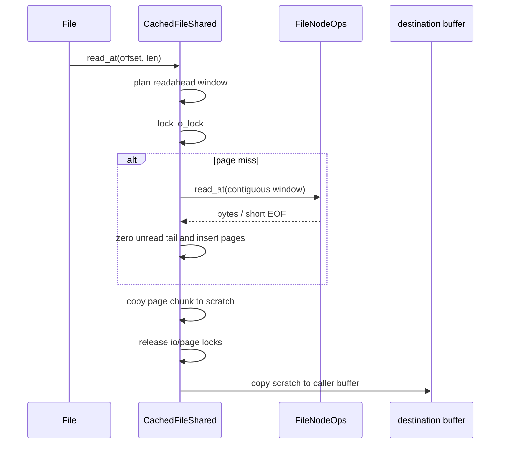

# 文件与页缓存

`ax-fs-ng` 将打开文件描述、VFS 节点和共享文件内容状态分开。`File` 持有本次 open 的 flags 与游标，`FileBackend` 决定 cached/direct/path-only 行为，`CachedFileShared` 保存同一 inode 共享的文件长度、4 KiB 页面、写回和 mmap 协调状态。

## 1. 文件状态

文件访问状态分为打开实例、缓存页 owner 和 inode 共享状态。`File` 保存本次打开的 flags 与游标，`PageCache` 持有单页物理内存，`CachedFileShared` 则让同一 inode 的不同路径和文件描述共享内容与持久化状态。

### 1.1 打开实例

`file/open.rs::OpenOptions` 处理 read、write、append、truncate、create、create_new、directory、no_follow、direct、path、mode 和 uid/gid。`open()` 先解析父路径或现存 `Location`，再验证 flag 组合和节点类型，最终返回 `OpenResult::File` 或 `OpenResult::Dir`。

| 选择 | `FileBackend` | 数据路径 |
| --- | --- | --- |
| 普通磁盘/内存文件 | `Cached(CachedFile)` | 共享页缓存 |
| `O_DIRECT` | `Direct(Location)` | 直接调用 `FileNodeOps`，调用方承担对齐语义 |
| `O_PATH` | path-only backend/flags | 只保留位置，不允许普通 read/write |

`File` 保存可选的 `Mutex<u64>` 游标；stream 节点没有 seek position，普通文件初始 position 为 0。fd clone/dup 是否共享打开文件描述状态由上层 fd owner 决定。`read_at`/`write_at` 不改变游标，`Read`/`Write` trait 路径在完成后推进 position。access check 在每次动作前核对 open flags，不能只依赖 syscall 初次校验。

### 1.2 页面所有权

`PageCache` 拥有一个由 `FsPageProvider` 分配的 4 KiB `FsPage`，并保存：

- `dirty`：是否有未持久化内容；
- `dirty_generation`：每次写入递增，用于识别 writeback snapshot 后的并发写；
- writeback protection 状态：mmap 写保护窗口及窗口内再次变脏事实。

ArceOS provider 使用 `ax-alloc` 的 `UsageKind::PageCache` 申请/释放物理页，并提供 virtual-to-physical 转换。`FsPage` 是 owner，Drop 恰好归还一次；cache、DMA request 或 listener 只能借用/转移明确对象，不能保存无 owner 的裸页地址。

### 1.3 缓存共享

`CachedFile::get_or_create(Location)` 首先读取 `DirEntry::user_data()`：

1. 已有 `FileUserData` 时直接共享 `CachedFileShared`；
2. ext4 节点还按 `(filesystem pointer, inode)` 查询 weak 全局索引；
3. tmpfs/ramfs 创建无界 cache、没有 backing `FileNode`；
4. 磁盘文件创建容量为 512 页的 LRU，并登记到全局 reclaim registry；
5. 再次取得 user-data lock，只有首个创建者发布，竞争失败者使用已发布对象。

每个打开句柄拥有独立 `ReadAheadState`，因此一个随机读 fd 不会重置另一个顺序读 fd 的窗口；实际页内容、长度和 dirty 状态仍由 inode 共享。

## 2. 缓存读写

buffered I/O 在 `CachedFileShared::io_lock` 下协调 file length、page state 和 backing I/O，并通过 kernel scratch 与用户内存隔离。读路径可批量预读，写路径则根据覆盖范围决定是否读取旧 backing。

### 2.1 缓存读取

磁盘顺序读的预读窗口从 4 页开始，连续命中时倍增，最大 32 页；随机读按本次请求页数读取并把下一次窗口重置到 4 页。tmpfs/ramfs 始终一次处理一页。



新分配页没有隐式清零保证，具体文件系统在 EOF 可 short-read，因此 miss 路径必须显式把未读取尾部填零。否则 mmap 或扩展后的读取可能泄露旧物理页内容。

目的 buffer 可能是 StarryOS 用户地址。实现先复制到临时 `PageCache` scratch，释放 cached-file 锁后再写入用户 buffer，使用户缺页可以取得 `AddrSpace` 锁，而不会形成 `CachedFile -> AddrSpace` 顺序。

### 2.2 缓存写入

write 在 `io_lock` 下串行修改 file length 和 cache：

- 写越过 EOF 时，先处理旧 EOF 所在 partial page 的零洞，再扩展 backing length；
- full-page overwrite 不读取旧 backing；partial overwrite 先填充原页；
- 从用户/`IoBuf` 复制到 scratch 后，在 page-cache lock 下写目标区间；
- 磁盘页递增 dirty generation 并标 dirty；内存文件的 cache 就是唯一数据源；
- `append()` 在同一串行化边界内读取当前长度并返回实际起始 offset。

文件长度用 `AtomicU64` 发布：扩展使用 compare-exchange max，truncate 使用 Release store，读取使用 Acquire。它提供长度可见性，但不替代 `io_lock` 对 resize、页内容和 backing 操作的事务保护。

## 3. 持久化状态

writeback 和 resize 都会在 backing、cache、mmap PTE 与长度之间迁移状态。`dirty_generation` 和 writeback-protect listener 用于确认写盘 snapshot 是否仍代表最新内容，resize rollback 则在失败时恢复可观察长度与尾页数据。

### 3.1 写回协调

shared file-backed mmap 通过两个 listener 接入 cache：

- eviction listener：解除或验证映射，使 cache page 可以释放；
- writeback-protect listener：在 snapshot 脏页前移除 writable PTE，让后续写重新 fault 并推进 dirty generation。

写回过程先标记目标页进入 protection window，再调用 listener 撤销 writable mapping，最后在 `io_lock` 下生成并持久化 snapshot。下面的顺序展示 generation 如何阻止并发 mmap 写被错误标记为 clean。

```text
writeback dirty page
  -> 在 cached-file 锁之外调用 writeback_protect listeners
  -> 取得 io_lock，重新确认目标页
  -> snapshot bytes + dirty_generation
  -> 在 page-cache lock 之外写 backing
  -> 再取 cache lock
  -> generation 未变化：标 clean
  -> generation 已变化：保留 dirty，后续再次写回
```

writeback-protect listener 可能取得地址空间锁，因此写回路径会先 clone callback，再在 page-cache/listener guard 外调用。全局 reclaim 同样在 page-cache 和 registry guard 外执行 eviction callback。写回不能仅凭“写盘成功”清除 dirty；snapshot 后并发 mmap 写会产生更新 generation，必须保留脏状态。

### 3.2 文件扩展

`CachedFile::set_len()` 扩展文件时先处理 partial EOF 页的零填充，再更新 backing length 和 cache length。以下顺序保证新暴露的 hole 读取为零，并让 mmap 写入参加 generation 判定。

1. 在锁外写保护受影响 mmap 页；
2. 取得 `io_lock` 并确认 length 未变化，否则重试；
3. snapshot partial page 原数据并把 hole 清零；
4. 扩展 backing length；
5. 持久化需要可见的清零区；
6. 发布新 length；
7. generation 未变化且页原先 clean 时才清 dirty。

### 3.3 文件截断

文件截断先处理新 EOF 所在 partial page，再缩短 backing 并移除完整位于 EOF 后的 cache page。该顺序防止旧数据在后续重新扩展时重新可见。

1. 写保护新的 EOF 页；
2. 把 EOF 后的 partial-page 区域清零并先持久化；
3. 缩短 backing；
4. 发布新 length；
5. 从 LRU 取走完整位于 EOF 后的页，并在 `io_lock` 释放后通知 eviction listener。

任一步失败都会尽量恢复 backing length、partial page 原数据和 dirty 状态。若 backing rollback 失败，cache 保持 dirty 或从实际 file length 重新同步，不能宣称事务完整成功。

## 4. 回收关闭

页缓存回收与系统关闭处理不同目标：回收只释放可以重建的干净磁盘页，关闭则必须先持久化脏数据和文件系统 metadata，再逆序释放已登记实例。

### 4.1 页面回收

磁盘文件每 inode 最多缓存 512 页。插入新页达到容量时驱逐 LRU：先通知映射 listener，若页 dirty 则按当前 EOF 截断长度写回，再释放 owner。tmpfs/ramfs 使用无界 cache，因为它们没有 backing，驱逐所谓“干净页”也会永久丢失数据。

全局 `page_cache_reclaim(num_pages)`：

1. 用 `RECLAIM_IN_PROGRESS` 防止递归回收；
2. 在 registry spin read lock 下每次只 clone 一个 file `Arc`；
3. 释放 registry guard 后 `try_lock()` file page cache；
4. 最多取 256 个 clean LRU candidate；
5. 在 page-cache lock 外调用 listener；
6. listener 全部成功则释放，否则把页重新插回。

目标扫描量至少为 32 页（`max(request, 16) * 2`），回收是 best effort。内存压力路径不分配第二份全局 file vector，也不等待忙文件锁。

### 4.2 同步关闭

`sync_all_cached_files()` 先 clone registry snapshot，逐 file 写回脏页并保留第一个错误，最后清理只剩 registry 引用且无脏页的对象。`shutdown_filesystems()` 的顺序是：

```text
sync_all_cached_files(false)
  -> 取出 mounted filesystem registry
  -> 按挂载登记的逆序调用 Filesystem::shutdown()
  -> 返回第一个错误，但继续关闭其余实例
```

页缓存写回与 filesystem metadata/journal flush 是两个阶段，`fsync`、`syncfs` 和系统 shutdown 不能只执行其中一个。整个生命周期还要求用户复制位于 cached-file 锁外、mmap writable mapping 参加 protection/eviction、short read 与 hole 尾部清零、listener 拒绝时恢复 page，并在 resize 错误中一致处理 backing、length、cache 和 dirty 四份状态。
