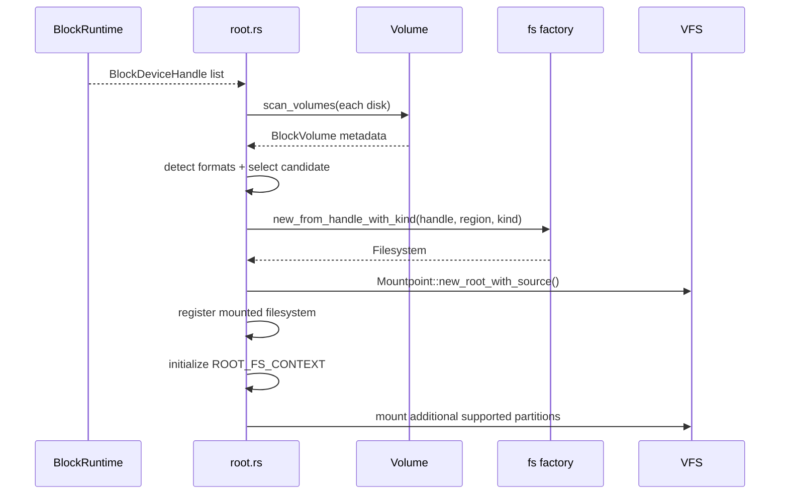

# 具体文件系统与根盘

根文件系统初始化把设备发现、卷解析、root policy、格式检测和 mount 发布分成五个阶段。格式实现只接收裁剪后的 `BlockRegion`；它不知道设备在 probe registry 中的顺序，也不解释 bootargs。

## 1. 根盘选择

根盘选择先把物理磁盘归一成 `BlockVolume`，再检测每个 region 的文件系统格式，最后由 `RootSpec` 或默认策略选择唯一候选。卷 parser 不读取 bootargs，root policy 也不重复解析 GPT/MBR。

### 1.1 卷发现

`volume::scan_volumes(reader, DiskId)` 按以下顺序识别磁盘：

1. 读取 LBA0；
2. 若存在 protective MBR，尝试 GPT；
3. 否则解析 MBR primary entry 和 extended partition 的 EBR chain；
4. 没有可用分区表时返回覆盖全盘的 raw volume。

扫描结果统一使用 `BlockVolume` 保存 region 和可选 partition metadata，使 root selector 不需要识别 GPT entry 或 MBR entry 的原始布局。

| 类型 | 保存的 metadata |
| --- | --- |
| GPT | partition index、LBA region、type/unique GUID、UTF-16 label |
| MBR | primary/logical partition index、type、bootable、由 disk signature 和 index 形成的 PARTUUID |
| Raw | 整个 reader 的 block region，无 partition id |

GPT header、entry size/count 和 entry-array 范围必须完全位于设备内；MBR/EBR 的逻辑分区必须同时位于磁盘和 extended container 内。无效表返回结构化 volume error，root 层记录诊断并跳过该 disk，不把损坏分区表误当 raw filesystem。

### 1.2 格式检测

`collect_partitions()` 对每个 `BlockVolume` 读取最小 magic：

| 格式 | 检测位置 | 条件 |
| --- | --- | --- |
| ext4 | volume byte offset `1024 + 0x38` | little-endian `0xEF53` |
| FAT16 | first sector `54..59` | boot signature `55 aa` 且 `FAT16` |
| FAT32 | first sector `82..87` | boot signature `55 aa` 且 `FAT32` |

检测只决定尝试哪个 adapter，不代替完整 mount 校验。读取失败、region 太小、block size 不合法或 magic 不匹配均视为不支持，真正的 superblock、feature 和一致性检查由具体格式实现完成。

### 1.3 显式选择

`RootSpec::parse_bootargs()` 提取 `root=` 并支持：

- `PARTUUID=<uuid>`；
- `PARTLABEL=<label>`；
- `/dev/sdXN`；
- `/dev/nvmeCn1pN`；
- `/dev/mmcblkXpN`；
- 裸 disk path（不带 partition）。

设备 path 被解析成发现顺序中的 `disk_index` 和 zero-based `partition_index`。`PARTUUID` 比较不区分大小写，`PARTLABEL` 按原字符串精确匹配。已经成功解析的 selector 找不到候选时启动失败；无法识别的 `root=` 语法当前会得到空 `RootSpec`，随后进入默认选择策略。

### 1.4 默认策略

没有显式 root 时使用确定性且 fail-closed 的顺序：

1. 恰好一个 `PARTLABEL=rootfs`；
2. 恰好一个带受支持文件系统的 bootable MBR partition；
3. 恰好一个带受支持文件系统的 partition；
4. 没有可用 partition 且恰好一个 raw disk；
5. 否则无法判定并失败。

多个 `rootfs` label 会直接报错，多个同优先级候选不会按枚举先后猜测。raw disk 只有在没有 partition match 时才参与 fallback，避免把有分区表的整盘误挂成文件系统。

## 2. 挂载发布

`init_root()` 把选择完成的 device、region 和 format kind 交给文件系统 factory，再创建 root mount、发布 `ROOT_FS_CONTEXT` 并处理其他可识别分区。发布后的根上下文不会被第二次替换。

### 2.1 根挂载

根挂载序列从已启动的 `BlockRuntime` 接收 `BlockDeviceHandle`，经过卷扫描和格式 factory 得到 `Filesystem`，最后创建带 source 信息的根 `Mountpoint`。

`ROOT_FS_CONTEXT` 只初始化一次。文件系统实例同时登记到 `MOUNTED_FILESYSTEMS`，用于 shutdown 时逆序关闭。mount source 根据硬件 driver identity 生成 `/dev/nvme0n1`、`/dev/sdX`、`/dev/mmcblkX` 类名字，供 mountinfo 和诊断使用。

### 2.2 附加分区

其余同 disk 的可识别 partition 会自动挂载：label 含 `boot` 的目标为 `/boot`，其他 label 使用 `/<label>`，无 label 使用 `/partition`。目标不存在时尝试创建；只读 root 无法创建或原位置不是目录时，可建立 transient in-memory mount directory 覆盖该名字，使只读 root 仍能承载额外挂载而不修改 backing。

## 3. 磁盘格式

ext4 和 FAT adapter 都实现 `FilesystemOps`、file/dir node 与 region-bounded block I/O，但它们的 inode 身份、错误恢复和内部同步模型不同。这些差异保留在各自 adapter 中，不泄漏到 VFS。

### 3.1 Ext4 适配

`fs/ax-fs-ng/src/fs/ext4/rsext4/` 把 `rsext4` API 映射到 VFS：

| 对象 | 职责 |
| --- | --- |
| `Ext4Filesystem` | sleepable `Ext4State`、根 entry、readonly 状态、flush |
| `Ext4State` | `Ext4FileSystem`、JBD2 device、live inode ref 和 zero-link 集合 |
| `Inode` | `NodeOps` + file/dir 操作、路径、延迟 inode 回收 |
| `Ext4Disk` | `FsBlockDevice` 到 rsext4 block device contract |

文件系统状态使用 sleepable mutex，因为 ext4 operation 可能在持锁期间等待 channel-backed block completion。不能改成 IRQ-disabling spin lock。

unlink 把 on-disk link count 降为零后，如果仍有 live `Inode Arc`，inode number 进入 `zero_link`；最后一个 live reference Drop 时才释放 block/inode。这样已 unlink 但仍打开的文件继续可用。hard link 和重复 dentry 则通过 inode cache 共享 page state。

mount 时若 superblock 已标 error，或 journal replay 返回 `EUCLEAN`，adapter 尝试不重放 journal的只读 fallback并记录 warning。其他 mount 错误保持 typed failure；不能为了启动成功把所有 ext4 错误都降级为只读。

### 3.2 FAT 适配

FAT adapter 使用 `starry-fatfs`：

- `SeekableDisk` 把 byte seek/read/write 转换为 region-bounded block I/O；
- `SeekableDiskFlusher` 在 filesystem flush 时持久化 pending block；
- `FatFilesystemInner` 保存 fatfs 对象和运行期 inode-number slab；
- `FatFileNode`/`FatDirNode` 实现 VFS trait；
- DOS 时间与 Unix `Duration` 在 `util.rs` 转换并裁剪到 FAT 可表示范围。

共享 FAT 状态使用 `SleepMutex`，根 entry 仅用短暂 `IrqMutex<Option<_>>` 发布。FAT inode number 是本次 mount 的内存身份，不是稳定 on-disk inode；不能把它当跨重启标识。

## 4. 组合边界

Cargo feature 决定哪些磁盘格式和 VFS 运行时能力进入镜像，factory 则把检测结果路由到已编译 adapter。扩展新格式或 root selector 时必须保持卷事实、选择策略和格式语义三层独立。

### 4.1 功能组合

`ax-fs-ng` 的 feature 分别控制格式 adapter、VFS sleep 支持和 lockdep。下表说明它们改变的代码范围，而不是运行时自动检测能力。

| Feature | 效果 |
| --- | --- |
| `ext4` | 编译 `rsext4` adapter、ext4 magic 和 inode cache |
| `fat` | 编译 `starry-fatfs` adapter、FAT magic |
| `vfs` | 启用 sleep support、mount namespace、全局页回收/sync |
| `lockdep` | 将 VFS/文件系统锁纳入项目 lockdep 路径 |

未编译某格式时，factory 对该 kind 返回 `Unsupported`。有效系统配置必须至少启用一个 rootfs 格式；无格式版本中的 `new_from_handle()` panic 是构建配置不变量，不是运行时格式 fallback。

### 4.2 扩展边界

新的磁盘格式需要同时提供独立 adapter、VFS 对象、region-bounded block 接口、无歧义 magic、factory 路由和持久化验证。以下实现面共同构成一个完整格式能力，缺少其中任一项都会让 host 测试或系统挂载只覆盖部分语义。

1. 独立格式实现或 adapter，不依赖 OS syscall；
2. `FilesystemOps`、file/dir node 和 typed error 转换；
3. region-bounded block adapter；
4. 最小且无歧义的 detection；
5. Cargo feature 与 factory routing；
6. host deterministic image tests；
7. root/附加 mount 集成验证；
8. flush、shutdown、unlink-open、rename 和 error-state 行为。

新增 root selector 只修改 `RootSpec`/candidate policy，不能复制 GPT/MBR 解析。新增分区表只修改 `volume/`，不能把 root label 策略写进 scanner。
