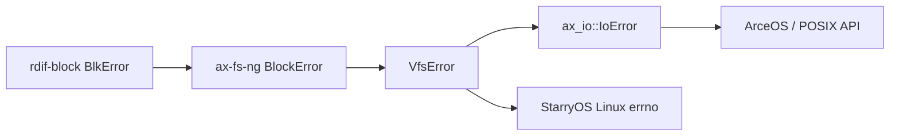

# 文件系统系统集成

公共文件系统机制同时服务 ArceOS 和 StarryOS；Axvisor 只在宿主需要文件或块设备时通过 ArceOS 间接使用。三者共享 VFS、页缓存和块运行时，但 API/ABI、伪文件系统和设备交接策略留在各自系统层。

## 1. ArceOS 集成

ArceOS 负责安装公共文件系统所需的 OS capability、启动块运行时并向内核 API 与用户库发布文件操作。启动接线位于 `ax-runtime`，API 转换位于 `arceos_api`、`arceos_posix_api` 和 `axstd`。

### 1.1 启动顺序

`ax-runtime` 的文件系统初始化顺序如下：

```text
platform + rdrive probe complete
  -> fs::block::init(bootargs)
  -> install time/page/task/DMA/IRQ providers
  -> take rdif block devices and shared groups
  -> start BlockRuntime with bootstrap queue
  -> scan/select/mount root
  -> initialize ROOT_FS_CONTEXT
  -> scheduler/SMP online
  -> BlockRuntime::online_smp() 扩展 CPU/queue mapping
```

初始化前需要 allocator、任务和 IRQ 基础能力已经可用；rootfs 初始化又必须在依赖文件的上层服务启动前完成。bootstrap 阶段在线 CPU 计数固定为 1，SMP 完成后才发布实际 CPU 数，避免 worker 被绑定到尚未 online 的 CPU。

`ax-runtime` 实现的 page provider把 page-cache allocation记为 `UsageKind::PageCache`，因此内存统计和 reclaim callback 可以区分文件页。DMA provider复用统一 `axklib::dma`，块 runtime 不另建物理地址或 cache-coherency 假设。

### 1.2 接口分层

ArceOS 上层接口按内核 facade、Rust API、POSIX API 和 std-like 用户库分层。它们共享 `FsContext` 与 `File`，但分别处理 feature 聚合、C ABI 和 Rust 类型适配。

| 层 | 路径 | 角色 |
| --- | --- | --- |
| 内核 facade | `ax-fs-ng::api` | 全局 cwd、create/remove/rename/metadata |
| Rust API | `os/arceos/api/arceos_api` | feature-gated ArceOS 能力 |
| POSIX API | `os/arceos/api/arceos_posix_api` | fd table、flags 和 C ABI |
| Rust std-like | `os/arceos/ulib/axstd/src/fs` | `File`、`OpenOptions`、`read_dir` 等 |

上层通过 `FsContext` 和 `File` 操作，不能直接取得 `DirNodeOps` 或块 handle。POSIX 层负责把 open flag 和错误转换到 ABI，公共文件系统继续使用 `VfsError`。

## 2. StarryOS 集成

StarryOS 复用 ArceOS 初始化的 rootfs 和 task、内存、驱动能力，再增加 Linux 进程可见的 fd、syscall、mount namespace、mmap 和伪文件系统语义。Linux-only 状态保留在 kernel adapter 中。

### 2.1 系统调用

StarryOS 复用 ArceOS 初始化的 rootfs 和 task/内存/驱动能力，在其上增加 Linux 进程可见语义：

| 集成点 | 主要职责 |
| --- | --- |
| `kernel/src/file/` | `FileLike`、fd-visible status、VFS file adapter |
| `kernel/src/syscall/fs/` | openat2、read/write、stat、mount、xattr、lock、event fd 等 |
| `kernel/src/pseudofs/` | tmpfs、procfs、sysfs、devfs、overlay、mqueue、cgroup、usbfs |
| `kernel/src/mm/aspace/backend/file.rs` | MAP_SHARED/MAP_PRIVATE、evict listener、writeback protection |
| `kernel/src/pseudofs/proc_mountinfo.rs` | namespace-local mount tree 和 propagation metadata 展示 |

syscall 层执行 user pointer、credential、permission、fd flag、Linux errno 和结构体布局处理，再调用公共 `FsContext`/VFS。具体伪文件系统直接实现 `FilesystemOps`/节点 trait，不把 Linux-only 节点加入 `ax-fs-ng`。

### 2.2 挂载命名空间

进程/任务 clone 是否共享 `FsContext` 和 `MountNamespace` 由 StarryOS clone/unshare policy 决定。公共层只提供：共享 `Arc`、clone tree、rebind namespace、pivot 和 topology 操作。`/proc/<pid>/mountinfo` 必须从目标进程 namespace 的 `walk_tree()` 读取，不能遍历全局 root。

### 2.3 文件映射

file-backed mapping 使用 `CachedFile` 的同一页 owner，注册 eviction 和 writeback-protect callback。页缓存不依赖 StarryOS `AddrSpace` 类型；StarryOS adapter负责：

- eviction 时解除对应 PTE，失败则拒绝回收；
- dirty writeback 前撤销 writable 映射；
- 写 fault 后调用 `mark_mmap_dirty_page()`；
- unmap/进程退出时删除 listener，保证 unsafe handle 只移除一次。

这条 capability boundary 防止公共文件缓存反向依赖 StarryOS mm，同时维持 buffered write 和 MAP_SHARED 的一致性。

### 2.4 伪文件系统

StarryOS 伪文件系统分为两类：

- 稳定目录结构：可以使用 `DirNode` dentry cache；
- 动态查询视图：`DirNodeOps::is_cacheable()` 返回 false，每次 lookup/read_dir 根据当前 process/device/control state 生成。

tmpfs/ramfs 的文件内容存在无界 `CachedFileShared` 中，没有磁盘 backing，也不登记 clean-page reclaim。procfs/sysfs 等控制文件常实现自定义 `FileNodeOps`，通过 poll/register 或 ioctl 对接相应子系统。节点实现不得让公共 VFS 依赖 process、driver registry 或网络内部类型。

## 3. 系统边界

rootfs 构建、Axvisor 设备交接和错误转换是公共文件系统与外部系统状态相接的三个边界。它们分别要求镜像与 feature 对齐、host owner 完整释放，以及 typed error 到最终 ABI 的延迟转换。

### 3.1 根文件系统配置

ArceOS 和 StarryOS 的构建通过逻辑 `fs` feature 启用 `ax-fs-ng`，再选择 `ext4fs`/`fatfs` 或 `ax-fs-ng/ext4|fat`。rootfs 镜像、QEMU block device 和 bootargs 必须与编译 feature 对齐：镜像是 ext4 而二进制只启用 FAT 时，magic detection 不会选择 ext4 adapter。

系统测试应优先使用 `cargo xtask`，由配置统一生成磁盘参数、rootfs 和 success regex。手工 QEMU 命令容易遗漏块设备型号、IRQ feature、root selector 或 mount 需要的用户态文件。

### 3.2 设备直通

Axvisor 的宿主 shell、镜像读取或其他管理功能可通过 `ax-std/fs` 使用 host filesystem。若某个物理块设备要直通 guest，交接顺序必须是：

```text
停止新的 host 文件访问
  -> sync page cache
  -> filesystem flush/shutdown
  -> 释放 host mount lifetime/resource
  -> BlockRuntime quiesce
  -> disable + synchronize + free host IRQ
  -> 归还 controller/queue/DMA owner
  -> 配置 guest passthrough
```

仅关闭文件描述符或卸载路径不代表 host 已放弃硬件；`BlockDeviceHandle`、group controller 或 IRQ registration 仍可能持有设备。公共交接入口见 `release_block_irqs_for_passthrough()` 和 AxVM host boundary。

### 3.3 错误转换

错误沿 driver、block runtime、VFS 和 OS API 单向转换。底层保留 operation、LBA 和 stage context，只有最终 API/ABI 边界才转换成 `ax_io::IoError` 或 Linux errno。



块层保留 operation、LBA 和 stage context；格式 adapter 在 VFS 边界转换为可匹配 `VfsError`；OS API 最后转换到 `IoError` 或 errno。`NotSupported`、`Retry`、`NoMemory`、`TimedOut` 和 `Io` 不能全部压成一个 EIO，因为调用方可能需要 retry、fallback 或报告配置缺失。系统集成还必须保持 root context 一次发布、SMP queue 在 CPU online 后扩展、mmap listener 与 mapping owner 同生命周期，以及 passthrough 前完整释放 host IRQ、queue 和 DMA owner。
