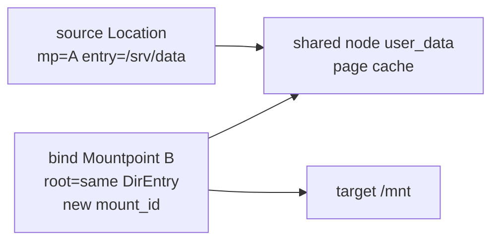
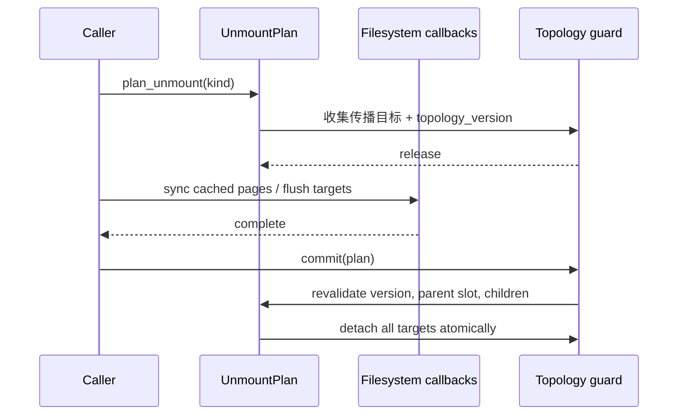

# 挂载与命名空间

挂载拓扑由 `axfs-ng-vfs::Mountpoint` 维护，`ax-fs-ng::MountNamespace` 只持有 namespace root 并提供 clone/walk。挂载树不是文件系统目录树的复制品：每个 mount node 只记录自身根 `DirEntry`、父挂载中的 attachment `Location` 和直接 child mounts。

## 1. 挂载拓扑

挂载拓扑由 `Mountpoint` 节点和 `Location` 查找规则共同实现。节点保存 namespace-local parent/children 与传播关系，查找规则则负责在目录 entry 和覆盖它的 child mount 之间切换。

### 1.1 挂载状态

`Mountpoint` 的字段区分文件系统设备身份、挂载实例身份、父子拓扑和传播边。该拆分允许同一个文件系统或 bind source 在一个 namespace 中出现多次。

| 字段 | 语义 |
| --- | --- |
| `root` | 这个挂载实例暴露的根 entry；bind mount 可以不是文件系统根 |
| `location` | 父 mount 中的 attachment 位置；namespace root 为 `None` |
| `children` | 以 attachment entry key 索引的直接子挂载 |
| `device` | 文件系统设备身份；bind clone 保留 |
| `mount_id` | 每个挂载实例唯一，namespace clone 和传播副本重新分配 |
| `source` | `/proc/*/mountinfo` 等接口展示的 source 名称 |
| `readonly` / `mount_flags` | mount-local 只读和 Linux mount option bits |
| `propagation` | private/shared/slave/unbindable |
| `peers` / `slaves` / `masters` | weak propagation graph |
| `lifetime_guard` | 只在 mount attached 期间持有的外部资源 owner |

`device` 和 `mount_id` 不同：多个 bind mount 可共享设备号，但每个挂载实例必须有独立 mount ID。`walk_tree()` 返回 `(mount_id, parent_id, mountpoint)`，root 的 parent ID 等于自身，符合 mountinfo 的根表示。

### 1.2 路径查找

父 `Mountpoint::children` 使用被覆盖 entry 的 `ReferenceKey` 索引 child，`Location` 则在向下 lookup 和向上 parent traversal 时解释这个索引。两种方向必须使用同一 attachment 事实，才能正确跨越 mount root。

父 `Mountpoint::children` 使用被覆盖 entry 的 `ReferenceKey` 索引 child。`Location::lookup_no_follow()` 先在当前目录查出 entry，再循环进入挂载在该 entry 上的 child root；同一位置重复 mount 时，后挂载覆盖先挂载，直到最上层 effective mount。

向上遍历的方向相反：在 child root 上调用 parent 时，通过 child `location` 回到父 mount 中 attachment 的父目录。这样 `/mnt/file` 的 parent 关系不会落到被挂载文件系统内部根 entry 的伪 parent。

## 2. 拓扑变更

普通 mount、bind、move 和 pivot 都会改变 parent/children 关系，但它们对 root entry、device identity 和 subtree 的处理不同。所有变更由 topology mutation guard 串行，并在发布后增加 topology version。

### 2.1 普通挂载

`Location::mount_with_source()` 创建新 `Mountpoint`，把 child 插入当前 mount 的 `children`，再在父为 shared 时传播新 child。具体文件系统 callback 和可能阻塞的初始化不应在全局 topology guard 内执行。

### 2.2 绑定挂载

bind mount 共享 source `DirEntry`、device、source、只读状态、mount flags 和 lifetime guard，但创建新的 mount ID。recursive bind 只克隆 source location 以下的 child mounts，并跳过 unbindable mount；clone 完成后再重建传播关系。



该关系使 source 和 target 共享节点 user data 与页缓存，同时保持独立的 absolute path、父挂载和 mount identity。recursive clone 完成后才重建传播边，避免中间节点引用未完成的副本。

### 2.3 移动挂载

`move_to()` 在 topology guard 内验证 source 不是 root、target 是空 mount slot 且目录、target 不位于 source subtree，然后从旧父 children 移除并接到新父。detached mount 使用 `attach_detached()`，不能把 namespace root 当 detached handle。

### 2.4 根切换

`pivot_mount(old_root, new_root, put_old)` 要求 `put_old` 严格位于 `new_root` 下、是目录且没有 mount。事务先把 new root 从 old tree 脱开，再把 old root 接到 `put_old`；随后 `FsContext` 层更新所有受影响的 root/cwd。

## 3. 命名空间传播

mount namespace clone 与 propagation 都会复制挂载节点，但二者目的不同：namespace clone 建立独立的本地 topology，propagation 则把一个 topology event 传给 peer 或 slave。底层 filesystem 与 entry 可以共享，mount relation 必须按目标树重建。

### 3.1 传播类型

`PropagationType` 的四种状态决定新 child 的发送、接收和 bind 行为。peer 是对称关系，master/slave 是有向关系，所有边均使用 `Weak<Mountpoint>` 防止关系图延长节点生命周期。

| 类型 | 新 child 是否向外传播 | 是否接收上游传播 | bind 限制 |
| --- | --- | --- | --- |
| private | 否 | 否 | 可 bind |
| shared | 向 peer 和下游 slave | 从 peer 接收 | 可 bind |
| slave | 不向 master 反向传播 | 从 master/上游链接收 | 可 bind |
| unbindable | 否 | 否 | recursive bind 跳过 |

shared peer relation 是对称边，master/slave relation 是有方向边。所有边使用 `Weak<Mountpoint>`，修改关系时清理 dead 和 duplicate edge。切换 propagation type 必须先离开原 peer/master/slave 关系，避免一个 mount 同时留在互相矛盾的集合中。

新 child 的传播遍历完整下游图，而不只处理直接 peer：`shared A -> slave B -> slave C` 必须让 C 收到事件。遍历用 `mount_id` visited set 阻止 shared peer clique 回环；每个目标根据相对 mount-root 路径找到自己的 attachment location，并生成具有目标专属 mount ID 的浅 clone。

### 3.2 命名空间克隆

`MountNamespace::clone_namespace()` 通过 `Mountpoint::clone_tree()` 建立独立 topology。clone 共享文件系统数据 owner，但重新创建 mount 节点、parent/children lock 和 mount ID。

```text
MountNamespace::clone_namespace()
  -> root_mount.clone_tree()
  -> 在 topology guard 内浅 clone 每个 mount node
  -> 复制 namespace-local parent/children 结构
  -> 用 source->clone 对重建 peer/master/slave relation
  -> 发布新 namespace root
```

clone 共享底层 filesystem、root entry 和 lifetime guard，但不共享 `location`/`children` mutex 或 mount identity。之后在一个 namespace move/unmount 不应改变另一个 namespace 的树。

## 4. 卸载语义

卸载同时涉及文件系统 flush、传播目标、busy admission 和 topology commit。实现把可睡眠回调与不可抢占的 topology mutation 分开，避免在全局 guard 内等待块设备或文件系统锁。

### 4.1 卸载事务

正常 unmount 采用 plan/flush/commit 三阶段。`UnmountPlan` 保存目标集合和 topology version，flush 完成后必须重新验证父槽位、child mount 和传播目标没有发生不兼容变化。filesystem flush 可能等待块 IRQ 或取得 sleep mutex，因此不在 topology guard 下执行。



`UnmountKind::Normal` 拒绝任何目标带 child mount；`Detach` 收集完整传播 subtree，并按 child-first 顺序移除。正常卸载在 flush 期间遇到无关 topology 变化时会在 guard 内重新计划，但只有新旧 target set 完全一致才提交；若新增了未 flush 的传播 target，则返回 `ResourceBusy`，不会部分 detach。

提交完成后再清除 propagation edges 并取走 `lifetime_guard`。guard 的析构放在对应 mutex 之外，防止资源析构反向进入 mount 或 filesystem 锁。

### 4.2 忙碌判定

normal unmount 的 busy 状态来自 child mount、任务 root/cwd、开放文件和传播目标等多个 owner，不能用单一 `Arc::strong_count()` 或 children 数量近似。

mount busy 不只等于“还有 child mount”。StarryOS umount admission 还检查：

- 任何 live `FsContext` 的 root/cwd 是否位于目标 mount；
- open file descriptor 是否指向目标；
- 正常 unmount target 是否出现 child；
- propagation 是否产生多个对应 target；
- topology 在 flush 和 commit 之间是否变化。

`is_mount_busy()` 先在 `FS_REGISTRY` 的 IRQ mutex 下 clone live context `Arc`，释放 registry lock 后才逐个取得 sleepable `FsContext` lock。topology mutation 必须统一推进 `MOUNT_TOPOLOGY_VERSION`，多目标传播需要 all-or-nothing，relation 双向边必须对称更新，callback 和 lifetime-guard 析构则保持在全局 topology guard 之外。
