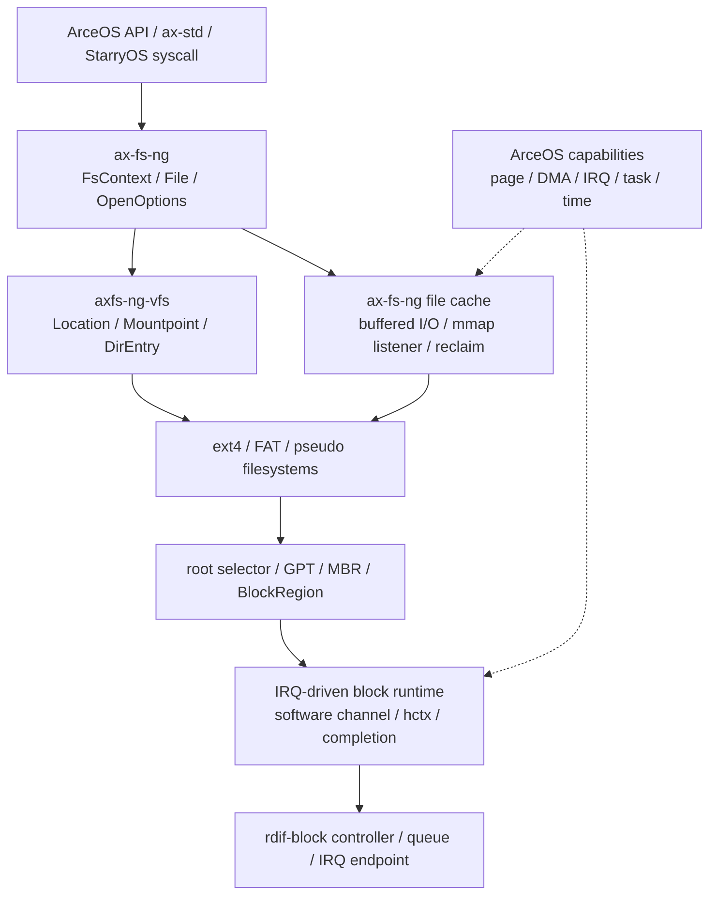

# 文件系统概览

TGOSKits 的文件系统由两个公共 crate 和若干系统适配层组成：`axfs-ng-vfs` 维护节点、路径位置和挂载拓扑等 Virtual Filesystem（虚拟文件系统，VFS）语义，`ax-fs-ng` 负责文件句柄、页缓存、卷发现、具体磁盘文件系统和 IRQ 驱动的块设备运行时。ArceOS 提供任务、内存、DMA、IRQ 和时间能力，StarryOS 在公共边界之上实现 Linux syscall、伪文件系统和 mount ABI。

`Filesystem`、`DirEntry`、`Location`、`FsContext`、`CachedFileShared` 和 `BlockDeviceHandle` 分别持有文件系统实例、节点名字、命名空间位置、任务视图、缓存内容和设备运行时。理解这些对象之间的所有权关系，是判断路径、挂载、缓存或块 I/O 改动影响范围的基础。

## 1. 架构边界

文件系统架构按 VFS 机制、文件访问策略、磁盘格式和系统适配划分职责。公共层通过 trait 与 provider 连接具体实现，使 StarryOS 的 Linux 语义和 ArceOS 的平台能力不会进入可复用 VFS 对象。

### 1.1 总体分层

总体调用关系从操作系统 API 向 VFS、页缓存和具体格式逐层收敛，最终由块运行时消费 `rdif-block` 设备。图中的虚线表示由 ArceOS 注入的能力，而不是 `ax-fs-ng` 对 ArceOS 模块的直接依赖。



分层中的核心规则是“上层选择策略，底层维护机制”。VFS 不知道 ext4、FAT、StarryOS syscall 或块设备型号；具体文件系统不直接注册平台 IRQ；块运行时不解释路径、inode 或 mount。这个依赖方向使内存文件系统、磁盘文件系统和 StarryOS 伪文件系统可以共享同一套目录项与挂载语义。

### 1.2 公共组件

`axfs-ng-vfs` 与 `ax-fs-ng` 共同构成公共文件系统边界，但二者持有的事实不同。前者维护 VFS 身份和拓扑，后者组合文件访问策略、磁盘格式与运行时能力。

| Crate | 负责的事实 | 不负责的事实 |
| --- | --- | --- |
| `fs/axfs-ng-vfs` | `VfsError`、节点 trait、`DirEntry`、`Location`、目录项缓存、挂载树、传播关系、卸载事务 | 页缓存、块 I/O、root 选择、OS 任务上下文、Linux errno |
| `fs/ax-fs-ng` | `FsContext`、文件打开与游标、buffered/direct I/O、页缓存、卷扫描、ext4/FAT adapter、块运行时、OS capability 接口 | 平台 probe、具体硬件寄存器、StarryOS syscall 编解码 |

`axfs-ng-vfs` 是纯 `no_std` 机制层。`ax-fs-ng` 同样默认 `no_std`，但通过 `os/` 下的小能力接口取得页、DMA、时间、任务通知和 IRQ 注册能力。ArceOS 的适配位于 `os/arceos/modules/axruntime/src/fs/`，因此公共文件系统 crate 不依赖 `ax-hal`、`ax-task` 或 `ax-alloc`。

### 1.3 核心对象

文件系统对象按其持有的不变量拆分，避免把节点身份、命名空间位置、打开状态和设备生命周期合并到一个共享对象。下表给出各对象的所有者和维护边界。

| 对象 | 所有者 | 主要不变量 |
| --- | --- | --- |
| `Filesystem` | `Arc<dyn FilesystemOps>` 包装 | 发布根目录、容量统计、flush 和 shutdown；不携带挂载位置 |
| `DirEntry` | `Arc<Inner>` | 节点实现与 `(parent, name)` 引用绑定；同一对象可被 `Location` 引用 |
| `Mountpoint` | namespace-local `Arc` 树 | 保存挂载父位置、子挂载、传播关系和 mount flags；同一文件系统可有多个挂载实例 |
| `Location` | `Mountpoint + DirEntry` | 同时表达“哪个节点”和“从哪个挂载树观察”；路径跨 mount 后必须更换 mountpoint |
| `FsContext` | task-local `Arc<SleepMutex<_>>` | 保存 mount namespace、root 和 cwd；`..` 不越过 context root |
| `File` | 打开文件描述对象 | 保存访问 flags、共享游标和 `FileBackend`；Drop 只在需要时更新元数据 |
| `CachedFileShared` | 同一 VFS 节点或 ext4 inode 共享 | 保存文件长度、页 LRU、I/O 串行化和 mmap listener；脏页写回前后用 generation 判定并发写入 |
| `BlockDeviceHandle` | 已安装块运行时 | 持有 controller、hctx、CPU channel、IRQ 注册和完成等待者；最后引用释放时 shutdown |

`DirEntry` 与 `Location` 不能互换。`DirEntry` 表达文件系统内部对象，`Location` 额外携带命名空间路径所需的挂载身份。bind mount、namespace clone 或同一文件系统多次挂载时，可能共享底层 `DirEntry`，但必须拥有不同的 `Mountpoint` 和 `mount_id`。

## 2. 运行主线

启动和文件读取是文件系统最主要的两条端到端路径。前者建立可信根视图并发布任务上下文，后者把路径解析、页缓存和异步设备完成组合成同步文件 API。

### 2.1 根文件系统启动

根文件系统启动由 `ax-runtime`、`BlockRuntime`、`scan_volumes()`、`RootSpec` 和文件系统 factory 依次完成。每一阶段只发布下游能够信任的事实，显式 root 选择失败时不会回退到其他磁盘。

```text
rdrive probe
  -> ax-runtime 收集 rdif-block device/group
  -> 安装 ax-fs-ng OS capabilities
  -> BlockRuntime 启动 controller、queue worker 和 IRQ
  -> scan_volumes() 识别 GPT / MBR / raw disk
  -> RootSpec 匹配 root= / PARTUUID / PARTLABEL
  -> 检测 ext4 / FAT magic
  -> 创建 Filesystem 和根 Mountpoint
  -> 初始化 ROOT_FS_CONTEXT
  -> 挂载其余可识别分区
```

根盘选择、分区边界和具体文件系统创建见[文件系统与根盘](./filesystems-root.md)，设备提交与完成路径见[块存储运行时](./block-storage.md)。

### 2.2 普通文件读取

普通读取从 `FsContext::resolve()` 取得 namespace-aware `Location`，再由 `OpenOptions` 选择 cached backend。页缓存未命中时，具体文件系统把相对文件 offset 转成分区内块请求，块运行时在 IRQ 完成后唤醒调用任务。

```text
用户 API / syscall
  -> FsContext::resolve()
  -> Location::lookup_no_follow() 跨越可见 mount
  -> OpenOptions -> FileBackend::Cached
  -> CachedFile::read_at()
  -> page cache hit，或读取一个有界 readahead window
  -> FileNodeOps::read_at()
  -> ext4 / FAT adapter
  -> RegionBlockDevice
  -> BlockDeviceHandle software channel
  -> hctx / hardware queue / IRQ completion
```

用户内存复制发生在 cached-file 锁之外，防止用户缺页取得地址空间锁时形成 `cached I/O -> AddrSpace` 的反向锁序。buffered I/O、direct I/O、truncate 和 mmap 协调见[文件与页缓存](./file-cache.md)。

## 3. 行为约束

公共文件系统不仅组合多种实现，还必须保持路径、挂载、持久化和设备完成之间的一致性。本节从外部能力与内部不变量两个角度说明当前行为边界。

### 3.1 能力范围

能力矩阵区分公共机制、具体格式和 StarryOS 适配，避免把某个 Cargo feature 或单个 trait 方法误认为完整的系统支持。

| 能力 | 当前路径 | 边界或限制 |
| --- | --- | --- |
| VFS 节点 | file、directory、symlink、device 等统一 `NodeType` | 具体操作由 `NodeOps`/`FileNodeOps`/`DirNodeOps` 实现 |
| 路径解析 | absolute/relative、`.`/`..`、symlink、chroot root | symlink 最多跟随 40 次；`RESOLVE_BENEATH | RESOLVE_NO_SYMLINKS` 有专用父路径入口 |
| 目录项缓存 | 每个 `DirNode` 的 name→`DirEntry` cache | 动态伪文件系统可用 `is_cacheable() = false` 禁用 |
| 挂载 | 普通、bind、recursive bind、move、pivot_root | mount topology mutation 使用全局事务 guard |
| mount namespace | clone tree、task-local context、shared/slave/private/unbindable | namespace clone 复制挂载节点，底层文件系统对象保持共享 |
| 磁盘文件系统 | ext4、FAT | 由 Cargo feature 选择；ext4 支持错误态只读回退 |
| 内存/伪文件系统 | StarryOS tmpfs、ramfs、procfs、sysfs、devfs 等 | 实现位于 StarryOS；通过公共 VFS trait 接入 |
| 页缓存 | 4 KiB 页、磁盘文件 512 页 LRU、顺序预读、写回、干净页回收 | tmpfs/ramfs 使用无界 cache，不能回收干净页，否则数据会丢失 |
| 块 I/O | 多 hardware context、per-CPU 有界提交 channel、IRQ completion、flush barrier | 文件系统只消费 `BlockDeviceHandle`，不直接进入硬件 queue |
| 卷发现 | GPT、MBR/EBR、raw fallback、PARTUUID/PARTLABEL | `BlockRegion` 对文件系统裁剪可见 LBA，并检查越界 |

这些能力都由明确代码对象持有。例如 `Mountpoint` 维护 namespace-local topology，`CachedFileShared` 区分有 backing 和无 backing 文件，`BlockDeviceHandle` 隔离同步文件访问与硬件 queue owner。

### 3.2 核心不变量

跨层改动必须保持以下不变量，因为它们分别防止路径身份混淆、旧目录项复活、脏数据丢失和设备所有权泄漏。

- 节点身份和命名空间位置分离：文件数据属于节点，mount visibility 属于 `Location`。
- 路径遍历以 `FsContext::root_dir` 为上界；`..` 不能逃出 chroot/pivot 后的根。
- 目录变更先由具体文件系统提交，再使 dentry cache 失效或替换；rename 不能保留指向旧 parent 的子缓存。
- 脏页只有在写回 snapshot 的 generation 仍然有效时才能标记 clean。
- 回收只驱逐磁盘支持的干净页；listener 不能失效 mmap 时必须把页放回 cache。
- mount/unmount 的文件系统回调不在 topology guard 内执行；回调后提交前必须重新验证版本和目标集合。
- block hard IRQ 只确认、记录事件并唤醒 worker；提交、完成回收和 rearm 在固定 CPU 的运行时上下文完成。
- flush 是设备级 barrier，必须作为单独 request group 提交并与所有 data submission 排序。

这些约束共同形成从 namespace 到持久化设备的单向所有权链。任一层新增缓存、引用或异步状态时，都需要明确它由哪个对象持有、在哪个完成事件后释放，以及失败是否保留已经成功的前缀。
