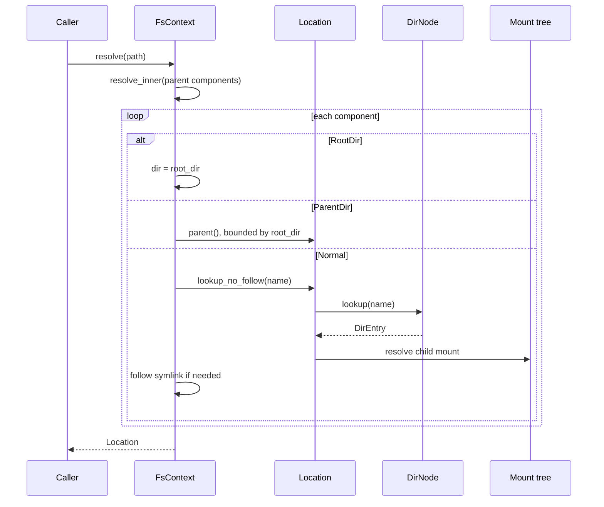

# 路径解析与文件系统上下文

路径解析由 `axfs-ng-vfs::path` 的无状态 component parser 和 `ax-fs-ng::FsContext` 的命名空间状态共同完成。前者只识别字符串结构，后者决定 absolute path 的根、relative path 的起点、symlink 跟随和 mount crossing。

## 1. 路径状态

路径状态由无状态字符串表示和有状态任务上下文共同组成。`Path`/`Components` 只解析 component，`FsContext` 才决定根目录、当前目录和 mount namespace，因此字符串 normalize 不能替代实际路径遍历。

### 1.1 路径表示

`Path` 是 `str` 的 transparent borrowed wrapper，`PathBuf` 持有 `String`。`Components` 双向产生 `RootDir`、`CurDir`、`ParentDir` 和 `Normal(name)` 四类 component；该层保留 trailing slash 等语法事实，但不访问任何节点。

| 输入 | component 结果 | 说明 |
| --- | --- | --- |
| `/a//b/` | root、a、b | 重复分隔符被折叠，trailing slash 可单独查询 |
| `./a` | cur、a | `.` 不触发 lookup |
| `a/../b` | a、parent、b | 是否能向上由 `FsContext` 判断 |
| 空字符串 | 无 component | 需要 entry 的调用返回 `NotFound`/`InvalidInput` |

单个目录项名字由 `verify_entry_name()` 检查：不能为空、不能是 `.`/`..`、不能含 `/`，UTF-8 byte 长度不能超过 255。路径总长度没有在这一层设固定常量，系统调用层仍需执行用户缓冲区和 ABI 限制。

### 1.2 文件系统上下文

`FsContext` 保存任务可见的 mount namespace、root 和 current directory。它是 chroot、relative path 和 namespace unshare 的状态 owner，而不是一个无状态路径 helper。

每个 `FsContext` 保存：

- `mnt_ns: Arc<MountNamespace>`（启用 `vfs` feature 时）；
- `root_dir: Location`；
- `current_dir: Location`。

`FS_CONTEXT` 是 scope-local `Arc<SleepMutex<FsContext>>`，首次访问从 `ROOT_FS_CONTEXT` clone 并登记 weak reference。clone 普通 `FsContext` 会共享 mount namespace；`unshare_mount_namespace()` 才克隆挂载树。`current_fs_context()` 只在 scope-local clone 期间固定 CPU，返回 `Arc` 后结束 pin，再由调用者取得可睡眠锁。

`root_dir` 是该 context 的可见上界，不一定是 namespace mount tree 的物理根。chroot 或 pivot 后，`..` 到达 `root_dir` 时停住，这是阻止 parent traversal 逃逸的关键不变量。

## 2. 解析语义

普通解析把 component 逐个应用到 `Location`，并在每次目录 lookup 后解释 mount 和 symlink。`FsContext::root_dir` 始终作为向上遍历的边界，使同一 namespace 中的不同任务可以看到不同根。

### 2.1 普通解析

`FsContext::resolve()` 先解析父 components，再按调用语义处理最后名字。序列图展示 `FsContext`、`Location`、`DirNode` 和 mount tree 在一次解析中的分工。



`resolve()` 跟随最后一个 symlink，`resolve_no_follow()` 不跟随最后一个 symlink，但中间 component 仍通过普通解析跟随。需要创建、删除或 rename 时，调用 `resolve_parent()`/`resolve_nonexistent()` 返回父 `Location` 和最后名字，使名字空间变更始终在父目录对象上执行。

### 2.2 符号链接

符号链接解析复用同一个 follow counter，并根据 target 是否绝对路径选择 context root 或链接所在目录。`try_resolve_symlink()` 最多跟随 `SYMLINKS_MAX = 40` 次，超限返回 `FilesystemLoop`，空 target 返回 `NotFound`；计数不会在递归 target 中重置。

解析相对 symlink 时，临时 context 的 cwd 被设为 symlink 所在目录；absolute target 的 `RootDir` component 则重新回到 context root。symlink target 继续使用同一个 follow counter，因此多段 target 不能通过递归重置限制。

```text
/sandbox/a/link -> ../data
current root = /sandbox

resolve /a/link/file
  /sandbox/a/link
  target 从 /sandbox/a 开始解释
  .. 到 /sandbox
  最终 /sandbox/data/file
```

该例中的 `..` 只回到 `/sandbox`，不会穿过 context root。relative target 的起点由临时 `FsContext::with_current_dir()` 设为链接所在父目录，而不是调用任务原来的 cwd。

### 2.3 根边界

parent component 同时受 `Location` 的 mount 语义和 `FsContext::root_dir` 的任务视图约束。前者允许从 child mount root 回到 attachment，后者阻止遍历越过 chroot 或 pivot 后的根。

`Location::parent()` 先判断当前 entry 是否是 mount root：

- 不是 mount root：返回 `DirEntry::parent()`，mountpoint 不变；
- 是非根 mount 的 root：返回该 mount 的 attachment `Location` 的父位置；
- 是 namespace/root mount：返回 `None`。

`FsContext::resolve_components()` 还会先比较当前位置和 `root_dir`；相等时忽略 `..`。因此即使 `Location::parent()` 能看到更外层 mount，context 也不会越过 chroot root。

## 3. 上下文转换

受限解析、namespace 切换和 pivot root 都会改变普通路径遍历所依赖的边界。这些操作在 `FsContext` 内以明确入口实现，避免 syscall 层通过字符串改写模拟 VFS 语义。

### 3.1 受限解析

`resolve_parent_beneath_no_symlinks()` 为 StarryOS `openat2` 的 `RESOLVE_BENEATH | RESOLVE_NO_SYMLINKS` 组合提供底层保证。它按相对深度拒绝逃逸，并在到达最后名字前拒绝任何中间 symlink。

| 输入情况 | 结果 |
| --- | --- |
| absolute path / `RootDir` | `CrossesDevices` |
| 在起点深度 0 处理 `..` | `CrossesDevices` |
| 中间 component 是 symlink | `FilesystemLoop` |
| 普通中间 component | 必须存在且是目录 |
| 最后 component | 返回父目录与名字，不自动跟随 |

该入口按相对深度限制 beneath，而普通 `resolve()` 按 `root_dir` 限制 chroot；两者不能互相替代。resolve flag 必须保持对 symlink 和 mount 边界的观察，不能在 syscall 层先 normalize 字符串再调用普通 resolve。

### 3.2 命名空间切换

`set_mount_namespace()` 先记录旧 root/cwd 的 absolute path，以新 namespace root 建临时 resolver，再分别解析出新 `Location`，最后原子替换 context 的 namespace、root 和 cwd。它不能直接复用旧 `Location`；任一路径在新 namespace 不存在时，context 保持原值并返回错误。

`unshare_mount_namespace()` 调用 `Mountpoint::clone_tree()`：底层 `DirEntry`、filesystem 和资源 guard 共享，mount 节点、父子拓扑和 mount ID 重新创建。clone 后的 shared peer/master/slave 关系按源/克隆映射重建，不能保留指向错误 namespace-local mount 的边。

### 3.3 根切换

`FsContext::pivot_root()` 先验证 `new_root` 与 `put_old`，调用 mount tree 的 `pivot_mount()`，再把当前 context 的 root/cwd 修正到新拓扑。`propagate_pivot_root()` 通过 `FS_REGISTRY` 查找共享旧 mount namespace 的 live context，并按 Linux `chroot_fs_refs()` 类似语义修正位置。

registry 只在短暂 `IrqMutex` 内清理并 clone weak references；实际取得每个 `FsContext` 的 sleep mutex 在 registry guard 释放后进行。路径和 namespace 回归必须同时覆盖 symlink、mount root、chroot root、relative cwd 和 namespace clone；只对 `Path::normalize()` 做字符串测试不足以验证可见路径语义。
