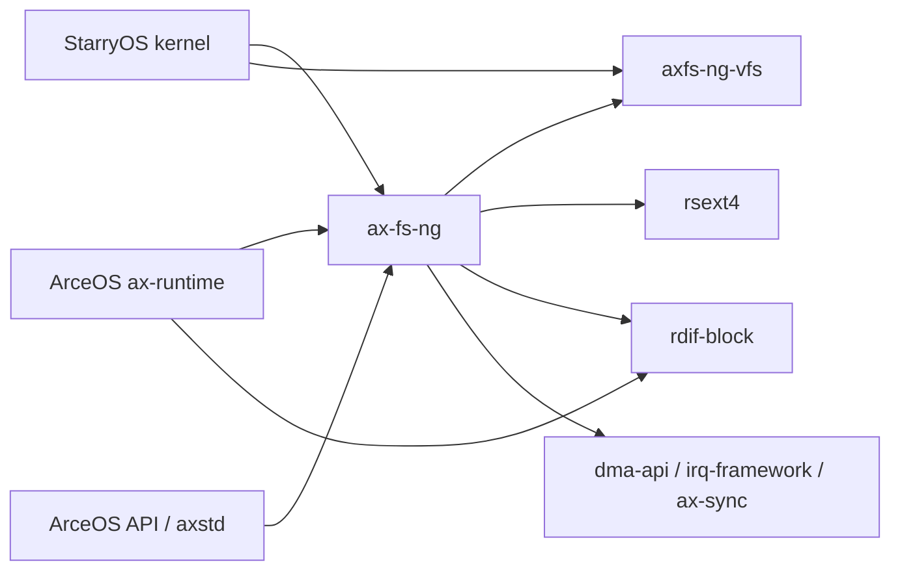

# 文件系统源码结构

文件系统源码按 VFS 机制、文件 I/O 策略、磁盘格式、块运行时和 OS glue 分层。目录位置不是依赖方向：例如 StarryOS 伪文件系统位于 kernel 内，但实现的是 `axfs-ng-vfs` 的底层节点 trait；`ax-fs-ng` 的块运行时位于文件系统 crate 内，却只处理设备 request，不识别 inode 或路径。

## 1. 公共机制

公共机制分为不感知操作系统的 VFS 对象和组合文件访问策略的高层模块。两者通过 `FilesystemOps`、`NodeOps`、`Location` 和 `VfsError` 连接，不共享平台或 syscall 类型。

### 1.1 虚拟文件系统

`fs/axfs-ng-vfs` 保存文件系统实例、节点、目录项、路径和挂载拓扑的公共表示。表中的入口是具体文件系统和上层路径解析共同依赖的稳定边界。

| 源码 | 负责的事实 | 主要入口 |
| --- | --- | --- |
| `fs/axfs-ng-vfs/src/lib.rs` | VFS 错误域与稳定导出 | `VfsError`、`VfsResult` |
| `fs/axfs-ng-vfs/src/types.rs` | 节点种类、权限、metadata、device id | `NodeType`、`NodePermission`、`Metadata` |
| `fs/axfs-ng-vfs/src/fs.rs` | 文件系统对象能力 | `FilesystemOps`、`Filesystem`、`StatFs` |
| `fs/axfs-ng-vfs/src/node/mod.rs` | 节点公共能力、目录项身份和 typed user data | `NodeOps`、`DirEntry`、`Reference`、`TypeMap` |
| `fs/axfs-ng-vfs/src/node/file.rs` | 普通文件节点能力 | `FileNodeOps`、`FileNode` |
| `fs/axfs-ng-vfs/src/node/dir.rs` | 目录操作和 dentry cache | `DirNodeOps`、`DirNode`、`OpenOptions` |
| `fs/axfs-ng-vfs/src/path.rs` | 路径 component 解析和 normalize | `Path`、`PathBuf`、`Component` |
| `fs/axfs-ng-vfs/src/poll.rs` | Linux-compatible readiness bits | `FsIoEvents`、`FsPollable` |
| `fs/axfs-ng-vfs/src/mount/mod.rs` | mount 节点、`Location`、attach/move/pivot | `Mountpoint`、`Location` |
| `fs/axfs-ng-vfs/src/mount/propagation.rs` | shared/slave/private/unbindable 关系 | propagation setters、peer/master/slave graph |
| `fs/axfs-ng-vfs/src/mount/unmount.rs` | plan/revalidate/commit 卸载事务 | `UnmountPlan`、`UnmountKind` |

### 1.2 文件访问策略

`fs/ax-fs-ng` 在 VFS 对象之上提供任务文件系统上下文、打开文件状态、页缓存和 `std::fs` 风格操作。这里的对象可以使用注入的 OS capability，但不直接依赖 ArceOS 实现。

| 源码 | 负责的事实 | 主要入口 |
| --- | --- | --- |
| `fs/ax-fs-ng/src/lib.rs` | facade、文件系统初始化、实例登记与 shutdown | `FilesystemKind`、`shutdown_filesystems()` |
| `fs/ax-fs-ng/src/fs_core/context.rs` | task 文件系统上下文、路径解析、namespace 和目录 API | `FsContext`、`MountNamespace`、`FS_CONTEXT` |
| `fs/ax-fs-ng/src/file/open.rs` | open flags 校验、create/no-follow/direct/path 选择 | `OpenOptions`、`OpenResult` |
| `fs/ax-fs-ng/src/file/handle.rs` | 打开文件对象、游标、访问检查、`ax-io` 适配 | `File`、`FileBackend`、`FileFlags` |
| `fs/ax-fs-ng/src/file/cache/mod.rs` | 页缓存共享状态、buffered read/write、mmap listener | `CachedFile`、`CachedFileShared` |
| `fs/ax-fs-ng/src/file/cache/readahead.rs` | 顺序读窗口 | `ReadAheadState` |
| `fs/ax-fs-ng/src/file/cache/writeback.rs` | generation-aware 写回 | dirty snapshot / protect / finish |
| `fs/ax-fs-ng/src/file/cache/resize.rs` | truncate/extend、尾页清零和失败恢复 | `CachedFile::set_len()` |
| `fs/ax-fs-ng/src/file/cache/reclaim.rs` | 全局磁盘 cache registry 与干净页回收 | `page_cache_reclaim()`、`sync_all_cached_files()` |
| `fs/ax-fs-ng/src/file/page.rs` | 4 KiB 页 owner 与 dirty generation | `PageCache` |
| `fs/ax-fs-ng/src/fops.rs` | `FileAttr`、`FileFlags` 等高层类型 | public file-operation types |
| `fs/ax-fs-ng/src/api.rs` | `std::fs` 风格全局 facade | create/remove/rename/cwd/metadata |

## 2. 存储路径

存储路径把磁盘分区事实、具体文件系统格式和异步块设备运行时分开。`BlockRegion` 是卷发现与格式实现之间的边界，`BlockDeviceHandle` 是格式实现与设备运行时之间的边界。

### 2.1 卷与磁盘格式

卷扫描和具体格式分别维护磁盘布局与文件语义。root policy 可以消费 `BlockVolume` metadata，但 GPT、MBR、ext4 和 FAT 实现都不读取 bootargs。

| 源码 | 负责的事实 | 主要入口 |
| --- | --- | --- |
| `fs/ax-fs-ng/src/root.rs` | root selector、设备命名、候选排序、附加分区挂载 | `RootSpec`、`init_root*()` |
| `fs/ax-fs-ng/src/volume/` | GPT、MBR/EBR、raw volume 发现 | `scan_volumes()`、`BlockVolume` |
| `fs/ax-fs-ng/src/block.rs` | 文件系统可见 block trait 和 region 裁剪 | `FsBlockDevice`、`BlockRegion`、`RegionBlockDevice` |
| `fs/ax-fs-ng/src/fs/mod.rs` | 文件系统工厂和 feature 路由 | `new_from_handle()` |
| `fs/ax-fs-ng/src/fs/ext4/rsext4/` | `rsext4` 到 VFS 的 adapter | `Ext4Filesystem`、`Inode`、`Ext4Disk` |
| `fs/rsext4/src/` | ext4 superblock、inode、extent、目录、JBD2 和 block cache | `Ext4FileSystem`、public API |
| `fs/ax-fs-ng/src/fs/fat/` | `starry-fatfs` 到 VFS 的 adapter 和 seekable disk | `FatFilesystem`、`FatFileNode`、`FatDirNode` |

`BlockRegion` 使用半开 LBA 范围 `[start_lba, end_lba)`。`RegionBlockDevice` 在加上物理起始 LBA 前验证 buffer 按逻辑块大小对齐且整个请求位于 region 内，因此具体文件系统看不到相邻分区。

### 2.2 块设备运行时

IRQ 驱动块运行时消费 `rdif-block` 的 controller、hardware queue、IRQ endpoint 和 owned request，并向文件系统提供同步 `BlockDeviceHandle`。其源码按生命周期、队列、IRQ 和完成所有权拆分。

| 源码 | 负责的事实 |
| --- | --- |
| `block/runtime/lifecycle/mod.rs` | runtime 安装、controller/device 生命周期、flush admission、shutdown |
| `block/runtime/lifecycle/controller.rs` | controller command port 和 transition worker |
| `block/runtime/lifecycle/device.rs` | hctx 发布、CPU channel、在线 CPU 扩容 |
| `block/runtime/lifecycle/io.rs` | 文件系统同步 buffer 与 DMA-owned request 的转换 |
| `block/runtime/hctx/` | hardware-context event loop、批量 dispatch、commit、completion |
| `block/runtime/channel.rs` | 有界 MPSC/SPSC 风格运行时 channel |
| `block/runtime/irq.rs` | hard IRQ action、event latch、shared group fan-out |
| `block/runtime/completion.rs` | 单请求和批量完成所有权 |
| `block/runtime/waiters.rs` | task-context 多等待者通知 |
| `block/runtime/metrics.rs` | batch、dispatch、commit、backpressure 统计 |

块 runtime 消费 `rdif-block` 的 controller、hardware queue、IRQ endpoint 和 owned request。文件系统只持有 `Arc<BlockDeviceHandle>`，不会获得 hardware queue 的可变引用。

## 3. 系统边界

系统边界负责把公共文件系统接入 ArceOS runtime 和 StarryOS Linux 语义。依赖方向始终从系统适配指向公共机制，不允许公共 crate 反向引用系统对象。

### 3.1 系统接线

ArceOS 提供页、DMA、IRQ、任务和时间 provider，StarryOS 提供 file descriptor、syscall、伪文件系统和 file-backed mmap adapter。下表标出这些能力的实际源码所有者。

| 源码 | 主要职责 |
| --- | --- |
| `fs/ax-fs-ng/src/os/` | 定义 page、DMA、IRQ、task、time capability，并保存一次性安装的 provider |
| `os/arceos/modules/axruntime/src/fs/block.rs` | 用 `ax-alloc`、`ax-hal`、`ax-task`、`axklib::dma` 实现 capability；收集 rdif 设备 |
| `os/arceos/modules/axruntime/src/fs/mod.rs` | 按 `fs` feature 调用初始化和 SMP online |
| `os/arceos/api/arceos_api/` | ArceOS API facade |
| `os/arceos/api/arceos_posix_api/` | POSIX fd 和文件 API 适配 |
| `os/arceos/ulib/axstd/src/fs/` | Rust `std::fs` 风格用户接口 |
| `os/StarryOS/kernel/src/file/` | Linux file-like 对象与 VFS file adapter |
| `os/StarryOS/kernel/src/syscall/fs/` | open/mount/stat/io/xattr/lock/event 等 Linux ABI |
| `os/StarryOS/kernel/src/pseudofs/` | tmpfs、procfs、sysfs、devfs、overlay、mqueue、cgroup 等节点实现 |
| `os/StarryOS/kernel/src/mm/aspace/backend/file.rs` | file-backed mmap 与 `CachedFile` listener 协调 |

### 3.2 依赖方向

依赖图展示公共 VFS、文件系统组合层、格式实现和系统适配之间的静态关系。`ax-fs-ng::os` 的运行时注入不会让 `ax-fs-ng` 直接依赖 `ax-runtime`。

禁止的反向依赖如下：

| 禁止方向 | 原因 | 正确边界 |
| --- | --- | --- |
| `axfs-ng-vfs -> ax-fs-ng` | VFS 机制不能依赖页缓存、磁盘或任务策略 | 由 `ax-fs-ng` 组合 VFS |
| `ax-fs-ng -> ax-hal/ax-task/ax-alloc` | 公共 crate 会绑定 ArceOS runtime | `ax-fs-ng::os` capability 注入 |
| ext4/FAT adapter -> `rdrive` | 磁盘格式不负责设备发现 | `BlockDeviceHandle` / `FsBlockDevice` |
| block runtime -> VFS node/path | 设备运行时不能解释文件语义 | owned block request 与 completion |
| `rsext4 -> StarryOS` | 格式实现必须可独立 host-test | adapter 将 ext4 错误转换为 `VfsError` |

这些禁止方向同时给出功能归属：节点公共能力属于 `axfs-ng-vfs/src/node/`，路径和 chroot 语义属于 `fs_core/context.rs`，磁盘格式属于 `fs/` adapter，硬件块驱动则必须在 `drivers/` 实现 `rdif-block`。源码目录因此反映状态所有权，而不是按调用深度机械分层。
