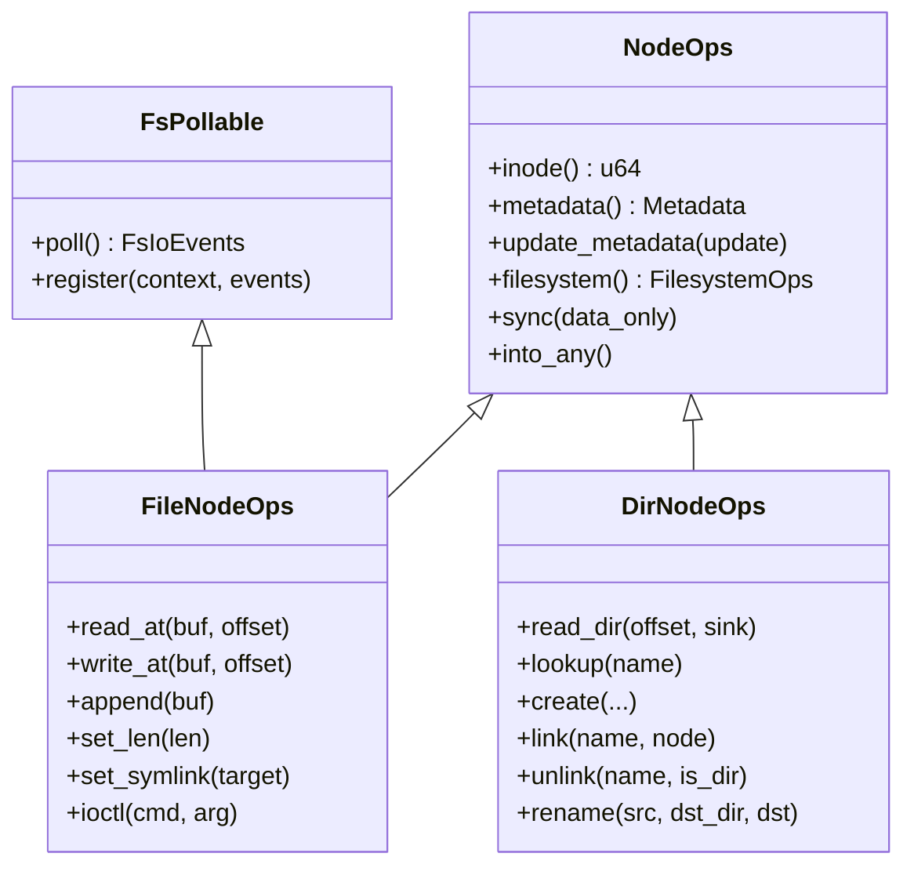

# VFS 对象模型

`axfs-ng-vfs` 将“磁盘或伪文件系统中的对象”“目录树中的名字”和“挂载命名空间中的位置”拆成不同类型。这个分离是 hard link、bind mount、mount namespace、rename cache 失效和 file-backed mmap 能共存的基础。

## 1. 能力对象

VFS 通过文件系统级和节点级两组 trait 描述实现能力。文件系统对象发布根节点与持久化入口，节点对象承载 inode、metadata、数据和目录操作，两者都不包含挂载位置。

### 1.1 文件系统实例

`FilesystemOps` 描述一个已经构造完成的文件系统实例，`Filesystem` 则用 `Arc<dyn FilesystemOps>` 提供共享所有权。表中的方法决定实例级可观测行为和 shutdown 边界。

`FilesystemOps` 只暴露文件系统实例级操作：

| 方法 | 语义 |
| --- | --- |
| `name()` | 稳定的文件系统类型名，例如 `ext4`、`vfat`、`tmpfs` |
| `is_readonly()` | superblock/实现层只读事实，默认 false |
| `root_dir()` | 返回文件系统内部根 `DirEntry` |
| `stat()` | 返回容量、block size、inode 和 name-length 信息 |
| `flush()` | 刷新该文件系统的持久状态，默认成功 |
| `shutdown()` | 最终关闭；默认委托 `flush()` |

`Filesystem` 是 `Arc<dyn FilesystemOps>` 的轻量包装。它不保存 mount flags 或父目录位置，因为同一个文件系统对象可以被多次挂载，每个挂载实例的只读标志、source、mount ID 和传播关系都不同。

### 1.2 节点能力

节点能力由 `NodeOps`、`FileNodeOps`、`DirNodeOps` 和 `FsPollable` 组合。继承关系表达“文件或目录同时具备哪些操作”，而不是共享具体文件系统内部状态。



`NodeOps` 保存所有节点共享的 inode、metadata、sync 和 downcast 能力。`FileNodeOps` 承担按 offset 的数据操作，`DirNodeOps` 承担名字空间变更。目录读取通过 `DirEntrySink` 流式返回，避免 VFS 强制每个实现先分配完整 entry vector；实现回调 sink 时不应再次操作当前目录，因为具体文件系统可能仍持有目录内部锁。

`FsPollable` 使用与 Linux poll 相同的 readiness bit，StarryOS 因而不需要把公共 VFS 事件重新编码。目录默认始终可读写；文件和设备节点可按各自状态注册 waker。

## 2. 节点身份

节点身份由 `DirEntry` 的实现对象、父目录引用和名称共同构成，目录缓存则保存这些身份的可重用视图。身份与缓存分离后，动态目录可以禁用缓存，hard link 也可以让不同名称共享同一内容 owner。

### 2.1 目录项

`DirEntry` 内部同时保存：

- `Node::File(FileNode)` 或 `Node::Dir(DirNode)`；
- 独立的 `NodeType`，可表示 regular file、directory、symlink 和各类 special node；
- `Reference { parent, name }`；
- `TypeMap` user data。

`Reference` 的 key 是 `(parent Arc address, name)`。目录 cache 和 mount child map 使用这个 key 区分同名但不同父目录的 entry。根 entry 的 parent 为 `None`；普通子 entry 的 parent 是创建它时观察到的父 `DirEntry`。

`TypeMap` 是节点级扩展槽，常见用途是把 `CachedFileShared` 绑定到 VFS 节点。hard link 创建新 `DirEntry` 时，`DirNode::link()` 会复制源节点 user data，使两个名字共享同一页缓存，而不是得到两份不一致的文件内容。ext4 还按 `(filesystem pointer, inode)` 建立 weak 索引，补偿同一 inode 由不同 lookup 路径重建 `DirEntry` 的情况。

### 2.2 查找缓存

每个 `DirNode` 保存具体 `DirNodeOps`、`HashMap<String, DirEntry>` cache、`cache_generation` 和可选 child mountpoint。generation 防止慢速底层 lookup 在并发名字空间变更后重新发布旧目录项。

`DirNode::lookup_and_cache()` 在内部锁外调用具体文件系统，再通过 generation 判断结果是否还能进入 cache。该过程保持底层 I/O 可睡眠，同时不让并发 unlink 或 rename 后的旧快照复活。

```text
DirNode::lookup(name)
  -> verify_entry_name()
  -> 若实现不可缓存，直接 ops.lookup()
  -> 记录 cache_generation
  -> cache hit 则返回
  -> cache miss 时调用 ops.lookup()
  -> 再取 cache lock
  -> generation 未变化才插入；否则返回刚查到的节点但不发布旧快照
```

generation 使用 Acquire/AcqRel，解决“慢 lookup 在并发 unlink/rename 后把旧 entry 重新插入”的问题。动态 procfs/sysfs 类目录可以让 `is_cacheable()` 返回 false，每次查找都由实现生成当前视图。

### 2.3 名字空间变更

create、link、unlink 和 rename 都先让具体文件系统提交名字空间变化，再更新 VFS dentry cache。这样底层失败不会留下只存在于缓存的虚假 entry。

| 操作 | 底层成功后的 cache 动作 |
| --- | --- |
| create/open-create | 插入新 entry，递增 generation |
| link | 共享源 user data，再插入新名字 |
| unlink | 删除名字，递增 generation；目录 entry 递归 forget |
| rename（同目录） | 在一把 cache lock 内移除 source/destination |
| rename（跨目录） | 分别使 source 和 destination cache 失效 |

rename 后不能直接把旧目录的 children cache 搬到新目录。缓存中的子 `DirEntry::Reference.parent` 仍指向旧目录，会使后续 absolute path、unlink 和 rename 回到已经不存在的路径。当前实现只转移节点 user data 和挂载点引用，再从目标文件系统重新 lookup 新 entry；子项按需重新加载。

## 3. 可见位置

`Location` 在节点身份之上增加 `Mountpoint`，从而表达同一节点在特定命名空间中的可见位置。metadata 和错误域则提供跨具体文件系统的稳定结果，使上层不需要识别 ext4、FAT 或伪文件系统内部类型。

### 3.1 命名空间位置

`Location` 保存 `Arc<Mountpoint>` 和 `DirEntry`。它委托 inode、metadata、sync、poll 等节点动作，同时在 lookup 和 parent traversal 中解释 mount 边界：

- lookup 到一个挂载槽后，`resolve_mountpoint()` 进入最上层 child mount root；
- 位于 mount root 的 `parent()` 返回挂载发生处的父位置；
- 全局/namespace root 没有父位置；
- `absolute_path()` 按解析后的 mount tree 生成路径，bind mount 的根使用目标挂载位置重定位；
- metadata update、create、link、rename 和 unlink 先检查当前 mount 是否只读。

同一个 `DirEntry` 可以出现在多个 `Location` 中。例如把 `/srv/data` bind 到 `/mnt` 后，两边共享节点和页缓存，但 `absolute_path()`、父遍历、mount flags 和 namespace visibility 由各自 `Location` 决定。

### 3.2 元数据

`Metadata` 包含 device、inode、size、block count、时间、节点类型、权限、link count、uid/gid 和 device ID；`MetadataUpdate` 用 `Option` 表示一次操作明确修改的字段。具体文件系统可以拒绝不支持的更新并返回结构化 `VfsError`，而不需要向上层暴露内部 inode 结构。

`VfsError` 是公共 VFS 唯一错误域，不依赖 Linux errno。下表按名字空间、权限、资源和能力缺失对变体分组，便于格式 adapter 和 syscall 层保持一对一语义。

| 类别 | 代表变体 |
| --- | --- |
| 名字空间 | `NotFound`、`AlreadyExists`、`NotADirectory`、`DirectoryNotEmpty` |
| 路径限制 | `NameTooLong`、`FilesystemLoop`、`CrossesDevices` |
| 权限/状态 | `PermissionDenied`、`ReadOnlyFilesystem`、`ResourceBusy`、`BadState` |
| 资源/I/O | `NoMemory`、`StorageFull`、`TimedOut`、`WouldBlock`、`Io` |
| 能力缺失 | `Unsupported`、`OperationNotSupported`、`NotATty` |

`ax-fs-ng` 在 `VfsError`、`ax_io::IoError`、`BlockError` 间按稳定语义转换；StarryOS 只在 syscall 边界转换为 Linux errno。底层实现不得提前把结构化失败压成整数或字符串。新的磁盘或伪文件系统必须维持稳定 root entry、正确 parent/name、hard-link 内容共享、开放后 unlink 生命周期、EOF 清零和可睡眠锁边界，这些要求都由上述对象模型直接产生。
