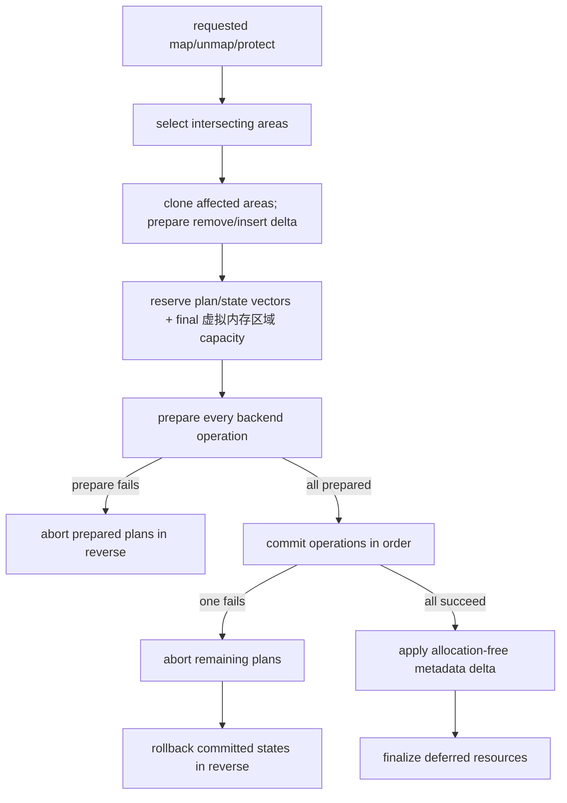
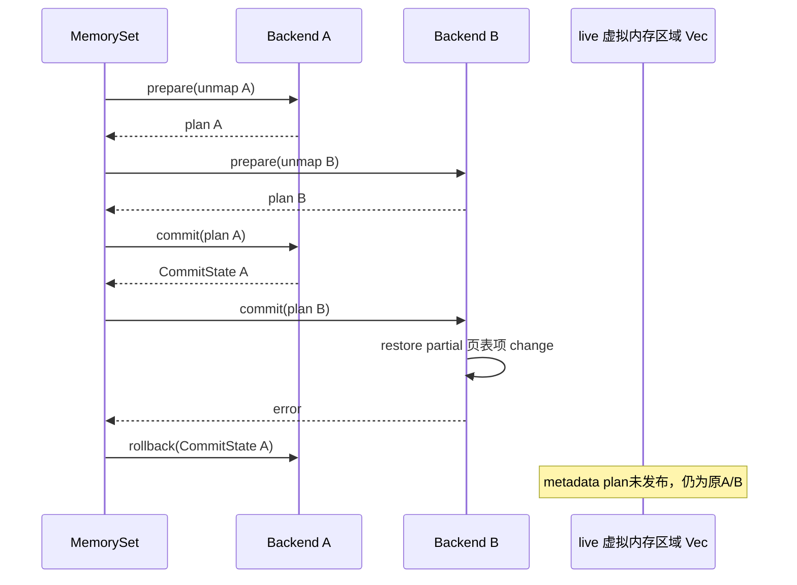

# 虚拟内存区域与页表事务

`ax-memory-set` 管理按起始地址排序的 `MemoryArea`，并把具体页表操作交给 `MappingBackend`。Virtual Memory Area（虚拟内存区域，VMA）描述连续虚拟范围及其策略，Page Table Entry（页表项，PTE）保存实际地址翻译；map、replace、unmap、protect 和 clear 都先规划区域元数据与后端操作，再通过 prepare、commit、rollback 和 finalize 协议保证跨多个区域的变更全成或回滚。

## 1. 数据模型

地址空间层把连续虚拟范围的 metadata 与页表实现分离。它不要求一个地址空间内所有 area 使用同一种物理页来源，但 backend 类型由上层 enum 统一。

### 1.1 内存区域

`MemoryArea<B>` 保存虚拟地址 range、实际 backend/页表项 flags、对外报告 flags 和 backend。`reported_flags` 允许 Starry 在写时复制等场景中区分页表实际权限与 `/proc`/syscall 可见权限。

| 字段/方法 | 语义 |
| --- | --- |
| `va_range()` | 半开区间 `[start, end)` |
| `flags()` | backend 和页表项实际使用的 flags |
| `reported_flags()` | introspection 和用户语义报告值 |
| `backend()` | 该 area 的物理映射策略 |
| `split()` / shrink helpers | 只修改 planned metadata，不直接改页表项 |

同一 `MemoryArea` 内 flags 和 backend 语义保持一致。protect 或 unmap 穿过 area 边界时，元数据计划只克隆相交 area，并预先 split 成 remove/insert 差量；无关虚拟内存区域不参与规划。

### 1.2 区域集合

`MemorySet<B>` 使用按 area start 排序的紧凑 `Vec<MemoryArea<B>>`。containment、overlap 和 page-fault 查找通过 `partition_point` 或 binary search 定位前驱，保持 O(log n)；free-area 搜索从 hint 对应的二分位置开始扫描 gaps。虚拟内存区域插入、删除和 split 为 O(n)，但这些操作不在 page-fault 热路径。选择该表示是为了让 `try_reserve` 在 backend commit 前可靠预留最终容量，避免为树节点再引入 allocator 或不可恢复的提交后分配。

| 操作 | metadata 目标 | backend 目标 |
| --- | --- | --- |
| `map` | 插入新 area，可选替换 overlap | map 新范围，必要时先 unmap overlap |
| `map_metadata` | 发布已经由专用事务安装的 area | 不修改页表项；失败时专用事务负责撤销 owner |
| `replace` | 替换指定 span 内全部 area | 同一事务 unmap old + map new |
| `unmap` | 删除、截短或 split areas | unmap 每个相交子范围 |
| `protect` | split 并更新 actual/reported flags | protect 每个相交子范围 |
| `clear` | 变为空 map | unmap 全部 area |

metadata-only 方法只用于已经由专用路径移动或分离页表项的调用方。普通消费者必须使用带 page table 的事务入口。

## 2. 映射后端协议

`MappingBackend` 是小型能力边界。它允许 backend 在 prepare 阶段预留资源，在 commit 失败时恢复自身的部分修改，并向外层提供撤销已成功操作所需的状态。

### 2.1 操作计划

`MappingOperation` 只有 Map、Unmap 和 Protect 三种。Map 携带 `MapPrecondition::Vacant` 或 `Replacing`；后者表示旧页表项将由同一事务中更早的 unmap operation 删除。Unmap 记录 old flags，Protect 同时记录 old/new flags，为 rollback 提供明确输入。

该前置条件不能用“prepare 时看到旧页表项就一律冲突”代替。重叠 map/replace 会在任何 commit 前同时 prepare old unmap 和 new map；`Replacing` 允许 new backend 验证并保存旧页表项，同时仍由提交顺序保证先 unmap、后 map。普通新映射必须使用 `Vacant`，发现未登记页表项时返回 `AlreadyExists`。

```rust
pub trait MappingBackend: Clone {
    type Addr: MemoryAddr;
    type Flags: Copy;
    type PageTable;
    type MappingPlan;
    type CommitState;

    fn prepare(...) -> MappingResult<Self::MappingPlan>;
    fn abort(&self, plan: Self::MappingPlan, page_table: &mut Self::PageTable);
    fn commit(...) -> MappingResult<Self::CommitState>;
    fn rollback(...) -> MappingResult;
    fn finalize(&self, state: Self::CommitState, page_table: &mut Self::PageTable);
}
```

`prepare()` 不得修改可观察 mapping 或 backend 状态。它可以分配 metadata、检查所有页表项、保留写时复制 reference 或预留后续 commit 所需资源；未提交 plan 必须交给 `abort()`。

### 2.2 提交状态

`commit()` 若可能失败，必须在返回错误前撤销本次 operation 的部分修改。外层只负责 rollback 更早已经完整成功的 operation。

| Hook | 调用时机 | 所有权责任 |
| --- | --- | --- |
| `prepare` | 所有页表项/虚拟内存区域变更之前 | 建立 plan，失败时不留可见状态 |
| `abort` | plan 未进入 commit | 释放预留资源和临时 reference |
| `commit` | 全部 plan 成功后依次执行 | 返回完整 undo state；自恢复局部失败 |
| `rollback` | 后续 operation 失败 | 恢复先前 mapping、flags 和 accounting |
| `finalize` | 全部 operation 成功 | 释放不再需要的旧页或临时 hold |

例如 allocation-backed unmap 不能在单个页表项清除后立即释放 frame，因为后续虚拟内存区域可能失败。它保留旧 frame 到整个事务成功，再由 `finalize()` 释放。

## 3. 区域事务流程

`MemorySet::execute()` 为 plan 和 commit state Vec 预留精确容量，`execute_with_metadata()` 还在进入 backend prepare 前预留 live 虚拟内存区域 Vec 的最终容量，避免事务中途因为容器扩容失败而无法记录 undo 或发布 metadata。metadata split 与 flags 更新在只包含相交虚拟内存区域的 `MetadataPlan` 中完成。

### 3.1 准备与提交

完整流程先准备所有 backend operation，再提交页表项/backend，最后才替换 live metadata。下图展示失败分支。



live metadata 容量在 backend prepare 前预留，差量只在全部 backend commit 成功后应用，随后才 finalize 旧资源。因此页表项/backend 失败不会留下已 split 但未映射的虚拟内存区域，metadata 发布不会再分配，也不会为一次局部操作复制整个地址空间。

### 3.2 回滚失败

如果任一 backend rollback 返回错误，`MemorySet` 返回 `MappingError::BadState`，因为无法再承诺原状态完整恢复。该错误应被视为地址空间一致性故障。

| `MappingError` | 含义 | 常见来源 |
| --- | --- | --- |
| `InvalidParam` | range、size 或 alignment 无效 | overflow、空或非页对齐 backend 请求 |
| `AlreadyExists` | mapping overlap 或现有页表项 | map 未允许替换 |
| `NoMemory` | plan、metadata 或 backend reserve 失败 | `try_reserve`、frame allocation |
| `BadState` | 页表层级、undo 或 backend 状态不一致 | huge 页表项、rollback failure、unexpected mapping |

调用方不能在 `BadState` 后继续假定局部范围可用。内核策略应停止相关地址空间或进入明确故障路径，而不是忽略错误。

## 4. 区间操作

区间操作必须同时覆盖所有相交虚拟内存区域，不能只处理第一个 area。metadata planner 根据 range 与 area 的相对位置选择删除、左/右收缩或中间 split。

### 4.1 删除与替换

`unmap_operations()` 为每个相交 area 生成精确交集范围。`unmap_metadata()` 在 planned map 上移除完全包含项，并处理左右边界和中间洞。

| 相对位置 | metadata 结果 |
| --- | --- |
| unmap 覆盖完整 area | 删除 area |
| unmap 截掉左侧 | start 前移，backend `shrink_left` |
| unmap 截掉右侧 | end 前移，backend `shrink_right` |
| unmap 位于 area 中间 | split 成 left/right 两个 area |
| replace span 包含新 area | 先计划删除整个 span，再插入经验证的新 area |

`replace()` 适合设备 mapping 小于用户请求 replacement span 的情况：整个请求 span 被移除，但只安装经过验证的设备范围。

### 4.2 权限与报告标志

`protect_with_reported_flags()` 在局部 metadata plan 中将每个相交 area 按边界 split，并为中间片段生成 Protect operation。actual flags 与 reported flags 在同一次 metadata publish 中更新。

| 场景 | 页表项/backend flags | reported flags |
| --- | --- | --- |
| 普通 ArceOS protect | new flags | 与 new flags 相同 |
| Starry 写时复制 writable 虚拟内存区域 | backend 可保持只读以触发写时复制 | 对用户报告 writable |
| 不需要修改的 area | 不生成 operation | metadata 保持原值 |

这一分离避免 `/proc/maps` 或 syscall 查询把写时复制页表暂时只读误报成虚拟内存区域不可写，同时保持 hardware enforcement 正确。

## 5. ArceOS 地址空间

`os/arceos/modules/axmm` 是 ArceOS 的 Stage-1 策略层。它组合 `ax-memory-set`、`ax-page-table::stage1` 和 `ax-alloc`，不再实现第二套通用虚拟内存区域容器。

### 5.1 映射后端

`axmm::Backend` 当前包含 Linear 和 Alloc。两者都用 `BackendTransaction` 保存每个 4 KiB 虚拟地址的旧 mapping，以支持 rollback。

| Backend | Map 行为 | Fault 行为 | Unmap ownership |
| --- | --- | --- | --- |
| `Linear { pa_va_offset }` | 虚拟地址通过有符号固定 offset 映射已知物理地址 | 不处理 fault | 只移除页表项，不释放物理 RAM |
| `Alloc { populate: true }` | 立即逐页申请并清零 | 不应 fault | finalize 后释放旧 frame |
| `Alloc { populate: false }` | 建立 empty entry | fault 时申请、清零并 remap | finalize 后释放已存在 frame |

Alloc frame 使用 `MemoryZone::Normal × UsageKind::VirtMem`。populate 中途失败时 backend 自己 unmap 并释放已完成页面，满足单 operation commit 失败自恢复要求。

### 5.2 内核映射

`ax-mm::AddrSpace` 拥有 `MemorySet<Backend>` 和 Stage-1 page table，提供 map_linear、map_alloc、unmap、protect、query 和 page-fault 接口。`kernel_aspace()` 使用 `SpinNoIrq` 保护全局 kernel 地址空间。

| 公共入口 | 用途 |
| --- | --- |
| `new_kernel_aspace()` | 从平台 kernel mappings 建立内核地址空间 |
| `new_user_aspace(base, size)` | 创建 ArceOS 用户地址空间 |
| `init_memory_management()` | 验证 多核 地址转换后备缓冲区 capability，建立/激活 kernel space |
| `iomap(paddr, size)` | 为 MMIO 寻找虚拟地址并创建 device mapping |

MMIO 的 Linear backend 不拥有设备物理区。unmap 只释放虚拟地址/页表项，不能调用 `ax-alloc` 释放对应物理地址。

## 6. Axvisor 客户机地址空间

`virtualization/axaddrspace` 将同一事务容器用于 Guest physical address space。它通过 `NestedPageTableOps` 适配具体架构的 Stage-2/嵌套页表 实现。

### 6.1 嵌套页表能力

该 trait 暴露 root、levels、Host frame allocation、地址转换和 map/unmap/protect/query。`axaddrspace` 不直接依赖某个 EPT、AArch64 S2 或 RISC-V HGATP 类型。

| 能力 | 作用 |
| --- | --- |
| `root_paddr()` / `levels()` | 配置 vCPU translation root |
| `alloc_frame()` / `dealloc_frame()` | Guest RAM backing ownership |
| `map_region(..., allow_huge)` | 建立 Stage-2 range，Linear 可使用 huge mapping |
| `remap()` | fault 时把空/占位 entry 替换为 Host frame |
| `query()` / `translate()` | Guest 物理地址到 Host 物理地址查询 |

保持 `NestedPageTable` 等原有领域名称有助于区分 Guest translation 与 Host Stage-1；统一 `PageFrameProvider` 不要求批量重命名所有具体 adapter。

### 6.2 客户机后端

`axaddrspace::Backend<Npt>` 同样提供 Linear 与 Alloc。Linear 使用 `i128` delta 并做 checked conversion，Alloc 的 frame 来源由 嵌套页表 adapter 注入。

| 路径 | 物理页来源 | huge mapping | 释放时机 |
| --- | --- | --- | --- |
| Guest linear | 调用方已有 Host 物理地址 | 允许 | 只移除 嵌套页表 entry |
| Guest alloc populate | `NestedPageTableOps::alloc_frame()` | 当前逐 4 KiB page | 完整 unmap transaction finalize |
| Guest alloc lazy | fault 时 alloc frame | remap base page | 客户机解除映射或虚拟机销毁 |

`AddrSpace::drop()` 调用 `clear()`，因此虚拟机销毁会遍历所有区域并释放由分配器提供后备页的客户机 RAM。外部借用或线性 RAM 不由该路径释放。

## 7. Starry 后端接入

Starry kernel 的 backend 比 ArceOS 多出 Cow、Shared 和 File，并把常驻内存集大小与写时复制保留引用纳入同一事务。具体 Linux 虚拟内存策略在 [StarryOS 内存](./starry-mm.md) 中说明。

### 7.1 准备内容

`os/StarryOS/kernel/src/mm/aspace/backend/mod.rs` 的 `prepare()` 先验证 backend page size 和 file flags，再保存旧 mapping、page size、常驻内存集大小 kind，并为即将 unmap 的写时复制 frame 获取 transaction hold。

| 保存内容 | Rollback 用途 |
| --- | --- |
| 虚拟地址、物理地址、flags、page size | 恢复原页表项 |
| `rss_kind` | 恢复 Anon/File/Shmem 计数 |
| `cow_hold` | 防止 unmap 后 frame 在事务完成前释放 |
| operation | 选择 map/unmap/protect 恢复路径 |

任何 prepare 错误都会释放已经取得的写时复制 holds。未提交 plan 的 `abort()` 也执行相同释放。

### 7.2 提交恢复

Starry backend 的 `commit()` 允许具体 backend 返回 `AxError`，但在向 `MemorySet` 返回失败前调用 `restore(plan, pt)`。更早成功的虚拟内存区域 operation 再由外层 reverse rollback。

| 阶段 | 常驻内存集大小/写时复制行为 |
| --- | --- |
| map 成功 | backend 在页表项成功后记录 resident charge |
| unmap prepare | 保存常驻内存集大小 kind，写时复制 frame 增加 hold |
| transaction rollback | 恢复页表项与 charge，转移或释放 hold |
| transaction finalize | 释放只用于 undo 的 hold，完成旧 owner 回收 |

`RssAccountingGuard` 通过当前执行 scope 把 owning `MemoryAccounting` 暴露给通用 backend bridge。它依赖 AddrSpace lock 的外部不变量，不是跨线程全局常驻内存集大小 registry。

## 8. 测试与源码入口

事务正确性必须用可控的中间失败验证，而不是只测试成功路径。mock backend 应能指定第几个 map/unmap/protect commit 失败。

### 8.1 必测故障

以下故障应比较操作前后的完整虚拟内存区域列表和模拟页表项数组。只检查返回错误不足以证明回滚正确。

| 故障 | 必须保持的不变量 |
| --- | --- |
| plan Vec reserve 失败 | live metadata 与页表项不变 |
| 第 N 个 prepare 失败 | 前 N-1 个 plan 全部 abort，页表项不变 |
| 第 N 个 commit 失败 | 本 operation 自恢复，先前 states reverse rollback |
| 多虚拟内存区域 unmap 中间失败 | 所有原页表项、area range 和 owner 恢复 |
| protect 中间失败 | actual/reported flags 与页表项一致回到旧值 |
| rollback 自身失败 | 返回 `BadState`，不得伪报原错误可恢复 |

还应覆盖 area 中间 split、左右边界、replace span、empty range、address overflow、huge 页表项与 base-page backend 冲突。

### 8.2 源码检查点

公共容器和三个策略消费者共同构成当前地址空间实现。修改 `MappingBackend` trait 时必须逐个迁移实现，不得通过 alias 或 wrapper 引入第二事务协议。

| 源码 | 审计重点 |
| --- | --- |
| `memory/memory_set/src/backend.rs` | hook contract 与 operation undo data |
| `memory/memory_set/src/set.rs` | affected-range metadata plan、vector reserve、reverse rollback |
| `memory/memory_set/src/area.rs` | split/shrink 与 actual/reported flags |
| `memory/memory_set/src/tests.rs` | deterministic fault injection |
| `os/arceos/modules/axmm/src/backend/` | Stage-1 frame ownership与 lazy fault |
| `virtualization/axaddrspace/src/address_space/backend/` | Guest RAM ownership 与 嵌套页表 rollback |
| `os/StarryOS/kernel/src/mm/aspace/backend/` | 写时复制 hold、常驻内存集大小和 file/shared restore |

新增 backend 前必须先定义它在 prepare 时能验证和预留什么、commit 局部失败如何自恢复、rollback 保存什么、finalize 释放什么。无法回答四个问题的 backend 不能接入 `MemorySet`。

## 9. 事务实例

地址空间事务需要同时观察虚拟内存区域 Vec、页表项和 backend owner。下面用两个虚拟内存区域的跨区间 unmap 展示 `plan_unmap()`、`execute()` 和 metadata 发布的精确输入输出。

### 9.1 跨区域删除

初始地址空间包含 A=`[0x1000, 0x5000)`、B=`[0x8000, 0xa000)`，中间 `[0x5000, 0x8000)` 没有映射。请求 `unmap(0x3000, 0x6000)` 对应目标 `[0x3000, 0x9000)`。

```text
before
0x1000          0x3000          0x5000          0x8000  0x9000  0xa000
|----- keep -----|---- remove A ---|--- hole -----|remove B| keep B |

metadata remove: [0x1000, 0x8000]
metadata insert: A-left [0x1000, 0x3000), B-right [0x9000, 0xa000)
backend ops:     unmap [0x3000, 0x5000), unmap [0x8000, 0x9000)
```

`affected_area_starts()` 先用 `partition_point()` 找到第一个 start 不小于 range start 的位置，再检查前驱 A 是否跨过 range start。它不扫描 `[0x5000, 0x8000)` 的 hole，也不会为 hole 创建虚假 backend operation。

```rust
let first_in_range = self
    .areas
    .partition_point(|area| area.start() < range.start);
let preceding = first_in_range
    .checked_sub(1)
    .and_then(|index| self.areas.get(index))
    .filter(|area| area.end() > range.start)
    .map(MemoryArea::start);
```

若两个 backend commit 都成功，metadata 发布后 live Vec 只剩 `[0x1000, 0x3000)` 和 `[0x9000, 0xa000)`。旧 frame 或临时写时复制 hold 在 Vec 发布后由两个 `finalize()` 释放。

### 9.2 中间失败回滚

延续 9.1，假设 A 的 commit 已经清除两个页表项并返回 `CommitStateA`，B 的 commit 在修改第一个页表项时失败。B backend 必须先恢复自己的部分修改再返回错误；`MemorySet::execute()` 随后逆序 rollback 已完整提交的 A。



只有所有 commit 成功时 `execute()` 才返回 committed states。失败分支会继续尝试所有前序 rollback；其中任一 rollback 失败时最终返回 `MappingError::BadState`，因为此时不能再承诺地址空间已经恢复。

下面是 `MemorySet::execute()` 失败分支的核心实现，对应 `memory/memory_set/src/set.rs`。`prepared.into_iter().rev()` 保证 plan abort 与 already-committed state rollback 都按逆序执行；显式 `rollback_failed` 标志避免遇到第一个 rollback 错误就提前返回，使每个已 commit 的 operation 都至少有一次恢复机会。

```rust
while let Some((backend, plan)) = prepared.next() {
    match backend.commit(plan, page_table) {
        Ok(state) => committed.push((backend, state)),
        Err(error) => {
            for (backend, plan) in prepared.rev() {
                backend.abort(plan, page_table);
            }
            let mut rollback_failed = false;
            for (backend, state) in committed.into_iter().rev() {
                if backend.rollback(state, page_table).is_err() {
                    rollback_failed = true;
                }
            }
            return Err(if rollback_failed {
                MappingError::BadState
            } else {
                error
            });
        }
    }
}
```

`abort()` 与 `rollback()` 的区别在于：`abort()` 处理尚未进入 commit 的 plan，它只释放预留资源；`rollback()` 处理已经 commit 但后续失败的 operation，它需要恢复可见页表项和 backend owner。两者都不能抛出新的 mapping 变更，否则就会破坏 abort/rollback 自身的不变量。

```rust
for (backend, state) in committed.into_iter().rev() {
    if backend.rollback(state, page_table).is_err() {
        rollback_failed = true;
    }
}
return Err(if rollback_failed {
    MappingError::BadState
} else {
    error
});
```

该循环不能使用遇到首个错误就提前返回的写法，否则更早的 mapping 将永远没有机会恢复。

### 9.3 元数据容量失败

成功结果从两个虚拟内存区域变为两个虚拟内存区域，本例不需要扩大 live Vec；如果 protect 一个虚拟内存区域中间范围，单个虚拟内存区域会 split 为三个，final length 增加两个。`MetadataPlan::reserve()` 在任何 backend prepare 之前计算最终长度并调用 `try_reserve()`。

```rust
let final_len = areas
    .len()
    .checked_sub(self.remove.len())
    .and_then(|len| len.checked_add(self.insert.len()))
    .ok_or(MappingError::BadState)?;
areas
    .try_reserve(final_len.saturating_sub(areas.len()))
    .map_err(|_| MappingError::NoMemory)
```

假设初始只有 `[0x1000, 0x7000)` RW，对 `[0x3000, 0x5000)` 执行只读 protect，计划是 remove 1、insert 3，final length 从 1 变为 3。若 `try_reserve(2)` 失败，页表项、actual flags、reported flags 和原虚拟内存区域均保持不变。

| 成功后的虚拟内存区域 | actual flags | reported flags |
| --- | --- | --- |
| `[0x1000, 0x3000)` | RW | RW |
| `[0x3000, 0x5000)` | R | 由上层 closure 决定，普通 protect 为 R |
| `[0x5000, 0x7000)` | RW | RW |

排序 Vec 的 insertion 会移动元素，但已预留容量后不再分配。page-fault `find()` 仍通过 `partition_point(area.start() <= addr)` 查前驱，保持 O(log n)。

### 9.4 重叠替换

`map(area, unmap_overlap=true)` 和 `replace()` 会把旧 unmap operations 放在新 map operation 之前，并把新 map 标记为 `MapPrecondition::Replacing`。这允许 prepare 阶段看到尚未删除的旧页表项，同时要求 commit 顺序先撤旧、后建新。

```text
old VMAs: [0x1000,0x4000) A, [0x4000,0x8000) B
replace:  [0x2000,0x7000) C

operations:
1. unmap A [0x2000,0x4000)
2. unmap B [0x4000,0x7000)
3. map C   [0x2000,0x7000), precondition=Replacing

success metadata:
[0x1000,0x2000) A, [0x2000,0x7000) C, [0x7000,0x8000) B
```

新 map commit 失败时，C backend 先撤销本次部分映射，外层再恢复 B、A。旧 owner 只有在 C 成功、metadata 已发布后才进入 finalize；这避免 new mapping 失败后旧 frame 已被释放。
