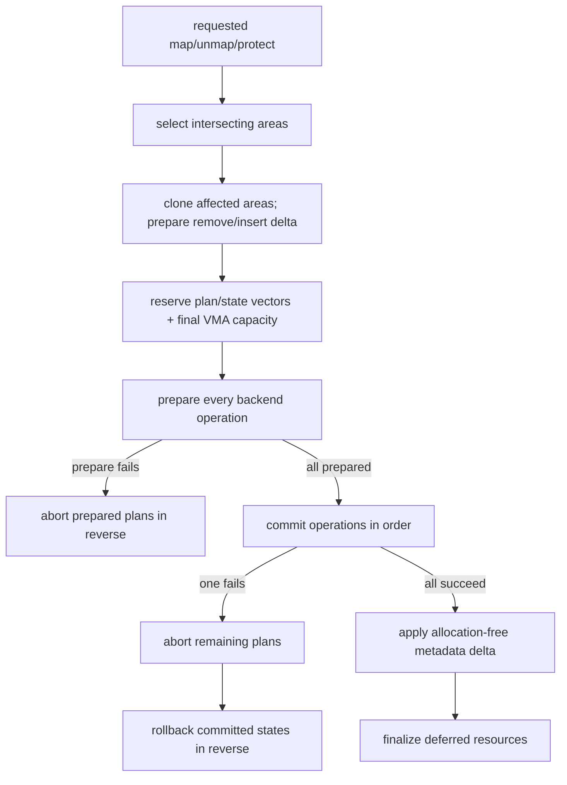

# VMA 与页表事务

`ax-memory-set` 管理按起始地址排序的 `MemoryArea`，并把具体页表操作交给 `MappingBackend`。map、replace、unmap、protect 和 clear 都先规划 VMA metadata 与 backend 操作，再通过 prepare/commit/rollback/finalize 协议保证跨多个 VMA 的变更全成或回滚。

## 1. 数据模型

地址空间层把连续虚拟范围的 metadata 与页表实现分离。它不要求一个地址空间内所有 area 使用同一种物理页来源，但 backend 类型由上层 enum 统一。

### 1.1 MemoryArea

`MemoryArea<B>` 保存 VA range、实际 backend/PTE flags、对外报告 flags 和 backend。`reported_flags` 允许 Starry 在 COW 等场景中区分页表实际权限与 `/proc`/syscall 可见权限。

| 字段/方法 | 语义 |
| --- | --- |
| `va_range()` | 半开区间 `[start, end)` |
| `flags()` | backend 和 PTE 实际使用的 flags |
| `reported_flags()` | introspection 和用户语义报告值 |
| `backend()` | 该 area 的物理映射策略 |
| `split()` / shrink helpers | 只修改 planned metadata，不直接改 PTE |

同一 `MemoryArea` 内 flags 和 backend 语义保持一致。protect 或 unmap 穿过 area 边界时，元数据计划只克隆相交 area，并预先 split 成 remove/insert 差量；无关 VMA 不参与规划。

### 1.2 MemorySet

`MemorySet<B>` 使用按 area start 排序的紧凑 `Vec<MemoryArea<B>>`。containment、overlap 和 page-fault 查找通过 `partition_point` 或 binary search 定位前驱，保持 O(log n)；free-area 搜索从 hint 对应的二分位置开始扫描 gaps。VMA 插入、删除和 split 为 O(n)，但这些操作不在 page-fault 热路径。选择该表示是为了让 `try_reserve` 在 backend commit 前可靠预留最终容量，避免为树节点再引入 allocator 或不可恢复的提交后分配。

| 操作 | metadata 目标 | backend 目标 |
| --- | --- | --- |
| `map` | 插入新 area，可选替换 overlap | map 新范围，必要时先 unmap overlap |
| `map_metadata` | 发布已经由专用事务安装的 area | 不修改 PTE；失败时专用事务负责撤销 owner |
| `replace` | 替换指定 span 内全部 area | 同一事务 unmap old + map new |
| `unmap` | 删除、截短或 split areas | unmap 每个相交子范围 |
| `protect` | split 并更新 actual/reported flags | protect 每个相交子范围 |
| `clear` | 变为空 map | unmap 全部 area |

metadata-only 方法只用于已经由专用路径移动或分离 PTE 的调用方。普通消费者必须使用带 page table 的事务入口。

## 2. Backend 协议

`MappingBackend` 是小型能力边界。它允许 backend 在 prepare 阶段预留资源，在 commit 失败时恢复自身的部分修改，并向外层提供撤销已成功操作所需的状态。

### 2.1 操作与计划

`MappingOperation` 只有 Map、Unmap 和 Protect 三种。Map 携带 `MapPrecondition::Vacant` 或 `Replacing`；后者表示旧 PTE 将由同一事务中更早的 unmap operation 删除。Unmap 记录 old flags，Protect 同时记录 old/new flags，为 rollback 提供明确输入。

该前置条件不能用“prepare 时看到旧 PTE 就一律冲突”代替。重叠 map/replace 会在任何 commit 前同时 prepare old unmap 和 new map；`Replacing` 允许 new backend 验证并保存旧 PTE，同时仍由提交顺序保证先 unmap、后 map。普通新映射必须使用 `Vacant`，发现未登记 PTE 时返回 `AlreadyExists`。

```rust
pub trait MappingBackend: Clone {
    type Addr: MemoryAddr;
    type Flags: Copy;
    type PageTable;
    type MappingPlan;
    type CommitState;

    fn prepare(...) -> MappingResult<Self::MappingPlan>;
    fn abort(&self, plan: Self::MappingPlan, page_table: &mut Self::PageTable);
    fn commit(...) -> MappingResult<Self::CommitState>;
    fn rollback(...) -> MappingResult;
    fn finalize(&self, state: Self::CommitState, page_table: &mut Self::PageTable);
}
```

`prepare()` 不得修改可观察 mapping 或 backend 状态。它可以分配 metadata、检查所有 PTE、保留 COW reference 或预留后续 commit 所需资源；未提交 plan 必须交给 `abort()`。

### 2.2 CommitState 与 finalize

`commit()` 若可能失败，必须在返回错误前撤销本次 operation 的部分修改。外层只负责 rollback 更早已经完整成功的 operation。

| Hook | 调用时机 | 所有权责任 |
| --- | --- | --- |
| `prepare` | 所有 PTE/VMA 变更之前 | 建立 plan，失败时不留可见状态 |
| `abort` | plan 未进入 commit | 释放预留资源和临时 reference |
| `commit` | 全部 plan 成功后依次执行 | 返回完整 undo state；自恢复局部失败 |
| `rollback` | 后续 operation 失败 | 恢复先前 mapping、flags 和 accounting |
| `finalize` | 全部 operation 成功 | 释放不再需要的旧页或临时 hold |

例如 allocation-backed unmap 不能在单个 PTE 清除后立即释放 frame，因为后续 VMA 可能失败。它保留旧 frame 到整个事务成功，再由 `finalize()` 释放。

## 3. MemorySet 执行流程

`MemorySet::execute()` 为 plan 和 commit state Vec 预留精确容量，`execute_with_metadata()` 还在进入 backend prepare 前预留 live VMA Vec 的最终容量，避免事务中途因为容器扩容失败而无法记录 undo 或发布 metadata。metadata split 与 flags 更新在只包含相交 VMA 的 `MetadataPlan` 中完成。

### 3.1 Prepare 与 commit

完整流程先准备所有 backend operation，再提交 PTE/backend，最后才替换 live metadata。下图展示失败分支。



live metadata 容量在 backend prepare 前预留，差量只在全部 backend commit 成功后应用，随后才 finalize 旧资源。因此 PTE/backend 失败不会留下已 split 但未映射的 VMA，metadata 发布不会再分配，也不会为一次局部操作复制整个地址空间。

### 3.2 Rollback 失败

如果任一 backend rollback 返回错误，`MemorySet` 返回 `MappingError::BadState`，因为无法再承诺原状态完整恢复。该错误应被视为地址空间一致性故障。

| `MappingError` | 含义 | 常见来源 |
| --- | --- | --- |
| `InvalidParam` | range、size 或 alignment 无效 | overflow、空或非页对齐 backend 请求 |
| `AlreadyExists` | mapping overlap 或现有 PTE | map 未允许替换 |
| `NoMemory` | plan、metadata 或 backend reserve 失败 | `try_reserve`、frame allocation |
| `BadState` | 页表层级、undo 或 backend 状态不一致 | huge PTE、rollback failure、unexpected mapping |

调用方不能在 `BadState` 后继续假定局部范围可用。内核策略应停止相关地址空间或进入明确故障路径，而不是忽略错误。

## 4. 区间操作

区间操作必须同时覆盖所有相交 VMA，不能只处理第一个 area。metadata planner 根据 range 与 area 的相对位置选择删除、左/右收缩或中间 split。

### 4.1 Unmap 与 replace

`unmap_operations()` 为每个相交 area 生成精确交集范围。`unmap_metadata()` 在 planned map 上移除完全包含项，并处理左右边界和中间洞。

| 相对位置 | metadata 结果 |
| --- | --- |
| unmap 覆盖完整 area | 删除 area |
| unmap 截掉左侧 | start 前移，backend `shrink_left` |
| unmap 截掉右侧 | end 前移，backend `shrink_right` |
| unmap 位于 area 中间 | split 成 left/right 两个 area |
| replace span 包含新 area | 先计划删除整个 span，再插入经验证的新 area |

`replace()` 适合设备 mapping 小于用户请求 replacement span 的情况：整个请求 span 被移除，但只安装经过验证的设备范围。

### 4.2 Protect 与 reported flags

`protect_with_reported_flags()` 在局部 metadata plan 中将每个相交 area 按边界 split，并为中间片段生成 Protect operation。actual flags 与 reported flags 在同一次 metadata publish 中更新。

| 场景 | PTE/backend flags | reported flags |
| --- | --- | --- |
| 普通 ArceOS protect | new flags | 与 new flags 相同 |
| Starry COW writable VMA | backend 可保持只读以触发 COW | 对用户报告 writable |
| 不需要修改的 area | 不生成 operation | metadata 保持原值 |

这一分离避免 `/proc/maps` 或 syscall 查询把 COW 页表暂时只读误报成 VMA 不可写，同时保持 hardware enforcement 正确。

## 5. ArceOS 地址空间

`os/arceos/modules/axmm` 是 ArceOS 的 Stage-1 策略层。它组合 `ax-memory-set`、`ax-page-table::stage1` 和 `ax-alloc`，不再实现第二套通用 VMA 容器。

### 5.1 Backend 类型

`axmm::Backend` 当前包含 Linear 和 Alloc。两者都用 `BackendTransaction` 保存每个 4 KiB VA 的旧 mapping，以支持 rollback。

| Backend | Map 行为 | Fault 行为 | Unmap ownership |
| --- | --- | --- | --- |
| `Linear { pa_va_offset }` | VA 通过有符号固定 offset 映射已知 PA | 不处理 fault | 只移除 PTE，不释放物理 RAM |
| `Alloc { populate: true }` | 立即逐页申请并清零 | 不应 fault | finalize 后释放旧 frame |
| `Alloc { populate: false }` | 建立 empty entry | fault 时申请、清零并 remap | finalize 后释放已存在 frame |

Alloc frame 使用 `MemoryZone::Normal × UsageKind::VirtMem`。populate 中途失败时 backend 自己 unmap 并释放已完成页面，满足单 operation commit 失败自恢复要求。

### 5.2 Kernel mapping

`ax-mm::AddrSpace` 拥有 `MemorySet<Backend>` 和 Stage-1 page table，提供 map_linear、map_alloc、unmap、protect、query 和 page-fault 接口。`kernel_aspace()` 使用 `SpinNoIrq` 保护全局 kernel 地址空间。

| 公共入口 | 用途 |
| --- | --- |
| `new_kernel_aspace()` | 从平台 kernel mappings 建立内核地址空间 |
| `new_user_aspace(base, size)` | 创建 ArceOS 用户地址空间 |
| `init_memory_management()` | 验证 SMP TLB capability，建立/激活 kernel space |
| `iomap(paddr, size)` | 为 MMIO 寻找 VA 并创建 device mapping |

MMIO 的 Linear backend 不拥有设备物理区。unmap 只释放 VA/PTE，不能调用 `ax-alloc` 释放对应 PA。

## 6. Axvisor Guest 地址空间

`virtualization/axaddrspace` 将同一事务容器用于 Guest physical address space。它通过 `NestedPageTableOps` 适配具体架构的 Stage-2/NPT 实现。

### 6.1 NestedPageTableOps

该 trait 暴露 root、levels、Host frame allocation、地址转换和 map/unmap/protect/query。`axaddrspace` 不直接依赖某个 EPT、AArch64 S2 或 RISC-V HGATP 类型。

| 能力 | 作用 |
| --- | --- |
| `root_paddr()` / `levels()` | 配置 vCPU translation root |
| `alloc_frame()` / `dealloc_frame()` | Guest RAM backing ownership |
| `map_region(..., allow_huge)` | 建立 Stage-2 range，Linear 可使用 huge mapping |
| `remap()` | fault 时把空/占位 entry 替换为 Host frame |
| `query()` / `translate()` | Guest PA 到 Host PA 查询 |

保持 `NestedPageTable` 等原有领域名称有助于区分 Guest translation 与 Host Stage-1；统一 `PageFrameProvider` 不要求批量重命名所有具体 adapter。

### 6.2 Guest backend

`axaddrspace::Backend<Npt>` 同样提供 Linear 与 Alloc。Linear 使用 `i128` delta 并做 checked conversion，Alloc 的 frame 来源由 NPT adapter 注入。

| 路径 | 物理页来源 | huge mapping | 释放时机 |
| --- | --- | --- | --- |
| Guest linear | 调用方已有 Host PA | 允许 | 只移除 NPT entry |
| Guest alloc populate | `NestedPageTableOps::alloc_frame()` | 当前逐 4 KiB page | 完整 unmap transaction finalize |
| Guest alloc lazy | fault 时 alloc frame | remap base page | Guest unmap/VM teardown |

`AddrSpace::drop()` 调用 `clear()`，因此 VM teardown 会遍历所有 area 并释放 allocation-backed Guest RAM。外部 borrowed/linear RAM 不由该路径释放。

## 7. Starry backend 接入

Starry kernel 的 backend 比 ArceOS 多出 Cow、Shared 和 File，并把 RSS/COW hold 纳入同一 transaction。具体 Linux VM policy 在 [StarryOS 内存](./starry-mm.md) 中说明。

### 7.1 Prepare 内容

`os/StarryOS/kernel/src/mm/aspace/backend/mod.rs` 的 `prepare()` 先验证 backend page size 和 file flags，再保存旧 mapping、page size、RSS kind，并为即将 unmap 的 COW frame 获取 transaction hold。

| 保存内容 | Rollback 用途 |
| --- | --- |
| VA、PA、flags、page size | 恢复原 PTE |
| `rss_kind` | 恢复 Anon/File/Shmem 计数 |
| `cow_hold` | 防止 unmap 后 frame 在事务完成前释放 |
| operation | 选择 map/unmap/protect 恢复路径 |

任何 prepare 错误都会释放已经取得的 COW holds。未提交 plan 的 `abort()` 也执行相同释放。

### 7.2 Commit 恢复

Starry backend 的 `commit()` 允许具体 backend 返回 `AxError`，但在向 `MemorySet` 返回失败前调用 `restore(plan, pt)`。更早成功的 VMA operation 再由外层 reverse rollback。

| 阶段 | RSS/COW 行为 |
| --- | --- |
| map 成功 | backend 在 PTE 成功后记录 resident charge |
| unmap prepare | 保存 RSS kind，COW frame 增加 hold |
| transaction rollback | 恢复 PTE 与 charge，转移或释放 hold |
| transaction finalize | 释放只用于 undo 的 hold，完成旧 owner 回收 |

`RssAccountingGuard` 通过当前执行 scope 把 owning `MemoryAccounting` 暴露给通用 backend bridge。它依赖 AddrSpace lock 的外部不变量，不是跨线程全局 RSS registry。

## 8. 测试与源码入口

事务正确性必须用可控的中间失败验证，而不是只测试成功路径。mock backend 应能指定第几个 map/unmap/protect commit 失败。

### 8.1 必测故障

以下故障应比较操作前后的完整 VMA 列表和模拟 PTE 数组。只检查返回错误不足以证明回滚正确。

| 故障 | 必须保持的不变量 |
| --- | --- |
| plan Vec reserve 失败 | live metadata 与 PTE 不变 |
| 第 N 个 prepare 失败 | 前 N-1 个 plan 全部 abort，PTE 不变 |
| 第 N 个 commit 失败 | 本 operation 自恢复，先前 states reverse rollback |
| 多 VMA unmap 中间失败 | 所有原 PTE、area range 和 owner 恢复 |
| protect 中间失败 | actual/reported flags 与 PTE 一致回到旧值 |
| rollback 自身失败 | 返回 `BadState`，不得伪报原错误可恢复 |

还应覆盖 area 中间 split、左右边界、replace span、empty range、address overflow、huge PTE 与 base-page backend 冲突。

### 8.2 源码检查点

公共容器和三个策略消费者共同构成当前地址空间实现。修改 trait 时必须逐个迁移，不能保留旧 compatibility shim。

| 源码 | 审计重点 |
| --- | --- |
| `memory/memory_set/src/backend.rs` | hook contract 与 operation undo data |
| `memory/memory_set/src/set.rs` | affected-range metadata plan、vector reserve、reverse rollback |
| `memory/memory_set/src/area.rs` | split/shrink 与 actual/reported flags |
| `memory/memory_set/src/tests.rs` | deterministic fault injection |
| `os/arceos/modules/axmm/src/backend/` | Stage-1 frame ownership与 lazy fault |
| `virtualization/axaddrspace/src/address_space/backend/` | Guest RAM ownership 与 NPT rollback |
| `os/StarryOS/kernel/src/mm/aspace/backend/` | COW hold、RSS 和 file/shared restore |

新增 backend 前必须先定义它在 prepare 时能验证和预留什么、commit 局部失败如何自恢复、rollback 保存什么、finalize 释放什么。无法回答四个问题的 backend 不能接入 `MemorySet`。
