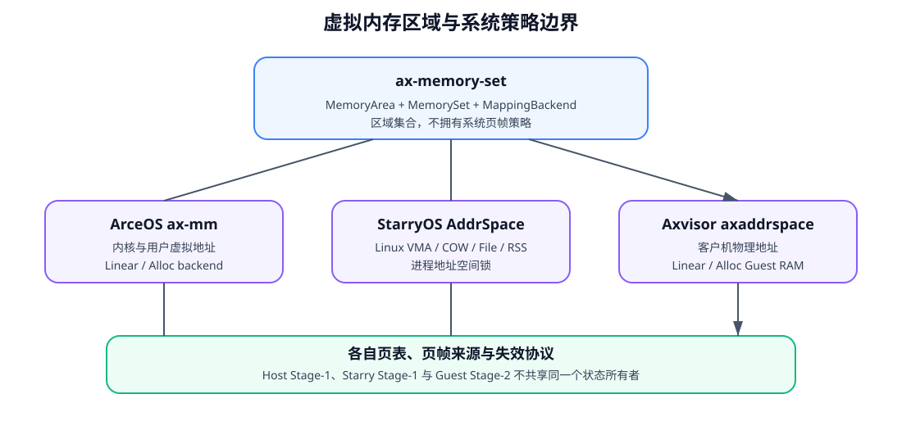

# 虚拟内存区域与地址空间

`ax-memory-set` 提供与操作系统策略无关的 Virtual Memory Area（虚拟内存区域）集合。它保存连续虚拟范围、权限和 backend，不拥有物理页分配器，也不实现 Linux 系统调用级事务。

ArceOS、StarryOS 和 Axvisor 分别在 `ax-mm`、StarryOS kernel 与 `axaddrspace` 中实现自己的物理页、文件映射、写时复制和客户机内存策略。

## 1. 组件边界

`ax-memory-set` 只维护区域集合和 backend 调用协议，三个消费者分别拥有地址类型、页表对象与物理页释放策略。下图把公共容器和系统策略分开，避免把共享 `MemorySet` 误读成统一的操作系统地址空间实现。



图中的向下依赖表示系统策略消费公共区域机制，而不是公共层回调某个固定操作系统。维护映射失败、缺页或销毁路径时，应先确认资源属于 ArceOS、StarryOS 还是 Axvisor，再检查相应 backend 的对称释放行为。

| 组件 | 保存的状态 | 不承担的职责 |
| --- | --- | --- |
| `ax-memory-set` | 有序虚拟内存区域、实际权限、报告权限、backend | 物理页分配、回收、跨核页表刷新、Linux 记账 |
| `ax-mm` | ArceOS 内核页表、线性映射和按需分配映射 | 文件虚拟内存、写时复制、客户机第二阶段策略 |
| StarryOS `AddrSpace` | 进程页表、常驻页统计、commit accounting、Linux 虚拟内存区域策略 | 通用 allocator 和架构页表项编码 |
| `axaddrspace` | 客户机物理地址范围、线性或分配型客户机 RAM backend | Linux 虚拟内存区域、宿主内核 iomap |
| `axcpu::paging` / `axvm` | 所属上下文的页表项、映射、权限修改和失效能力 | 虚拟内存区域策略和物理页回收策略 |

这组边界要求新增消费者通过实现 `MappingBackend` 组合自己的页表和页帧策略，而不是把系统特有的回收、文件或客户机语义加入 `MemorySet`。

## 2. 数据模型

区域数据模型由单个 `MemoryArea<B>` 和有序集合 `MemorySet<B>` 组成。前者维护一个连续区间的权限与 backend，后者负责跨区域查找、重叠判断和拆分；两者都不隐式取得物理页分配器所有权。

### 2.1 区域对象

`MemoryArea<B>` 是区域级不变量的所有者，源码位于 `memory/memory_set/src/area.rs`。它把半开虚拟范围、实际权限、报告权限和可拆分 backend 绑定在一起，使边界变化不会与物理偏移或写时复制报告语义分离。

`MemoryArea<B>` 描述一个半开区间 `[start, end)`：

```rust
pub struct MemoryArea<B: MappingBackend> {
    va_range: AddrRange<B::Addr>,
    flags: B::Flags,
    reported_flags: B::Flags,
    backend: B,
}
```

字段全部保持私有，调用方只能通过构造、拆分和查询方法改变区域状态；这使虚拟范围、实际权限、报告权限和 backend 偏移能够作为一个不变量整体维护。

| 字段 | 含义 |
| --- | --- |
| `va_range` | 连续虚拟地址范围 |
| `flags` | backend 和页表实际使用的权限 |
| `reported_flags` | StarryOS 等上层向用户报告的权限 |
| `backend` | 线性映射、分配映射、写时复制、文件映射等策略 |

实际权限和报告权限分离是为了支持写时复制。父子页表项可以暂时移除写权限，而 `/proc` 和 Linux 虚拟内存语义仍报告原始可写属性。

`split(pos)` 只在 `start < pos < end` 时成功。它同时调用 backend 的 `split(align_diff)`，因此范围元数据和 backend 内部偏移不会分离。

### 2.2 区域集合

`MemorySet<B>` 是地址空间中的有序区域索引，源码位于 `memory/memory_set/src/set.rs`。它用区域起点作为 `BTreeMap` 键，集中实现查找、重叠判断、空洞搜索和跨区域拆分，但把页表与物理页动作委托给 backend。

```rust
pub struct MemorySet<B: MappingBackend> {
    areas: BTreeMap<B::Addr, MemoryArea<B>>,
}
```

键是虚拟内存区域起始地址。核心复杂度如下：

| 操作 | 复杂度 | 说明 |
| --- | --- | --- |
| `find(addr)` | O(log n) | 查找最后一个不大于地址的起点，再检查 containment |
| `overlaps(range)` | O(log n) | 只检查前驱和第一个后继 |
| 插入/删除 | O(log n) | 不移动其他虚拟内存区域 |
| `find_free_area` | O(log n + k) | 从 hint 前驱开始扫描后续 gap |
| 跨区域 unmap/protect | O(k log n) 或 O(n) | k 为受影响区域数量 |

当前实现保留 `BTreeMap`。没有代表性 StarryOS 多虚拟内存区域基准前，不用排序 `Vec` 替换它，也不为了预留树节点引入第二套元数据 allocator。

## 3. 后端能力

`MappingBackend` 定义于 `memory/memory_set/src/backend.rs`，是区域元数据与具体页表策略之间的最小能力边界。它要求每个消费者明确地址类型、权限类型和页表对象，并为 map、unmap、protect 与 split 提供系统专属实现。

```rust
pub trait MappingBackend: Clone {
    type Addr: MemoryAddr;
    type Flags: Copy;
    type PageTable;

    fn map(
        &self,
        start: Self::Addr,
        size: usize,
        flags: Self::Flags,
        page_table: &mut Self::PageTable,
    ) -> bool;

    fn unmap(
        &self,
        start: Self::Addr,
        size: usize,
        page_table: &mut Self::PageTable,
    ) -> bool;

    fn protect(
        &self,
        start: Self::Addr,
        size: usize,
        new_flags: Self::Flags,
        page_table: &mut Self::PageTable,
    ) -> bool;

    fn split(&mut self, align_diff: usize) -> Option<Self>;
}
```

该 trait 是直接页表操作边界，不是事务框架。公共层不定义：

- `MappingOperation`；
- `MapPrecondition`；
- `MappingPlan` 或 `CommitState`；
- `prepare/abort/commit/rollback/finalize`；
- 通用逐页 `SavedMapping`。

这样 ArceOS 和 Axvisor 的普通映射不会因为 Linux 系统调用级回滚语义创建动态数组或扫描整个旧映射。trait 还提供默认的 `shrink_left`/`shrink_right`，按拆分后的偏移收缩 backend。

当前 trait 仍使用 `bool` 表示 backend 成败。公共 `MemorySet` 把 map/unmap/shrink 的失败转换为 `MappingError::BadState`；`protect_area` 当前不检查 backend `protect` 的返回值，直接返回 `Ok(())`，这是保留原接口以控制修改范围的已知限制。需要细分 `NoMemory`、参数错误和页表损坏时，应先证明所有调用方都能稳定处理这些错误，再单独修改接口。

## 4. 映射流程

`MemorySet` 的公开修改接口先验证区间和元数据关系，再调用当前区域的 backend 修改页表。公共层只在 backend 成功后提交相应区域元数据，但跨多个区域的复合操作仍不承诺通用事务语义。

### 4.1 新建映射

`MemorySet::map()` 先拒绝空区间与未授权重叠，再调用 `MemoryArea::map_area()`。如果调用方允许覆盖，已有重叠范围会先被解除，因此新 backend 失败时不能假设旧映射仍然存在。

```text
MemorySet::map(area)
  │
  ├─ 检查空范围
  ├─ 检查与已有区域是否重叠
  │    ├─ 不允许覆盖：返回 AlreadyExists
  │    └─ 允许覆盖：先执行 unmap
  ├─ area.map_area()
  │    └─ backend.map()
  └─ backend 成功后插入 BTreeMap
```

不重叠映射不会构造公共操作计划或撤销日志，单次 map 的失败清理由具体 backend 承担。当前 `ax-mm` 的 allocation backend 在 `populate=true` 时通过 `populate_pages()` 逐页建立映射；页帧申请或页表写入失败时，`rollback_populated_pages()` 删除本次已经安装的前缀页，并连同当前尚未映射的 frame 一并归还。`axaddrspace` 的 allocation backend 尚未实现同等回滚，因此两个消费者不能被概括为相同失败语义。

### 4.2 解除映射

`unmap(start, size)` 会遍历与目标半开区间相交的区域，并根据覆盖关系选择整段删除、边界收缩或中间拆分。backend 操作成功后才提交对应边界变化，但已完成的前序区域不会因后续区域失败而自动恢复。

```text
原区域完全位于目标范围：调用 unmap_area 后删除
目标切除区域尾部：       shrink_right
目标切除区域头部：       shrink_left
目标位于区域中间：       split + shrink_right
```

`shrink_left` 和 `shrink_right` 先调用 backend unmap，成功后才修改该区域的边界和 backend 偏移。

跨多个虚拟内存区域的直接 unmap 不是公共事务。前面区域已经成功解除后，后续 backend 失败不会由 `ax-memory-set` 建立逐页日志恢复。调用方不得把低层直接接口描述为全成或回滚。

### 4.3 权限修改

`protect_with_reported_flags` 遍历相交区域，并按需要把一个区域拆成左、中、右三部分。中间部分调用 backend `protect`，随后更新实际权限和报告权限。

StarryOS 写时复制 backend 可以把页表实际写权限清除，同时保留对用户报告的可写权限。

### 4.4 metadata-only 操作

当策略层已经移动、复制或分离页表项时，再调用普通 map/unmap 会重复触碰物理资源。`unmap_metadata()` 与 `replace_area_metadata()` 只调整区域描述，专门服务这种已经由上层完成页表状态转换的路径。

| API | 用途 |
| --- | --- |
| `unmap_metadata` | 页表项已移动或分离后只删除区域描述 |
| `replace_area_metadata` | 在已有区域内部替换一段描述而不修改页表 |

`MemorySet` 当前只有这两个 metadata-only 入口；发布新区域仍走常规 `map`（含 backend 页表操作）。StarryOS 的 fork 先由 backend `clone_map()` 把页表项写入 child 页表，再用 `map`（不允许覆盖）发布区域描述；mremap 等路径用 `replace_area_metadata`/`unmap_metadata` 调整已有描述。

StarryOS fork 的写时复制流程先由 backend `clone_map()` 建立 child 页表项、引用计数和常驻页统计，再用常规 `map`（不允许覆盖）发布区域元数据。如果元数据发布失败，整个新建的 child `AddrSpace` 被丢弃，其 Drop/`clear()` 撤销已建立的 child 页表项、引用计数与记账；公共组件不重复保存同一份撤销状态。

## 5. 覆盖映射和原子性边界

当前 `MemorySet` 没有独立的 `replace()` API。覆盖行为由 `map(area, page_table, unmap_overlap)` 的第三个参数控制；当该参数为 `true` 时，公共层先解除相交范围，再尝试安装新区域。

```text
if overlaps && unmap_overlap
  -> unmap overlapping range
  -> map the new area's backend
  -> insert the new area metadata
```

这段调用顺序对应 `MemorySet::map()` 的实际控制流。新 backend 失败时，已经解除的旧范围不会由公共层自动恢复，因此启用覆盖只适合具有明确恢复策略或允许重建映射的上层路径。

- 上层已经保存专用恢复信息；
- 失败后允许调用方重建映射；
- 不要求 Linux 系统调用原子性的内部路径。

这些条件是覆盖映射的使用边界，而不是三个任选其一即可忽略失败状态的豁免。Linux `MAP_FIXED`、mremap 等用户可见操作仍需在 StarryOS syscall 和 `AddrSpace` 层完成预检与专用恢复。

StarryOS 的 `AddrSpace` 在调用低层操作前负责地址范围、`RLIMIT_AS`、commit delta、文件映射状态和页表移动预检。写时复制 clone 和 mremap 分别维护自己的有限回滚记录，不把通用逐页快照施加给所有地址空间消费者。

普通跨区域 unmap/protect 当前不承诺 all-or-nothing。这一限制必须保留在设计、测试和错误报告中，不能仅通过文档声称已经具备事务保证。

## 6. 12 GiB 映射示例

大范围映射的关键成本来自实际页表层级与叶子项数量，而不是 `MemorySet` 元数据。下面的计算说明当前公共区域层只保存一个 `MemoryArea`，不会按 4 KiB 基础页生成通用撤销数组。

12 GiB 范围包含：

```text
12 GiB / 4 KiB = 3,145,728 个基础页
```

旧五阶段实现曾在 prepare 阶段为每个页表项保存 `SavedMapping`，即使操作只需要建立线性映射，也可能先消耗数十至上百 MiB 临时堆。

当前直接实现：

```text
MemoryArea 元数据：1 项
通用操作计划：    0 项
通用页表快照：    0 项
backend 额外状态：常数
页表建立时间：    由实际页表映射粒度决定
```

大范围映射不再因为通用事务快照在真正写页表前返回 `NoMemory`。如果架构和 backend 支持大页，页表层可以选择大页；`ax-memory-set` 不展开或复制页表项。

## 7. 三类消费者

三个主要消费者复用相同区域容器，但各自实现不同的页帧来源、页表类型和失败清理。理解这些差异是判断某个 backend 修改是否能够复用到其他系统的前提。

### 7.1 ArceOS ax-mm

`os/arceos/modules/axmm/src/backend/` 提供线性与分配型两类 backend；其中分配型 eager populate 已为当前操作实现前缀回滚，懒分配则在缺页时补充单页。

- `Linear`：虚拟地址按固定差值换算为物理地址；
- `Alloc`：立即填充或缺页时分配物理页。

这两个 backend 的 backing ownership 不同：`Linear` 只删除页表项，`Alloc` 才按 `UsageKind::VirtMem` 归还自己取得的 frame。

页帧使用 `global_allocator().alloc_pages(..., UsageKind::VirtMem)`。释放时传回原页数和用途；DMA32 这类低地址选择不参与普通虚拟内存页释放路由。

### 7.2 StarryOS

`os/StarryOS/kernel/src/mm/aspace/` 保留 Linux 专属状态。`VmaMap` 是 VMA metadata 的 publication owner，`PageObject`/`FrameLease`/`MappingSlot`/`RmapSet` 共同表达 resident ownership，`MutationReceipt` 把页表变化、统计 generation 与 TLB retirement 关联起来。

- 写时复制；
- anonymous、file、shared mapping；
- 常驻内存集大小和虚拟内存大小；
- commit accounting；
- mremap、fork 和缺页恢复；
- signal/errno 转换。

这些状态依赖 Linux ABI、进程 MM 生命周期和 active CPU 集合，不能下沉为所有 `MemorySet` 消费者都必须承担的字段。

StarryOS 不再把通用 `MemorySet` 的直接 backend 调用当作 VMA 事实源。syscall 先准备 immutable VMA successor、PTE/slot preimage 与资源 reservation，再由 `AddrSpace` 的 mutation protocol 发布 root、mapping graph、resident delta 和 epoch。当前 RSS 从 published slot 派生，历史峰值由 `ResidentWatermark` 保存。

### 7.3 Axvisor axaddrspace

`virtualization/axaddrspace/src/address_space/backend/` 使用 `GuestPhysAddr` 和 `NestedPageTableOps`。Linear backend 映射外部客户机 RAM，Alloc backend 按需取得宿主页帧。

客户机生命周期、第二阶段页表失效和设备 DMA 停止顺序由 AxVM 管理，不进入 `ax-memory-set`。

## 8. 锁与并发

`MemorySet` 本身不提供内部同步，直接使用它的 ArceOS/Axvisor 调用方必须在 map、unmap、protect 或 clear 前取得唯一修改权。Starry 使用自己的 VMA publication 与 receipt protocol，生命周期 capability 和 mutation lock 也不是同一个对象。

| 消费者 | 外层同步 |
| --- | --- |
| ArceOS kernel address space | `kernel_aspace()` 外层锁 |
| StarryOS process address space | `MmHandle`/`MmPin`/`ActivationLease`；内部 `Mutex<AddrSpace>` + `MutationGate` + PTE stripe |
| Axvisor guest address space | VM/地址空间所有者的外层锁 |

外层锁只串行化软件状态；页表项对其他 CPU 或虚拟处理器的可见性仍需由 Stage-1 或 Stage-2 失效协议完成。

锁内可能执行 bounded 页表操作和已预留资源的 publication，因此不能从硬中断上下文调用。Starry 在进入文件 I/O、`.await`、未知 callback 或 user-copy 前必须释放 VMA publication、PTE stripe、rmap 和 page-cache index lock，并在返回后重检 identity。

跨 CPU Translation Lookaside Buffer（地址转换后备缓冲区）失效由页表和操作系统层协调，不由 `MemorySet` 发起。AArch64 硬件广播和其他架构的处理器间中断路径见[多架构内存实现](./architecture-support.md)。

## 9. 源码索引

修改区域容器、系统 backend 或页表接线时，应从下列文件按“公共机制、系统策略、页表所有者”的顺序审计。表中的目录都是当前实现入口，不包含已经删除的事务计划类型。

| 文件 | 内容 |
| --- | --- |
| `memory/memory_set/src/area.rs` | 虚拟内存区域、权限和 split/shrink/grow |
| `memory/memory_set/src/set.rs` | `BTreeMap` 索引和 map/unmap/protect |
| `memory/memory_set/src/backend.rs` | 直接 backend 能力边界 |
| `os/arceos/modules/axmm/src/backend/` | ArceOS Linear/Alloc backend |
| `os/StarryOS/kernel/src/mm/aspace/` | StarryOS Linux 虚拟内存策略和专用恢复 |
| `virtualization/axaddrspace/src/address_space/` | 客户机地址空间策略 |

相关测试需要同时覆盖 `memory_set` 的区域操作和具体 backend 的资源回滚；只运行公共容器测试无法证明系统页帧已经对称释放。

相关测试命令见[内存管理测试](./testing.md)。
