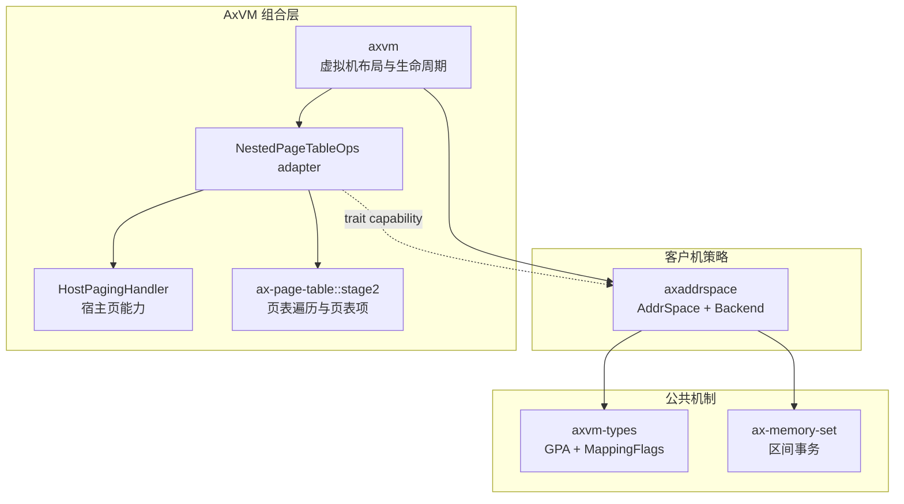
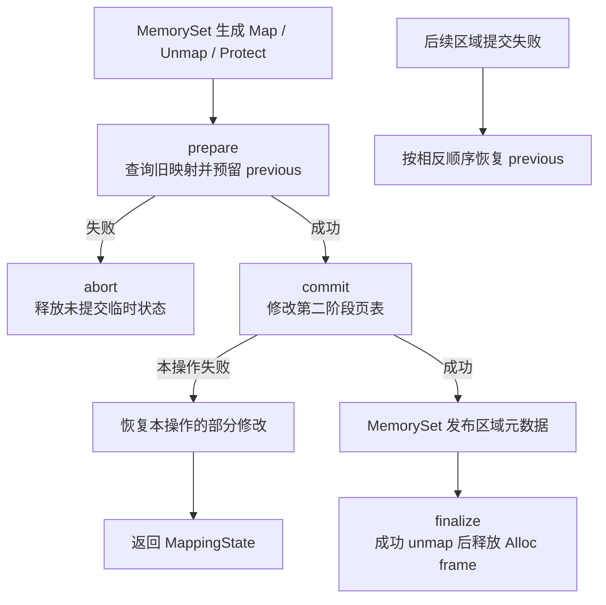
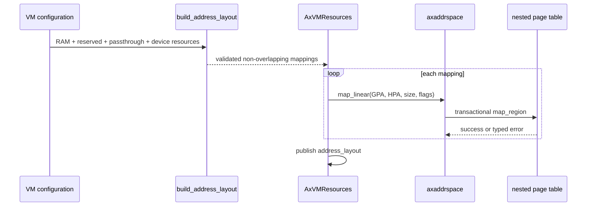

# Axvisor 客户机地址空间设计与实现

`virtualization/axaddrspace` 管理 Guest Physical Address（客户机物理地址，GPA）范围、客户机 RAM 后备页策略和第二阶段地址映射事务。它位于通用虚拟内存区域事务与具体架构嵌套页表之间，不管理客户机进程虚拟地址，也不替代宿主 ArceOS 的第一阶段地址空间。

## 1. 组件边界

`axaddrspace` 是 Axvisor 的客户机内存策略层。通用区间事务由 `ax-memory-set` 提供，具体页表项格式与遍历由 `ax-page-table::stage2` 提供，宿主页来源与架构适配由 `axvm` 注入。

### 1.1 职责划分

本组件只维护客户机地址空间特有的不变量，不把宿主分配器、架构寄存器或设备生命周期纳入自身状态。

| 能力 | 负责组件 | `axaddrspace` 的边界 |
| --- | --- | --- |
| GPA 类型与映射权限 | `axvm-types` | 直接复用，不重复定义地址类型或 flags |
| 地址区间集合与事务 | `ax-memory-set` | 以 `Backend<Npt>` 实现 `MappingBackend` |
| 客户机 RAM 策略 | `axaddrspace` | 区分外部线性内存与自身分配后备页 |
| 第二阶段页表机制 | `ax-page-table::stage2` | 仅通过 `NestedPageTableOps` 使用 |
| 宿主页分配与地址转换 | `axvm::HostPagingHandler` | 由页表适配器注入，不直接依赖 `ax-alloc` |
| 虚拟机布局与生命周期 | `axvm` | 创建、加锁、装载、停止虚拟处理器并销毁资源 |
| 架构页表根寄存器 | 各架构虚拟处理器实现 | `axaddrspace` 只公开根物理地址和层数 |

`axaddrspace` 的生产依赖中没有 `ax-page-table`。该 crate 只在开发依赖中启用 `stage2`，用于组件测试；生产构建由 `axvm` 同时组合两者。

### 1.2 依赖方向

依赖从虚拟机策略指向公共机制，页表和物理页能力通过 trait 注入。该方向使地址空间可使用测试页表，也避免公共页表反向绑定 ArceOS 分配器。



运行时真实链路是 `AxVM → AddrSpace<ArchNestedPageTable> → NestedPageTableOps → ax-page-table::stage2`。`axaddrspace` 不应增加只转发这些调用的页表 facade，也不应直接调用 `ax-alloc` 形成第二个宿主页入口。

## 2. 地址与状态模型

客户机执行一次内存访问时可能经过三种地址域。文档和源码必须区分地址语义，不能因为底层均以 `usize` 保存就混用。

### 2.1 三种地址域

Guest Virtual Address（客户机虚拟地址，GVA）由客户机自身第一阶段页表翻译；`axaddrspace` 从 GPA 开始工作，并把它翻译为 Host Physical Address（宿主机物理地址，HPA）。宿主软件访问内容时，再由平台直接映射把 HPA 转成 Host Virtual Address（宿主机虚拟地址，HVA）。

```text
客户机进程访问
    GVA
     │ 客户机第一阶段页表：由客户机操作系统维护
     ▼
    GPA
     │ axaddrspace + 宿主第二阶段页表
     ▼
    HPA
     │ HostPagingHandler::phys_to_virt
     ▼
    HVA
```

`AddrSpace` 的查询、映射和缺页接口全部接收 `GuestPhysAddr`。客户机内部的 GVA、Linux 虚拟内存区域和客户机页缓存均不属于该组件。

### 2.2 地址空间对象

`virtualization/axaddrspace/src/address_space/mod.rs` 中的核心对象只保存允许的 GPA 总范围、已登记区域和一个嵌套页表实例。

```rust
pub struct AddrSpace<Npt: NestedPageTableOps> {
    va_range: GuestPhysAddrRange,
    areas: MemorySet<Backend<Npt>>,
    pt: Npt,
}
```

字段名 `va_range` 沿用地址空间容器的历史命名，但其实际类型是 `GuestPhysAddrRange`。这不是客户机虚拟地址范围，单纯更名不会改变接口语义，当前没有必要为此扩大代码改动。

| 字段 | 所有权 | 不变量 |
| --- | --- | --- |
| `va_range` | `AddrSpace` | 所有公开 map/unmap 请求必须完全落在半开区间内 |
| `areas` | `AddrSpace` | 区域不重叠；元数据与第二阶段页表事务一致 |
| `pt` | `AddrSpace` | 页表根、子页表页和查询能力由具体 `Npt` 管理 |

`new_empty(page_table, base, size)` 使用 checked addition 验证总范围。它接收已经构造完成的页表，而不是只接收层数后在内部选择架构实现。

### 2.3 公共操作

公开操作围绕 GPA 区间组织。当前没有对外公开 `protect`；权限修改能力只存在于通用 backend 协议中，不能在文档中把它写成 `AddrSpace` 已提供的公共入口。

| 操作 | 输入 | 结果 |
| --- | --- | --- |
| `map_linear` | GPA、已知 HPA、长度、权限 | 建立固定偏移的第二阶段映射 |
| `map_alloc` | GPA、长度、权限、是否立即填充 | 建立由 adapter 分配宿主页的区域 |
| `unmap` | GPA 与长度 | 事务化移除相交区域和页表项 |
| `clear` | 无 | 清空全部区域；用于重置和销毁 |
| `handle_page_fault` | fault GPA 与访问权限 | 为懒分配区域补一个基础页 |
| `translate` | GPA | 查询 HPA，不建立新映射 |
| `translated_byte_buffer` | GPA 与长度 | 将同一区域内的范围切成宿主可访问片段 |
| `page_table_root` / `page_table_levels` | 无 | 向虚拟处理器配置层提供页表信息 |

`map_linear`、`map_alloc` 和 `unmap` 要求 GPA、HPA 和长度满足 4 KiB 对齐。范围越界、地址算术溢出、对齐错误和映射冲突均返回可匹配的 `AddrSpaceError`。

## 3. 后端与内存所有权

`Backend<Npt>` 只有 `Linear` 和 `Alloc` 两种。两者使用相同区间事务，但后备内存的 owner 和解除映射后的动作完全不同。

### 3.1 线性映射

`Linear` 保存 `GPA - HPA` 的有符号差值。使用 `i128` 可以同时表示 HPA 低于 GPA 和 HPA 高于 GPA 的情况，实际换算仍通过 checked subtraction 与 `usize::try_from` 拒绝越界。

```rust
pub enum Backend<Npt: NestedPageTableOps> {
    Linear {
        pa_to_va_delta: i128,
    },
    Alloc {
        populate: bool,
        _phantom: core::marker::PhantomData<Npt>,
    },
}
```

线性映射的 HPA 由调用方拥有。`unmap_linear()` 只删除页表项，不调用 `dealloc_frame()`；虚拟机销毁时，外层 `VMMemoryRegion` 或平台保留内存 owner 决定是否释放实际内存。

`map_linear()` 把 `allow_huge` 设为 `true`，因此连续、对齐且属性一致的范围可由第二阶段页表核心选择大页。具体页尺寸选择和架构页表项编码由[统一页表核心](./page-table.md)维护。

### 3.2 分配型映射

`Alloc { populate }` 通过 `NestedPageTableOps::alloc_frame()` 获取宿主基础页。`populate = true` 在 map 提交时逐页分配并映射；`populate = false` 只发布区域元数据，首次客户机访问再由缺页路径分配。

```rust
let area = MemoryArea::new(start, size, flags, Backend::new_alloc(populate));
self.areas.map(area, &mut self.pt, false)?;
```

立即填充路径若在第 N 页分配或映射失败，会解除此前已经建立的前缀并归还对应 frame。懒分配路径若 `remap()` 失败，会立即归还刚取得的 frame，不留下无人拥有的宿主页。

当前 AxVM 的生产内存布局先由宿主分配 `VMMemoryRegion`，再使用 `map_linear()` 建立客户机映射；仓库内 `map_alloc()` 的直接调用目前集中在 `axaddrspace` 测试。`Alloc` 是已实现的组件能力，但不能据此宣称现有 AxVM 默认使用按需 Guest RAM。

### 3.3 所有权转移

解除映射与释放内存必须分开判断。只有 `Alloc` 获得的 frame 才由 backend 在完整事务成功后释放。

| 资源 | 创建者 | 映射期间 owner | 解除映射或销毁 |
| --- | --- | --- | --- |
| Linear 后备 RAM | AxVM、平台或外部调用方 | 外部 owner | 仅删除页表项，外部 owner 释放 |
| Alloc 后备页 | `NestedPageTableOps::alloc_frame` | `Backend::Alloc` | 事务 `finalize` 调用 `dealloc_frame` |
| 第二阶段根和子页表页 | 具体 `Npt` | 嵌套页表对象 | `Npt` 析构时由同一 frame provider 释放 |
| 地址区域元数据 | `MemorySet` | `AddrSpace` | unmap/clear 事务发布新元数据后删除 |
| 设备模拟缓冲区 | 设备模型或 DMA owner | 对应设备对象 | 不由 Guest RAM backend 隐式释放 |

分配型 unmap 在清除单个页表项时不会立即释放 frame。旧映射被保存在事务状态中，只有全部区域成功提交后，`finalize()` 才归还物理页；失败回滚仍可重新安装原映射。

## 4. 映射事务与缺页

`axaddrspace::Backend<Npt>` 实现 `ax_memory_set::MappingBackend`。区间拆分、操作排序和元数据发布由 `MemorySet` 统一完成，本章只说明客户机后端保存的恢复信息和物理页释放规则；通用协议见[虚拟内存区域与页表事务](./address-space.md)。

### 4.1 事务状态

`virtualization/axaddrspace/src/address_space/backend/mod.rs` 按页表查询返回的实际页尺寸保存旧映射。大页映射只保存一个大页记录，不会无条件展开成 4 KiB 项。

```rust
#[derive(Clone, Copy)]
struct SavedMapping {
    vaddr: GuestPhysAddr,
    paddr: PhysAddr,
    flags: MappingFlags,
    page_size: PageSize,
}

pub struct BackendTransaction {
    operation: MappingOperation<GuestPhysAddr, MappingFlags>,
    previous: Vec<SavedMapping>,
}
```

`prepare()` 从操作起点遍历到终点：已映射范围按查询到的 `PageSize` 前进并记录；未映射范围按 4 KiB 前进但不写入 `previous`。若操作边界切入现有大页中部，或查询到的映射超过操作终点，则返回 `MappingState`，避免误删整个大页。

### 4.2 提交与恢复

客户机后端遵循 prepare、commit、rollback、finalize 四阶段。图中“释放旧 frame”只适用于 `Alloc` 的成功 unmap。



Map 使用 `MapPrecondition::Vacant` 时，`prepare()` 发现任一旧映射即返回 `AlreadyMapped`。Linear unmap 要求目标范围没有空洞；Alloc unmap 允许懒分配区域中存在尚未填充的页，但会拒绝在按基础页释放的路径中遇到大页。

大范围空闲 Map 的 `previous` 保持为空，因此临时内存不随 4 KiB 页数增长；当前 `prepare()` 仍会按 4 KiB 查询整个空范围，时间复杂度仍与基础页数相关。不能把“消除逐页快照内存”误写为“prepare 已是常数时间”。

### 4.3 懒分配缺页

`AddrSpace::handle_page_fault()` 先验证 fault GPA 位于总范围和某个已登记区域内，再检查原区域权限是否包含本次访问。只有 `Alloc { populate: false }` 会尝试补页。

```rust
let Some(frame) = pt.alloc_frame() else {
    return false;
};
if pt.remap(vaddr, frame, orig_flags) {
    true
} else {
    pt.dealloc_frame(frame);
    false
}
```

缺页路径一次只处理一个 4 KiB 页，不执行回收、阻塞或内部重试。宿主分配失败直接返回 `false`，上层虚拟处理器异常处理决定如何终止、注入异常或采取其他策略。

## 5. 第二阶段页表适配

`NestedPageTableOps` 是 `axaddrspace` 与具体架构之间的最小能力边界。它同时提供页表操作和 allocation-backed Guest RAM 所需的宿主页能力，但不暴露具体页表项类型。

### 5.1 能力接口

`virtualization/axaddrspace/src/paging.rs` 定义的接口可分为页表身份、frame provider、单项操作和范围操作四组。

| 方法组 | 方法 | 用途 |
| --- | --- | --- |
| 页表身份 | `root_paddr()`、`levels()` | 创建虚拟处理器硬件配置 |
| 宿主页能力 | `alloc_frame()`、`dealloc_frame()`、`phys_to_virt()` | Alloc 后备页与宿主访问 |
| 单项操作 | `map()`、`unmap()`、`remap()`、`query()` | 缺页、恢复和地址翻译 |
| 范围操作 | `map_region()`、`unmap_region()`、`protect_region()` | Linear 映射与事务提交 |

`PageSize` 当前表达 4 KiB、1 MiB、2 MiB 和 1 GiB。adapter 根据页表查询得到的层级和大页位转换尺寸，backend 回滚时使用实际尺寸，不自行推断架构几何。

### 5.2 通用适配器

`virtualization/axvm/src/npt.rs` 用 `GenericFrameAllocator<H>` 把 `HostPagingHandler` 接到 `ax_page_table::stage2::PageFrameProvider`，再由 `LeveledPageTable` 实现 `NestedPageTableOps`。

```text
HostPagingHandler
    │ alloc_frame / dealloc_frame / phys_to_virt
    ▼
GenericFrameAllocator<H>
    │ PageFrameProvider
    ▼
ax_page_table::stage2::PageTable
    │ map / unmap / query / protect
    ▼
LeveledPageTable
    │ NestedPageTableOps
    ▼
axaddrspace::AddrSpace
```

`HostPagingHandler` 最终调用 AxVM 私有 ArceOS host adapter 的 `HostMemory` 能力。`axaddrspace` 因此只知道“可申请一个宿主页”，不知道 Buddy section、内存 zone 或 `GlobalPage` 的具体表示。

### 5.3 架构差异

所有架构向 `AddrSpace` 暴露同一 `NestedPageTableOps`，差异留在 `axvm/src/arch/<arch>/npt.rs` 或 x86 嵌套分页运行时中。

| 架构 | AxVM 具体类型 | 本层可见差异 |
| --- | --- | --- |
| AArch64 | `LeveledPageTable<A64HVPagingMetaDataL3, A64HVPagingMetaDataL4, HostPagingHandler, true>` | 支持三层或四层，使用第二阶段页表项与对应失效操作 |
| RISC-V | `LeveledPageTable<Sv39x4MetaData, Sv48x4MetaData, HostPagingHandler, true>` | 支持 Sv39x4 或 Sv48x4 几何 |
| LoongArch64 | `LeveledPageTable<LoongArchPagingMetaDataL3, LoongArchPagingMetaDataL4, HostPagingHandler, true>` | 支持三层或四层架构元数据 |
| x86_64 | 运行时选择 Extended Page Table（扩展页表，EPT）或 Nested Page Table（嵌套页表，NPT） | CPU backend 初始化后固定页表项编码，当前使用四层表 |

页表项位定义、页表根寄存器和 Translation Lookaside Buffer（地址转换后备缓冲区，TLB）失效指令由[多架构内存实现](./architecture-support.md)唯一维护。本组件只要求 adapter 在返回成功前完成页表核心规定的失效协议。

## 6. AxVM 集成流程

`axvm` 持有 `AddrSpace<ArchNestedPageTable>`，并把地址空间放入虚拟机生命周期资源。创建、布局发布、客户机访问和销毁都经过该 owner，普通虚拟设备不直接取得可变页表引用。

### 6.1 创建地址空间

`AxVMResources::from_page_table()` 使用架构层已创建的页表构造地址空间，当前 GPA 总范围是 `[0, 0x7fff_ffff_f000)`。随后读取页表根并构造架构硬件配置。

```rust
let address_space = AddrSpace::new_empty(
    page_table,
    GuestPhysAddr::from(VM_ASPACE_BASE),
    VM_ASPACE_SIZE,
)?;
let nested_paging = build_nested_paging(address_space.page_table_root())?;
```

页表层数和可寻址 GPA 位数由架构 `NestedPagingConfig` 约束。总范围只是软件容器上限，不能绕过架构实际地址宽度校验。

### 6.2 发布客户机布局

`virtualization/axvm/src/vm/prepare/address_space.rs` 先由 `build_address_layout()` 合并客户机 RAM、启动描述、保留区、直通范围和模拟设备资源，再逐项调用 `map_linear()`。



当前生产布局使用 Linear 的原因是宿主侧 `VMMemoryRegion` 已持有连续 HVA/HPA 和 `Layout`，映射层不能再次取得同一内存的所有权。若未来生产路径使用 `map_alloc()`，必须同时定义如何向装载器、设备和销毁流程暴露非连续后备页，不能只替换一个调用。

### 6.3 客户机内存访问

AxVM 的 `read_from_guest()`、`write_to_guest()` 和镜像装载路径在持有虚拟机资源锁的闭包内调用 `translated_byte_buffer()`。该方法逐次查询第二阶段页表，将一个区域内的访问切成不跨页表映射边界的宿主 slice。

`translated_byte_buffer()` 不允许访问跨越两个 `MemoryArea`，即使两个区域地址相邻；范围终点超过当前区域就返回 `None`。它也不会为懒分配区域自动触发缺页，未建立页表项时查询失败。

crate 还导出 `GuestMemoryAccessor`，为实现者提供对象和跨翻译区间的 buffer 读写默认方法。当前生产 AxVM 没有为 `AddrSpace` 实现该 trait，而是直接使用上述分片接口，因此两条能力不能混写成同一调用链。

### 6.4 销毁顺序

虚拟机销毁先停止并等待虚拟处理器任务，再清除地址空间，最后释放外部 `VMMemoryRegion` 和设备对象。该顺序防止硬件继续使用已经解除映射或归还分配器的内存。

```text
AxVM::destroy
  -> stop_and_join_runtime
  -> cleanup_resource_set
     -> address_space.clear()
        -> remove Stage-2 entries
        -> finalize Alloc-owned frames
     -> dealloc VMMemoryRegion with needs_dealloc = true
     -> drop devices / vCPU list / interrupt fabric
  -> drop nested page table
```

`AddrSpace::drop()` 也会调用 `clear()` 作为最后防线，并记录清理失败；正常生命周期仍应显式 `clear()` 并处理错误，不能依赖 Drop 吞掉一致性故障。

## 7. 锁、并发与安全边界

`AddrSpace`、`MemorySet` 和具体页表都不为单个实例内置全局锁。可变操作要求 `&mut self`，生产环境由 AxVM 的虚拟机资源 owner 提供串行化。

### 7.1 外层锁

`virtualization/axvm/src/vm/mod.rs` 将 `ax_kspin::SpinNoIrq` 别名为 `Mutex`，并以 `Mutex<Machine<AxVMResources, Arc<VmRuntimeHandle>>>` 保护地址空间和生命周期状态。

```rust
fn with_resources_mut<F, R>(&self, f: F) -> AxVmResult<R>
where
    F: FnOnce(&mut AxVMResources) -> AxVmResult<R>,
{
    let mut machine = self.machine.lock();
    let resources = machine
        .resources_mut()
        .ok_or_else(|| ax_err_type!(BadState, "VM resources are not available"))?;
    f(resources)
}
```

`map_region()`、`unmap_region()`、缺页处理和客户机内存读写均通过 `with_resources()` 或 `with_resources_mut()` 执行。事务从 prepare 到 finalize 期间锁不会释放，另一个虚拟处理器或设备处理路径不能并发修改同一页表。

### 7.2 禁止中断临界区

`SpinNoIrq` 表示地址空间操作期间本 CPU 中断关闭。页表遍历、事务快照预留和宿主页分配都可能发生在该临界区，因此它保证一致性但不保证硬实时延迟。

| 路径 | 临界区内可能发生的工作 | 约束 |
| --- | --- | --- |
| Linear map | 区间查询、页表页分配、大范围页表建立 | 不执行文件系统或回收 callback |
| Alloc populate | 每个 4 KiB 页分配和映射 | 不用于硬实时路径；失败立即回滚 |
| Alloc fault | 一个 frame 分配与 remap | 不阻塞、不内部重试 |
| unmap/clear | 保存旧映射、失效翻译、延后释放 | 虚拟处理器必须已停止或与更新同步 |
| guest buffer access | 查询页表并复制数据 | slice 不得逃逸出锁保护的闭包 |

完整锁顺序和禁止组合只在[内存管理锁与并发](./concurrency.md)维护。该组件不得在持有分配器内部锁时反向获取虚拟机 `machine` 锁。

### 7.3 不安全内存访问

`translated_byte_buffer()` 使用 `phys_to_virt()` 得到的地址构造 `&'static mut [u8]`。`GuestMemoryAccessor` 默认方法还使用裸指针进行 volatile 或 non-overlapping copy。这些操作的安全性依赖 adapter 和调用方共同满足以下条件。

| 前置条件 | 维护者 |
| --- | --- |
| HPA 对应有效且当前可访问的宿主直接映射 | `HostPagingHandler::phys_to_virt` 实现 |
| slice 覆盖范围没有越过实际页表映射 | `query()` 返回的页尺寸与范围切分逻辑 |
| 同一物理内存不存在并发可变 Rust 引用 | AxVM 外层锁和调用方生命周期 |
| 返回 slice 不在解除映射、清理或释放后继续使用 | 调用方必须在锁闭包内立即消费 |
| 设备或虚拟处理器不会在缺少协议时并发修改内容 | 虚拟机生命周期和设备队列协议 |

`'static` 是当前接口表达宿主直接映射的方法，不表示数据真的可脱离虚拟机生命周期永久保存。任何把这些 slice 缓存到 `AxVMResources` 之外的实现都会破坏清理顺序和别名约束。

`GuestMemoryAccessor` 的默认实现会把 `translate_and_get_limit()` 返回的 `PhysAddr` 数值直接转换为裸指针，而不会再调用 `phys_to_virt()`。因此实现该 trait 的 translator 当前必须返回可被宿主直接解引用的地址表示；仓库测试通过 mock 转换满足这一前提，生产 AxVM 没有使用该 trait。不能把普通 HPA 原样返回给默认方法，除非平台明确保证物理地址与可解引用虚拟地址恒等。

`AddrSpace::translate_and_get_limit()` 当前返回整个 `MemoryArea::size()`，而不是从任意输入 GPA 到区域末尾的剩余长度；同时 `AddrSpace` 并未实现 `GuestMemoryAccessor`。在修正该语义前，不能把该方法直接接到以“剩余可访问字节数”为契约的通用 accessor。

## 8. 映射实例

下面的实例只展示 `axaddrspace` 自身可观察的状态，不重复页表核心内部逐级建表算法。地址均采用半开区间，权限用 `R`、`W`、`X` 表示读、写、执行。

### 8.1 线性客户机 RAM

假设 AxVM 已分配 128 MiB 宿主连续内存 `HPA [0x4800_0000, 0x5000_0000)`，客户机希望把它作为 `GPA [0x8000_0000, 0x8800_0000)` 的可读写 RAM。

```rust
address_space.map_linear(
    GuestPhysAddr::from_usize(0x8000_0000),
    PhysAddr::from_usize(0x4800_0000),
    0x0800_0000,
    MappingFlags::READ | MappingFlags::WRITE,
)?;
```

此时 `pa_to_va_delta = 0x3800_0000`。查询 `GPA 0x8123_4000` 得到 `HPA 0x4923_4000`；若 GPA、HPA 和长度满足具体架构的大页条件，页表核心可用较大 block 减少页表项与 TLB 压力。

```text
GPA 0x8000_0000                                   0x8800_0000
    +---------------------------------------------------+
    |                 Guest RAM 128 MiB                 |
    +---------------------------------------------------+
                         │ fixed signed delta
                         ▼
HPA 0x4800_0000                                   0x5000_0000
    +---------------------------------------------------+
    |        VMMemoryRegion owned by outer AxVM         |
    +---------------------------------------------------+
```

解除该映射只删除第二阶段页表项。之后 AxVM 根据 `VMMemoryRegion::needs_dealloc` 和原 `Layout` 释放 HVA/HPA 后备内存。

### 8.2 懒分配区域

假设组件调用方建立 `GPA [0x4000_0000, 0x4000_4000)` 的 16 KiB 懒分配区。map 成功后 `MemorySet` 有一个区域，但第二阶段页表暂时没有四个基础页映射。

```text
map_alloc(populate = false)
    area metadata: [0x4000_0000, 0x4000_4000) R|W
    page table:     unmapped, unmapped, unmapped, unmapped

guest writes GPA 0x4000_1234
    -> permission check succeeds
    -> alloc_frame()
    -> align/remap GPA page 0x4000_1000
    -> page table: unmapped, mapped, unmapped, unmapped
```

随后 `unmap(0x4000_0000, 0x4000)` 允许三个页仍未映射，只保存并移除实际存在的第二个页；事务全部成功后仅释放该 frame。

### 8.3 大页回滚

假设 Linear 区域 `[0, 128 MiB)` 已由 64 个 2 MiB block 映射。`prepare()` 每次 `query()` 得到 `PageSize::Size2M`，因此 `previous` 只保存 64 项。

若操作范围从 `0x1000` 开始，它落在首个 2 MiB block 中部。当前 backend 返回 `MappingState`，不会删除整个 block，也不会静默把它拆成 512 个基础页。局部修改需要页表层先提供可回滚的大页拆分能力。

## 9. 源码定位与修改边界

`axaddrspace` 的实现文件较少，但修改任一 trait 或所有权规则都必须同时检查 AxVM adapter、虚拟机生命周期和通用 `MemorySet` 协议。

### 9.1 源码入口

以下文件构成从公共 API 到生产第二阶段页表的完整路径。

| 源码 | 维护内容 |
| --- | --- |
| `virtualization/axaddrspace/src/address_space/mod.rs` | `AddrSpace` 状态、范围验证、公共 map/unmap/fault/query |
| `virtualization/axaddrspace/src/address_space/backend/mod.rs` | 事务状态、prepare/commit/rollback/finalize |
| `virtualization/axaddrspace/src/address_space/backend/linear.rs` | 固定偏移换算与 Linear 范围操作 |
| `virtualization/axaddrspace/src/address_space/backend/alloc.rs` | eager/lazy frame 分配、缺页和失败清理 |
| `virtualization/axaddrspace/src/paging.rs` | `NestedPageTableOps` 与 `PageSize` |
| `virtualization/axaddrspace/src/memory_accessor.rs` | 客户机对象和 buffer 访问 capability |
| `virtualization/axaddrspace/src/error.rs` | 类型化范围、映射和访问错误 |
| `virtualization/axvm/src/npt.rs` | 通用 Stage-2 adapter 与 frame provider 桥接 |
| `virtualization/axvm/src/arch/*/npt.rs` | 架构页表项元数据和失效实现 |
| `virtualization/axvm/src/vm/prepare/address_space.rs` | 生产客户机布局到 Linear 映射的接线 |
| `virtualization/axvm/src/vm/mod.rs` | 外层锁、内存访问和销毁顺序 |

确定性事务、巨大 Linear 映射、frame 释放和各架构构建的验证矩阵统一放在[内存管理测试与验收](./testing.md)，本章不复制测试命令和用例表。

### 9.2 明确不负责的能力

下列能力不应塞入 `axaddrspace`，否则会把客户机策略、宿主机制和设备生命周期重新耦合。

| 非职责 | 正确位置 |
| --- | --- |
| 客户机 GVA、进程虚拟内存区域、写时复制和文件映射 | 客户机操作系统自身 |
| 宿主内核第一阶段地址空间 | ArceOS `ax-mm` |
| 页表项编码、页表遍历和 TLB 指令 | `ax-page-table::stage2` 与 AxVM 架构 adapter |
| Buddy、Slab、内存 zone 和回收策略 | `ax-alloc` 及上层系统策略 |
| 输入输出内存管理单元 domain 与设备 DMA buffer | `dma-api` 和具体设备/domain adapter |
| 虚拟设备地址冲突、直通窗口和启动布局 | `axvm::layout` 与设备管理层 |
| 虚拟处理器停止、暂停和销毁状态机 | `axvm` 生命周期层 |

扩展客户机内存能力时，应先判断变化属于“地址区域策略”“第二阶段页表机制”还是“宿主资源 owner”。只有前者进入 `axaddrspace`；后两者分别进入页表核心/架构 adapter 和 AxVM host/lifecycle 层。
