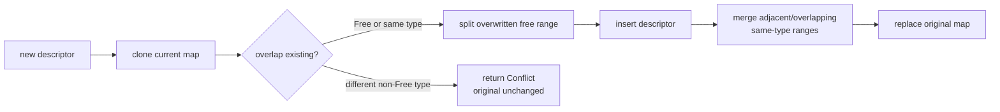
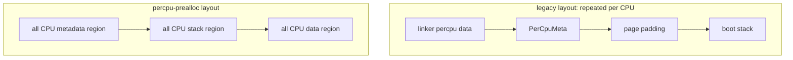
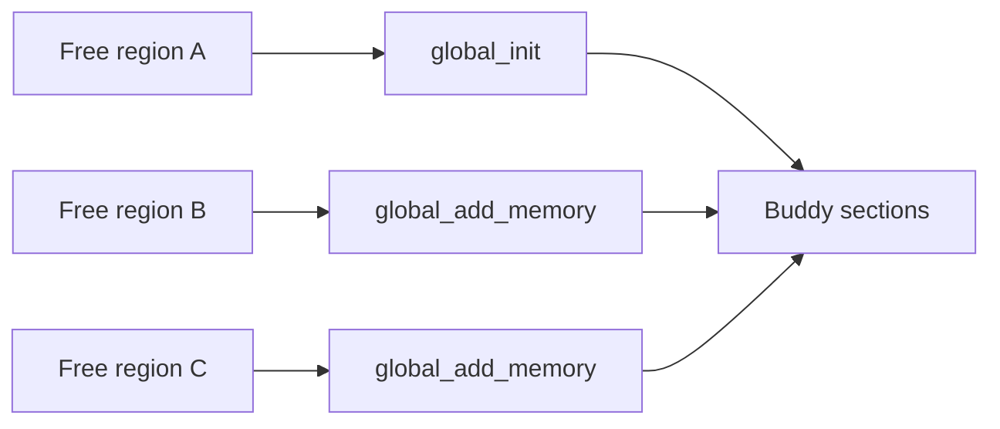

# 启动内存发现与交接

动态平台的启动内存由 `someboot` 管理。U-Boot 或其他固件把 DTB 地址交给入口代码，`someboot` 从 DTB 收集所有 RAM 段和保留区，再用固定容量内存图裁剪内核镜像、启动页表、DTB 副本、per-CPU 数据和启动栈，最后把剩余 `Free` 段交给运行时分配器。

## 1. 固件输入

固件输入是硬件事实来源，不是运行期 allocator。启动路径必须在没有堆、没有调度器且页表可能尚未建立的条件下完成解析。

### 1.1 U-Boot 与 DTB 契约

U-Boot 通常通过架构规定的入口寄存器传入 DTB 指针；`someboot` 的架构入口保存并验证该地址，随后由 `platforms/someboot/src/fdt/` 解析。Rust 内存管理接收的是一份设备树，而不是固件预先整理好的单段 heap。

| 架构路径 | DTB 入口事实 | 后续使用 |
| --- | --- | --- |
| AArch64 | 启动参数寄存器中的 FDT 地址 | `someboot` early entry 保存后交给 FDT parser |
| RISC-V | SBI/U-Boot 约定的 DTB 参数 | early entry 保存，物理地址按架构规则规范化 |
| LoongArch64 | UHI/U-Boot 参数或平台启动协议 | entry 解析后形成统一 FDT base |
| x86_64 | 平台固件/动态平台描述 | 最终仍转换为统一内存描述符输入 |

入口差异止于平台层。内存图建立后，后续代码只处理 `usize` 物理范围和 `MemoryType`，不会把 U-Boot 私有结构带入 `ax-alloc`。

### 1.2 多段 RAM 扫描

`platforms/someboot/src/fdt/memory.rs::init_memory_map()` 遍历每个 FDT memory node，并继续遍历该 node 的所有 `reg` region。每个非零且不溢出的范围都会以 `MemoryType::Free` 加入内存图，因此正常的多 bank RAM 会被完整保留为多个物理段。

```rust
for memory in fdt.memory() {
    for region in memory.regions() {
        // normalize_region(...) 后加入 MemoryType::Free
    }
}
```

`normalize_region()` 使用 checked addition 计算末地址，并调用架构的 `canonicalize_paddr()` 规范化物理地址。零长度或溢出的 region 被忽略，合法 region 不需要相邻或连续。

## 2. 启动内存图

启动内存图位于 `platforms/someboot/src/mem/mod.rs`，类型为 `heapless::Vec<MemoryDescriptor, 512>`。固定容量避免 early boot 引入动态分配，代价是平台描述符数量必须有明确上限。

### 2.1 描述符类型

`components/kernutil/src/memory.rs` 定义了共享的 `MemoryDescriptor` 和 `MemoryType`。描述符保存物理起点、字节长度和唯一类型，不保存 allocator 私有 metadata。

| `MemoryType` | 含义 | 是否进入运行时 Buddy |
| --- | --- | --- |
| `Free` | 可交给运行时的 RAM | 是 |
| `Ram` | 平台已知 RAM，但尚未表示可分配 | 由平台转换规则决定 |
| `KImage` | 内核镜像及按映射粒度扩展的范围 | 否 |
| `Reserved` | 固件、early bump、页表或其他保留区 | 否 |
| `Mmio` | 设备寄存器窗口 | 否 |
| `PerCpuData` | per-CPU metadata、stack 和 linker data | 否 |

`Mmio` 不因为存在物理地址就属于 RAM。MMIO 映射只建立 VA/PTE，不得把设备窗口加入 Buddy，也不得在 unmap 时释放其物理区。

### 2.2 区间合并与冲突

`MemoryMapExt::merge_add()` 先克隆当前固定容量 map，在副本上执行 split、insert 和同类型合并，成功后才替换原 map。这使 capacity、alignment、range overflow 或冲突错误不会留下半修改状态。



同类型范围可以相邻或重叠后合并。新描述符可以覆盖 `Free`，但不能覆盖不同类型的非 `Free` 区间；例如 `Reserved` 与已有 `KImage` 冲突时会返回 `MemoryRangeError::Conflict`。

## 3. 保留区裁剪

所有不可分配范围必须在运行时接管前进入同一内存图。这样 `ax-hal` 只需要消费最终描述符，不需要再次理解 FDT reserved-memory、内核镜像布局或 early bump 的内部状态。

### 3.1 固件与镜像保留区

`init_memory_map()` 处理 FDT memory reservation block，并将范围按页对齐后加入 `Reserved`。它也遍历 `/reserved-memory` 每个子节点的全部 `reg` tuple；固定容量内存图无法保留条目时明确失败，不能静默暴露保留页。

| 保留来源 | 添加位置 | 类型或处理 |
| --- | --- | --- |
| FDT reservation block | `fdt/memory.rs` | 页对齐的 `Reserved` |
| `/reserved-memory` | `fdt/memory.rs` | 每个 node 的全部 `reg` tuple 都加入 `Reserved` |
| kernel image | `mem::early_init()` | `KImage`，结束地址按 `KIMAGE_MAP_ALIGN` 扩展 |
| x86 AP trampoline | `reserve_arch_early_ranges()` | 一页 `Reserved`，已被固件保留时接受现状 |
| memory-backed debug console | `memory_map_setup()` | 平台返回的描述符 |

### 3.2 Early bump 占用

`someboot::mem::ram` 在 `early_init()` 中选择最大的非空、地址计算不溢出的 `Free` 描述符作为 bump arena。选择不依赖固件描述符顺序；它不是运行期 heap，也不跨多个 RAM bank 拼接分配。实现不设置固定的最小容量，实际启动对象超出 arena 时由 checked bump 明确失败。

| 状态 | 允许操作 | 转换条件 |
| --- | --- | --- |
| `Uninitialized` | 无分配 | `ram::init(free_range)` |
| `Active` | checked bump allocation | boot object 分配完成 |
| `Frozen` | 禁止继续分配 | `memory_map_setup()` 调用 `ram::freeze()` |

Bump 的所有地址计算使用 checked arithmetic。`ram::used_range()` 在冻结前被作为 `Reserved` 加回内存图，因此 arena 中未使用的尾部仍可保持 `Free`，已使用前缀不会被运行时重复分配。

## 4. 启动对象

Early bump 只分配必须在通用 allocator 之前存在、且生命周期明确的对象。普通任务、用户页和设备请求不应继续使用该 arena。

### 4.1 Boot 页表与 DTB

`ax-page-table` 的 `boot` feature 通过 `PageFrameProvider` 使用 `someboot::mem::ram::Ram`。该 provider 能分配 frame 和完成物理到虚拟地址转换，但 boot 阶段的 deallocation 是 no-op；整个已用前缀随后统一标记为 `Reserved`。

| 启动对象 | 分配来源 | 运行期释放 |
| --- | --- | --- |
| 临时/启动页表 frame | `Ram` provider → early bump | 不单独释放，随 used range 保留 |
| 保存后的 DTB | `crate::fdt::save_fdt()` → early bump | 当前启动生命周期内保留 |
| CPU metadata | `alloc_percpu()` → early bump | 系统生命周期内保留 |
| per-CPU boot stack | `alloc_percpu()` → early bump | 被 main/secondary task 借用，不释放 |
| per-CPU linker data copy | `alloc_percpu()` → early bump | 系统生命周期内保留 |

boot 页表引擎不依赖 `ax-alloc`，从而避免“建立运行时页表之前必须先初始化运行时分配器”的循环依赖。

### 4.2 Per-CPU 预分配

`platforms/someboot/src/smp/` 在 BSP 上为配置的全部 CPU 预先分配 metadata、stack 和 per-CPU linker data。`percpu-prealloc` feature 使用分组布局；默认 legacy 布局按 CPU 将三部分放在同一 stride 内。



两种布局都在 early bump 冻结前完成全部 CPU 的物理预留。AP 启动后只绑定自己的地址并初始化本 CPU Slab，不在启动临界路径重新申请 metadata 或 stack。

## 5. 运行时交接

交接分为平台描述符转换和 allocator 初始化两步。中间层继续保留物理段边界，避免低地址 MMIO hole 或固件保留区被误合并。

### 5.1 平台内存区规范化

`platforms/axplat-dyn/src/mem.rs` 将 `someboot` 的描述符转换为平台 `MemRegion`，其内部固定容量分别为 free 32、reserved 32、MMIO 16。`os/arceos/modules/axhal/src/mem.rs` 再从 RAM 中扣除 reserved，并执行 4 KiB 对齐。

| 阶段 | 输入 | 输出 |
| --- | --- | --- |
| `someboot::memory_map_setup()` | FDT、KImage、early allocations | 冻结后的 `MemoryDescriptor[]` |
| `axplat-dyn::mem` | `MemoryType` | FREE / RESERVED / MMIO 平台区域 |
| `ax-hal::mem::memory_regions()` | 平台区域 | 页对齐且已扣除保留区的运行时区域 |
| `ax-runtime::init_allocator()` | 所有 `MemRegionFlags::FREE` 区域 | `ax-alloc` 的多个 Buddy section |

固定容量是嵌入式设计选择，也是一项显式平台约束。超出容量时必须返回错误或在启动阶段失败，不能静默丢弃 RAM 或保留区。

### 5.2 多段内存进入 Buddy

`ax-runtime::init_allocator()` 先找到最大的 `Free` region 并调用 `ax_alloc::global_init()`，随后对其余每个 `Free` region 调用 `global_add_memory()`。当前 `buddy-slab-allocator` 会把这些区域都加入多 section Buddy。



选择最大段作为初始化段可以保证初始 allocator metadata 有足够空间，但不会把其他段降级成“只能供 byte heap 使用”。页分配和大对象分配都可以扫描全部 Buddy section；单次连续分配仍必须完全落在某一个 section 内。

## 6. 当前约束

启动内存追求确定性和低复杂度，因此没有动态扩容或复杂物理内存重排。平台配置与测试必须覆盖这些固定边界。

### 6.1 容量与连续性限制

当前代码中需要重点监控的硬限制如下。它们不影响正常的少量 RAM bank，但会决定复杂服务器级固件描述是否可直接使用。

| 限制 | 当前值或行为 | 影响 |
| --- | --- | --- |
| someboot memory map | 512 descriptors | 大量 split 后可能 capacity failure |
| FDT `memories()` 临时结果 | 128 ranges | 超出时立即失败，不静默丢弃 range |
| axplat dynamic free list | 32 ranges | 超出平台容量不能完整交接 |
| axplat dynamic reserved list | 32 ranges | 复杂保留图需要显式处理 |
| axplat dynamic MMIO list | 16 ranges | 设备窗口数量受限 |
| early bump arena | 最大的非空有效 Free range | 不跨物理 hole；容量不足由实际分配报告 |
| Buddy contiguous allocation | 单 section 内完成 | 不能跨物理 hole 拼接连续页 |

这些限制应通过板级启动测试验证，而不是通过引入通用 NUMA、compaction 或页迁移框架解决。若具体平台超过固定容量，应先提高有依据的常量或压缩平台描述符。

### 6.2 维护检查点

修改启动内存时必须同时检查区间不重叠、冻结后不可分配和多段 RAM 全部交接。下面的源码是该路径的主要审计入口。

| 源码 | 审计重点 |
| --- | --- |
| `platforms/someboot/src/fdt/memory.rs` | 所有 RAM bank、reservation 和地址规范化 |
| `components/kernutil/src/memory.rs` | transactional `merge_add` 与 fixed capacity |
| `platforms/someboot/src/mem/mod.rs` | KImage、early range 选择、freeze 与最终 map |
| `platforms/someboot/src/mem/ram.rs` | checked bump 状态机与 boot provider |
| `platforms/someboot/src/smp/` | 全 CPU metadata/stack/data 预分配 |
| `platforms/axplat-dyn/src/mem.rs` | 平台固定容量转换 |
| `os/arceos/modules/axhal/src/mem.rs` | reserved subtraction 与页对齐 |
| `os/arceos/modules/axruntime/src/lib.rs` | 最大初始段与其余 section 的交接 |

任何修改都应至少构造“两段 RAM、中间有保留洞、early bump 位于其中一段”的确定性用例，并验证最终 Buddy 可见总页数与输入减去全部保留范围一致。
