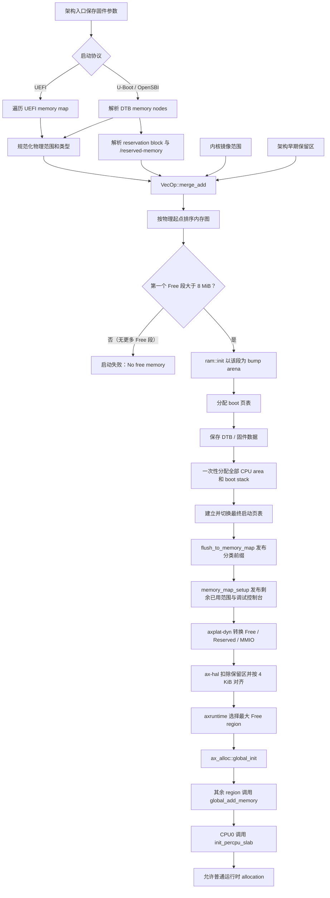
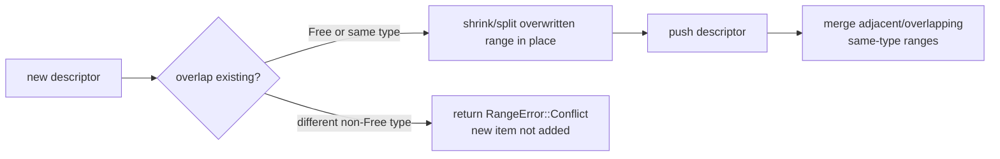
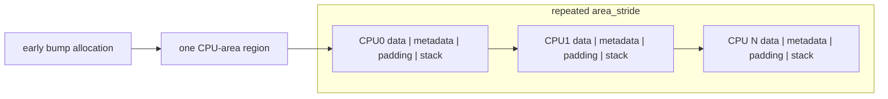
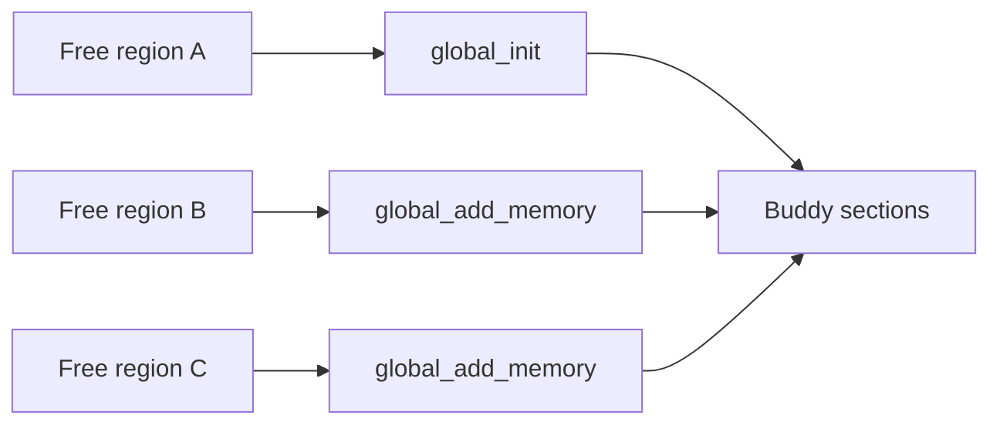

# 启动内存发现与交接

动态平台的启动内存由 `someboot` 管理。U-Boot 或其他固件把 Device Tree Blob（设备树二进制对象，DTB）地址交给入口代码，`someboot` 从设备树收集所有 RAM 段和保留区，再用固定容量内存图裁剪内核镜像、启动页表、设备树副本、每 CPU 数据和启动栈，最后把剩余 `Free` 段交给运行时分配器。

## 1. 固件输入

固件输入是硬件事实来源，不是运行期 allocator。启动路径必须在没有堆、没有调度器且页表可能尚未建立的条件下完成解析。

启动内存的主要源码入口如下。入口代码只保存固件参数；内存图、early allocator 和交接分别由独立模块维护，避免架构汇编直接操作运行时 Buddy。

| 阶段 | 源码 | 发布的结果 |
| --- | --- | --- |
| 架构入口 | `platforms/someboot/src/arch/*/entry.rs` | 固件参数、当前 CPU 标识和初始执行环境 |
| 设备树 RAM | `platforms/someboot/src/fdt/memory.rs` | 全部 RAM bank、reservation block、`/reserved-memory` |
| UEFI RAM | `platforms/someboot/src/efi_stub/memmap.rs` | 归一后的 Free、Reserved 与 MMIO 描述符 |
| 描述符与区间操作 | `components/kernutil/src/memory.rs`、`memory/ranges-ext/src/lib.rs` | `MemoryDescriptor`、`MemoryType`、`RangeOp` 实现与 `VecOp::merge_add()` 区间覆盖 |
| early allocator | `platforms/someboot/src/mem/ram.rs` | 引导处理器专用的线性 bump 分配器 |
| 启动编排 | `platforms/someboot/src/mem/mod.rs` | KImage、架构保留区、已用 early 前缀和最终发布的 map |
| 每 CPU 对象 | `platforms/someboot/src/smp/` | 全部 CPU 的 metadata、boot stack 和 linker data |
| 运行时交接 | `axplat-dyn` → `axhal` → `axruntime` | 多个独立 Buddy section 和 CPU-local Slab |

### 1.1 U-Boot 与 设备树二进制对象 契约

U-Boot 或 OpenSBI 通过架构启动协议传入设备树二进制对象指针，UEFI 路径则提供 memory map。`someboot` 的架构入口只保存和规范化固件参数，随后分别交给 `platforms/someboot/src/fdt/` 或 `efi_stub/memmap.rs`；各架构的寄存器、页表切换和地址规则集中在 1.4 节。

固件私有结构不会进入 `ax-alloc`。完成解析后，公共路径只处理物理半开区间和 `MemoryType`，因此设备树、UEFI 与动态平台可以共用后续裁剪和交接算法。

### 1.2 多段 RAM 扫描

`platforms/someboot/src/fdt/memory.rs::init_memory_map()` 遍历每个 扁平设备树 memory node，并继续遍历该 node 的所有 `reg` region。每个非零且不溢出的范围都会以 `MemoryType::Free` 加入内存图，因此正常的多 bank RAM 会被完整保留为多个物理段。

```rust
for memory in fdt.memory() {
    for region in memory.regions() {
        // normalize_region(...) 后加入 MemoryType::Free
    }
}
```

`normalize_region()` 使用 checked addition 计算末地址，并调用架构的 `canonicalize_paddr()` 规范化物理地址。零长度或溢出的 region 被忽略，合法 region 不需要相邻或连续。

### 1.3 完整启动流程

下图覆盖从固件入口到第一个普通运行时 allocation 的完整流程。每个菱形表示可能改变内存资格或启动地址限制的决策，任何被标记为保留或设备的区间都不会进入 `ax-alloc`。


```mermaid
flowchart TD
    E["架构入口保存固件参数"] --> I{"启动协议"}
    I -->|"UEFI"| U["遍历 UEFI memory map"]
    I -->|"U-Boot / OpenSBI"| F["解析 DTB memory nodes"]
    U --> N["规范化物理范围和类型"]
    F --> N
    F --> R["解析 reservation block 与 /reserved-memory"]
    N --> M["VecOp::merge_add"]
    R --> M
    K["内核镜像范围"] --> M
    A["架构早期保留区"] --> M
    M --> S["按物理起点排序内存图"]
    S --> L{"第一个 Free 段大于 8 MiB？"}
    L -->|"否（无更多 Free 段）"| PANIC["启动失败：No free memory"]
    L -->|"是"| B["ram::init 以该段为 bump arena"]
    B --> P["分配 boot 页表"]
    P --> D["保存 DTB / 固件数据"]
    D --> S2["一次性分配全部 CPU area 和 boot stack"]
    S2 --> Q["建立并切换最终启动页表"]
    Q --> X["flush_to_memory_map 发布分类前缀"]
    X --> Z["memory_map_setup 发布剩余已用范围与调试控制台"]
    Z --> PL["axplat-dyn 转换 Free / Reserved / MMIO"]
    PL --> H["ax-hal 扣除保留区并按 4 KiB 对齐"]
    H --> G["axruntime 选择最大 Free region"]
    G --> GI["ax_alloc::global_init"]
    GI --> GA["其余 region 调用 global_add_memory"]
    GA --> PS["CPU0 调用 init_percpu_slab"]
    PS --> RUN["允许普通运行时 allocation"]
```

这条流程没有“把所有 RAM 拼成一个大堆”的步骤。early bump 只选择一个物理连续子区间；运行时则把每个剩余 `Free` 区间登记为独立 Buddy section。

### 1.4 架构差异

固件输入、地址规范化和页表切换由架构层实现，内存描述符合并与运行时交接保持一致。下表给出影响启动内存结果的差异。

固件输入、地址规范化和页表切换由架构层实现，内存描述符合并与运行时交接保持一致。early arena 的选择规则在四个架构上完全相同：`early_init()` 先把内存图按物理起点排序，再取第一个大小超过 8 MiB 的 `Free` 描述符整体作为 bump arena；不存在候选时直接 `panic!("No free memory")`。当前代码没有按架构裁剪候选区间地址上限的逻辑，x86_64 的 arena 也可能位于 4 GiB 以上；应用处理器 trampoline 通过 `reserve_arch_early_ranges()` 单独预留一页低地址 `Reserved`。下表给出其余影响启动内存结果的差异。

| 架构 | 固件与 RAM 输入 | 架构早期保留 | 页表切换 | 地址处理 |
| --- | --- | --- | --- | --- |
| x86_64 | 主要来自 UEFI/动态平台描述 | AP trampoline 一页 `Reserved`，已被固件保留时接受现状 | 写 `CR3` 并失效本地翻译 | 重定位前恒等，之后使用 `PHYS_VIRT_OFFSET` |
| AArch64 | UEFI 或 U-Boot 传入设备树 | 无 | 设置 EL1/EL2 translation registers、MAIR 和 TLBI | RAM 使用 `PAGE_OFFSET`，每 CPU 区有额外窗口 |
| RISC-V 64 | OpenSBI/U-Boot 传入设备树 | 无 | 写 Sv39 `satp` 并执行 `sfence.vma` | 重定位配置下区分镜像、每 CPU 区和线性映射 |
| LoongArch64 | UEFI 或设备树 | 无 | 写 `PGDH/PGDL`、ASID，执行 TLB 全量失效与屏障 | 先移除直接映射窗口高位；RAM 与 MMIO 使用不同窗口 |

更完整的页表项、缓存属性和多 CPU 失效差异见[多架构内存实现](./architecture-support.md)。

## 2. 启动内存图

启动内存图位于 `platforms/someboot/src/mem/mod.rs`，类型为 `heapless::Vec<MemoryDescriptor, 512>`。固定容量避免 early boot 引入动态分配，代价是平台描述符数量必须有明确上限。

### 2.1 描述符类型

`components/kernutil/src/memory.rs` 定义了共享的 `MemoryDescriptor` 和 `MemoryType`。描述符保存物理起点、字节长度和唯一类型，不保存 allocator 私有 metadata。

| `MemoryType` | 含义 | 是否进入运行时 Buddy |
| --- | --- | --- |
| `Free` | 可交给运行时的 RAM | 是 |
| `Ram` | 平台已知 RAM，但尚未表示可分配 | 由平台转换规则决定 |
| `KImage` | 内核镜像及按映射粒度扩展的范围 | 否 |
| `Reserved` | 固件、early bump、页表或其他保留区 | 否 |
| `Mmio` | 设备寄存器窗口 | 否 |
| `PerCpuData` | per-CPU metadata、stack 和 linker data | 否 |

`Mmio` 不因为存在物理地址就属于 RAM。MMIO 映射只建立虚拟地址/页表项，不得把设备窗口加入 Buddy，也不得在 unmap 时释放其物理区。

`MemoryType` 在 `components/kernutil/src/memory.rs` 中定义，公共枚举值就是上面六类。`Free` 是枚举默认值，但 `MemoryDescriptor::default()` 的长度为零，不会凭空形成可分配区间；任何非空描述符都必须由固件解析或平台代码显式填写起点、长度和类型。

```rust
#[derive(Debug, Clone, Copy, PartialEq, Eq, Default)]
pub enum MemoryType {
    #[default]
    Free,
    Ram,
    KImage,
    Reserved,
    Mmio,
    PerCpuData,
}
```

`MemoryDescriptor` 只保存 `physical_start`、`size_in_bytes` 和 `memory_type` 三个字段；它不持有 allocator 私有 metadata，也不携带 owner 指针。重叠检测与 conflict 判定由 `memory/ranges-ext` 的 `VecOp::merge_add()` 在固定容量 `heapless::Vec` 上原地完成，`kernutil::memory` 只为描述符实现 `RangeOp`（提供 `overwritable()` 与同类型 `mergeable()` 判定）。

### 2.2 区间合并与冲突

`VecOp::merge_add()` 直接在当前固定容量 map 上原地执行：逐个检查与新区间重叠的既有描述符，把被覆盖的 `Free` 段拆分收缩，再 push 新描述符并合并相邻同类型区间。冲突在新描述符写入前判定；容量不足时 push/insert 返回 `RangeError::Capacity`，但此前已经生效的拆分不会回滚，调用方因此需要在启动路径上用 `unwrap`/`panic` 立即暴露容量问题，而不是假设 map 保持事务性。


```mermaid
flowchart LR
    New["new descriptor"] --> Check{"overlap existing?"}
    Check -->|"Free or same type"| Split["shrink/split overwritten range in place"]
    Check -->|"different non-Free type"| Conflict["return RangeError::Conflict\nnew item not added"]
    Split --> Insert["push descriptor"]
    Insert --> Merge["merge adjacent/overlapping\nsame-type ranges"]
```

同类型范围可以相邻或重叠后合并。新描述符可以覆盖 `Free`，但不能覆盖不同类型的非 `Free` 区间；例如 `Reserved` 与已有 `KImage` 冲突时会返回 `RangeError::Conflict`。x86 AP trampoline 的预留代码就依赖这一语义：`Conflict` 且既有区间非 `Free` 时接受固件已保留的现状，其余错误直接 panic。

### 2.3 分配资格、直接映射与页表属性

一个物理区间至少有三个彼此独立的属性：能否交给页分配器、是否需要进入内核直接映射、映射时使用普通内存还是设备内存属性。`MemoryType` 当前主要回答第一个问题；它不能完整表达后两个问题。

| 启动类型 | 进入 `ax-alloc` | 当前运行期映射处理 | 映射属性来源 |
| --- | --- | --- | --- |
| `Free` | 是 | `ax-hal` 生成普通 RAM 区域，`ax-mm` 建立线性映射 | 普通可缓存内存 |
| `KImage` / `PerCpuData` | 否 | 作为保留物理 RAM 进入内核映射清单 | 当前与 `Reserved` 一样折叠为普通内存、可读/可写/可执行 |
| `Reserved` | 否 | 当前统一作为保留物理 RAM 进入内核映射清单 | 普通内存、可读/可写/可执行 |
| `Mmio` | 否 | 作为设备区域进入内核映射清单 | 设备内存属性 |
| `Ram` | 取决于平台转换 | 动态平台当前不把它当作 `Free` | 取决于平台策略 |

当前 `MemoryDescriptor` 没有类似 `NoDirectMap` 的独立标志。因此，固件私有窗口、PCI 空洞和“需要保留但不应由 CPU 普通访问”的区域若都被归为 `Reserved`，会和真正的保留 RAM 走同一条映射路径。这是当前表达能力的限制；平台在加入描述符前必须尽量区分 RAM、MMIO 和地址空洞，不能把所有不可分配地址都笼统标成 `Reserved`。

## 3. 保留区裁剪

所有不可分配范围必须在运行时接管前进入同一内存图。这样 `ax-hal` 只需要消费最终描述符，不需要再次理解 扁平设备树 reserved-memory、内核镜像布局或 early bump 的内部状态。

### 3.1 固件与镜像保留区

`init_memory_map()` 处理 扁平设备树 memory reservation block，并将范围按页对齐后加入 `Reserved`。它还遍历 `/reserved-memory` 的每个子节点，但当前实现只读取每个节点的第一个 `reg` tuple（`reserved.reg()` 迭代器只调用一次 `next()`），其余 reg 被忽略；该路径构造描述符时不做页对齐，与 reservation block 不同。固件在 `/reserved-memory` 节点中使用多个 reg 或非页对齐边界时，平台需要显式处理或修正解析代码。

| 保留来源 | 添加位置 | 类型或处理 |
| --- | --- | --- |
| 扁平设备树 reservation block | `platforms/someboot/src/fdt/memory.rs` | 页对齐的 `Reserved` |
| `/reserved-memory` | `platforms/someboot/src/fdt/memory.rs` | 每个节点仅第一个 `reg` tuple，不做页对齐 |
| kernel image | `mem::early_init()` | `KImage`，结束地址按 `KIMAGE_MAP_ALIGN` 扩展 |
| x86 应用处理器 trampoline | `reserve_arch_early_ranges()` | 一页 `Reserved`，已被固件保留时接受现状 |
| memory-backed debug console | `memory_map_setup()` | 平台返回的描述符 |

### 3.2 早期线性分配

`platforms/someboot/src/mem/mod.rs::early_init()` 完成内存图裁剪后，先把描述符按 `physical_start` 排序，再取第一个大小超过 8 MiB 的 `Free` 描述符整体作为 bump arena；不存在这样的段时 `expect("No free memory")` 直接失败。选择不计算启动工作集，也没有架构地址上限：arena 可能位于高地址 RAM，8 MiB 阈值只是当前经验的保守下界。early arena 不是运行期 heap，也不跨多个 RAM bank 拼接分配，后续每次 bump 仍检查 `end > RAM_END` 边界。

```rust
unsafe { MEMORY_MAP.update(|m| m.sort_by_key(|a| a.physical_start)) };

let mut free_range = None;
for desc in memory_map().iter() {
    if desc.memory_type == MemoryType::Free && desc.size_in_bytes > 8 * MB {
        free_range = Some(desc.physical_start..(desc.physical_start + desc.size_in_bytes));
        break;
    }
}
ram::init(free_range.expect("No free memory"));
```

`platforms/someboot/src/mem/ram.rs` 的 early allocator 由三个 `static mut`（`RAM_START`、`RAM_END`、`RAM_CURRENT`）组成的线性 bump 实现，没有锁也没有显式状态机；它的安全前提是只在引导处理器、单核 early boot 阶段被调用。

```rust
static mut RAM_START: usize = 0;
static mut RAM_END: usize = 0;
static mut RAM_CURRENT: usize = 0;
```

`ram::init()` 把 `RAM_CURRENT` 初始化为 `range.start.max(0x40)` 而非 `range.start`，避免从地址 0 开始分配造成 NULL 指针语义混淆；当 `range.start < 0x40` 时 `RAM_START` 与 `RAM_CURRENT` 之间存在初始间隙，该间隙会随首次 `flush_to_memory_map()` 一同作为已用前缀发布。`alloc(Layout)` 先对齐 `RAM_CURRENT`，加上请求大小后与 `RAM_END` 比较；arena 耗尽时返回 `None`。注意当前实现的加法没有使用 checked arithmetic，`start + size` 在极地址下溢出会回绕，这是已知实现限制。

`flush_to_memory_map(kind)` 把区间 `[RAM_START, RAM_CURRENT.align_up(page_size))` 作为 `MemoryDescriptor` 加入内存图，随后把 `RAM_START` 与 `RAM_CURRENT` 同时重置为已发布区间的末端；下一次 `alloc` 从新的 `RAM_CURRENT` 继续推进。`memory_map_setup()` 是 boot/runtime 边界的交接点：它读取尚未 flush 的 `ram::used_range()` 并作为 `Reserved` 加入内存图（保证已使用前缀不会被运行时分配器重复分配），再加入 memory-backed debug console 描述符。当前代码没有冻结机制阻止交接后继续调用 early allocator；“`memory_map_setup()` 之后不再使用 early bump”是启动流程的约定，由调用顺序而非类型系统保证。

## 4. 启动对象

Early bump 只分配必须在通用 allocator 之前存在、且生命周期明确的对象。普通任务、用户页和设备请求不应继续使用该 arena。

### 4.1 启动页表与设备树

`someboot` 的各架构启动页表通过 `page-table-generic::FrameAllocator` 使用 `someboot::mem::ram::Ram`。该 allocator 能分配 frame 和完成物理到虚拟地址转换，但 boot 阶段的 deallocation 是 no-op；整个已用前缀随后统一标记为 `Reserved`。

| 启动对象 | 分配来源 | 运行期释放 |
| --- | --- | --- |
| 临时/启动页表 frame | `Ram` provider → early bump | 不单独释放，随 used range 保留 |
| 保存后的 设备树二进制对象 | `crate::fdt::save_fdt()` → early bump | 当前启动生命周期内保留 |
| CPU metadata | `alloc_percpu()` → early bump | 系统生命周期内保留 |
| per-CPU boot stack | `alloc_percpu()` → early bump | 被 main/secondary task 借用，不释放 |
| per-CPU linker data copy | `alloc_percpu()` → early bump | 系统生命周期内保留 |

boot 页表引擎不依赖 `ax-alloc`，从而避免“建立运行时页表之前必须先初始化运行时分配器”的循环依赖。

### 4.2 每 CPU 预分配

`platforms/someboot/src/smp/layout.rs` 在引导处理器上为固件报告的全部可用 CPU 一次性预留连续区域。每个 CPU 使用相同的 `area_stride`，内部依次放置 per-CPU linker data、按至少 64 B 对齐的 `PerCpuMeta`、页对齐填充和 boot stack。总大小通过 `area_stride.checked_mul(cpu_count)` 计算，CPU 数为零、对齐非法或地址运算溢出都会在分配前失败。


```mermaid
flowchart LR
    Bump["early bump allocation"] --> Region["one CPU-area region"]
    subgraph RegionLayout["repeated area_stride"]
        C0["CPU0 data | metadata | padding | stack"]
        C1["CPU1 data | metadata | padding | stack"]
        CN["CPU N data | metadata | padding | stack"]
    end
    Region --> C0 --> C1 --> CN
```

`allocate_cpu_areas()` 只保留并清零原始物理存储；切换到最终高地址镜像后，`initialize_percpu_layout()` 调用标量应用程序二进制接口 `__percpu_initialize_layout()` 构造全部 typed per-CPU 值，再写入 CPU identity、stack top、页表地址并完成 cache maintenance。运行期发布 CPU 数采用 Release，读取采用 Acquire。应用处理器启动后只绑定已构造区域并初始化本 CPU Slab，不重新申请 metadata 或 stack。

## 5. 运行时交接

交接分为平台描述符转换和 allocator 初始化两步。中间层继续保留物理段边界，避免低地址 MMIO hole 或固件保留区被误合并。

### 5.1 平台内存区规范化

`platforms/axplat-dyn/src/mem.rs` 将 `someboot` 的描述符转换为平台 `MemRegion`，其内部固定容量分别为 free 32、reserved 32、MMIO 16。`os/arceos/modules/axhal/src/mem.rs` 再从 RAM 中扣除 reserved，并执行 4 KiB 对齐。

| 阶段 | 输入 | 输出 |
| --- | --- | --- |
| `someboot::memory_map_setup()` | 扁平设备树、KImage、early allocations | 交接后的最终 `MemoryDescriptor[]` |
| `axplat-dyn::mem` | `MemoryType` | FREE / RESERVED / MMIO 平台区域 |
| `ax-hal::mem::memory_regions()` | 平台区域 | 页对齐且已扣除保留区的运行时区域 |
| `ax-runtime::init_allocator()` | 所有 `MemRegionFlags::FREE` 区域 | `ax-alloc` 的多个 Buddy section |

固定容量是嵌入式设计选择，也是一项显式平台约束。超出容量时必须返回错误或在启动阶段失败，不能静默丢弃 RAM 或保留区。

### 5.2 多段内存进入页分配器

`ax-runtime::init_allocator()` 先找到最大的 `Free` region 并调用 `ax_alloc::global_init()`，随后对其余每个 `Free` region 调用 `global_add_memory()`。当前 `buddy-slab-allocator` 会把这些区域都加入多 section Buddy。


```mermaid
flowchart LR
    R0["Free region A"] --> Init["global_init"]
    R1["Free region B"] --> Add1["global_add_memory"]
    R2["Free region C"] --> Add2["global_add_memory"]
    Init --> Sections["Buddy sections"]
    Add1 --> Sections
    Add2 --> Sections
```

选择最大段作为初始化段可以保证初始 allocator metadata 有足够空间，但不会把其他段降级成“只能供 byte heap 使用”。页分配和大对象分配都可以扫描全部 Buddy section；单次连续分配仍必须完全落在某一个 section 内。

### 5.3 描述符到内核直接映射

运行时映射路径由三个模块连续完成。`axplat-dyn::mem::reserved_phys_ram_ranges()` 把 `Reserved`、`KImage` 和 `PerCpuData` 汇总为保留物理 RAM；`ax-hal::mem::memory_regions()` 为它们生成非 `FREE` 的 `MemRegion`；`ax-mm::new_kernel_aspace()` 再遍历全部 `MemRegion` 并调用 `map_linear()`。

```text
MemoryDescriptor[]
  -> axplat-dyn: Free / reserved physical RAM / MMIO
  -> ax-hal: MemRegion + FREE/RESERVED/DEVICE/permission flags
  -> ax-mm: physical-to-virtual address + map_linear
```

这条路径保留了“不可分配”的含义，但当前也把“保留物理 RAM”和“需要直接映射”绑定在一起。维护固件内存解析时必须先判断区间的真实性质。

| 物理区间性质 | 分配器处理 | 合理的直接映射处理 | 当前实现 |
| --- | --- | --- | --- |
| 可用 RAM | 加入 Buddy | 建立普通内存直接映射 | 已实现 |
| 内核镜像、启动页表、每 CPU 数据 | 排除 | 保留映射，并按用途设置权限/属性 | 已实现为保留区域映射 |
| CPU 必须访问的保留 RAM | 排除 | 按实际访问属性映射 | 当前作为普通保留区域映射 |
| 固件私有、PCI 空洞或不可访问窗口 | 排除 | 不建立普通直接映射 | 当前缺少独立表达，可能被 `Reserved` 路径映射 |
| MMIO | 排除 | 仅以设备内存属性映射需要访问的窗口 | 当前作为 `DEVICE` 区域映射，也可由 `iomap` 建立专用映射 |

是否映射必须先于页尺寸选择。把一个不应访问的保留窗口改用 1 GiB 大页映射，只减少页表开销，并不能修正错误的区间分类。

## 6. 当前约束

启动内存追求确定性和低复杂度，因此没有动态扩容或复杂物理内存重排。平台配置必须在进入运行时前满足这些固定边界。

当前代码中需要重点监控的硬限制如下。它们不影响正常的少量 RAM bank，但会决定复杂服务器级固件描述是否可直接使用。

| 限制 | 当前值或行为 | 影响 |
| --- | --- | --- |
| someboot memory map | 512 descriptors | 大量 split 后可能 capacity failure |
| 扁平设备树 `memories()` 临时结果 | 128 ranges | 超出时 `push(...).ok()` 静默丢弃，不报错 |
| axplat dynamic free list | 32 ranges | 超出平台容量不能完整交接 |
| axplat dynamic reserved list | 32 ranges | 复杂保留图需要显式处理 |
| axplat dynamic MMIO list | 16 ranges | 设备窗口数量受限 |
| early bump arena | 排序后第一个大于 8 MiB 的 `Free` 段 | 不跨物理 hole；无候选时 `expect("No free memory")` 启动失败 |
| Buddy contiguous allocation | 单 section 内完成 | 不能跨物理 hole 拼接连续页 |

这些限制不应通过引入通用非统一内存访问、compaction 或页迁移框架解决。若具体平台超过固定容量，应先提高有依据的常量或压缩平台描述符；对应验收方法见[内存管理测试与验收](./testing.md)。

## 7. 地址处理实例

启动内存最容易出现的错误不是 allocator 算法错误，而是区间端点、对齐和覆盖顺序错误。`MemoryDescriptor` 的实际更新过程可以展开到具体地址，其结果由 `VecOp::merge_add()` 的拆分/收缩与同类型合并分支决定。

### 7.1 保留区拆分

假设 扁平设备树 提供一个 `0x4000_0000..0x5000_0000` 的 256 MiB RAM bank，同时 reservation block 声明 `0x47ff_f123..0x4800_2345`。reservation block 通过 `MemoryDescriptor::new_aligned(..., PAGE_SIZE)` 向下对齐起点、向上对齐终点，因此实际保留范围为 `0x47ff_f000..0x4800_3000`。

| 步骤 | 内存图 |
| --- | --- |
| 加入 RAM | `Free 0x4000_0000..0x5000_0000` |
| 对齐 reservation | `Reserved 0x47ff_f000..0x4800_3000` |
| `merge_add()` 提交后 | `Free 0x4000_0000..0x47ff_f000`；`Reserved 0x47ff_f000..0x4800_3000`；`Free 0x4800_3000..0x5000_0000` |

拆分在原 map 上逐项完成：与 reservation 相交的 `Free` 段被收缩为左右两段，随后 push 新描述符并合并相邻同类型区间。若固定容量不足，push/insert 返回 `RangeError::Capacity`，但此前已完成的收缩不会回滚，因此启动路径对 `merge_add()` 的结果一律 `unwrap`，让容量问题立即暴露。

```rust
// 相交且既不可覆盖也不可合并（不同非 Free 类型）时，先于任何修改返回冲突。
if new_range.start < existing_range.end && new_range.end > existing_range.start {
    if !(existing.overwritable(&item) || existing.mergeable(&item)) {
        return Err(RangeError::Conflict { new: item, existing: existing.clone() });
    }
    // 按重叠位置 remove/insert 收缩既有区间，之后 push(item) 并 merge_same_kind()。
}
```

该代码位于 `memory/ranges-ext/src/lib.rs::VecOp::merge_add()`。`KImage`、`Reserved` 和 `PerCpuData` 都使用相同覆盖规则，因此无需为每一种保留来源复制一套区间算法。

### 7.2 早期分配对齐

假设最大 Free 段为 `0x8000_0000..0x9000_0000`，当前 bump 指针是 `0x8000_3120`。接下来依次申请一个 4 KiB 对齐页表页和一个 64 字节对齐、160 字节大小的 metadata 对象。

| 请求 | 对齐后的起点 | 结束地址 | 被跳过的 padding |
| --- | --- | --- | ---: |
| `Layout(4096, 4096)` | `0x8000_4000` | `0x8000_5000` | `0xee0` |
| `Layout(160, 64)` | `0x8000_5000` | `0x8000_50a0` | `0` |

`ram::alloc()` 先把 `RAM_CURRENT` 向上对齐，再做普通加法并在 `end > RAM_END` 时返回 `None`。arena 耗尽会立即失败；注意当前实现的加法不是 checked arithmetic，极端地址溢出会回绕（见 3.2 节的实现限制说明）。

```rust
pub unsafe fn alloc(layout: Layout) -> Option<usize> {
    let start = unsafe { RAM_CURRENT.align_up(layout.align()) };
    let end = start + layout.size();

    if end > unsafe { RAM_END } {
        return None;
    }

    unsafe { RAM_CURRENT = end; }
    Some(start)
}
```

如果此时调用 `flush_to_memory_map(PerCpuData)`，发布范围会从当前 `used_start` 延伸到 `current.align_up(page_size())`。上例最后的 `0x8000_50a0` 会按页扩展到 `0x8000_6000`；扩展出的尾部 padding 也属于该启动对象，不能再次进入 Buddy。

### 7.3 交接与二次分配防护

`memory_map_setup()` 读取尚未 flush 的 `used_range()`，把它加入 `Reserved`，再加入 memory-backed debug console 描述符。当前没有 freeze 状态：交接后继续调用 early provider 仍会成功返回 arena 内的地址，因此“交接后不再使用 early bump”由启动调用顺序约定保证。

```rust
pub(crate) fn memory_map_setup() {
    let ram_range = ram::used_range();
    if !ram_range.is_empty() {
        let desc = MemoryDescriptor::new_with_range(ram_range, MemoryType::Reserved);
        add_memory_descriptor(desc).unwrap();
    }
    if let Some(desc) = crate::console::debug_to_memory_desc() {
        add_memory_descriptor(desc).unwrap();
    }
}
```

boot/runtime 边界是一次性的：运行期新增页表、任务栈或驱动 buffer 必须进入 `ax-alloc`。若未来在交接后错误地继续调用 early provider，已发布为 `Reserved` 的区间会被再次分配，这是当前实现需要评审关注的边界。

### 7.4 运行时区段结果

延续 7.1 的 RAM bank，再假设 KImage 为 `0x4020_0000..0x40e0_0000`，early bump 已用前缀为 `0x40e0_0000..0x4100_0000`。排序后第一个大于 8 MiB 的 `Free` 段是 `0x40e0_0000..0x47ff_f000`，因此它就是 early arena；其已用前缀发布为 `Reserved`。在扣除这些范围后，运行时能够接收的 Free 段是可逐项计算的。

```text
0x4000_0000  Free
0x4020_0000  KImage start
0x40e0_0000  KImage end / early arena start
0x4100_0000  early used end / Free resumes
0x47ff_f000  firmware Reserved start
0x4800_3000  firmware Reserved end / Free resumes
0x5000_0000  RAM end
```

最终候选为 `0x4000_0000..0x4020_0000`、`0x4100_0000..0x47ff_f000` 和 `0x4800_3000..0x5000_0000`。`ax-hal::memory_regions()` 还会执行 4 KiB 对齐，`buddy-slab-allocator` 再消耗每个 region 的 section metadata 和 2 MiB heap 对齐前缀，因此 `managed_bytes()` 必然小于这三段的简单字节和。

### 7.5 大型固件保留区

假设固件还报告一个 12 GiB 保留范围。该范围包含 `12 GiB / 4 KiB = 3,145,728` 个基础页，但启动内存图只需要一个 `MemoryDescriptor`；描述符成本与区间字节数无关。进入运行时前必须按来源判断它属于保留 RAM、MMIO，还是没有可访问存储的物理地址空洞。

```text
12 GiB firmware range
  |
  +-- actual RAM and CPU must access it? -- yes --> Reserved RAM, map required subranges
  |                                          no
  +-- device register/aperture? ------------- yes --> MMIO, device attributes, map on demand
  |                                          no
  +-- firmware-private or address hole ---------> exclude from allocator and direct map
```

若它是固件私有窗口或地址空洞，主流做法是只保留区间元数据并排除分配，不为每个基础页建立普通内存映射。若它确实是 CPU 必须访问的同属性 RAM，页表层应在地址、长度和属性边界允许时选择最大的硬件页尺寸。当前 ArceOS 的 `ax-mm::Backend::Linear` 调用 Stage-1 `map_region(..., false)`，仍会为该范围建立 4 KiB 映射；这不会再导致 map 准备阶段保存 314 万项快照，但会产生约 314 万个叶子页表项，是需要继续测量和收敛的现有限制。

大范围映射的页表与元数据成本见[虚拟内存区域管理](./address-space.md#6-12-gib-映射示例)，大页选择能力见[页表分层与实现](./page-table.md#33-区域页尺寸选择)。
