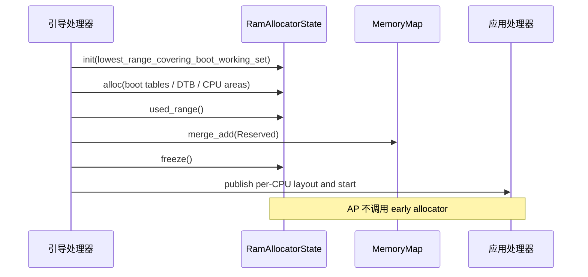
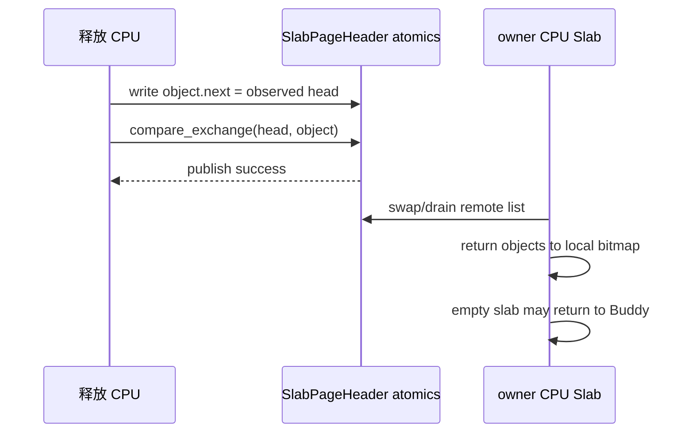

# 内存管理锁与并发

内存子系统同时运行在单核启动、普通内核线程、多 CPU 释放、缺页异常和设备完成路径中。锁的选择由“能否睡眠、能否被中断、是否依赖当前 CPU、是否会调用外部代码”决定；本章给出当前源码中的锁、原子变量、顺序和禁止组合。

## 1. 并发模型

启动内存依赖引导处理器独占，运行时物理页依赖禁止中断自旋锁，虚拟地址空间由其所属操作系统提供外层锁。`ax-memory-set` 和 `ax-page-table` 本身不为一个实例增加隐式全局锁。

### 1.1 上下文矩阵

下表中的“允许”表示实现能够保持数据一致性，不代表满足硬实时延迟。Buddy 或 Slab 扩容即使使用禁止中断自旋锁，也不应出现在硬实时临界区。

| 执行上下文 | 可使用的同步 | 可进入的内存路径 | 禁止行为 |
| --- | --- | --- | --- |
| 单核 early boot | `SpinRaw`，依赖引导核独占 | 固定容量内存图、checked bump、boot 页表 | 调度等待、回收、文件系统调用 |
| 普通内核线程 | 禁止中断/禁止抢占自旋锁，或操作系统 Mutex | Slab、Buddy、地址空间事务、缺页 | 持 allocator 锁调用文件系统或回收 |
| 硬中断 | 已预分配对象、固定 ring、极短禁止中断锁 | 驱动已有 descriptor 的状态转换 | 通用堆、Buddy、Slab 扩容、阻塞 Mutex |
| bottom half | 由具体运行时约束决定 | 已预留资源、无阻塞短路径 | 无界 reclaim、持自旋锁等待 I/O |
| 硬实时临界区 | 固定容量池或启动期预留资源 | 常数上界的本地状态转换 | Buddy、通用 Slab miss、动态虚拟映射 |
| 用户缺页异常 | 地址空间 Mutex、短时页表锁、外层有界回收 | 分配页、填充、映射、记账 | 中断上下文缺页、持页表锁执行文件 I/O |

禁止中断自旋锁解决的是重入死锁和内核可抢占问题，不会给分配搜索提供固定时间上界。实时路径必须通过预分配消除动态扩容。

### 1.2 锁清单

当前主要锁及其保护对象如下。测试专用的 `std::sync::Mutex` 不属于生产并发模型。

| 锁或原子 | 源码 | 保护对象 | 关键约束 |
| --- | --- | --- | --- |
| `SpinRaw<RamAllocatorState>` | `someboot/src/mem/ram.rs` | early bump 状态机 | 仅引导处理器使用；不承担运行时 IRQ 安全 |
| `SpinNoIrq<BuddyAllocator>` | `buddy-slab-allocator/src/global.rs` | 全部 Buddy section、free lists 和 page metadata | 临界区内不调用上层策略或回收 |
| `SpinNoIrq<SlabAllocator>` | `ax-alloc/src/buddy_slab.rs` | 当前 CPU 的 Slab cache | 调用期间同时持有 `NoPreempt` |
| remote-free atomics | `buddy-slab-allocator/src/slab/page.rs` | 跨 CPU 归还的 object 链 | 释放者只发布节点，owner CPU drain |
| `AtomicUsize` 统计矩阵 | `ax-alloc/src/lib.rs` | source × usage 字节计数 | Relaxed，仅统计，不发布资源 |
| `SpinNoIrq<AddrSpace>` | `axmm/src/lib.rs` | ArceOS 内核地址空间 | 不在锁内执行可睡眠 I/O |
| `Mutex<AddrSpace>` | Starry `kernel/src/mm/aspace` | 单个进程地址空间、虚拟内存区域与页表事务 | fault、map、clone 通过同一 owner 串行化 |
| `SpinNoIrq<Machine<...>>` | `axvm/src/vm/mod.rs` | AxVM 生命周期资源、`axaddrspace` 与嵌套页表 | map、fault、客户机访问和 clear 均在同一虚拟机 owner 下执行 |
| `AtomicU64` 汇总计数 | `starry-mm/src/accounting.rs` | 单地址空间匿名页、文件页、共享内存页和峰值 | 映射事务由地址空间锁串行化；原子只提供无锁统计快照 |
| `SpinNoIrq<CowFrameTable>` | Starry 写时复制 backend | 写时复制物理页索引、引用计数和分类 | 不在表锁内执行外部 I/O；归还物理页前释放表锁 |
| `AtomicU64/AtomicI64` | `starry-mm` policy/stat | commit、RSS/VSS 与峰值 | 原子顺序按 admission 或统计语义选择 |

## 2. 启动期同步

`RamAllocatorState` 的 `SpinRaw` 只防止同一早期调用链中的可变别名，不意味着应用处理器可以并发分配。引导处理器在启动其他 CPU 前完成所有 early allocation、内存图发布和 per-CPU 区域构造。

### 2.1 单写者状态机

状态只按 `Uninitialized → Active → Frozen` 前进。`alloc()` 在锁内完成对齐、溢出检查和 `current` 更新；失败不修改状态。`memory_map_setup()` 先发布剩余已用区间，再冻结，避免运行时看到部分状态。



每 CPU 区域在引导核完成 typed 初始化和 cache maintenance 后才发布 CPU 数量。发布使用 Release，应用处理器观察使用 Acquire，保证 metadata、stack top 和页表地址先于 CPU online 可见。

### 2.2 启动页表发布

写入新页表根前，页表页必须已经清零并完成全部页表项写入。架构实现负责必要的页表根寄存器、地址转换后备缓冲区失效和指令/数据屏障；不能只依赖 Rust 锁释放替代硬件页表同步。

## 3. 运行时分配器

分配器把页级慢路径集中到单个 Buddy 锁，把小对象热路径分散到每 CPU Slab。该结构与主流实时操作系统的“简单全局页源 + 固定大小快速路径”一致，没有引入非统一内存访问、页迁移或复杂 reclaim 锁链。

### 3.1 Buddy 临界区

`GlobalAllocator::buddy` 使用 `SpinNoIrq<BuddyAllocator>`。section 链、free list、`PageMeta`、拆分和合并都只在该锁内修改。region 初始化也持有同一锁，因此初始化期间不能并发分配。

```text
alloc_pages
  -> disable local IRQ + acquire Buddy lock
  -> scan sections
  -> find aligned block
  -> split and mark PageMeta::Allocated
  -> release lock + restore IRQ state
```

锁内不能调用虚拟文件系统、页缓存回收、缺页处理或任何可能再次分配的 callback。`NoMemory` 在释放锁后直接返回，上层若有回收策略，应在锁外完成并限制重试次数。

### 3.2 每 CPU Slab 与禁止抢占

字节分配在 `ax-alloc/src/buddy_slab.rs` 中先创建 `NoPreempt` guard，再通过 `with_cpu_pin` 获取当前 CPU 的 Slab。具体 allocation 代码只在[运行时页与堆分配器](./runtime-allocator.md#33-页所有权)展示；本章只定义并发条件：guard 必须覆盖 Slab lookup、可能发生的 Buddy backing allocation 和统计更新，防止任务持有 CPU-local 指针时迁移。

锁顺序是“固定当前 CPU → 本 CPU Slab → 必要时短时 Buddy”。Buddy 实现不反向获取某个 CPU 的 Slab 锁；这样避免 `Buddy → Slab` 与 `Slab → Buddy` 形成环。

### 3.3 跨 CPU 释放

对象的 Slab page header 记录 owner CPU。非 owner CPU 释放时，把待释放对象自身的第一个机器字作为 next 指针，以 Compare-And-Swap 循环发布到 `remote_free_head`，并更新计数；它不获取 owner CPU 的 Slab 锁。



发布节点必须使 owner 在取得 head 后观察到 next 写入；owner drain 后才可把 empty Slab backing 归还 Buddy。跨 CPU 路径不能直接释放 backing 页，否则仍在 remote list 中的对象会引用已重新分配内存。

### 3.4 统计原子

`AllocatorCounters` 的每个 source × usage bucket 使用 `AtomicUsize` Relaxed 操作。计数不决定页是否可访问、不发布 owner，也不参与释放正确性，所以无需用其建立线程间 happens-before。资源发布由锁、remote-free 原子和上层所有权协议承担。

## 4. 页表与地址空间

页表对象不内置全局锁，`MemorySet` 也假定调用者独占 `&mut self`。这一设计使嵌入式单地址空间不支付动态锁成本，同时允许 StarryOS 使用可睡眠 Mutex、ArceOS 使用禁止中断自旋锁。

### 4.1 外层所有权

不同消费者采用不同外层同步，但都必须在事务 `prepare` 到 `finalize` 期间保持地址空间独占。

| 消费者 | 外层 owner | 事务期间的要求 |
| --- | --- | --- |
| ArceOS kernel | `SpinNoIrq<AddrSpace>` | 不睡眠、不调用文件系统，完成 map/unmap/protect 后释放 |
| ArceOS user address space | 由进程/调用链持有可变访问 | 不允许另一个线程并发修改同一实例 |
| StarryOS process | `Arc<Mutex<AddrSpace>>` | 虚拟内存区域、页表和记账作为一个状态转换提交 |
| Axvisor guest | `SpinNoIrq<Machine<AxVMResources, ...>>` | 客户机映射修改、缺页和内存访问由同一虚拟机 owner 串行化；销毁前停止虚拟处理器 |

`prepare` 可以预留内存、检查全部区间并生成 undo 数据；`commit` 不应调用不可控外部代码。若 backend 无法提供不可失败 commit，失败路径必须在仍持外层地址空间 owner 时逆序 rollback。Axvisor 的具体锁闭包和 slice 生命周期见[Axvisor 客户机地址空间设计与实现](./axaddrspace.md#7-锁并发与安全边界)。

### 4.2 地址转换缓存失效

页表锁只保护软件数据结构，CPU 可能仍缓存旧翻译。安全的替换或解除映射顺序如下。

```text
1. 持有地址空间 owner，阻止并发修改。
2. 写入或清除页表项。
3. 执行架构要求的页表写入屏障。
4. 使所有可能运行该地址空间的 CPU 的 TLB 条目失效。
5. 等待远程失效完成。
6. 释放旧物理页或降低 COW 引用计数。
7. 发布新的虚拟内存区域元数据并释放外层 owner。
```

AArch64 默认失效器提供 inner-shareable 硬件广播。x86_64、RISC-V 和 LoongArch64 默认失效器只处理本 CPU；多 CPU consumer 必须提供远程处理器间中断或定制 `TlbInvalidator`。缺少有效 shootdown 时不能把本地失效当作系统完成。

## 5. StarryOS 并发

StarryOS 的缺页、映射和进程克隆涉及可睡眠对象，因此以 `Arc<Mutex<AddrSpace>>` 为主要串行化边界。`MemoryAccounting` 只维护匿名页、文件页、共享内存页和峰值的原子汇总，不再维护按虚拟地址索引的第二套分类表。

### 5.1 地址空间与文件后端

持有 `AddrSpace` Mutex 时可以修改虚拟内存区域和页表，但应避免等待文件 I/O。文件后端把自身状态放在单独 Mutex 中，listener 在不能立即取得地址空间锁时使用 `try_lock()` 避免锁顺序反转。

需要访问页缓存或文件系统的 prepare/fault 路径应先取得外部数据，再重新验证地址空间状态并提交。不能长期同时持有文件对象锁和地址空间锁。

### 5.2 写时复制帧表

全局 `FRAME_TABLE` 的 `SpinNoIrq<CowFrameTable>` 同时保护以物理地址数值为键的哈希表、带溢出检查的 `u32` 引用计数和常驻内存集大小分类，不再为每个物理页增加 `Arc<SpinNoIrq<_>>`。引用增加、释放和分类读取都在一次短临界区内完成；物理页释放在退出 `FRAME_TABLE` 临界区后执行。

写时复制 clone 使用 preflight、commit 和 rollback。预检先验证计数不会溢出并准备所有页，提交阶段逐项增加引用、修改父子页表并增加 child 汇总计数；任一步失败都逆序撤销已提交项。新 frame 登记前使用 `HashMap::try_reserve()`，因此内存不足返回 `AxError::NoMemory`；锁顺序固定为地址空间 Mutex、`FRAME_TABLE`、allocator，释放物理页时不持有 `FRAME_TABLE`。

### 5.3 记账与提交策略

`MemoryAccounting` 用原子保存匿名页、文件页、共享内存页和峰值。File/Shared backend 的分类由 backend 类型确定；私有写时复制页的分类由 `CowFrameState::rss_kind` 确定。文件私有页第一次写入时，在地址空间锁内执行 checked File→Anon 汇总转换并更新 frame state；任一计数下溢都会返回 `AxError::BadState`，不会在发布构建中回绕。

全局 commit admission 使用原子计数。严格模式通过原子 compare-exchange 保证“检查上限并扣费”不可被并发请求越过；Always 模式仍维护统计，但不因上限拒绝。测试锁只在 `cfg(test)` 中串行化全局测试状态，不是生产同步的一部分。

## 6. DMA 与内存映射输入输出

设备内存的并发安全主要依靠 owner 和操作期 token，而不是全局设备内存锁。allocation、mapping、unmapping 和 free 的顺序必须反映设备是否仍可能访问该地址。

### 6.1 DMA 所有权顺序

`DmaAllocation` 和 `DmaMapping` 不实现任意复制的释放 token。驱动提交 DMA 前把 buffer 的 operation-lifetime retainer 交给请求；完成中断只标记完成并唤醒，最终 owner 在设备不再访问后执行 unmap/free。

```text
allocate/map
  -> CPU prepares buffer
  -> cache ownership transition
  -> publish descriptor to device
  -> device completion
  -> cache ownership transition
  -> CPU consumes result
  -> unmap/free exactly once
```

不能在持 Buddy 锁时等待设备完成，也不能在最后一个 DMA owner Drop 后继续保存裸 device address。跨线程共享应共享上层 `Arc` owner，而不是复制底层释放 token。

### 6.2 寄存器映射

`Mmio`/`MmioRaw` 通过易失性访问保证编译器不消除寄存器读写，但易失性不等于 CPU 内存屏障或多线程互斥。设备协议要求的 doorbell 顺序、read-back 和屏障由驱动或平台 capability 显式完成；共享寄存器块的序列化由设备实例 owner 负责。

## 7. 锁顺序与禁止组合

下列顺序用于避免跨 allocator、地址空间、文件系统和设备路径形成环。新增代码若必须偏离，应在源码中记录完整原因和替代顺序。

### 7.1 推荐顺序

锁从上层对象向短时底层机制获取，但外部 I/O 必须在获取底层自旋锁前完成。

```text
process/task owner
  -> address-space Mutex or SpinNoIrq
    -> backend-local state
      -> page-table cursor / COW frame reference
        -> ax-alloc per-CPU Slab or Buddy lock
```

该图不是要求一次持有全部锁。更安全的实现通常在 prepare 阶段短时分配资源并释放 allocator 锁，再持地址空间 owner 提交；释放页也应先摘除页表并完成失效，再单独进入 allocator。

### 7.2 明确禁止

以下组合会导致死锁、不可控延迟或 use-after-free，应在审查中直接拒绝。

| 禁止组合 | 风险 |
| --- | --- |
| Buddy/Slab 锁内调用 reclaim、文件系统、日志分配或 callback | 递归分配和无界持锁 |
| 持页表/地址空间锁等待远程 CPU 或设备进行可能回调本地址空间的操作 | 锁环和停机 |
| 本地地址转换缓存失效后立即释放共享旧页 | 其他 CPU 仍可通过旧翻译访问 |
| remote-free 尚未 drain 就归还 Slab backing | 原子链指向已复用物理页 |
| 复制 DMA free/unmap token | 重复释放或设备仍在使用时释放 |
| 硬中断中触发 Slab miss 或 Buddy 高阶搜索 | 无确定延迟并扩大禁止中断窗口 |
| 同时持文件 backend Mutex 与地址空间 Mutex 执行可睡眠 I/O | 文件回调或 listener 反向取锁 |
