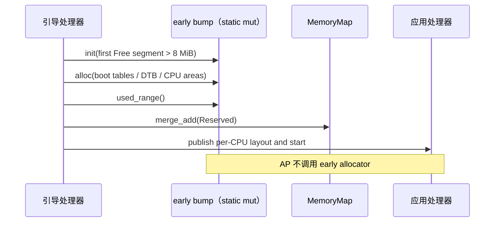
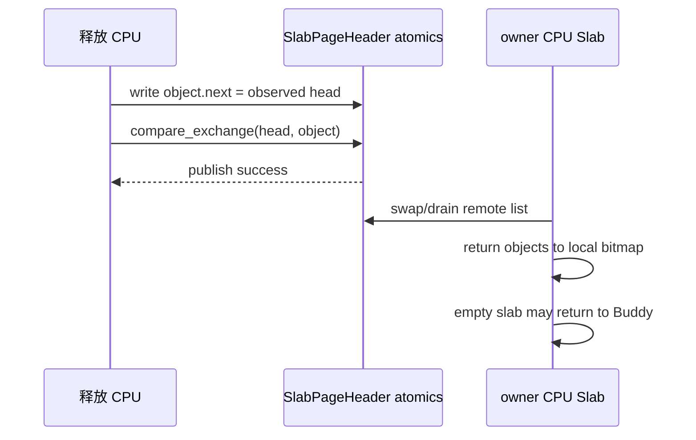

# 内存管理锁与并发

内存子系统同时运行在单核启动、普通内核线程、多 CPU 释放、缺页异常和设备完成路径中。锁的选择由“能否睡眠、能否被中断、是否依赖当前 CPU、是否会调用外部代码”决定；本章给出当前源码中的锁、原子变量、顺序和禁止组合。

## 1. 并发模型

启动内存依赖引导处理器独占，运行时物理页依赖禁止中断自旋锁，虚拟地址空间由其所属操作系统提供外层锁。`ax-memory-set`、`page-table-generic` 和 `axcpu::paging` 本身不为一个实例增加隐式全局锁。

### 1.1 上下文矩阵

下表中的“允许”表示实现能够保持数据一致性，不代表满足硬实时延迟。Buddy 或 Slab 扩容即使使用禁止中断自旋锁，也不应出现在硬实时临界区。

| 执行上下文 | 可使用的同步 | 可进入的内存路径 | 禁止行为 |
| --- | --- | --- | --- |
| 单核 early boot | 无锁（约定引导核独占） | 固定容量内存图、early bump、boot 页表 | 调度等待、回收、文件系统调用 |
| 普通内核线程 | 禁止中断/禁止抢占自旋锁，或操作系统 Mutex | Slab、Buddy、地址空间操作、缺页 | 持 allocator 锁调用文件系统或回收 |
| 硬中断 | 已预分配对象、固定 ring、极短禁止中断锁 | 驱动已有 descriptor 的状态转换 | 通用堆、Buddy、Slab 扩容、阻塞 Mutex |
| bottom half | 由具体运行时约束决定 | 已预留资源、无阻塞短路径 | 无界 reclaim、持自旋锁等待 I/O |
| 硬实时临界区 | 固定容量池或启动期预留资源 | 常数上界的本地状态转换 | Buddy、通用 Slab miss、动态虚拟映射 |
| 用户缺页异常 | 地址空间 Mutex、短时页表锁、外层有界回收 | 分配页、填充、映射、记账 | 中断上下文缺页、持页表锁执行文件 I/O |

禁止中断自旋锁解决的是重入死锁和内核可抢占问题，不会给分配搜索提供固定时间上界。实时路径必须通过预分配消除动态扩容。

### 1.2 同步对象

当前主要锁及其保护对象覆盖 early boot、运行时分配器、地址空间和虚拟机生命周期。测试专用的 `std::sync::Mutex` 不属于生产并发模型，不能用于推断禁止中断、CPU pinning 或内核可抢占语义。

| 锁或原子 | 源码 | 保护对象 | 关键约束 |
| --- | --- | --- | --- |
| 无锁 `static mut`（`RAM_START/RAM_END/RAM_CURRENT`） | `someboot/src/mem/ram.rs` | early bump 状态 | 仅引导处理器、单核 early boot 阶段调用；不承担运行时 IRQ 安全 |
| `SpinLock<BuddyAllocator>`（ax_sync，经 `lock_irqsave()` 访问） | `buddy-slab-allocator/src/global.rs` | 全部 Buddy section、free lists 和 page metadata | 临界区内不调用上层策略或回收 |
| `SpinLock<SlabAllocator>`（ax_sync） | `buddy-slab-allocator/src/slab/mod.rs` | 当前 CPU 的 Slab cache | 通过 `ax_percpu::with_cpu_pin` 获取 CPU-local 指针 |
| remote-free atomics | `buddy-slab-allocator/src/slab/page.rs` | 跨 CPU 归还的 object 链 | 释放者只发布节点，owner CPU drain |
| `SpinLock<Usages>` | `ax-alloc/src/buddy_slab.rs` | `UsageKind` 字节计数 | 统计锁不发布资源，释放正确性由 allocator 锁和 owner 协议保证 |
| `SpinLock<AddrSpace>`（ax_sync，`lock_irqsave()`） | `axmm/src/lib.rs` | ArceOS 内核地址空间 | 不在锁内执行可睡眠 I/O |
| `Mutex<AddrSpace>` | Starry `kernel/src/mm/aspace` | 单个 MM 的短期 mutation serialization | 生命周期由 `MmHandle`/`MmPin`/`ActivationLease` 表达；锁不代表 CPU root 已失活 |
| `Mutex<Machine<...>>`（`IrqSafeMutex` 别名） | `axvm/src/vm/mod.rs` | AxVM 生命周期资源、`axaddrspace` 与嵌套页表 | map、fault、客户机访问和 clear 均在同一虚拟机 owner 下执行 |
| `PageObject::mapping_graph` | Starry `kernel/src/mm/aspace/objects.rs` | `MappingSlot`、rmap 与 mapping reference 的同一次变更 | 不在 graph lock 内发布 VMA、发 TLB IPI 或执行文件 I/O |
| `ResidentWatermark` | `os/StarryOS/kernel/src/mm/aspace/accounting.rs` | 已发布 `MappingSlot` 派生出的历史 RSS 峰值 | 不保存当前 RSS 或按 VA charge map |
| `AtomicU64/AtomicI64` | Starry kernel mm stat/accounting | VSS、commit 与历史统计 | 当前 RSS 从 slot graph 派生；当前 `/proc/meminfo` 的 `Committed_AS` 固定展示 0 |

表中的同步对象保护不同层级状态，不能组成一个长期持有的全局锁链。尤其是 allocator、地址空间和文件 backend 之间需要在资源准备与状态提交阶段缩短临界区。

## 2. 启动期同步

early bump allocator 没有锁：`ram.rs` 用三个 `static mut`（`RAM_START`、`RAM_END`、`RAM_CURRENT`）保存状态，安全性完全依赖“仅引导处理器、单核 early boot 阶段调用”的约定。引导处理器在启动其他 CPU 前完成所有 early allocation、内存图发布和 per-CPU 区域构造。

### 2.1 单写者流程

启动内存的所有更新都发生在引导处理器单一调用链上。`alloc()` 完成对齐和边界检查后推进 `RAM_CURRENT`；失败不修改状态。`memory_map_setup()` 把尚未发布的已用区间以 `Reserved` 合入内存图，此后 early bump 不再使用（当前没有冻结机制，靠调用顺序保证）。


```mermaid
sequenceDiagram
    participant BSP as 引导处理器
    participant RAM as early bump（static mut）
    participant Map as MemoryMap
    participant AP as 应用处理器

    BSP->>RAM: init(first Free segment > 8 MiB)
    BSP->>RAM: alloc(boot tables / DTB / CPU areas)
    BSP->>RAM: used_range()
    BSP->>Map: merge_add(Reserved)
    BSP->>AP: publish per-CPU layout and start
    Note over AP,RAM: AP 不调用 early allocator
```

每 CPU 区域在引导核完成 typed 初始化和 cache maintenance 后才发布 CPU 数量。发布使用 Release，应用处理器观察使用 Acquire，保证 metadata、stack top 和页表地址先于 CPU online 可见。

### 2.2 启动页表发布

写入新页表根前，页表页必须已经清零并完成全部页表项写入。架构实现负责必要的页表根寄存器、地址转换后备缓冲区失效和指令/数据屏障；不能只依赖 Rust 锁释放替代硬件页表同步。

## 3. 运行时分配器

分配器把页级慢路径集中到单个 Buddy 锁，把小对象热路径分散到每 CPU Slab。该结构与主流实时操作系统的“简单全局页源 + 固定大小快速路径”一致，没有引入非统一内存访问、页迁移或复杂 reclaim 锁链。

### 3.1 Buddy 临界区

`GlobalAllocator::buddy` 是 `ax_sync::SpinLock<BuddyAllocator>`，通过 `lock_irqsave()` 访问（取锁同时关闭本地中断）。section 链、free list、`PageMeta`、拆分和合并都只在该锁内修改。region 初始化也持有同一锁，因此初始化期间不能并发分配。

```text
alloc_pages
  -> disable local IRQ + acquire Buddy lock
  -> scan sections
  -> find aligned block
  -> split and mark PageMeta::Allocated
  -> release lock + restore IRQ state
```

锁内不能调用虚拟文件系统、页缓存回收、缺页处理或任何可能再次分配的 callback。当前 `ax-alloc` 在 page allocation 失败后会释放 allocator 锁，再调用已注册的 page reclaim callback 并重试；因此新增 reclaim 代码必须维持“锁外执行、重试有界”的约束。

### 3.2 每 CPU Slab 与禁止抢占

字节分配在 `ax-alloc/src/buddy_slab.rs` 中通过 `ax_percpu::with_cpu_pin` 获取当前 CPU 的 Slab 指针，并由 per-CPU Slab 内部 `SpinLock` 串行化本 CPU cache。具体 allocation 代码只在[运行时页与堆分配器](./runtime-allocator.md#33-页所有权)展示；本章只定义并发条件：CPU-local 指针的获取和使用必须处在有效 pinning/IRQ-safe allocator 调用边界内，避免任务持有 CPU-local 指针时迁移。

锁顺序是“固定当前 CPU → 本 CPU Slab → 必要时短时 Buddy”。Buddy 实现不反向获取某个 CPU 的 Slab 锁；这样避免 `Buddy → Slab` 与 `Slab → Buddy` 形成环。

### 3.3 跨 CPU 释放

对象的 Slab page header 记录 owner CPU。非 owner CPU 释放时，把待释放对象自身的第一个机器字作为 next 指针，以 Compare-And-Swap 循环发布到 `remote_free_head`，并更新计数；它不获取 owner CPU 的 Slab 锁。


```mermaid
sequenceDiagram
    participant F as 释放 CPU
    participant H as SlabPageHeader atomics
    participant O as owner CPU Slab

    F->>H: write object.next = observed head
    F->>H: compare_exchange(head, object)
    H-->>F: publish success
    O->>H: swap/drain remote list
    O->>O: return objects to local bitmap
    O->>O: empty slab may return to Buddy
```

发布节点必须使 owner 在取得 head 后观察到 next 写入；owner drain 后才可把 empty Slab backing 归还 Buddy。跨 CPU 路径不能直接释放 backing 页，否则仍在 remote list 中的对象会引用已重新分配内存。

### 3.4 统计原子

`ax-alloc` 的用途统计由 `SpinLock<Usages>` 无条件保护：每次成功分配/释放都在 allocator 内部锁之外短暂持有统计锁更新对应 `UsageKind` bucket，没有独立 feature 开关，也没有 per-bucket 原子。计数不决定页是否可访问、不发布 owner，也不参与释放正确性，所以无需用其建立线程间 happens-before。资源发布由锁、remote-free 原子和上层所有权协议承担。

## 4. 页表与地址空间

页表对象不内置全局锁，`MemorySet` 也假定调用者独占 `&mut self`。这一设计使嵌入式单地址空间不支付动态锁成本，同时允许 StarryOS 使用可睡眠 Mutex、ArceOS 使用禁止中断自旋锁。

### 4.1 外层所有权

不同消费者采用不同外层同步，但都必须在一次页表与虚拟区域状态变更期间保持地址空间独占。

| 消费者 | 外层 owner | 操作期间的要求 |
| --- | --- | --- |
| ArceOS kernel | `SpinLock<AddrSpace>`（ax_sync，`lock_irqsave()`） | 不睡眠、不调用文件系统，完成 map/unmap/protect 后释放 |
| ArceOS user address space | 由进程/调用链持有可变访问 | 不允许另一个线程并发修改同一实例 |
| StarryOS process | `MmHandle`、`MmPin`、`ActivationLease` 与内部 `Mutex<AddrSpace>` | user owner、kernel pin、CPU root 存活分别计数；修改经 receipt 提交 |
| Axvisor guest | `Mutex<Machine<AxVMResources, ...>>`（`IrqSafeMutex`） | 客户机映射修改、缺页和内存访问由同一虚拟机 owner 串行化；销毁前停止虚拟处理器 |

`ax-memory-set` 不提供通用 undo 日志。单个 backend 必须清理本次 map 新建的资源；需要专用恢复的写时复制 clone、页连续填充或页表移动由 Starry 策略层维护局部记录。Axvisor 的具体锁闭包和 slice 生命周期见[Axvisor 客户机地址空间设计与实现](./axaddrspace.md#7-锁并发与安全边界)。

### 4.2 地址转换缓存失效

页表锁只保护软件数据结构，CPU 可能仍缓存旧翻译。安全的替换或解除映射顺序如下。

```text
1. 在已发布快照之外准备 VMA successor、PTE preimage、slot/rmap 与 TLB 容量。
2. 持有地址空间 mutation owner，并按固定顺序取得 PTE stripe。
3. 应用 PTE delta；失败时逆序恢复，不能证明恢复时进入 `NeedsRepair`。
4. 原子发布 VMA root、slot/rmap、resident delta、epoch 与 `MutationReceipt`。
5. 执行架构屏障，并向 receipt 记录的 active CPU 发出 TLB 失效。
6. 等待远程确认；等待期间 detached frame 和页表节点留在 `TlbQuarantine`。
7. 全部确认后退休 receipt，才允许释放旧 owner 或复用 frame。
```

AArch64 的地址级 `tlbi vaae1is` 提供 inner-shareable 硬件广播（全量 `vmalle1` 仅本核）。x86_64、RISC-V 和 LoongArch64 的 `TableMeta::flush()` 只处理本 CPU；多 CPU consumer 解除共享内核映射时必须使用 `ax_hal::cache::flush_tlb_range_all_cpus()` 一类的软件 shootdown（基于 `axipi` 的 ready 状态机）。缺少有效 shootdown 时不能把本地失效当作系统完成。

## 5. StarryOS 并发

StarryOS 的缺页、映射和进程克隆涉及可睡眠对象。进程 owner、临时 kernel pin 与 CPU root activation 分别由 `MmHandle`、`MmPin` 和 `ActivationLease` 表达；内部 `Mutex<AddrSpace>` 只串行化一次 mutation 的组合过程。最后一个 `MmHandle` 只把 MM 转为 `Retiring`，只有 pin、activation 和 active CPU mask 都清零后，`RetirePermit` 才允许可睡眠 reclaimer 清理页表与后端。

### 5.1 地址空间与文件后端

fault 先取得 immutable `VmaSnapshot` 并复制私有 `MappingOperation`，释放 metadata owner 后预留 `PageObject`/cache entry 并执行文件 I/O，最后取得 PTE stripe、复核 VMA/PTE identity 并提交 receipt。任何一个快照都不能携带跨锁存活的 `&MemoryArea`。

eviction 先取得 `EvictionLease` 并把 `PageObject` 标成 `Evicting`，释放 page-cache index lock 后遍历 `RmapSet`，对每个地址空间取得短期 `MmPin` 并发起撤销事务。地址空间不再注册 `Weak<AddrSpace>` listener，也不按 VMA 扫描反向查找映射。

### 5.2 页对象和反向映射

`FrameLease` 是物理 frame 的释放 capability，`PageObject` 是共享页状态的 owner，每个已安装 PTE 对应一个 `MappingSlot` 和一个 `RmapSet` entry。slot publication 在 `PageObject::mapping_graph` 内同时增加 rmap 与 mapping reference；detach 以相反状态转换撤销，不能只更新一个裸物理地址引用计数。

fork 让父子 slot 指向同一 `PageObject`；私有写 fault 用一次事务把当前 slot 替换成匿名对象。大页 split 保留同一 `PageObject`，并用 `MappingSlot::frame_offset` 表示每个基础 PTE 对应的物理子范围。多映射 cardinality 不再受 `u8` 计数上限或全局 frame 表锁序约束。

### 5.3 记账与提交策略

当前 RSS 的 Anon/File/Shmem 分类属于 published `MappingSlot`。`AddrSpace` 从 slot graph 派生当前 RSS，`ResidentWatermark` 只保存历史峰值；不存在第二份按 VA charge map。文件私有页第一次写入时，slot 的 File→Anon 分类与其 `PageObject` 替换由同一个 mutation publication 完成。

`MutationGate` 线性化 epoch 和 receipt 状态，不承担长时间的 PTE walk 或文件操作。publish 后的 TLB timeout 是 `PublishedPendingTlb`，相关 owner 留在 quarantine；无法证明 inverse 或 retirement 完整时进入 `NeedsRepair`，不能返回普通 rollback 成功。

当前 StarryOS 没有独立的全局 commit admission 对象；`RLIMIT_AS`、overcommit 展示和 mmap/brk 准入由 Starry kernel syscall/resource 代码处理，`/proc/meminfo` 的 `Committed_AS` 仍固定为 0。

## 6. DMA 与内存映射输入输出

设备内存的并发安全主要依靠 owner 和操作期 token，而不是全局设备内存锁。allocation、mapping、unmapping 和 free 的顺序必须反映设备是否仍可能访问该地址。

### 6.1 DMA 所有权顺序

高层 `DmaAllocation` 和 `StreamingMap` 不实现任意复制的释放 owner。需要注意的是，当前底层 `DmaAllocHandle` 和 `DmaMapHandle` 派生了 `Clone + Copy`，所以驱动代码必须只通过高层 owner 传播生命周期，不能把裸 handle 当成独占 token 复制保存。

```text
allocate/map
  -> CPU prepares buffer
  -> cache ownership transition
  -> publish descriptor to device
  -> device completion
  -> cache ownership transition
  -> CPU consumes result
  -> unmap/free exactly once
```

不能在持 Buddy 锁时等待设备完成，也不能在最后一个 DMA owner Drop 后继续保存裸 device address。跨线程共享应共享上层 `Arc` owner，而不是复制底层释放 token。

### 6.2 寄存器映射

`Mmio`/`MmioRaw` 通过易失性访问保证编译器不消除寄存器读写，但易失性不等于 CPU 内存屏障或多线程互斥。设备协议要求的 doorbell 顺序、read-back 和屏障由驱动或平台 capability 显式完成；共享寄存器块的序列化由设备实例 owner 负责。

## 7. 锁顺序与禁止组合

下列顺序用于避免跨 allocator、地址空间、文件系统和设备路径形成环。新增代码若必须偏离，应在源码中记录完整原因和替代顺序。

### 7.1 推荐顺序

锁从上层对象向短时底层机制获取，但外部 I/O 必须在获取底层自旋锁前完成。

```text
process/task owner
  -> address-space Mutex or irq-save SpinLock
    -> PTE stripe or backend-local state
      -> PageObject mapping graph / page-table structure cursor
        -> ax-alloc per-CPU Slab or Buddy lock
```

该图不是要求一次持有全部锁。更安全的实现通常在 prepare 阶段短时分配资源并释放 allocator 锁，再持地址空间 owner 提交；释放页也应先摘除页表并完成失效，再单独进入 allocator。

### 7.2 明确禁止

以下组合会导致死锁、不可控延迟或 use-after-free，应在审查中直接拒绝。

| 禁止组合 | 风险 |
| --- | --- |
| Buddy/Slab 锁内调用 reclaim、文件系统、日志分配或 callback | 递归分配和无界持锁 |
| 持页表/地址空间锁等待远程 CPU 或设备进行可能回调本地址空间的操作 | 锁环和停机 |
| 本地地址转换缓存失效后立即释放共享旧页 | 其他 CPU 仍可通过旧翻译访问 |
| remote-free 尚未 drain 就归还 Slab backing | 原子链指向已复用物理页 |
| 复制 DMA free/unmap token | 重复释放或设备仍在使用时释放 |
| 硬中断中触发 Slab miss 或 Buddy 高阶搜索 | 无确定延迟并扩大禁止中断窗口 |
| 同时持 page-cache index、VMA publication、PTE stripe 或 rmap lock 执行可睡眠 I/O | fault、eviction 与地址空间事务形成锁环 |

遇到这些组合时，应调整所有权阶段、预分配资源或拆分锁区间，不能通过增加重试、关闭锁检查或延长禁止中断时间掩盖问题。
