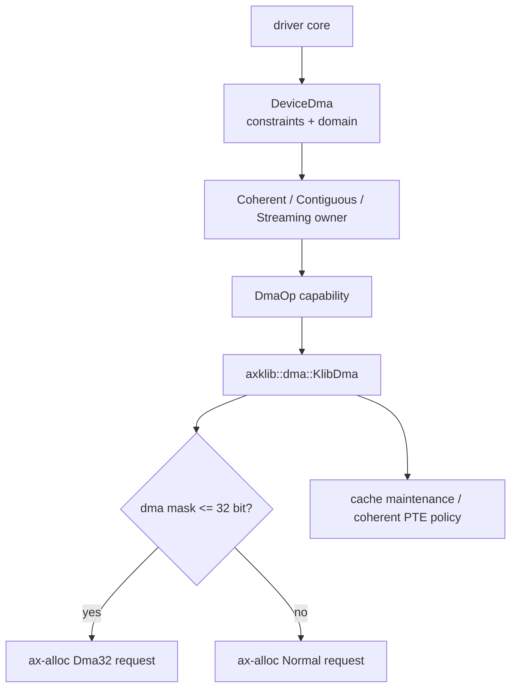
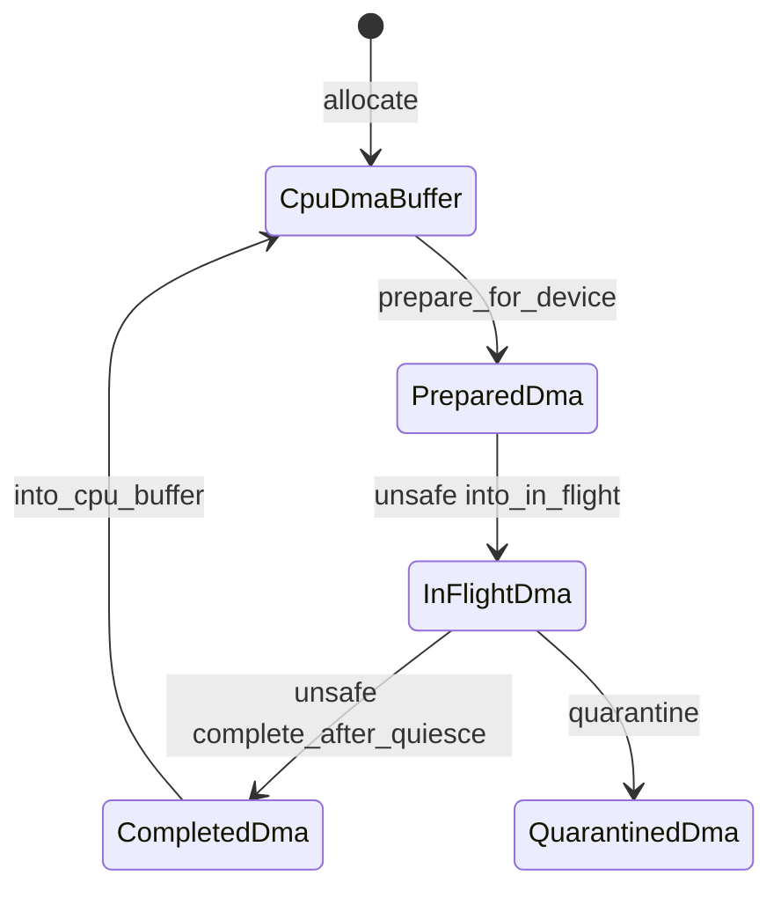
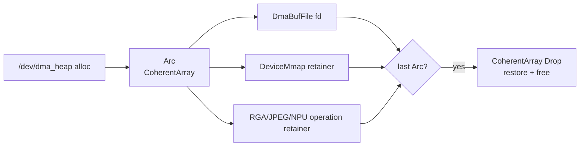

# DMA 内存与设备所有权

`memory/dma-api` 是驱动可见的 DMA capability boundary。驱动通过 `DeviceDma` 表达 mask、alignment、boundary、segment size 和 translation domain，通过 coherent、contiguous 或 streaming RAII owner 管理生命周期；`axklib::dma` 负责把能力接到 `ax-alloc`、页表属性和平台 cache maintenance。

## 1. 分层边界

DMA 不是独立物理 allocator。底层页仍由 `ax-alloc` 管理，`dma-api` 增加的是设备可达性、cache ownership 和 consume-on-release 协议。

### 1.1 组件职责

当前 DMA 主线只有能力层和平台 adapter，不保留已删除的 DMA facade 或裸元数据手工释放模型。

| 组件 | 职责 | 禁止承担的职责 |
| --- | --- | --- |
| `dma-api` | device constraints、domain、typed buffer、sync、RAII token | 直接依赖全局 allocator、解析 FDT/IOMMU 控制器 |
| `axklib::dma` | `DmaOp` adapter、页申请、PA 转换、cache/PTE 属性切换 | 暴露裸释放元数据、保存驱动对象 |
| `ax-runtime::Klib` | 将 mask 映射到 Normal/Dma32 `PageRequest` | 创建第二个 DMA allocator |
| 驱动 core | 持有 owner、编程 DMA address、执行 ownership transition | 直接 free imported buffer、绕过 constraint check |
| Starry dma-buf glue | fd/mmap/import 的 `Arc` lifetime | 把 user fd lifetime 当成唯一 owner |

MMIO 使用 `mmio-api` 建立寄存器映射，不经 DMA allocator。IOMMU page table 若实现，应归具体 controller/domain adapter，不复用 CPU Stage-2 作为 IOPTE 格式。

### 1.2 请求数据流

设备创建 `DeviceDma` 后，所有 allocation/map 都先经过通用 constraint 验证，再由 `DmaOp` 执行平台动作。



当前 `KlibDma` 使用 `virt_to_phys` 得到 device address，表示 IOMMU-bypass/identity 路径。`DmaDomainId::identity()` 明确这是兼容 domain，不代表已经实现 device-specific IOMMU isolation。

## 2. DeviceDma 约束

`DeviceDma` 可 Clone，内部持有静态 `DmaOp` capability、`DmaConstraints` 和稳定 `DmaDomainId`。clone 共享同一 backend，不复制 allocation owner。

### 2.1 Constraint model

`DmaConstraints` 在每次 allocation/map 后由 `DeviceDma` 再验证 backend token，防止错误平台实现把不可达地址交给硬件。

| 约束 | 验证规则 | 错误 |
| --- | --- | --- |
| `addr_mask` | allocation 的最后一个 byte 也必须在 mask 内 | `DmaMaskNotMatch` |
| `align` | DMA address 满足 device 与 Layout 最大 alignment | `AlignMismatch` |
| `boundary` | start 与 end 位于同一 boundary window | `BoundaryCross` |
| `max_segment_size` | bytes 不超过单 segment 上限 | `SegmentTooLarge` |
| nonzero length | `Layout::size()` 必须大于 0，且在调用 backend 前检查 | `ZeroSizedBuffer` |

检查使用 checked end-address arithmetic。零长度请求不会进入 backend；backend 返回其他不合规 token 时，`DeviceDma` 先按值消费并释放/unmap token，再向调用方返回 typed error。

### 2.2 Domain identity

`DmaDomainId` 是非零稳定标识，用于拒绝已经为另一个设备/IOMMU domain 准备的 buffer。`with_constraints()` 保留原 domain，只替换 constraints。

| 构造 | 语义 |
| --- | --- |
| `DeviceDma::new(domain, mask, op)` | 显式 domain |
| `DeviceDma::new_identity(mask, op)` | identity/bypass domain |
| `axklib::dma::device_with_mask(mask)` | 当前 runtime adapter 的 identity/bypass domain |

真正 IOMMU 支持需要 domain-specific map/unmap、IOVA ownership、device attach/detach 和 IOTLB invalidation。未实现的平台不能仅换一个 domain id 就声称完成隔离。

## 3. DmaPod 与 typed buffer

DMA typed buffer 允许设备直接读写 `T` 的原始字节，因此 `T` 必须没有引用、资源 owner、无效 bit pattern 或未初始化 padding。`DmaPod` 是这一不变量的 unsafe marker。

### 3.1 安全契约

`DmaPod: Copy` 的 `# Safety` 要求全零 bit pattern 有效，任意设备写入不会破坏 Rust validity，且值不拥有需要 Drop 的资源或引用。

```rust
pub unsafe trait DmaPod: Copy {}

unsafe impl<T: bytemuck::Pod> DmaPod for T {}
```

trait 必须是 `unsafe`，因为编译器无法仅从 `Copy` 证明布局、padding 和所有 bit pattern 安全。`unsafe` 把无法自动验证的责任集中在实现点，而不是让每次 buffer 访问都隐式承担未声明前提。

### 3.2 实现规则

本地 hardware descriptor 应优先 `#[derive(bytemuck::Pod, bytemuck::Zeroable)]`，通过 blanket impl 获得 `DmaPod`。只有外部类型 wrapper 或 derive 无法表达的特殊布局才允许 manual `unsafe impl`。

| 类型情况 | 处理 |
| --- | --- |
| 本地 `repr(C)` descriptor、无 padding | derive `Pod + Zeroable` |
| 外部 crate hardware record | 用本地透明/固定布局 wrapper，并审计 |
| 含引用、pointer owner、enum invalid niche | 禁止作为 typed DMA buffer |
| manual `unsafe impl DmaPod` | 必须紧邻英文 SAFETY 注释和 size/align/layout assertion |

当前生产代码中 xHCI context 的四个外部 wrapper 保留 manual impl，并配套布局断言。新增驱动不得为方便而给普通 descriptor 批量添加 manual unsafe impl。

## 4. DMA buffer 类型

DMA API 区分 coherent allocation、普通连续 allocation 和 existing buffer streaming map。三者的 cache 与物理 ownership 不同。

### 4.1 Coherent 与 contiguous

`CoherentBox/Array` 和 `ContiguousBox/Array` 内部都持有不可复制的 `DmaAllocation`。区别在于 coherent mapping 生命周期内无需显式 cache maintenance，而 contiguous 需要按 direction 转移 ownership。

| 类型 | 物理连续 | CPU/device cache 规则 | Drop |
| --- | --- | --- | --- |
| `CoherentBox<T>` / `CoherentArray<T>` | 是 | 无显式 clean/invalidate；ordering barrier 仍由驱动负责 | 恢复平台 mapping policy并 consume token |
| `ContiguousBox<T>` / `ContiguousArray<T>` | 是 | 调用 `prepare_for_device` / `complete_for_cpu` | consume contiguous token |
| `ContiguousBufferPool` | pool 内每项连续 | 与 ContiguousArray 相同；固定容量，耗尽立即返回 `NoMemory` | 返回 pool；pool 消失后 owner 正常 Drop |

CPU accessor 本身不会自动 sync cache。高层 `write_for_device()` 和 `read_from_device()` 将 CPU access 与相应 sync 组合，普通 `set_cpu()`/`read_cpu()` 只执行内存访问。

### 4.2 Streaming map 与 bounce

`StreamingMap<T>` 借用调用方已有 slice，并持有 move-only `DmaMapHandle`。若原 buffer 的 PA 不满足 mask/alignment，`KlibDma` 分配符合约束的 bounce pages 并把地址记录在 token 中。

| Direction | device 前动作 | CPU 完成动作 |
| --- | --- | --- |
| `ToDevice` | copy 到 bounce（若有）并 clean | 通常无需 invalidate/copy back |
| `FromDevice` | invalidate device target | invalidate 后从 bounce copy back |
| `Bidirectional` | clean/invalidate并可能 copy-in | invalidate并可能 copy-out |

`StreamingMap::drop()` 按值消费 token并 unmap；bounce pages 同时释放。调用方必须保证原 slice 在整个 map 生命周期保持 live。

## 5. Token 与状态所有权

底层 handle 和高层 owner 解决不同问题。handle 是 backend release metadata，高层 container 的 Drop 才是日常驱动应使用的 RAII。

### 5.1 Move-only handle

`DmaAllocHandle` 保存 CPU address、DMA address、Layout 和 opaque backend token；`DmaMapHandle` 额外保存可选 bounce pointer。两者不实现 `Copy`/`Clone`。

| Token | 创建 | 消费 |
| --- | --- | --- |
| `DmaAllocHandle` | `alloc_contiguous` / `alloc_coherent` | `dealloc_contiguous(handle)` / `dealloc_coherent(handle)` |
| `DmaMapHandle` | `map_streaming` | `unmap_streaming(handle)` |
| `DmaPageAllocation` | runtime `dma_alloc_pages` | runtime `dma_dealloc_pages(allocation)` |

查询方法只借用 token，free/unmap 按值消费。opaque backend token 当前由 `axklib` 编码 `Normal` 或 `Dma32` 来源，释放时恢复原 zone，无需额外 bool 参数。

### 5.2 Async ownership states

`CpuDmaBuffer` 提供面向异步 request 的显式状态转换：CPU-owned → Prepared → InFlight → Completed。硬件未 quiesce 时不能安全回收 backing。



直接 Drop `InFlightDma` 或 `QuarantinedDma` 会故意泄漏 backing，避免硬件仍访问时内存被重用。正确驱动应在 reset/timeout 路径证明硬件 quiesce 后完成 owner 转换；无法证明时泄漏是安全隔离而不是正常资源管理策略。

## 6. axklib Runtime adapter

`components/axklib/src/dma.rs::KlibDma` 实现 `DmaOp`。它把通用 Layout 转成页数与对齐，通过 Klib 回调向 `ax-alloc` 申请页面。

### 6.1 Zone 与 release metadata

`ax-runtime` 根据 mask 选择 allocator zone，并返回 move-only `DmaPageAllocation { addr, num_pages, zone }`。`KlibDma` 把 zone 编码进 handle backend token，dealloc 时恢复。

| Mask | Runtime request | Usage |
| --- | --- | --- |
| `<= u32::MAX` | `MemoryZone::Dma32` | `UsageKind::Dma` |
| `> u32::MAX` | `MemoryZone::Normal` | `UsageKind::Dma` |

release 接口按值消费完整 allocation metadata，避免旧 `_dma32: bool` 与地址、页数分离后传错来源。页数不匹配或 mask/alignment 防御检查失败会立即归还页面。

### 6.2 Coherent policy 与 cache

当前 coherent adapter 通过 `mem_make_dma_coherent_uncached()` 修改 kernel mapping，allocation 前后执行平台 cache/PTE 同步；释放前调用 `mem_restore_dma_cached()`。

| 路径 | 平台动作 |
| --- | --- |
| coherent alloc | 申请页 → clean/属性准备 → PTE 改 uncached → TLB/cache barrier → 清零 |
| coherent free | 恢复 cached PTE → TLB/cache barrier → 归还原 zone |
| contiguous sync | 按 direction clean/invalidate normal mapping |
| streaming bounce | 使用符合 mask 的 Normal/Dma32 pages，并在 sync 时 copy |

恢复 cached mapping 是释放 coherent page 的前置不变量。失败时 adapter 立即终止该内核路径，绝不把属性不一致的 page 归还 Buddy；平台页表实现必须保证该恢复操作在合法 owner 上成功。

## 7. Starry dma-buf

Starry `/dev/dma_heap` 使用同一 `dma-api` owner，不再保存裸释放元数据。fd、mmap 和加速器 import 共享一个 `Arc` allocation。

### 7.1 Allocation 与 mmap

`DmaBufFile::alloc(len)` 将大小向 4 KiB 取整，使用 `device_with_mask(u32::MAX)` 创建页对齐 `CoherentArray<u8>`，满足当前 RK3588 IOMMU-bypass 32-bit 地址寄存器。



`device_mmap()` 把 allocation clone 为 type-erased retainer，因此用户关闭 fd 后只要 VMA 仍存在，物理页就不会释放。

### 7.2 Import contract

`resolve_contiguous_dmabuf(fd)` 只接受本内核 `DmaBufFile`，返回 `Arc<DmaBufFile>`。设备 glue 获取 DMA base、size 和 operation-lifetime owner，并在提交前验证访问范围。

| 参与者 | 可以做 | 不可以做 |
| --- | --- | --- |
| Starry fd layer | 解析 fd、clone owner | 暴露可复制 free token |
| accelerator glue | 校验 offset/length、保留 `Arc` | 释放 imported buffer |
| driver core | 编程已验证 DMA address | 假定 fd 在 operation 中始终存在 |
| mmap | 借用同一 PA 并持有 retainer | 独立拥有或释放 page |

同一 owner 模型适用于 RGA、JPEG 和 NPU import，避免每个设备建立自己的 DMA facade 或手工引用计数。

## 8. 验证与源码入口

DMA 错误往往表现为静默数据损坏，因此测试必须同时覆盖类型、constraint、cache transition、ownership 和异常 teardown。

### 8.1 必测不变量

`dma-api` 已包含 compile-fail 文档测试和 tracking backend 单元测试。新增能力应继续使用确定性 backend 记录每次 alloc/free/map/unmap/sync。

| 测试 | 证明内容 |
| --- | --- |
| 非法 reference 类型不满足 `DmaPod` | typed buffer 不接受引用/owner |
| handle 不满足 `Copy` | token 不能重复 free/unmap |
| RAII owner Drop 计数为 1 | backend token 只消费一次 |
| backend 地址超出 mask | 验证失败并先释放 token |
| boundary/segment/alignment | constraint 错误是 typed error |
| streaming bounce copy-in/out | direction 与 sync 顺序正确 |
| explicit domain survives constraints | `with_constraints` 不丢 domain |
| in-flight timeout/quarantine | backing 不在硬件访问时重用 |

硬件测试还需验证 descriptor/ring 在 IRQ 前预分配、completion 不触发通用 heap，以及 device reset 后确实 quiesce 才完成 in-flight owner。

### 8.2 源码检查点

下面的文件构成 DMA 从公共能力到系统 fd 的完整路径。unsafe 修改必须遵循 `book/guideline/code-quality.md` 的 Safety contract 要求。

| 源码 | 审计重点 |
| --- | --- |
| `memory/dma-api/src/def.rs` | constraint、typed error、`DmaPod`、move-only token |
| `memory/dma-api/src/lib.rs` | `DeviceDma` validation 与高层构造 |
| `memory/dma-api/src/common.rs` | `DmaAllocation` 单次 Drop |
| `memory/dma-api/src/array.rs` / `dbox.rs` | typed coherent/contiguous owner |
| `memory/dma-api/src/streaming.rs` | borrow、bounce sync 与 unmap |
| `memory/dma-api/src/owned.rs` | async ownership state machine |
| `components/axklib/src/dma.rs` | zone token、coherent mapping、cache adapter |
| `os/arceos/modules/axruntime/src/klib.rs` | mask → PageRequest 与按值释放 |
| `os/StarryOS/kernel/src/file/dmabuf.rs` | fd/mmap/import 共享 `Arc` owner |

任何新 manual `unsafe impl DmaPod`、裸 handle 构造或 in-flight completion 都应作为独立 soundness review 点，而不是普通样板代码。
