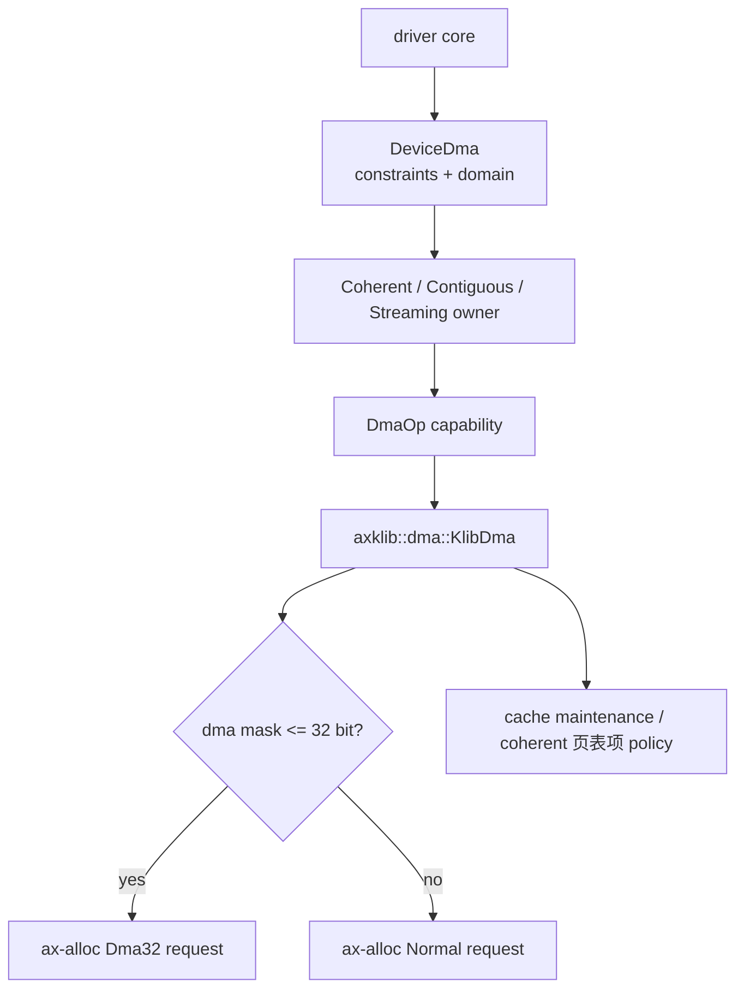
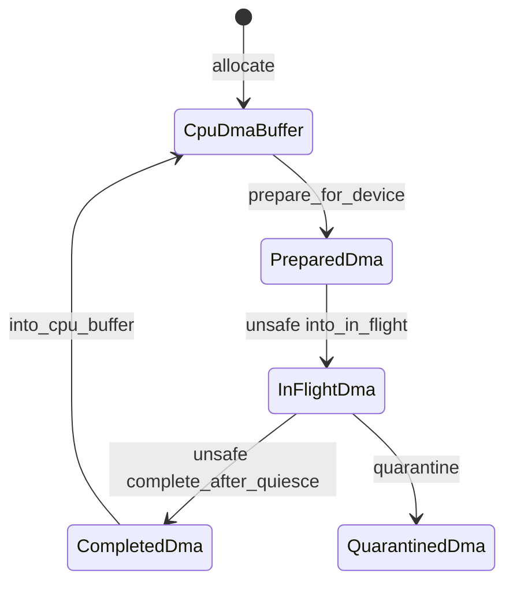
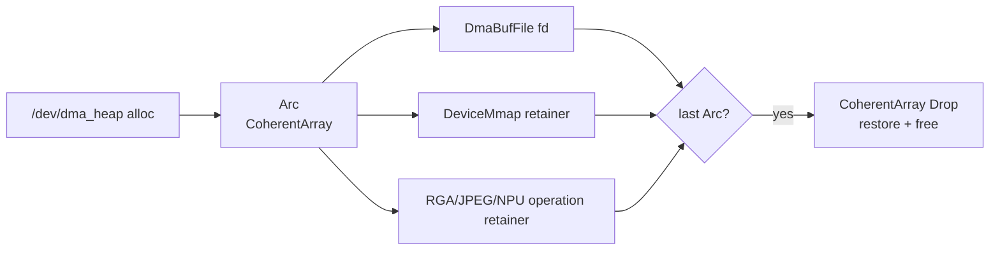
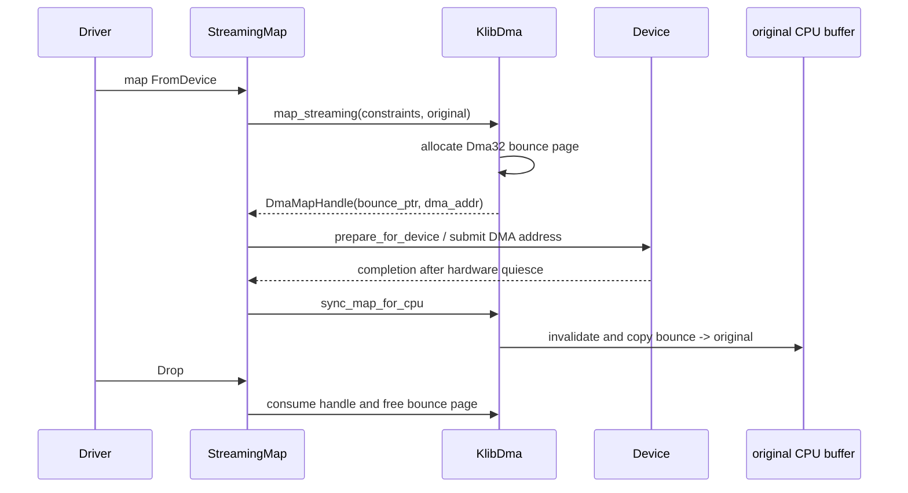

# DMA 内存与设备所有权

`memory/dma-api` 是驱动可见的 DMA 能力边界。驱动通过 `DeviceDma` 表达地址掩码、对齐、边界、单段大小和地址转换域，通过 coherent、contiguous 或 streaming 的 Resource Acquisition Is Initialization（资源获取即初始化，RAII）所有者管理生命周期；`axklib::dma` 负责把能力接到 `ax-alloc`、页表属性和平台缓存维护。

## 1. 分层边界

DMA 不是独立物理 allocator。底层页仍由 `ax-alloc` 管理，`dma-api` 增加的是设备可达性、cache ownership 和 consume-on-release 协议。

### 1.1 组件职责

当前 DMA 主线只有能力层（`dma-api`）和平台 adapter（`axklib::dma`）。驱动通过 `DeviceDma` 表达约束、通过 RAII owner 管理生命周期，平台 adapter 负责把能力接到 `ax-alloc`、页表属性和平台缓存维护。

| 组件 | 职责 | 禁止承担的职责 |
| --- | --- | --- |
| `dma-api` | device constraints、domain、typed buffer、sync、资源获取即初始化 token | 直接依赖全局 allocator、解析 扁平设备树/输入输出内存管理单元控制器 |
| `axklib::dma` | `DmaOp` adapter、页申请、物理地址转换、cache/页表项属性切换 | 暴露裸释放元数据、保存驱动对象 |
| `ax-runtime::Klib` | 将 mask 映射到 Normal/Dma32 `PageRequest` | 创建第二个 DMA allocator |
| 驱动 core | 持有 owner、编程 DMA address、执行 ownership transition | 直接 free imported buffer、绕过 constraint check |
| Starry dma-buf glue | fd/mmap/import 的 `Arc` lifetime | 把 user fd lifetime 当成唯一 owner |

MMIO 使用 `mmio-api` 建立寄存器映射，不经 DMA allocator。输入输出内存管理单元 page table 若实现，应归具体 controller/domain adapter，不复用 CPU Stage-2 作为 IOPTE 格式。

### 1.2 请求数据流

设备创建 `DeviceDma` 后，所有 allocation/map 都先经过通用 constraint 验证，再由 `DmaOp` 执行平台动作。



当前 `KlibDma` 使用 `virt_to_phys` 得到 device address，表示输入输出内存管理单元-bypass/identity 路径。`DmaDomainId::legacy_global()` 标记尚未按设备拆分的兼容 domain，不代表已经实现 device-specific 输入输出内存管理单元 isolation。

### 1.3 架构差异

`dma-api` 的类型和 ownership 在各架构相同，平台 adapter 负责处理物理地址转换、缓存一致性和设备内存属性。驱动不得根据 `target_arch` 自行跳过 cache transition。

| 架构 | identity DMA 地址来源 | cache 处理 | coherent/uncached 页属性 |
| --- | --- | --- | --- |
| x86_64 | 去除内核物理线性映射偏移 | 常见平台为硬件一致，仍由 capability 决定 | 页表禁用缓存/写穿透位 |
| AArch64 | 区分镜像、每 CPU 区和普通线性映射后取物理地址 | 显式 clean、invalidate 和数据同步屏障 | `MAIR_ELx` 的 Normal/Non-cacheable/Device 槽位 |
| RISC-V 64 | 按重定位和 `PAGE_OFFSET` 反向转换 | 由具体 cache controller/platform capability 决定 | 标准实现与处理器扩展能力分开 |
| LoongArch64 | `addrspace::to_phys()` 去除直接映射窗口编码 | 当前平台至少执行数据屏障 | 页表项 Memory Access Type（内存访问类型，MAT） |

Dma32 始终按转换后的物理地址末端检查 4 GiB 上限。虚拟地址低于 4 GiB 不代表设备可达，带直接映射窗口高位的虚拟地址也不代表物理地址超限。

## 2. 设备约束

`DeviceDma` 可 Clone，内部持有静态 `DmaOp` capability、`DmaConstraints` 和稳定 `DmaDomainId`。clone 共享同一 backend，不复制 allocation owner。

### 2.1 约束模型

`DmaConstraints` 在每次 allocation/map 后由 `DeviceDma` 再验证 backend token，防止错误平台实现把不可达地址交给硬件。

| 约束 | 验证规则 | 错误 |
| --- | --- | --- |
| `addr_mask` | allocation 的最后一个 byte 也必须在 mask 内 | `DmaMaskNotMatch` |
| `align` | DMA address 满足 device 与 Layout 最大 alignment | `AlignMismatch` |
| `boundary` | start 与 end 位于同一 boundary window | `BoundaryCross` |
| `max_segment_size` | bytes 不超过单 segment 上限 | `SegmentTooLarge` |
| nonzero length | `Layout::size()` 必须大于 0，且在调用 backend 前检查 | `ZeroSizedBuffer` |

检查使用 checked end-address arithmetic。零长度请求不会进入 backend；backend 返回其他不合规 token 时，`DeviceDma` 先按值消费并释放/unmap token，再向调用方返回 typed error。

### 2.2 转换域身份

`DmaDomainId` 是非零稳定标识，用于拒绝已经为另一个设备/输入输出内存管理单元 domain 准备的 buffer。`with_constraints()` 保留原 domain，只替换 constraints。

| 构造 | 语义 |
| --- | --- |
| `DeviceDma::new(domain, mask, op)` | 显式 domain |
| `DeviceDma::new_legacy(mask, op)` | 尚未按设备拆分的全局兼容 domain |
| `axklib::dma::device_with_mask(mask)` | 当前 runtime adapter 的全局兼容 domain |

真正输入输出内存管理单元支持需要 domain-specific map/unmap、输入输出虚拟地址 ownership、device attach/detach 和输入输出地址转换后备缓冲区 invalidation。未实现的平台不能仅换一个 domain id 就声称完成隔离。

`DmaDomainId` 内部使用 `NonZeroU64`。`legacy_global()` 的值为 1；`from_raw(0)` 为兼容旧调用方回落到该值，非零值原样保存。当前接口没有保留值校验，也没有仅凭 domain id 实现输入输出内存管理单元隔离。

```rust
#[derive(Debug, Clone, Copy, PartialEq, Eq, PartialOrd, Ord, Hash)]
pub struct DmaDomainId(NonZeroU64);

impl DmaDomainId {
    /// Compatibility domain for callers without device-specific translation.
    pub const fn legacy_global() -> Self {
        Self(NonZeroU64::MIN)
    }

    pub fn from_raw(id: u64) -> Self {
        Self(NonZeroU64::new(id).unwrap_or(NonZeroU64::MIN))
    }
}
```

`DmaConstraints` 是 plain struct，调用方通过 builder-style `with_align()` / `with_boundary()` / `with_max_segment_size()` 链式补充约束。`boundary` 与 `max_segment_size` 都是 `Option<usize>`：`None` 表示“无对应约束”，`Some(b)` 表示“DMA 起止必须落在同一 `b` 字节窗口内”或“单个 segment 不得超过 `b` 字节”。

## 3. 类型安全

DMA typed buffer 允许设备直接读写 `T` 的原始字节，因此 `T` 必须没有引用、资源 owner、无效 bit pattern 或未初始化 padding。`DmaPod` 是这一安全性条件的 unsafe marker。

### 3.1 安全契约

`DmaPod: Copy` 的 `# Safety` 要求全零 bit pattern 有效，任意设备写入不会破坏 Rust validity，且值不拥有需要 Drop 的资源或引用。

```rust
pub unsafe trait DmaPod: Copy {}

unsafe impl<T: bytemuck::Pod> DmaPod for T {}
```

trait 必须是 `unsafe`，因为编译器无法仅从 `Copy` 证明布局、padding 和所有 bit pattern 安全。`unsafe` 把无法自动验证的责任集中在实现点，而不是让每次 buffer 访问都隐式承担未声明前提。

### 3.2 实现规则

本地 hardware descriptor 应优先 `#[derive(bytemuck::Pod, bytemuck::Zeroable)]`，通过 blanket impl 获得 `DmaPod`。只有外部类型 wrapper 或 derive 无法表达的特殊布局才允许 manual `unsafe impl`。

| 类型情况 | 处理 |
| --- | --- |
| 本地 `repr(C)` descriptor、无 padding | derive `Pod + Zeroable` |
| 外部 crate hardware record | 用本地透明/固定布局 wrapper，并审计 |
| 含引用、pointer owner、enum invalid niche | 禁止作为 typed DMA buffer |
| manual `unsafe impl DmaPod` | 必须紧邻英文 SAFETY 注释和 size/align/layout assertion |

当前生产代码中 xHCI context 的四个外部 wrapper 保留 manual impl，并配套布局断言。新增驱动不得为方便而给普通 descriptor 批量添加 manual unsafe impl。

## 4. 缓冲区类型

DMA API 区分 coherent allocation、普通连续 allocation 和 existing buffer streaming map。三者的 cache 与物理 ownership 不同。

### 4.1 一致性与连续缓冲区

`CoherentBox/Array` 和 `ContiguousBox/Array` 内部都持有不可复制的 `DmaAllocation`。区别在于 coherent mapping 生命周期内无需显式 cache maintenance，而 contiguous 需要按 direction 转移 ownership。

| 类型 | 物理连续 | CPU/device cache 规则 | Drop |
| --- | --- | --- | --- |
| `CoherentBox<T>` / `CoherentArray<T>` | 是 | 无显式 clean/invalidate；ordering barrier 仍由驱动负责 | 恢复平台 mapping policy并 consume token |
| `ContiguousBox<T>` / `ContiguousArray<T>` | 是 | 调用 `prepare_for_device` / `complete_for_cpu` | consume contiguous token |
| `ContiguousBufferPool` | pool 内每项连续 | 与 ContiguousArray 相同；固定容量，耗尽立即返回 `NoMemory` | 返回 pool；pool 消失后 owner 正常 Drop |

CPU accessor 本身不会自动 sync cache。高层 `write_for_device()` 和 `read_from_device()` 将 CPU access 与相应 sync 组合，普通 `set_cpu()`/`read_cpu()` 只执行内存访问。

### 4.2 流式映射与回弹缓冲区

`StreamingMap<T>` 借用调用方已有 slice，并持有 move-only `DmaMapHandle`。若原 buffer 的物理地址不满足 mask/alignment，`KlibDma` 分配符合约束的 bounce pages 并把地址记录在 token 中。

| Direction | device 前动作 | CPU 完成动作 |
| --- | --- | --- |
| `ToDevice` | copy 到 bounce（若有）并 clean | 通常无需 invalidate/copy back |
| `FromDevice` | invalidate device target | invalidate 后从 bounce copy back |
| `Bidirectional` | clean/invalidate并可能 copy-in | invalidate并可能 copy-out |

`StreamingMap::drop()` 按值消费 token并 unmap；bounce pages 同时释放。调用方必须保证原 slice 在整个 map 生命周期保持 live。

## 5. 令牌与状态所有权

底层 handle 和高层 owner 解决不同问题。handle 是 backend release metadata，高层 container 的 Drop 才是日常驱动应使用的资源获取即初始化。

### 5.1 单次消费令牌

`DmaAllocHandle` 保存 CPU address、DMA address、Layout 和 opaque backend token；`DmaMapHandle` 额外保存可选 bounce pointer。两者不实现 `Copy`/`Clone`。

| Token | 创建 | 消费 |
| --- | --- | --- |
| `DmaAllocHandle` | `alloc_contiguous` / `alloc_coherent` | `dealloc_contiguous(handle)` / `dealloc_coherent(handle)` |
| `DmaMapHandle` | `map_streaming` | `unmap_streaming(handle)` |
| `DmaPageAllocation` | runtime `dma_alloc_pages` | runtime `dma_dealloc_pages(allocation)` |

查询方法只借用 token，free/unmap 按值消费。opaque backend token 供真正需要额外释放信息的 backend 使用；当前 `axklib` adapter 使用默认值 0，因为 `Normal` 与 `Dma32` 共享 Buddy section，释放根据地址定位 section，无需额外 zone 或 bool 参数。

`DmaAllocHandle` 的字段对 backend 可见（`pub(crate)`），但对外只暴露查询方法。两个 unsafe 构造函数把“调用方证明 cpu_addr/dma_addr 关系”的责任集中在创建点，避免后续每次访问都重复验证。

```rust
#[derive(Debug, PartialEq, Eq, Hash)]
pub struct DmaAllocHandle {
    pub(crate) cpu_addr: NonNull<u8>,
    pub(crate) dma_addr: DmaAddr,
    pub(crate) layout: Layout,
    pub(crate) backend_token: usize,
}

/// Backend mapping token with consume-on-unmap ownership.
#[derive(Debug, PartialEq, Eq, Hash)]
pub struct DmaMapHandle {
    pub(crate) cpu_addr: NonNull<u8>,
    pub(crate) dma_addr: DmaAddr,
    pub(crate) layout: Layout,
    pub(crate) bounce_ptr: Option<NonNull<u8>>,
    pub(crate) backend_token: usize,
}
```

`DmaMapHandle::bounce_ptr` 为 `Some` 时表示原 buffer 不满足 DMA 约束，backend 已经分配了符合 mask 的 bounce page 并把 DMA 地址指向 bounce。释放时 bounce 与 handle 一并按值消费。`backend_token` 由具体 backend 解释，当前 `axklib` 不在其中编码地址区域。

`dma-api` 通过 doc-test 强制这些 token 不能复制：把 `require_copy::<DmaAllocHandle>()` 写在 compile_fail 代码块中，使任何意外添加 `Copy`/`Clone` 的实现都会被 doc-test 拦截。

### 5.2 异步所有权状态

`CpuDmaBuffer` 提供面向异步 request 的显式状态转换：CPU-owned → Prepared → InFlight → Completed。硬件未 quiesce 时不能安全回收 backing。



直接 Drop `InFlightDma` 或 `QuarantinedDma` 会故意泄漏 backing，避免硬件仍访问时内存被重用。正确驱动应在 reset/timeout 路径证明硬件 quiesce 后完成 owner 转换；无法证明时泄漏是安全隔离而不是正常资源管理策略。

## 6. 运行时适配

`components/axklib/src/dma.rs::KlibDma` 实现 `DmaOp`。它把通用 Layout 转成页数与对齐，通过 Klib 回调向 `ax-alloc` 申请页面。

### 6.1 来源与释放元数据

`ax-runtime` 根据 mask 选择 allocator zone，并返回 move-only `DmaPageAllocation { addr, num_pages }`。zone 只参与申请时的地址筛选；释放根据地址定位 Buddy section，因此不写入 allocation token 或 handle backend token。

| Mask | Runtime request | Usage |
| --- | --- | --- |
| `<= u32::MAX` | `MemoryZone::Dma32` | `UsageKind::Dma` |
| `> u32::MAX` | `MemoryZone::Normal` | `UsageKind::Dma` |

release 接口按值消费地址和页数，避免旧 `_dma32: bool` 与地址、页数分离后传错。页数不匹配或 mask/alignment 防御检查失败会立即归还页面。

### 6.2 一致性与缓存策略

当前 coherent adapter 通过 `mem_make_dma_coherent_uncached()` 修改 kernel mapping，allocation 前后执行平台 cache/页表项同步；释放前调用 `mem_restore_dma_cached()`。

| 路径 | 平台动作 |
| --- | --- |
| coherent alloc | 申请页 → clean/属性准备 → 页表项改 uncached → 地址转换后备缓冲区/cache barrier → 清零 |
| coherent free | 恢复 cached 页表项 → 地址转换后备缓冲区/cache barrier → 按地址归还 Buddy section |
| contiguous sync | 按 direction clean/invalidate normal mapping |
| streaming bounce | 使用符合 mask 的 Normal/Dma32 pages，并在 sync 时 copy |

恢复 cached mapping 是释放 coherent page 的前置条件。失败时 adapter 立即终止该内核路径，绝不把属性不一致的 page 归还 Buddy；平台页表实现必须保证该恢复操作在合法 owner 上成功。

## 7. Starry 共享缓冲区

Starry `/dev/dma_heap` 使用同一 `dma-api` owner，不再保存裸释放元数据。fd、mmap 和加速器 import 共享一个 `Arc` allocation。

### 7.1 分配与映射

`DmaBufFile::alloc(len)` 将大小向 4 KiB 取整，使用 `device_with_mask(u32::MAX)` 创建页对齐 `CoherentArray<u8>`，满足当前 RK3588 输入输出内存管理单元-bypass 32-bit 地址寄存器。



`device_mmap()` 把 allocation clone 为 type-erased retainer，因此用户关闭 fd 后只要虚拟内存区域仍存在，物理页就不会释放。

### 7.2 导入契约

`resolve_contiguous_dmabuf(fd)` 只接受本内核 `DmaBufFile`，返回 `Arc<DmaBufFile>`。设备 glue 获取 DMA base、size 和 operation-lifetime owner，并在提交前验证访问范围。

| 参与者 | 可以做 | 不可以做 |
| --- | --- | --- |
| Starry fd layer | 解析 fd、clone owner | 暴露可复制 free token |
| accelerator glue | 校验 offset/length、保留 `Arc` | 释放 imported buffer |
| driver core | 编程已验证 DMA address | 假定 fd 在 operation 中始终存在 |
| mmap | 借用同一物理地址并持有 retainer | 独立拥有或释放 page |

同一 owner 模型适用于 RGA、JPEG 和 NPU import，避免每个设备建立自己的 DMA facade 或手工引用计数。

## 8. 源码入口

下面的文件构成 DMA 从公共能力到系统 fd 的完整路径。完整的类型、约束、缓存转换、所有权和异常 teardown 用例集中在[内存管理测试与验收](./testing.md)。

### 8.1 源码检查点

Unsafe 修改必须遵循 `book/guideline/code-quality.md` 的 Safety contract 要求。

| 源码 | 审计重点 |
| --- | --- |
| `memory/dma-api/src/def.rs` | constraint、typed error、`DmaPod`、move-only token |
| `memory/dma-api/src/lib.rs` | `DeviceDma` validation 与高层构造 |
| `memory/dma-api/src/common.rs` | `DmaAllocation` 单次 Drop |
| `memory/dma-api/src/array.rs` / `dbox.rs` | typed coherent/contiguous owner |
| `memory/dma-api/src/streaming.rs` | borrow、bounce sync 与 unmap |
| `memory/dma-api/src/owned.rs` | async ownership state machine |
| `components/axklib/src/dma.rs` | zone token、coherent mapping、cache adapter |
| `os/arceos/modules/axruntime/src/klib.rs` | mask → PageRequest 与按值释放 |
| `os/StarryOS/kernel/src/file/dmabuf.rs` | fd/mmap/import 共享 `Arc` owner |

任何新 manual `unsafe impl DmaPod`、裸 handle 构造或 in-flight completion 都应作为独立 soundness review 点，而不是普通样板代码。

## 9. 设备请求实例

DMA 请求是否有效由整个地址范围、设备 domain 和 ownership 阶段共同决定。下面以 descriptor ring、streaming RX 和 dma-buf import 展开三种不同生命周期。

### 9.1 描述符环分配

假设设备使用 32-bit DMA address，descriptor ring 为 256 项、每项 32 B，要求 4 KiB 对齐、不得跨 64 KiB boundary，单 segment 上限 16 KiB。请求大小为 8192 B。

```rust
let constraints = DmaConstraints::new(u32::MAX as u64)
    .with_align(0x1000)
    .with_boundary(0x1_0000)
    .with_max_segment_size(0x4000);
let device = axklib::dma::device_with_mask(u32::MAX as u64)
    .with_constraints(constraints);
let ring = device.coherent_array_zero_with_align::<Descriptor>(256, 0x1000)?;
```

`Descriptor` 必须通过 `bytemuck::Pod + Zeroable` 获得 `DmaPod`。8192 B 没有超过 16 KiB；runtime 构造两个 Dma32 pages，并在 backend 返回后再次验证起点、末地址和 boundary。

| Backend 返回 DMA start | Range | 结果 |
| --- | --- | --- |
| `0x0010_0000` | `0x0010_0000..0x0010_2000` | 满足 4 KiB alignment 和 64 KiB boundary |
| `0x0010_f000` | `0x0010_f000..0x0011_1000` | 跨 `0x0011_0000` boundary，释放 token 后返回 `BoundaryCross` |
| `0xffff_f000` | `0xffff_f000..0x1_0000_1000` | 末地址超出 32-bit mask，释放 token 后返回 `DmaMaskNotMatch` |

mask 检查必须覆盖最后一个 byte，而不是只检查 start。constraint 验证失败时，`DeviceDma` 消费 backend token执行对应 deallocation，调用方不会得到一个需要手工清理的半有效 owner。

```rust
match self.check_alloc_handle(&res, constraints) {
    Ok(()) => Ok(res),
    Err(error) => {
        unsafe { self.op.dealloc_coherent(res) };
        Err(error)
    }
}
```

成功后 `CoherentArray` 独占 move-only handle。驱动只保存 owner和 `dma_addr()`，不能把 `(addr, pages, dma32)` 拆成三份长期状态。

### 9.2 流式接收与回弹

假设网络驱动已有一个位于物理地址 `0x1_2000_0000` 的 4096 B CPU buffer，但设备只能访问 32-bit 地址。`map_streaming_slice(..., FromDevice)` 无法直接使用原物理地址，`KlibDma` 必须从 Dma32 路径申请 bounce page。



`FromDevice` 不需要在提交前把原 buffer 内容复制到 bounce，因为设备将覆盖目标；完成后必须 invalidate device-written range 并 copy back。`ToDevice` 的方向相反，提交前 copy-in/clean，完成后通常不 copy back。

| Direction | 提交前 bounce | 完成后 bounce |
| --- | --- | --- |
| `ToDevice` | original → bounce | 无 copy-back |
| `FromDevice` | 无需保留 original 内容 | bounce → original |
| `Bidirectional` | original → bounce | bounce → original |

硬件 completion 到达不自动证明 DMA 已停止。驱动必须按设备协议确认 queue ownership 已回到 CPU，才能调用 complete/sync 并释放 mapping；timeout 路径无法证明 quiesce 时应进入 quarantine，而不是 Drop 后复用页面。

### 9.3 一致性页属性转换

当前 identity adapter 的 coherent allocation 使用普通物理页，但在 CPU kernel mapping 中切换为 uncached。顺序是分配、cache 准备、修改页表项、地址转换后备缓冲区/cache barrier、清零，再交给设备。

```text
allocate Normal/Dma32 pages
        |
        v
dma_coherent_before_make_uncached
        |
        v
kernel 页表项 cached -> uncached
        |
        v
地址转换后备缓冲区/cache mapping-update barrier
        |
        v
zero bytes and publish DmaAllocHandle
```

释放顺序必须先撤销设备使用并恢复 cached mapping，再按地址和页数归还 Buddy。分配时的 `Normal`/`Dma32` 只决定地址筛选，不参与释放路由。

```rust
unsafe fn dealloc_coherent(&self, handle: DmaAllocHandle) {
    let num_pages = DmaPages::layout_pages(handle.layout());
    CoherentDmaPolicy::restore_cached(handle.as_ptr(), num_pages)
        .expect("DMA pages must regain their cached mapping before release");
    DmaPages::dealloc_pages(
        handle.as_ptr(),
        num_pages,
    );
}
```

恢复失败时不能继续 free，因为 Buddy 后续可能把仍带 uncached alias 或失效地址转换后备缓冲区状态的页交给普通内核对象。当前实现把这种平台一致性故障视为不可恢复错误。

### 9.4 dma-buf 引用顺序

假设用户创建 dma-buf fd 7，随后 mmap，再把 fd 传给 RGA，最后按“关闭 fd、解除 mmap、RGA completion”顺序释放。三者都持有同一个 `Arc<DmaBufAlloc>`。

| 时刻 | fd owner | mmap retainer | RGA retainer | backing 状态 |
| --- | ---: | ---: | ---: | --- |
| allocation 后 | 1 | 0 | 0 | live |
| mmap 后 | 1 | 1 | 0 | live |
| import 后 | 1 | 1 | 1 | live |
| close fd | 0 | 1 | 1 | live |
| munmap | 0 | 0 | 1 | live |
| RGA completion | 0 | 0 | 0 | 最后一个 Arc Drop，恢复 cached并释放 Dma32 pages |

驱动 core只接收 DMA address、length 和 operation-lifetime retainer，不接收释放函数。这样 fd close 与 device completion 的先后顺序不会造成 use-after-free，也不需要在每个加速器中复制 dma-buf 引用计数。
