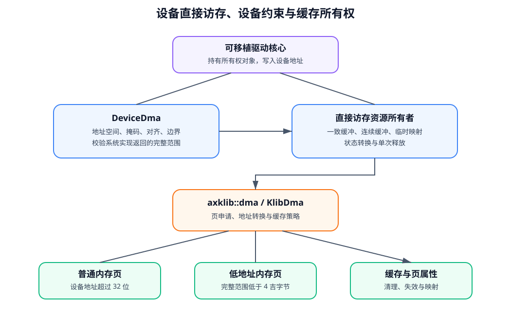
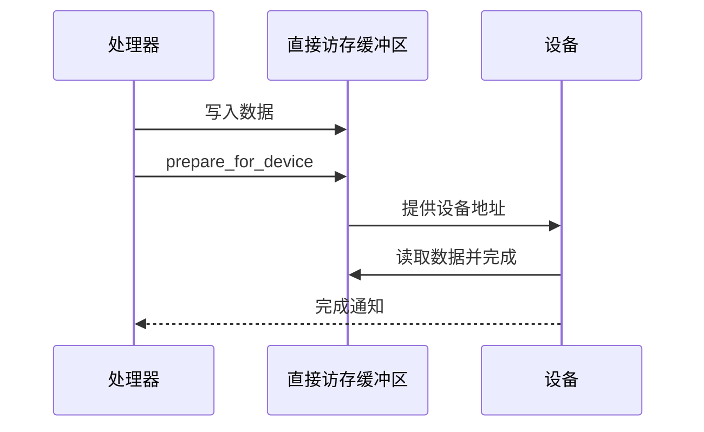
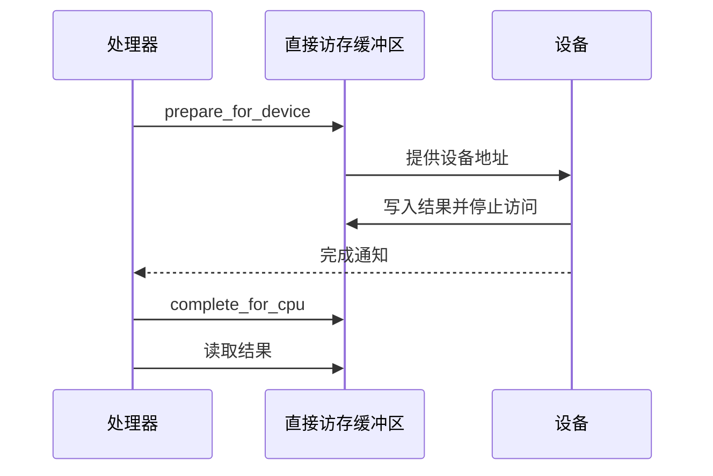
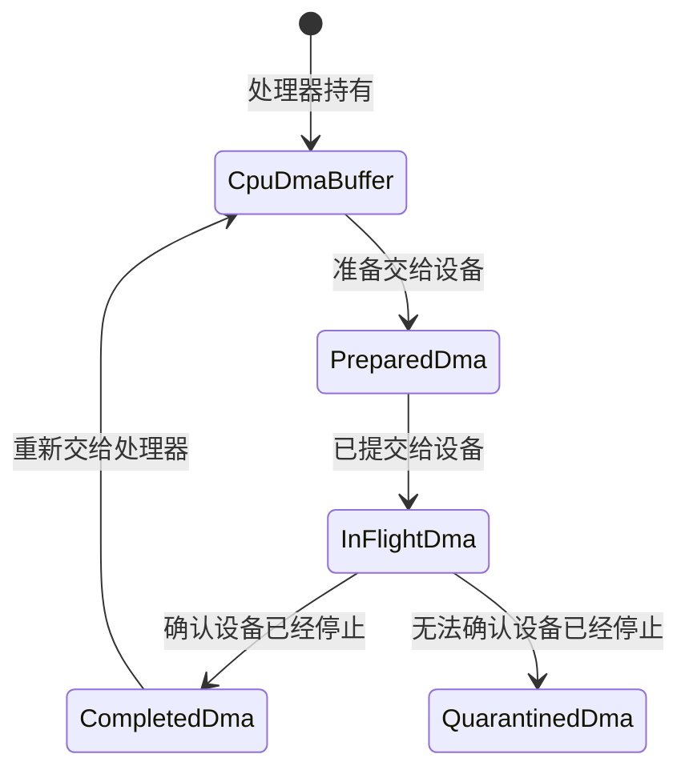

# 设备直接访存接口设计

本文面向第一次接触设备直接访存的读者。这里的“设备直接访存”是指：网卡、硬盘控制器、图形处理器等设备，不经过处理器逐字节搬运，直接读写内存。代码中沿用通用缩写 `DMA`。

## 1. 先理解问题

处理器和设备虽然都在访问内存，但它们看到的内容和地址不一定相同。

- 处理器写入的数据可能暂时留在缓存中，设备还看不到。
- 设备写入内存后，处理器缓存里可能仍是旧数据。
- 设备能够使用的地址位数可能有限，例如只能访问低 4 吉字节。
- 某些机器会在设备和内存之间做地址转换，同一个设备地址只对某个转换空间有效。
- 一块内存在交给设备后，处理器不能同时随意改写；设备完成前也不能释放或复用。

所以，这不是简单调用一次“同步内存”就能完整解决的问题。系统既要知道“底层怎样同步”，也要知道“这台设备是否需要同步、什么时候同步、同步哪一段、使用哪个设备地址、当前由谁使用”。

## 2. 1775 暴露了什么

1775 发现的问题，本质上是设备属性和平台动作没有被完整绑定到一起。

在模拟的 RISC-V 机器上，存储控制器与处理器能够直接看到一致的内存内容，不需要为它额外建立无缓存映射。如果把它一律当成“不一致设备”处理，就会走到不必要的特殊映射分配，最后可能以“没有可用内存”失败。

但在 SG2002 一类机器上，设备与处理器并不自动保持缓存一致。提交描述符前若不把处理器写入推出缓存，设备可能读取旧描述符；设备写完后若不让处理器丢弃旧缓存，处理器又可能读取旧结果。

因此，正确方案必须同时满足两端：

- 自动保持一致的设备，不做多余的缓存和映射操作。
- 不能自动保持一致的设备，在所有权切换时执行正确操作。
- 两种设备使用同一套上层接口，由设备自身属性决定底层动作。

这也是本次重构能解决 1775 的关键，而不是单独增加某个平台同步函数。

## 3. 为什么只有系统内存同步接口还不够

`someboot` 和 `somehal` 已经提供了缓存范围处理能力。它们适合回答“这台机器具体怎样清理缓存”，但无法独自回答下面的问题。

| 问题 | 谁负责回答 |
| --- | --- |
| 设备是否自动保持一致 | 总线或固件探测结果 |
| 设备只能访问哪些地址 | 设备能力和控制器限制 |
| 地址是否经过转换 | 设备所属的地址空间 |
| 当前是处理器交给设备，还是设备交还处理器 | 驱动的请求生命周期 |
| 同步整块内存还是其中一段 | 缓冲区所有者 |
| 设备尚未停止时能否释放内存 | 驱动的完成和复位流程 |
| 某种处理器具体执行哪条缓存指令 | `someboot` 和 `somehal` |

如果驱动直接调用系统内存同步函数，每个驱动都要重复判断这些条件，也很容易把方向写反、漏掉一条完成路径，或者对本来自动一致的设备执行错误操作。

因此分层如下：


```mermaid
flowchart LR
    A["设备探测：得到设备属性"] --> B["dma-api：检查地址、记录所有权、决定是否同步"]
    B --> C["axklib：连接系统内存和页表能力"]
    C --> D["somehal：转交当前平台实现"]
    D --> E["someboot：执行本处理器所需的缓存和屏障操作"]
```

从内存对象的角度看，驱动持有的所有权对象会同时约束设备地址、内存页来源和平台缓存动作：



`someboot` 和 `somehal` 仍然是必需的，但它们是最后一段平台实现，不是设备直接访存的完整语义接口。

## 4. 唯一的设备描述

一台设备的直接访存能力用 `DmaDeviceInfo` 一次性描述，包含三部分：

1. 设备地址属于哪个地址空间。
2. 设备和处理器是否自动保持缓存一致。
3. 设备地址、对齐、边界和单段长度限制。

```rust
let info = DmaDeviceInfo::new(
    DmaDomainId::Direct,
    DmaCoherency::NonCoherent,
    DmaConstraints::new(u32::MAX as u64)
        .with_align(64)
        .with_boundary(0x1_0000)
        .with_max_segment_size(0x4000),
);
let dma = DeviceDma::new(info, axklib::dma::op());
```

`DeviceDma` 只接受完整描述和系统实现，不再接受一组容易错位的零散参数。块设备队列也直接携带同一个 `DmaDeviceInfo`，文件系统不再把设备域、一致性和地址限制重新拼装一遍。

### 4.1 地址空间只有两种明确情况

`DmaDomainId` 不再使用“历史全局值”或数字零回退。

- `DmaDomainId::Direct`：设备地址就是物理地址。当前未启用设备地址转换的平台使用这一项。
- `DmaDomainId::Translated(编号)`：为以后接入设备地址转换保留的明确类型。当前实现还没有建立这种转换空间，不能因为填写了编号就认为已经完成地址转换或设备隔离；真正接入后，编号必须来自已建立并绑定到设备的转换空间。

这样可以避免把一个随手填写的数字误认为已经实现了设备隔离。将来接入地址转换硬件时，也必须从真正的转换空间取得编号，不能继续借用全局占位值。

### 4.2 缓存一致性是设备属性

`DmaCoherency::Coherent` 表示设备和处理器能够自动看到对方写入的内容。`DmaCoherency::NonCoherent` 表示所有权切换时必须执行平台规定的缓存处理。

它不是由处理器种类单独决定的。同一种处理器上，不同设备也可能具有不同属性。这个值应来自设备树、固件表、总线信息或明确的平台配置。

### 4.3 地址限制必须检查整个范围

`DmaConstraints` 包含：

- `addr_mask`：设备能表示的地址范围。
- `align`：设备地址起点必须满足的对齐。
- `boundary`：一个连续段不能跨过的边界。
- `max_segment_size`：单个连续段的最大长度。

检查必须覆盖最后一个字节。只检查起始地址会漏掉“开头在范围内、末尾已经越界”的情况。平台分配返回不合规地址时，`DeviceDma` 会先收回该分配，再向驱动返回明确错误。

## 5. 内存所有权怎样切换

公开接口只保留一套所有权用语：

- `prepare_for_device(范围)`：处理器已经写完，把指定范围交给设备。
- `complete_for_cpu(范围)`：设备已经停止访问，把指定范围交还处理器。

不再同时提供另一套 `sync_for_*` 名称，也不再提供仅仅转调的 `*_all` 兼容入口。整块数组使用 `0..bytes_len()` 明确范围；只有固定大小的单值容器可以省略范围。

以“处理器写、设备读”为例：


```mermaid
sequenceDiagram
    participant C as 处理器
    participant M as 直接访存缓冲区
    participant D as 设备
    C->>M: 写入数据
    C->>M: prepare_for_device
    M->>D: 提供设备地址
    D->>M: 读取数据并完成
    D-->>C: 完成通知
```

以“设备写、处理器读”为例：


```mermaid
sequenceDiagram
    participant C as 处理器
    participant M as 直接访存缓冲区
    participant D as 设备
    C->>M: prepare_for_device
    M->>D: 提供设备地址
    D->>M: 写入结果并停止访问
    D-->>C: 完成通知
    C->>M: complete_for_cpu
    C->>M: 读取结果
```

对于自动保持一致的设备，这些上层步骤仍然保留，因为所有权顺序没有消失；底层只是跳过不需要的缓存操作。对于不能自动保持一致的设备，同样的步骤会下传到平台缓存实现。

## 6. 三类缓冲区

### 6.1 自动一致缓冲区

`CoherentArray<T>` 和 `CoherentBox<T>` 适合设备描述符、命令队列、完成队列等频繁交接的小块控制数据。

如果设备本身自动一致，系统保留普通映射；如果设备不自动一致，后端可以为处理器建立专用映射，当前实现使用无缓存别名。这个映射只是保证处理器按正确方式访问同一块内存，并不会把原本不一致的设备变成一致设备。驱动不需要为两种情况写两套逻辑。

### 6.2 物理连续缓冲区

`ContiguousArray<T>` 和 `ContiguousBox<T>` 适合数据区。它们使用普通的处理器映射，在交给设备和收回时执行显式所有权转换。

高层组合方法如 `copy_to_device_from_slice` 和 `read_from_device` 仍然保留，因为它们表达的是一次完整动作，而不是旧接口的别名。

### 6.3 临时映射已有内存

`StreamingMap<T>` 用于一次请求中临时交给设备的现有内存。如果原内存地址不满足设备限制，平台实现会申请一块符合限制的中转内存：

- 处理器交给设备前，按传输方向复制到中转内存。
- 设备交还处理器后，按传输方向复制回原内存。
- 映射对象销毁时，自动解除映射并释放中转内存。

## 7. 异步请求不能提前释放

块设备请求可能在提交后很久才完成。仅收到超时不代表设备已经停止访问内存。因此异步缓冲区使用类型变化表示状态：


```mermaid
stateDiagram-v2
    [*] --> CpuDmaBuffer: 处理器持有
    CpuDmaBuffer --> PreparedDma: 准备交给设备
    PreparedDma --> InFlightDma: 已提交给设备
    InFlightDma --> CompletedDma: 确认设备已经停止
    CompletedDma --> CpuDmaBuffer: 重新交给处理器
    InFlightDma --> QuarantinedDma: 无法确认设备已经停止
```

无法证明设备已经停止时，宁可隔离这块内存，也不能把它重新交给分配器。否则设备可能继续写入已经被别处使用的页面，造成难以复现的数据破坏。

## 8. 系统实现具体怎样同步

当前调用链为：

1. 驱动调用 `prepare_for_device` 或 `complete_for_cpu`。
2. `dma-api` 根据设备一致性和传输方向决定是否需要缓存操作。
3. `axklib` 把内存范围传给内核运行时。
4. 动态平台层把请求交给 `somehal::cache`。
5. `somehal` 转交 `someboot::mem`。
6. `someboot` 的各处理器实现执行对应缓存指令和必要屏障。

三种基本动作是：

| 动作 | 目的 |
| --- | --- |
| 清理 | 把处理器缓存中的新数据写到设备可见的位置 |
| 失效 | 丢弃处理器可能保存的旧数据，让之后读取设备写入的新内容 |
| 清理并失效 | 双向传输时同时处理两种风险 |

平台函数只处理“怎样做”。是否调用、调用方向和内存生命周期仍由 `dma-api` 与驱动所有权流程决定。

## 9. 纯粹接口的取舍

本次设计有意不保留历史兼容层：

- 删除 `DeviceDma::new_legacy`。
- 删除 `DmaDomainId::legacy_global` 和数字零自动回退。
- 删除 `axklib::dma::device_with_mask`，改为传入完整设备描述。
- 删除公开的 `sync_for_device`、`sync_for_cpu` 及仅转调的整块别名。
- `DmaAllocHandle` 只保留一个构造入口，明确给出处理器访问地址、分配器释放地址和设备地址。
- 块设备队列只保存一个 `DmaDeviceInfo`，不再复制其中字段。

这样做会要求所有调用方一次性迁移，但最终只有一条正确路径，后续代码无需猜测旧接口和新接口的差别。

## 10. 验证重点

验证不能只看能否编译，还要覆盖下列行为：

- 自动一致设备不会执行多余缓存操作，也不会错误申请专用无缓存映射。
- 非自动一致设备在交给设备和交还处理器时执行对应缓存操作。
- 设备地址的最后一个字节不能超过地址范围。
- 不满足地址范围时能够使用中转内存，并按传输方向复制。
- 不同地址转换空间准备的缓冲区不能混用。
- 块设备队列传递的设备描述与实际缓冲区完全一致。
- 设备未停止时，异步缓冲区不能被释放或复用。

这些检查共同保证既修复 1775 的一致性误判，也不会破坏 SG2002 等确实需要缓存处理的平台。

## 11. 主要源码位置

| 文件 | 作用 |
| --- | --- |
| `memory/dma-api/src/def.rs` | 设备描述、地址空间、限制和错误类型 |
| `memory/dma-api/src/lib.rs` | 设备能力入口和统一检查 |
| `memory/dma-api/src/array.rs` | 数组缓冲区及范围所有权转换 |
| `memory/dma-api/src/dbox.rs` | 固定大小缓冲区 |
| `memory/dma-api/src/streaming.rs` | 已有内存的临时映射 |
| `memory/dma-api/src/owned.rs` | 异步请求状态变化 |
| `components/axklib/src/dma.rs` | 内核内存、地址和缓存能力连接 |
| `os/arceos/modules/axruntime/src/klib.rs` | 内核运行时实现 |
| `platforms/axplat-dyn/src/mem.rs` | 动态平台转接 |
| `platforms/somehal/src/cache.rs` | 平台硬件抽象入口 |
| `platforms/someboot/src/mem/mod.rs` | 各处理器缓存操作入口 |
