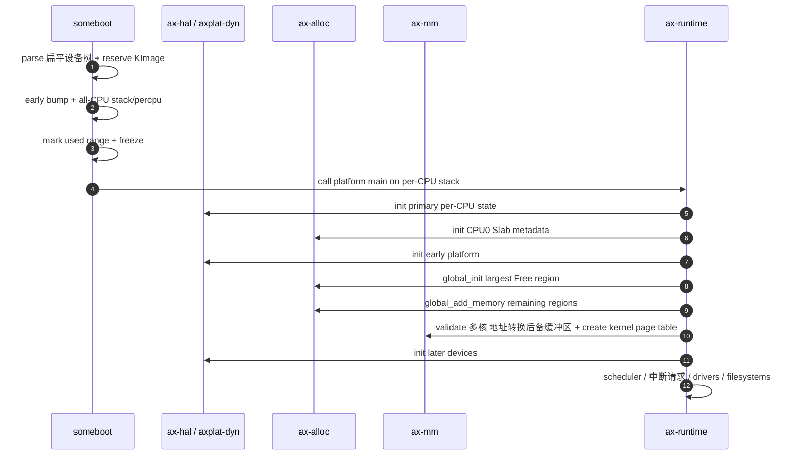
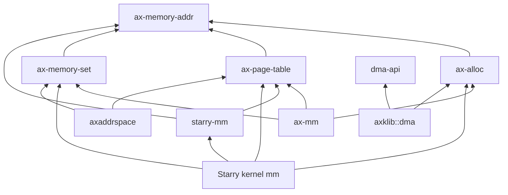
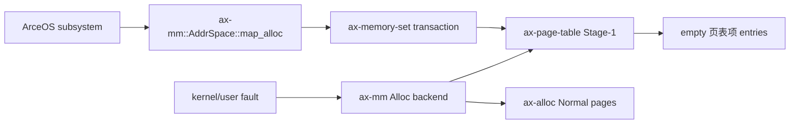
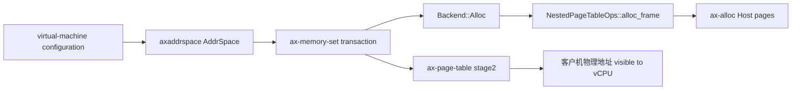

# ArceOS、StarryOS 与 Axvisor 内存集成

三套系统共享启动内存、运行时分配器和页表机制，但不共享同一套地址空间策略。ArceOS 使用 `ax-mm`，StarryOS 在公共机制上增加 Linux 虚拟内存策略，Axvisor 使用 `axaddrspace` 管理客户机第二阶段地址转换；设备分别通过 `dma-api` 和 `mmio-api` 获取 DMA 内存与 MMIO 寄存器能力。

## 1. 层级与组件数量

层级是否必要应以不变量是否不同判断，而不是单纯统计 crate 数量。当前公共核心、系统策略和能力 adapter 各自维护不同 ownership，合并会造成反向依赖或重复策略。

### 1.1 必要层级

下表说明每一层隔离的变化原因。相邻层之间只保留实际需要的 capability。

| 层级 | 组件 | 必须独立的原因 |
| --- | --- | --- |
| 地址事实 | `ax-memory-addr` | Host typed address 被 allocator、页表、DMA共同使用 |
| 启动事实 | `kernutil::memory` + `someboot` | 无堆、固定容量、固件区间与 early bump 状态机 |
| 运行时资源 | `ax-alloc` | 唯一公共 page/heap/stats/zone 入口 |
| allocator 算法 | `buddy-slab-allocator` | Buddy/Slab 内部结构不泄露给系统策略 |
| 页表机制 | `ax-page-table` | 页表项/Stage-1/Stage-2/boot 共用 frame 与 entry 不变量 |
| 虚拟内存区域事务 | `ax-memory-set` | 跨 backend 的 metadata 与页表项 all-or-rollback |
| 系统策略 | `ax-mm`、Starry mm、`axaddrspace` | Host kernel、Linux process、Guest RAM 语义不同 |
| 设备能力 | `dma-api`、`mmio-api` 与 `axklib` 适配 | DMA 缓冲区所有权和 MMIO 寄存器映射分别与分配器、地址空间实现解耦 |

`ax-alloc` 位于运行时资源层，不位于页表或 Starry policy 层。它既不应被 `buddy-slab-allocator` 之外的算法 crate 包装成多套 facade，也不应吸收虚拟内存区域、DMA domain 或 reclaim policy。

### 1.2 不应新增的层

当前架构明确拒绝只做转发或保存重复状态的组件。新增 crate 必须拥有独立领域不变量和多个真实消费者。

| 不新增的抽象 | 原因 |
| --- | --- |
| 第二个 page allocator facade | 会绕过 `ax-alloc` zone/usage/stats |
| 通用 pool manager | 固定池应由有实际容量依据的中断请求/driver owner 持有 |
| DMA allocator crate | `dma-api` 是能力边界，页仍来自 `ax-alloc` |
| 空壳输入输出内存管理单元 crate | controller/domain/IOPTE 未实现时只会伪装支持 |
| Starry 虚拟内存转发 facade | syscall/kernel adapter 应直接消费 `starry-mm` 类型 |
| 公共 crate compatibility alias | 形成长期双入口和 feature/re-export 冗余 |

机械转发方法应删除或由上层直接调用公共组件；但承载不同地址类型、ownership 或 rollback 语义的 adapter 不能仅因代码短而合并。

## 2. 启动顺序

启动顺序保证 allocator 的 metadata、per-CPU Slab、页表和中断请求路径在使用前就绪。引导处理器完成全局资源接管，应用处理器只初始化 CPU-local 状态。

### 2.1 引导处理器路径

动态平台的引导处理器从 `someboot` 进入 `ax-runtime::rust_main()`。关键顺序如下。



`init_percpu_slab()` 可以在全局 Buddy 初始化前建立空的 CPU-local Slab；真正小对象 allocation 必须等 `init_allocator()` 完成。设备 probe 在 allocator 和 kernel page table 建立之后执行。

### 2.2 应用处理器路径

应用处理器使用 someboot 已预留 stack 进入 `rust_main_secondary()`，先绑定 per-CPU data，再初始化本地 Slab和 local 硬件抽象层状态。

| 顺序 | 操作 | 不变量 |
| --- | --- | --- |
| 1 | 超出编译 CPU capacity 的 hart 停驻 | 不索引越界 per-CPU storage |
| 2 | `ax_hal::percpu::init_secondary(cpu_id)` | 本 CPU per-CPU address 有效 |
| 3 | `ax_alloc::init_percpu_slab(cpu_id)` | scheduler/中断请求前 local Slab ready |
| 4 | `ax_mm::init_memory_management_secondary()` | 加载共享 kernel root 并 local flush |
| 5 | scheduler/处理器间中断/中断请求 init | 此后运行正常并发路径 |

应用处理器不调用 `global_add_memory()`，也不重新分配 boot stack。全局 Buddy 只由引导处理器完成物理区交接。

## 3. ArceOS 集成

ArceOS 是公共 runtime 和 Host Stage-1 的主要集成者。它使用统一 allocator 服务内核对象、页表、用户页、任务栈与设备 DMA。

### 3.1 内核与用户地址空间

启用 paging 时，`ax-runtime` 调用 `ax_mm::init_memory_management()`，后者验证 多核 invalidation capability、创建 fine-grained kernel page table、写 root register 并 flush。

| 资源 | ArceOS 路径 | Usage |
| --- | --- | --- |
| Rust heap/object | `GlobalAlloc` → Slab/Buddy | `RustHeap` |
| Stage-1 page table | `PagingHandlerImpl` → Normal pages | `PageTable` |
| allocation-backed 虚拟内存区域 | `ax-mm::Backend::Alloc` | `VirtMem` |
| kernel task stack | `TaskStack` → GlobalAlloc/pages | `RustHeap` 或 `Global` |
| MMIO 虚拟地址 | `ax-mm::iomap` → Linear backend | 不拥有物理 RAM |

runtime page-fault handler 先诊断 kernel stack guard，再把其他 fault 交给 `kernel_aspace().handle_page_fault()`。ArceOS policy 不实现 Linux overcommit 或 file 虚拟内存区域 reclaim。

### 3.2 DMA 与驱动

启用相应设备能力时，`ax-runtime` 提供 Klib 回调，`axklib::dma::KlibDma` 把 `DeviceDma` allocation 接到 `ax-alloc`。

| 层 | ArceOS 职责 |
| --- | --- |
| `ax-runtime` | mask → Normal/Dma32、cache/页表项/虚拟地址平台回调 |
| `axklib` | 实现 `DmaOp`、编码 release zone、bounce buffer |
| `dma-api` | 验证 constraints、资源获取即初始化与 ownership transition |
| driver | 持有 owner、预分配 ring、在正确时机 sync/quiesce |

驱动 core 不依赖 `ax-mm` 或 `ax-alloc`，只依赖 `dma-api`。OS glue 不能把 allocator raw page token泄露给 portable driver。

## 4. StarryOS 集成

StarryOS 复用 ArceOS 运行时、主机页表、分配器与驱动框架，再通过独立 `starry-mm` 和 kernel backend 提供 Linux 进程虚拟内存。

### 4.1 进程虚拟内存

Starry kernel 的 `AddrSpace` 与 ArceOS `ax-mm::AddrSpace` 并列，不在后者外面再包一层 Linux 虚拟内存区域。两者共享 `ax-memory-set` 和 Stage-1 mechanism，但 backend policy 不同。

| 能力 | 公共机制 | Starry 专属策略 |
| --- | --- | --- |
| 虚拟地址 range transaction | `ax-memory-set` | Linux mmap/mprotect/mremap ordering |
| 页表项 | `ax-page-table::stage1` | Cow/Shared/File/Linear backend |
| physical pages | `ax-alloc` | 常驻内存集大小 category、写时复制 refs、page cache owner |
| 内存不足 | allocator 立即 `NoMemory` | fault 外层一次 clean-page reclaim |
| admission | 无公共 allocator policy | RLIMIT_AS + Always/Strict commit |

`starry-mm` 通过 feature `starry-strict-commit` 切换 mode 2；默认 mode 1。Starry kernel feature 只把该选项转发给策略 crate，不保留第二套 overcommit 实现。

### 4.2 设备内存

Starry `/dev/dma_heap`、ION compatibility 和 RGA/JPEG/NPU/TPU glue 使用 `dma-api`。用户 fd 只提供查找入口，实际 allocation 生命周期由 `Arc` owner 保留。

| 场景 | Ownership |
| --- | --- |
| dma-buf fd live | `DmaBufFile` 持有 `Arc<DmaBufAlloc>` |
| fd close、mmap 仍 live | 虚拟内存区域 retainer继续持有同一 Arc |
| accelerator operation | import glue 持有 operation-lifetime retainer |
| 最后引用释放 | `CoherentArray` Drop 恢复 mapping 并释放 Dma32 页 |

设备 backend 不释放 imported buffer，也不维护与 fd/mmap 分离的裸引用计数。

## 5. Axvisor 集成

Axvisor 的核心内存对象是 Guest physical address space 和 nested page table。Host allocator 与 Guest policy 通过 `NestedPageTableOps` 分离。

### 5.1 嵌套页表

各架构保留原有 `NestedPageTable<HostPagingHandler>` 领域名称，并实现 `NestedPageTableOps` 供 `axaddrspace` 使用。统一 frame provider 是新 capability，不需要无意义地把所有 adapter 重命名为 Runtime provider。

| 架构 | Stage-2/嵌套页表 形态 | Root consumer |
| --- | --- | --- |
| AArch64 | 第二阶段地址转换表 | `VTTBR` 与虚拟机控制寄存器 |
| x86_64 | EPT/嵌套页表 adapter | VMCS/VMCB |
| RISC-V | nested translation table | HGATP |
| LoongArch64 |架构 嵌套页表 adapter | vCPU translation control |

`ax-page-table` 的 `stage2` feature提供 variable-level engine；具体 entry format、flush 和 vCPU register programming 留在 AxVM 架构模块。

### 5.2 客户机内存所有权

`axaddrspace::Backend::Alloc` 通过 嵌套页表 adapter 申请 Host frame，支持 eager populate 或 Guest fault lazy allocation。`Backend::Linear` 映射调用方已有 Host 物理地址。

| Guest memory | Owner | teardown |
| --- | --- | --- |
| allocation-backed RAM | `AddrSpace`/backend | unmap transaction finalize 或 `AddrSpace::drop()` |
| 线性保留 RAM | 外部虚拟机或平台所有者 | 只删除嵌套页表映射 |
| 嵌套页表页帧 | 具体嵌套页表所有者 | 页表析构或虚拟机销毁 |
| emulated device buffer | 对应 device model/DMA owner | 不由 Guest RAM backend隐式释放 |

Guest teardown 必须先停止 vCPU 和设备 DMA，再清除地址空间。页表/Guest RAM owner 不能在硬件仍访问时提前 Drop。

## 6. 嵌入式与系统配置

配置通过真实 crate feature 组合能力。文档中的 profile 是构建目标，不是要求创建一个集中 profile manager 或虚构 Cargo feature。

### 6.1 嵌入式配置

嵌入式默认采用主流实时操作系统的简单机制：启动期固定容量 metadata、Buddy、固定 size-class Slab，以及驱动 ring/descriptor 预分配。只有经过消费者审计并纳入具体 hard-实时 构建的中断请求/实时 路径，才声明“通用动态分配次数为 0”；默认构建当前不作这一保证。

| 配置目标 | 启用内容 | 不启用内容 |
| --- | --- | --- |
| 单核最小 ArceOS | Buddy + local Slab，按需 Stage-1 | 多核 shootdown、Stage-2、Starry policy |
| 多核 embedded | per-CPU Slab + 处理器间中断/hardware broadcast | 非统一内存访问、page migration、compaction |
| hard-实时 | 具体驱动和子系统的固定池 | 实时 critical 中 GlobalAlloc/Buddy/reclaim |
| fixed-function device | 只链接实际 driver DMA/MMIO capability | 通用 pool manager、未使用 reserve |

这种方案类似实时操作系统的“简单 heap + fixed block/pool +静态预分配”取舍，但保留 Rust 资源获取即初始化、typed errors和多段物理内存支持。它不复制 Linux 的完整物理内存子系统。

### 6.2 系统与虚拟化配置

Starry 和 hypervisor 在同一底座上增加所需策略，不迫使嵌入式镜像承担这些成本。

| 配置目标 | 增加内容 | 仍保持的边界 |
| --- | --- | --- |
| Starry default | Linux 虚拟内存区域、常驻内存集大小、写时复制、mode 1、一次有界回收 | allocator 不回收、不阻塞 |
| Starry strict | `starry-strict-commit` mode 2 | 无 heuristic mode 0、无 swap |
| Axvisor | `stage2`、`axaddrspace`、显式 Guest RAM | Host allocator 仍为 `ax-alloc` |
| 混合 Host + device | `dma-api` 与实际 driver | 输入输出内存管理单元未实现时保持 identity/bypass domain |

关闭 Starry 或 Stage-2 后，对应代码和静态状态应由编译裁剪，不应通过 always-on registry 保留。尚无消费者的 reserve 和通用 hard-实时 guard 不进入当前实现。

## 7. 依赖与维护规则

集成层的主要风险是反向依赖、重复状态和启动顺序变化。所有改动应先确认资源 owner，再决定代码位置。

### 7.1 允许的依赖方向

下面的依赖方向是架构约束。辅助 error/log/sync 依赖不改变主线。



禁止 `ax-alloc → Starry/虚拟文件系统/DMA driver`、`ax-page-table → ax-alloc`、`starry-mm → Starry kernel` 或 driver core → `ax-runtime` 的反向依赖。

### 7.2 修改放置规则

新行为按它拥有的不变量放置，避免用“调用方便”作为增加公共层职责的理由。

| 新行为 | 放置位置 |
| --- | --- |
| 新 page usage 统计 | `ax-alloc::UsageKind`，前提是确有独立展示需求 |
| 新架构页表项 bit | `ax-page-table::entry::arch` |
| 新虚拟内存区域 transaction hook | `ax-memory-set` 小 capability |
| Linux 应用程序二进制接口/policy | `starry-mm` 或 Starry kernel adapter，按 OS 依赖划分 |
| Guest mapping policy | `axaddrspace` / AxVM 架构 adapter |
| DMA controller/domain | `drivers/iommu/<controller>` 与 `DmaOp` adapter |
| 中断请求 descriptor pool |实际 driver owner，不创建通用 allocator层 |

只有职责真实变化、原名表达错误或新公共接口替代旧接口时才重命名。统一 trait 不应触发无意义的具体类型批量更名。

## 8. 系统调用路径实例

三套系统共享物理页和页表机制，但它们的最终 owner、错误翻译和 teardown 顺序不同。本节用同一个“需要 16 KiB memory”的规模对比 ArceOS、StarryOS 与 Axvisor 的实际路径。

### 8.1 ArceOS 映射

ArceOS 内核若需要一个按需填页的 16 KiB虚拟区，由 `ax-mm::AddrSpace` 创建 `MemoryArea<Backend>`，`Backend::Alloc { populate: false }` 在虚拟内存区域建立阶段只创建 empty mapping，后续 fault 才逐页申请 `Normal × VirtMem`。



如果调用方使用 `populate: true`，backend prepare/commit 在事务中准备并安装全部物理页；中间失败必须释放已经取得的 frame并保持虚拟内存区域/页表项不变。`Backend::Linear` 则只映射外部物理地址，unmap 不释放其 backing。

| 层 | 16 KiB alloc mapping 的责任 |
| --- | --- |
| `ax-mm` | 选择虚拟范围、backend 和 flags |
| `ax-memory-set` | 虚拟内存区域 split与跨区间事务 |
| Stage-1 | 写页表项、分配下级 table frame、地址转换后备缓冲区 invalidation |
| `ax-alloc` | 提供实际 data frame和 table frame |

ArceOS 不经过 `starry-mm`，也不需要 Linux commit/常驻内存集大小。将常驻内存集大小或 overcommit 放进 `ax-mm` 会使嵌入式消费者承担无关策略。

### 8.2 Starry 匿名映射

Starry 的 16 KiB `MAP_PRIVATE | MAP_ANONYMOUS | PROT_READ | PROT_WRITE` 先通过 syscall 应用程序二进制接口验证，再执行 RLIMIT_AS和 commit delta，最后由 `MemorySet<Backend>` 发布 Cow 虚拟内存区域。未使用 `MAP_POPULATE` 时，建立 mapping不立即消耗四个 resident frame。

```text
sys_mmap
  -> validate flags, fd, offset and user range
  -> admit_address_space(current, replaced, 16 KiB, RLIMIT_AS)
  -> AddressSpaceCommit::prepare_delta(removed_commit, 16 KiB)
  -> AddrSpace::map / MemorySet transaction
  -> CommitDelta::commit
  -> return user 虚拟地址

later write fault
  -> AddrSpace::handle_page_fault
  -> CowBackend::populate
  -> ax-alloc Normal × VirtMem
  -> map 页表项 + record 常驻内存集大小 Anon
```

mapping 成功时虚拟内存大小和 private commit增加 16 KiB，常驻内存集大小仍可能为 0；每个首次写 fault 再使常驻内存集大小 Anon增加一页。syscall 返回值和 errno由 Starry kernel处理，`starry-mm` 只返回 typed policy/fault结果。

### 8.3 Axvisor 客户机内存

Axvisor 的 16 KiB allocation-backed Guest RAM 使用 Guest physical range作为 `axaddrspace` 的地址键，再由 `NestedPageTableOps` 将 客户机物理地址映射到 Host 物理地址。它不建立 Host进程虚拟内存区域，也不维护 Linux 常驻内存集大小。



延迟分配的客户机 RAM 在嵌套缺页时逐页申请，预先分配的 RAM 在映射阶段准备。虚拟机销毁的硬顺序是停止虚拟 CPU、停止或隔离设备 DMA、清除客户机映射、销毁嵌套页表，最后释放主机页帧。

| Teardown 顺序 | 原因 |
| --- | --- |
| 1. stop vCPU | 防止继续执行 Guest load/store |
| 2. quiesce device DMA | 防止 passthrough/emulated queue继续访问 Guest RAM |
| 3. unmap Guest RAM | 移除 客户机物理地址 → 主机物理地址 translation |
| 4. destroy 嵌套页表 | 释放页表 frame |
| 5. release remaining owners | Host frame回到 allocator |

把第 5 步提前会使仍运行的虚拟 CPU 或设备访问已复用页面。`ax-page-table` 只负责第 3、4 步的翻译结构，无法替代虚拟机生命周期同步。

### 8.4 设备分配路径

驱动请求 16 KiB coherent buffer时不直接依赖 `ax-alloc`。`DeviceDma` 校验 device约束，`KlibDma` 通过 runtime callback选择 Normal或Dma32并切换 cache policy。

```text
portable driver
  -> DeviceDma::coherent_array_zero_with_align
  -> dma-api DmaAllocation owner
  -> axklib::dma::KlibDma
  -> ax-runtime Klib::dma_alloc_pages
  -> ax-alloc PageRequest { count=4, zone=Normal/Dma32 }, UsageKind::Dma
```

这条路径跨越多层是因为每层分别拥有 device constraint、资源获取即初始化 token、platform cache policy 和物理页；不能为了减少调用层数把 mask/domain/cache状态塞进通用 allocator。相反，不含新不变量的转发 facade应删除。
