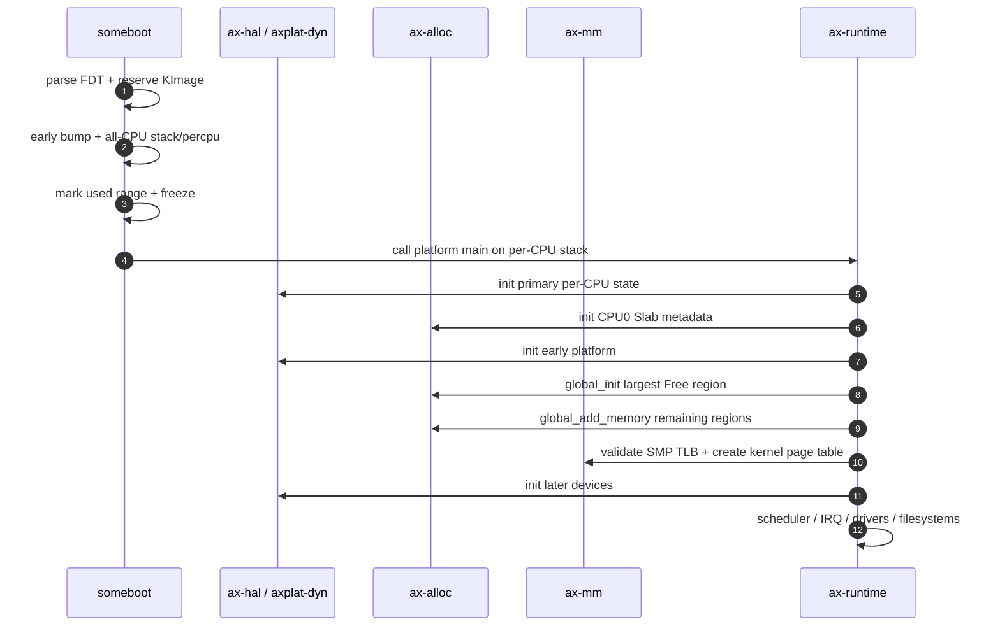
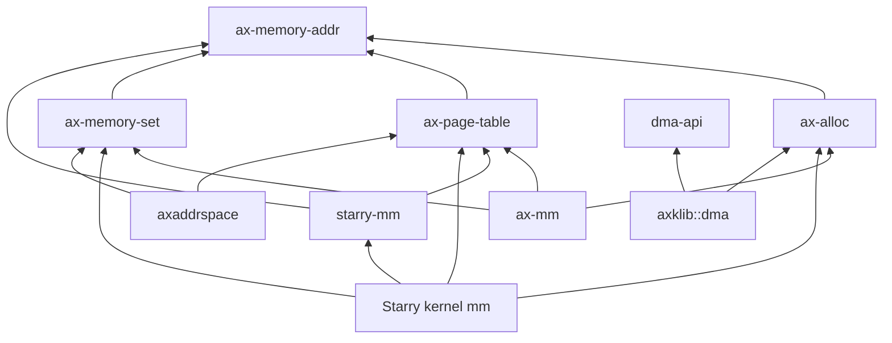

# ArceOS、StarryOS 与 Axvisor 内存集成

三套系统共享启动内存、运行时 allocator 和页表机制，但不共享同一套地址空间策略。ArceOS 使用 `ax-mm`，StarryOS 在公共机制上增加 Linux VM policy，Axvisor 使用 `axaddrspace` 管理 Guest Stage-2；设备统一通过 `dma-api` 获取内存能力。

## 1. 层级与组件数量

层级是否必要应以不变量是否不同判断，而不是单纯统计 crate 数量。当前公共核心、系统策略和能力 adapter 各自维护不同 ownership，合并会造成反向依赖或重复策略。

### 1.1 必要层级

下表说明每一层隔离的变化原因。相邻层之间只保留实际需要的 capability。

| 层级 | 组件 | 必须独立的原因 |
| --- | --- | --- |
| 地址事实 | `ax-memory-addr` | Host typed address 被 allocator、页表、DMA共同使用 |
| 启动事实 | `kernutil::memory` + `someboot` | 无堆、固定容量、固件区间与 early bump 状态机 |
| 运行时资源 | `ax-alloc` | 唯一公共 page/heap/stats/zone 入口 |
| allocator 算法 | `buddy-slab-allocator` | Buddy/Slab 内部结构不泄露给系统策略 |
| 页表机制 | `ax-page-table` | PTE/Stage-1/Stage-2/boot 共用 frame 与 entry 不变量 |
| VMA 事务 | `ax-memory-set` | 跨 backend 的 metadata 与 PTE all-or-rollback |
| 系统策略 | `ax-mm`、Starry mm、`axaddrspace` | Host kernel、Linux process、Guest RAM 语义不同 |
| 设备能力 | `dma-api` + `axklib::dma` | device mask/domain/cache ownership 与 allocator 分离 |

`ax-alloc` 位于运行时资源层，不位于页表或 Starry policy 层。它既不应被 `buddy-slab-allocator` 之外的算法 crate 包装成多套 facade，也不应吸收 VMA、DMA domain 或 reclaim policy。

### 1.2 不应新增的层

当前架构明确拒绝只做转发或保存重复状态的组件。新增 crate 必须拥有独立领域不变量和多个真实消费者。

| 不新增的抽象 | 原因 |
| --- | --- |
| 第二个 page allocator facade | 会绕过 `ax-alloc` zone/usage/stats |
| 通用 pool manager | 固定池应由有实际容量依据的 IRQ/driver owner 持有 |
| DMA allocator crate | `dma-api` 是能力边界，页仍来自 `ax-alloc` |
| 空壳 IOMMU crate | controller/domain/IOPTE 未实现时只会伪装支持 |
| Starry VM 转发 facade | syscall/kernel adapter 应直接消费 `starry-mm` 类型 |
| 旧 crate 名 compatibility shim | 形成长期双入口和 feature/re-export 冗余 |

机械转发方法应删除或由上层直接调用公共组件；但承载不同地址类型、ownership 或 rollback 语义的 adapter 不能仅因代码短而合并。

## 2. 启动顺序

启动顺序保证 allocator 的 metadata、per-CPU Slab、页表和 IRQ 路径在使用前就绪。BSP 完成全局资源接管，AP 只初始化 CPU-local 状态。

### 2.1 BSP 路径

动态平台的 BSP 从 `someboot` 进入 `ax-runtime::rust_main()`。关键顺序如下。

`init_percpu_slab()` 可以在全局 Buddy 初始化前建立空的 CPU-local Slab；真正小对象 allocation 必须等 `init_allocator()` 完成。设备 probe 在 allocator 和 kernel page table 建立之后执行。

### 2.2 AP 路径

AP 使用 someboot 已预留 stack 进入 `rust_main_secondary()`，先绑定 per-CPU data，再初始化本地 Slab和 local HAL 状态。

| 顺序 | 操作 | 不变量 |
| --- | --- | --- |
| 1 | 超出编译 CPU capacity 的 hart 停驻 | 不索引越界 per-CPU storage |
| 2 | `ax_hal::percpu::init_secondary(cpu_id)` | 本 CPU per-CPU address 有效 |
| 3 | `ax_alloc::init_percpu_slab(cpu_id)` | scheduler/IRQ 前 local Slab ready |
| 4 | `ax_mm::init_memory_management_secondary()` | 加载共享 kernel root 并 local flush |
| 5 | scheduler/IPI/IRQ init | 此后运行正常并发路径 |

AP 不调用 `global_add_memory()`，也不重新分配 boot stack。全局 Buddy 只由 BSP 完成物理区交接。

## 3. ArceOS 集成

ArceOS 是公共 runtime 和 Host Stage-1 的主要集成者。它使用统一 allocator 服务内核对象、页表、用户页、任务栈与设备 DMA。

### 3.1 内核与用户地址空间

启用 paging 时，`ax-runtime` 调用 `ax_mm::init_memory_management()`，后者验证 SMP invalidation capability、创建 fine-grained kernel page table、写 root register 并 flush。

| 资源 | ArceOS 路径 | Usage |
| --- | --- | --- |
| Rust heap/object | `GlobalAlloc` → Slab/Buddy | `RustHeap` |
| Stage-1 page table | `PagingHandlerImpl` → Normal pages | `PageTable` |
| allocation-backed VMA | `ax-mm::Backend::Alloc` | `VirtMem` |
| kernel task stack | `TaskStack` → GlobalAlloc/pages | `RustHeap` 或 `Global` |
| MMIO VA | `ax-mm::iomap` → Linear backend | 不拥有物理 RAM |

runtime page-fault handler 先诊断 kernel stack guard，再把其他 fault 交给 `kernel_aspace().handle_page_fault()`。ArceOS policy 不实现 Linux overcommit 或 file VMA reclaim。

### 3.2 DMA 与驱动

启用相应设备能力时，`ax-runtime` 提供 Klib 回调，`axklib::dma::KlibDma` 把 `DeviceDma` allocation 接到 `ax-alloc`。

| 层 | ArceOS 职责 |
| --- | --- |
| `ax-runtime` | mask → Normal/Dma32、cache/PTE/VA 平台回调 |
| `axklib` | 实现 `DmaOp`、编码 release zone、bounce buffer |
| `dma-api` | 验证 constraints、RAII 与 ownership transition |
| driver | 持有 owner、预分配 ring、在正确时机 sync/quiesce |

驱动 core 不依赖 `ax-mm` 或 `ax-alloc`，只依赖 `dma-api`。OS glue 不能把 allocator raw page token泄露给 portable driver。

## 4. StarryOS 集成

StarryOS 复用 ArceOS runtime、Host page table、allocator 与驱动框架，再通过独立 `starry-mm` 和 kernel backend 提供 Linux process VM。

### 4.1 Process VM

Starry kernel 的 `AddrSpace` 与 ArceOS `ax-mm::AddrSpace` 并列，不在后者外面再包一层 Linux VMA。两者共享 `ax-memory-set` 和 Stage-1 mechanism，但 backend policy 不同。

| 能力 | 公共机制 | Starry 专属策略 |
| --- | --- | --- |
| VA range transaction | `ax-memory-set` | Linux mmap/mprotect/mremap ordering |
| PTE | `ax-page-table::stage1` | Cow/Shared/File/Linear backend |
| physical pages | `ax-alloc` | RSS category、COW refs、page cache owner |
| OOM | allocator 立即 `NoMemory` | fault 外层一次 clean-page reclaim |
| admission | 无公共 allocator policy | RLIMIT_AS + Always/Strict commit |

`starry-mm` 通过 feature `starry-strict-commit` 切换 mode 2；默认 mode 1。Starry kernel feature 只把该选项转发给策略 crate，不保留第二套 overcommit 实现。

### 4.2 Device memory

Starry `/dev/dma_heap`、ION compatibility 和 RGA/JPEG/NPU/TPU glue 使用 `dma-api`。用户 fd 只提供查找入口，实际 allocation 生命周期由 `Arc` owner 保留。

| 场景 | Ownership |
| --- | --- |
| dma-buf fd live | `DmaBufFile` 持有 `Arc<DmaBufAlloc>` |
| fd close、mmap 仍 live | VMA retainer继续持有同一 Arc |
| accelerator operation | import glue 持有 operation-lifetime retainer |
| 最后引用释放 | `CoherentArray` Drop 恢复 mapping 并释放 Dma32 页 |

设备 backend 不释放 imported buffer，也不维护与 fd/mmap 分离的裸引用计数。

## 5. Axvisor 集成

Axvisor 的核心内存对象是 Guest physical address space 和 nested page table。Host allocator 与 Guest policy 通过 `NestedPageTableOps` 分离。

### 5.1 Nested page table

各架构保留原有 `NestedPageTable<HostPagingHandler>` 领域名称，并实现 `NestedPageTableOps` 供 `axaddrspace` 使用。统一 frame provider 是新 capability，不需要无意义地把所有 adapter 重命名为 Runtime provider。

| 架构 | Stage-2/NPT 形态 | Root consumer |
| --- | --- | --- |
| AArch64 | Stage-2 translation table | VTTBR/VM control |
| x86_64 | EPT/NPT adapter | VMCS/VMCB |
| RISC-V | nested translation table | HGATP |
| LoongArch64 |架构 NPT adapter | vCPU translation control |

`ax-page-table` 的 `stage2` feature提供 variable-level engine；具体 entry format、flush 和 vCPU register programming 留在 AxVM 架构模块。

### 5.2 Guest RAM ownership

`axaddrspace::Backend::Alloc` 通过 NPT adapter 申请 Host frame，支持 eager populate 或 Guest fault lazy allocation。`Backend::Linear` 映射调用方已有 Host PA。

| Guest memory | Owner | teardown |
| --- | --- | --- |
| allocation-backed RAM | `AddrSpace`/backend | unmap transaction finalize 或 `AddrSpace::drop()` |
| linear reserved RAM | 外部 VM/platform owner | 只删除 NPT mapping |
| NPT page-table frame |具体 nested page table owner | table Drop/VM teardown |
| emulated device buffer | 对应 device model/DMA owner | 不由 Guest RAM backend隐式释放 |

Guest teardown 必须先停止 vCPU 和设备 DMA，再清除地址空间。页表/Guest RAM owner 不能在硬件仍访问时提前 Drop。

## 6. 嵌入式与系统配置

配置通过真实 crate feature 组合能力。文档中的 profile 是构建目标，不是要求创建一个集中 profile manager 或虚构 Cargo feature。

### 6.1 嵌入式配置

嵌入式默认采用主流 RTOS 的简单机制：启动期固定容量 metadata、Buddy、固定 size-class Slab，以及驱动 ring/descriptor 预分配。只有经过消费者审计并纳入具体 hard-RT 构建的 IRQ/RT 路径，才声明“通用动态分配次数为 0”；默认构建当前不作这一保证。

| 配置目标 | 启用内容 | 不启用内容 |
| --- | --- | --- |
| 单核最小 ArceOS | Buddy + local Slab，按需 Stage-1 | SMP shootdown、Stage-2、Starry policy |
| SMP embedded | per-CPU Slab + IPI/hardware broadcast | NUMA、page migration、compaction |
| hard-RT | 具体驱动和子系统的固定池 | RT critical 中 GlobalAlloc/Buddy/reclaim |
| fixed-function device | 只链接实际 driver DMA/MMIO capability | 通用 pool manager、未使用 reserve |

这种方案类似 RTOS 的“简单 heap + fixed block/pool +静态预分配”取舍，但保留 Rust RAII、typed errors和多段物理内存支持。它不复制 Linux 的完整物理内存子系统。

### 6.2 Starry 与 hypervisor 配置

Starry 和 hypervisor 在同一底座上增加所需策略，不迫使嵌入式镜像承担这些成本。

| 配置目标 | 增加内容 | 仍保持的边界 |
| --- | --- | --- |
| Starry default | Linux VMA、RSS、COW、mode 1、一次有界回收 | allocator 不回收、不阻塞 |
| Starry strict | `starry-strict-commit` mode 2 | 无 heuristic mode 0、无 swap |
| Axvisor | `stage2`、`axaddrspace`、显式 Guest RAM | Host allocator 仍为 `ax-alloc` |
| 混合 Host + device | `dma-api` 与实际 driver | IOMMU 未实现时保持 legacy/bypass domain |

关闭 Starry 或 Stage-2 后，对应代码和静态状态应由编译裁剪，不应通过 always-on registry 保留。尚无消费者的 reserve 和通用 hard-RT guard 不进入当前实现。

## 7. 依赖与维护规则

集成层的主要风险是反向依赖、重复状态和启动顺序变化。所有改动应先确认资源 owner，再决定代码位置。

### 7.1 允许的依赖方向

下面的依赖方向是架构约束。辅助 error/log/sync 依赖不改变主线。

禁止 `ax-alloc → Starry/VFS/DMA driver`、`ax-page-table → ax-alloc`、`starry-mm → Starry kernel` 或 driver core → `ax-runtime` 的反向依赖。

### 7.2 修改放置规则

新行为按它拥有的不变量放置，避免用“调用方便”作为增加公共层职责的理由。

| 新行为 | 放置位置 |
| --- | --- |
| 新 page usage 统计 | `ax-alloc::UsageKind`，前提是确有独立展示需求 |
| 新架构 PTE bit | `ax-page-table::entry::arch` |
| 新 VMA transaction hook | `ax-memory-set` 小 capability |
| Linux ABI/policy | `starry-mm` 或 Starry kernel adapter，按 OS 依赖划分 |
| Guest mapping policy | `axaddrspace` / AxVM 架构 adapter |
| DMA controller/domain | `drivers/iommu/<controller>` 与 `DmaOp` adapter |
| IRQ descriptor pool |实际 driver owner，不创建通用 allocator层 |

只有职责真实变化、原名表达错误或新公共接口替代旧接口时才重命名。统一 trait 不应触发无意义的具体类型批量更名。
