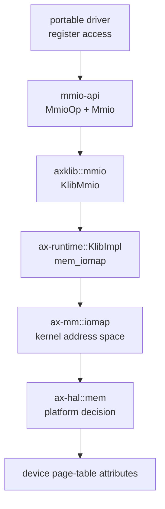
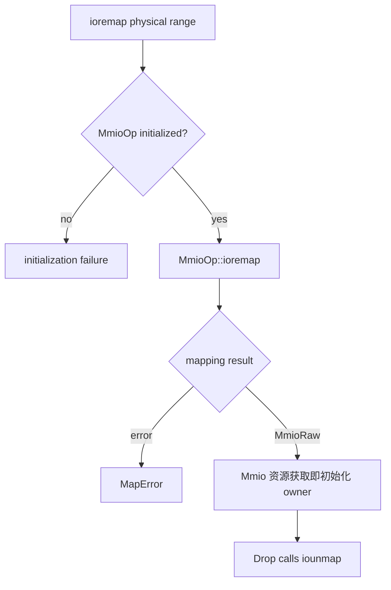
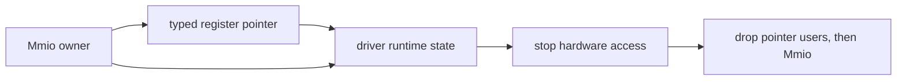
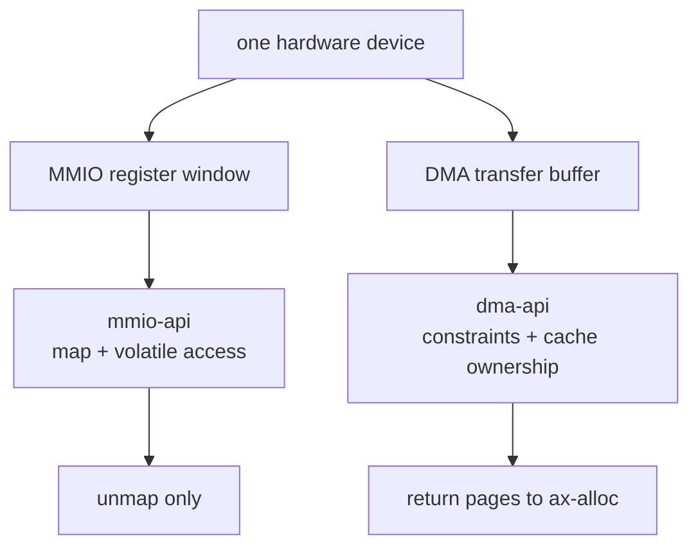

# 内存映射输入输出与寄存器所有权

Memory-Mapped Input/Output（内存映射输入输出，MMIO）把设备寄存器物理区间映射为内核可访问的虚拟地址。`memory/mmio-api` 只定义映射能力、映射结果和寄存器访问入口；`components/axklib/src/mmio.rs`、`ax-mm::iomap()` 与平台内存实现负责建立带设备属性的实际映射。MMIO 不分配设备传输缓冲区，也不能把设备寄存器区加入普通物理页分配器。

## 1. 分层边界

MMIO 的核心一致性条件是“寄存器窗口不是普通内存”。驱动只持有映射对象并执行易失性读写，操作系统适配层决定物理地址如何进入内核地址空间，页表层负责使用设备内存属性建立页表项。

### 1.1 组件职责

各层按寄存器窗口的发现、映射和消费分工，避免驱动直接依赖 ArceOS 地址空间或特定平台的物理直映规则。

| 组件 | 主要职责 | 不负责的内容 |
| --- | --- | --- |
| `mmio-api` | 定义 `MmioOp`、`MmioAddr`、`MmioRaw`、`Mmio` 和 `MapError` | 选择页表格式、分配物理页、解析设备树 |
| `axklib::mmio` | 注册 `KlibMmio`，把映射请求接到 `Klib::mem_iomap()` | 保存设备对象、解释寄存器语义 |
| `ax-runtime::KlibImpl` | 在启用分页时调用 `ax_mm::iomap()`，否则返回不支持 | 在未启用分页时猜测直映地址 |
| `ax-mm` 与 `ax-hal` | 检查范围、选择平台映射或通用映射、设置设备页属性 | 把设备窗口交给 Buddy 分配器 |
| 驱动核心 | 持有映射对象，以正确宽度和偏移访问寄存器 | 调用页分配器、修改内核页表 |

Direct Memory Access（直接内存访问，DMA）管理设备可访问的内存缓冲区及其缓存所有权，MMIO 管理设备寄存器窗口。二者可能被同一个驱动同时使用，但没有互相包装或释放的关系。

### 1.2 依赖方向

映射请求从驱动向平台逐层收敛，映射结果以 `Mmio` 或 `MmioRaw` 返回。`mmio-api` 不反向依赖 `ax-mm`，因此可移植驱动不会绑定到 ArceOS。



`platforms/axplat-dyn/src/boot.rs` 也实现 `MmioOp`，把动态平台探测阶段的请求转交给同一个 `axklib::mmio::op()`。`platforms/somehal/src/setup.rs::set_kernel_op()` 在平台与内核运行时接线时注册能力，平台驱动因此不需要直接引用 `ax-mm`。

### 1.3 架构差异

公共 `Mmio` owner 和易失性访问接口不区分架构，物理窗口如何变成可访问虚拟地址、页表项如何编码设备属性以及设备访问前后的屏障由平台实现。

| 架构 | MMIO 虚拟地址 | 设备属性 | 访问顺序 |
| --- | --- | --- | --- |
| x86_64 | 平台直映或 `ax-mm::iomap()` 建立内核映射 | `NO_CACHE | WRITE_THROUGH` | 设备协议需要时使用架构 I/O/内存 fence |
| AArch64 | `iomap()` 建立映射或平台启动窗口 | Device-nGnRE MAIR 槽位 | 设备寄存器协议配合 DMB/DSB |
| RISC-V 64 | 平台物理窗口经内核映射 | 标准页表权限；平台扩展表达强序/非缓存 | 设备协议配合 `fence` |
| LoongArch64 | `_io()` 使用独立 `IO_BASE`，并检查物理地址宽度 | MAT 强序非缓存 | 设备协议配合 `dbar` |

易失性读写只约束编译器，不自动执行上述架构屏障。驱动核心表达“提交 descriptor 后敲 doorbell”等协议顺序，平台 capability 提供具体指令。

## 2. 公共类型

`memory/mmio-api/src/lib.rs` 的公共接口把物理寄存器地址、映射描述和自动释放所有者分成三个类型。类型分离能够区分“尚未映射的设备地址”和“已经可以由处理器访问的虚拟地址”。

### 2.1 地址与映射描述

`MmioAddr` 是物理 MMIO 地址的透明封装；`MmioRaw` 保存物理地址、虚拟地址和映射长度。`MmioRaw::new()` 是不安全构造函数，因为调用方必须证明虚拟地址确实覆盖指定物理区间，并且在整个使用期保持有效。

| 类型或方法 | 语义 | 调用方约束 |
| --- | --- | --- |
| `MmioAddr` | 尚未映射的物理寄存器基址 | 地址宽度必须能由目标平台的 `usize` 表示 |
| `MmioRaw::new()` | 构造已存在映射的描述 | 物理地址、虚拟指针和长度必须描述同一窗口 |
| `phys_addr()` | 返回设备窗口物理起点 | 不能据此释放普通内存页 |
| `as_nonnull_ptr()` | 返回驱动寄存器封装所需的非空指针 | 映射所有者必须活得比指针使用期更久 |
| `size()` | 返回映射请求覆盖的字节数 | 寄存器宽度也必须计入边界检查 |

`MmioRaw` 实现 `Clone`，但克隆只复制映射描述，不创建第二份页表映射，也不形成独立释放所有权。需要自动结束映射的普通驱动应优先持有 `Mmio`，而不是长期保存克隆后的裸描述。

### 2.2 自动释放所有者

`Mmio` 包装一个 `MmioRaw`，实现 `Deref<Target = MmioRaw>`，并在析构时调用已注册的 `MmioOp::iounmap()`。这是 Resource Acquisition Is Initialization（资源获取即初始化）所有权模型：构造成功表示映射已可用，对象生命周期结束表示映射所有权结束。

```rust
let registers = mmio_api::ioremap(bar_address.into(), bar_size)?;
let status = registers.read::<u32>(STATUS_OFFSET);
registers.write::<u32>(CONTROL_OFFSET, status | ENABLE);
```

当前 `KlibMmio::iounmap()` 是空操作，因为 `ax-mm::iomap()` 建立的内核设备映射按长期映射管理，尚未实现对应的虚拟区间回收。`Mmio` 仍然保留析构协议，使未来加入真实解除映射时不需要修改驱动接口；文档和调用方不能把当前空操作解释为所有平台都无需解除映射。

## 3. 注册与初始化

`mmio-api` 通过全局 `MmioOp` 能力连接可移植驱动和操作系统实现。注册只接受静态生命周期对象；当前原子状态只保证第一个初始化者取得写入资格，调用方仍必须在单线程启动阶段完成初始化后再允许并发映射。

### 3.1 能力注册

`mmio_api::init()` 先通过 `INIT.compare_exchange()` 选择第一个初始化者，再把 `MmioOp` 写入全局槽位。后续初始化直接返回，不会替换已经被驱动使用的后端；但当前实现不是支持初始化与映射并发执行的发布协议，不能依靠 `INIT` 替代启动顺序约束。

| 初始化入口 | 注册对象 | 使用场景 |
| --- | --- | --- |
| `axklib::mmio::init_global()` | 静态 `KlibMmio` | ArceOS 运行时与普通驱动 |
| `axklib::mmio::ioremap()` | 映射前确保调用 `init_global()` | 经 `axklib` 的延迟初始化路径 |
| `somehal::setup::set_kernel_op()` | 动态平台提供的 `KernelOp` | someboot 与 somehal 接线 |
| 驱动构造函数中的 `mmio_api::init()` | 调用方提供的 `MmioOp` | 独立驱动或测试环境 |

初始化必须发生在第一次 `ioremap()` 或 `ioremap_raw()` 之前，并且初始化期间不能有其他 CPU 同时读取全局槽位。当前未初始化访问会触发不可恢复错误，因此启动和独立驱动环境都必须显式安装后端，不能依赖默认的空实现。

### 3.2 映射入口

安全入口 `ioremap()` 返回自动释放的 `Mmio`；不安全入口 `ioremap_raw()` 返回 `MmioRaw`，要求调用方自行保证最终调用 `iounmap()` 或由更高层持有等价生命周期。



`MapError::Invalid` 表示地址、长度或平台规则不合法，`MapError::NoMemory` 表示缺少虚拟地址或页表资源，`MapError::Busy` 表示目标范围已被占用。适配层必须保留这些可判定错误，不能把所有失败压成字符串或静默使用其他地址。

## 4. 地址空间映射

`ax-mm::iomap()` 是 ArceOS 的实际地址空间入口。它先检查零长度与地址加法溢出，再让 `ax_hal::mem::prepare_iomap()` 决定使用平台已有映射还是进入通用页表路径。

### 4.1 平台决策

`prepare_iomap(addr, size, IomapAttrs::DEVICE)` 返回 `IomapDecision::Mapped` 或 `IomapDecision::UseGeneric`。前者表示平台已经提供适合访问设备的虚拟地址，后者要求 `ax-mm` 在内核地址空间建立映射。

| 决策 | 后续动作 | 适用情况 |
| --- | --- | --- |
| `Mapped(vaddr)` | 直接返回平台提供的虚拟地址 | 硬件直映窗口已具有正确设备属性 |
| `UseGeneric(paddr)` | 调用 `iomap_generic()` | 需要由内核页表创建设备映射 |
| `InvalidInput` | 转换为 `AxError::InvalidInput` | 范围或平台地址规则非法 |
| `Unsupported` | 转换为 `AxError::Unsupported` | 当前平台不能建立该类映射 |

未启用 `ax-runtime` 的分页能力时，`KlibImpl::mem_iomap()` 明确返回 `AxError::Unsupported`。运行时不会把物理地址强制转换为指针，因为这种回退无法证明设备属性、地址可达性和缓存语义正确。

### 4.2 页对齐处理

通用路径把物理起点向下对齐到 4 KiB 页边界，把区间末端向上对齐，再在返回值中恢复原始页内偏移。页表项使用 `DEVICE | READ | WRITE`，而不是普通可缓存内存属性。

```text
请求物理区间：0x1000_0120..0x1000_0320，长度 0x200
页表映射区间：0x1000_0000..0x1000_1000，长度 0x1000
返回虚拟地址：mapped_page_base + 0x120
```

如果平台物理直映地址位于内核页表管理范围内，`iomap_generic()` 在该地址建立或覆盖线性设备映射；如果直映地址位于范围外，则通过 `find_free_area()` 选择新的内核虚拟区间。两条路径都必须保持原始页内偏移不变。

## 5. 寄存器访问

设备寄存器访问必须使用易失性语义，避免编译器删除、合并或重排具有硬件副作用的读写。`MmioRaw::read<T>()` 和 `write<T>()` 分别调用 `read_volatile()` 与 `write_volatile()`。

### 5.1 宽度与边界

访问宽度由寄存器规范决定，不能使用任意 Rust 类型替代硬件定义的 8、16、32 或 64 位字段。调用方必须同时验证偏移、访问宽度和对齐。

| 条件 | 当前接口检查 | 驱动必须补充的检查 |
| --- | --- | --- |
| `offset < size` | `read()` 与 `write()` 使用断言检查 | 无 |
| `offset + size_of::<T>() <= size` | 接口当前未完整检查 | 在寄存器包装层检查整个访问范围 |
| `virt + offset` 满足 `T` 对齐 | 接口依赖调用方 | 使用硬件规定的宽度和对齐偏移 |
| 访问顺序 | 易失性访问防止消除 | 按设备协议加入内存屏障或读回确认 |

例如 `drivers/pci/rk3588-pci/src/lib.rs` 的 `read32()` 与 `write32()` 在调用 `MmioRaw` 前以 `debug_assert!` 检查四字节范围。面向不可信偏移或发布构建的接口应使用可恢复的运行时边界检查，不能只依赖调试断言。

### 5.2 指针生命周期

部分驱动把 `Mmio::as_ptr()` 转为寄存器结构指针，例如 `drivers/blk/nvme-driver/src/nvme.rs`。此时驱动对象必须同时保存原始 `Mmio` 所有者，保证寄存器指针使用期间映射不会结束。



`MmioRaw::as_slice()` 只适合确实按字节窗口定义且由调用方保证访问语义的区域。普通寄存器访问不应通过常规切片读写，因为常规内存访问不提供设备寄存器所需的易失性语义。

## 6. 所有权边界

MMIO 映射拥有的是虚拟地址到设备物理窗口的访问关系，不拥有窗口背后的物理存储。释放映射和释放普通内存页是完全不同的操作。

### 6.1 与普通内存的区别

固件或设备树报告的寄存器范围应标记为设备内存或保留区，不能作为 `MemoryRegionFlags::FREE` 交给 `ax-alloc`。即使数值上落在系统物理地址空间内，也不表示该范围可由 Buddy 回收。

| 属性 | 普通随机存取内存 | MMIO 寄存器窗口 |
| --- | --- | --- |
| 物理页所有者 | `ax-alloc` 或启动分配器 | 硬件设备 |
| 页表属性 | 普通可缓存内存 | 架构设备内存属性 |
| 访问方式 | 普通加载与存储 | 易失性加载与存储，必要时带屏障 |
| 生命周期结束 | 页面返回原分配来源 | 只解除虚拟映射，不释放设备窗口 |
| 可加入 Buddy | 可以，但必须来自可用内存描述符 | 不可以 |

`boot-memory.md` 中的 `MemRegionFlags::DEVICE` 和非 `FREE` 区间负责阻止已识别设备窗口进入运行时页分配器；`page-table.md` 中的架构属性布局负责把设备映射编码为正确的页表项。分配资格和映射策略是两个独立判断：排除 Buddy 不表示必须建立普通直接映射，也不表示该区间自动具有设备属性。

固件明确报告的 MMIO 应归为 `MemoryType::Mmio`，并以设备属性映射实际需要访问的窗口。固件私有区或 PCI 地址空洞若只标为通用 `Reserved`，当前启动交接可能把它当作保留物理 RAM 加入内核线性映射；平台必须先完成分类，不能依靠 `iomap()` 在运行期修正错误的普通内存映射。具体交接限制见 [启动内存发现与交接](./boot-memory.md#53-描述符到内核直接映射)。

### 6.2 与设备传输内存的区别

DMA 缓冲区通常来自 `ax-alloc`，由 `dma-api` 保存设备地址约束、缓存同步和释放令牌；MMIO 地址来自设备资源描述，由 `mmio-api` 保存映射关系。驱动不能用 DMA 释放接口处理 MMIO，也不能把 MMIO 指针交给设备作为普通传输缓冲区。



典型驱动先通过 MMIO 配置 DMA 描述符基址，再由设备访问 DMA 缓冲区。寄存器映射对象和缓冲区所有者必须分别保存在驱动状态中，硬件停止顺序也必须先禁止设备访问，再释放缓冲区和映射。

## 7. 使用实例

实例以未对齐寄存器窗口和驱动对象生命周期说明边界计算与所有权保存方式。数值仅用于展示算法，不代表固定平台地址。

### 7.1 未对齐窗口

设备资源给出物理起点 `0xfe20_0120`、长度 `0x180`。通用映射先计算末端 `0xfe20_02a0`，随后映射整个 `0xfe20_0000..0xfe20_1000` 页面，并向驱动返回页基址加 `0x120`。

| 计算项 | 数值 | 目的 |
| --- | --- | --- |
| 原始起点 | `0xfe20_0120` | 保留设备资源给出的精确地址 |
| 向下对齐起点 | `0xfe20_0000` | 满足页表映射粒度 |
| 原始末端 | `0xfe20_02a0` | 使用受检加法避免溢出 |
| 向上对齐末端 | `0xfe20_1000` | 覆盖最后一个寄存器字节 |
| 返回偏移 | `0x120` | 让驱动偏移零对应真实寄存器起点 |

若 `addr + size` 溢出或 `size == 0`，请求在进入页表操作前失败。映射成功后，驱动的有效偏移范围仍是 `0..0x180`，不能因为底层映射覆盖一整页而访问设备未声明的其余地址。

### 7.2 驱动生命周期

以 Non-Volatile Memory Express（非易失性存储器规范，NVMe）驱动为例，`Nvme::new()` 接收 `MmioOp`，调用 `mmio_api::ioremap()`，再把寄存器指针和 `Some(mmio)` 一同交给 `new_with_bar()`。映射所有者随驱动状态保存，避免构造函数返回后映射提前析构。

```text
设备资源发现
  -> 安装 MmioOp
  -> ioremap(BAR physical address, BAR size)
  -> Mmio owner + typed register pointer
  -> 初始化队列并启动设备
  -> 停止设备访问
  -> 驱动状态析构
  -> Mmio::drop() 调用 iounmap()
```

Base Address Register（基址寄存器，BAR）只描述设备窗口的位置和大小，不是普通内存分配结果。驱动初始化失败时，局部 `Mmio` 会按 Rust 析构顺序调用解除映射接口，不需要额外的裸地址清理分支。

## 8. 源码入口

下面的文件构成从公共能力到内核页表和驱动消费的完整路径。输入范围、页对齐、设备属性、易失性访问和对象生命周期的测试集中在[内存管理测试与验收](./testing.md)。

### 8.1 源码检查点

修改任一层时，需要同步检查相邻层的所有权与错误转换。

| 源码 | 审计重点 |
| --- | --- |
| `memory/mmio-api/src/lib.rs` | 全局能力初始化、`MmioRaw` 安全契约、易失性访问和 `Mmio::drop()` |
| `components/axklib/src/mmio.rs` | 零长度检查、错误转换和 `KlibMmio` 适配 |
| `components/axklib/src/lib.rs` | `Klib::mem_iomap()` 能力边界 |
| `os/arceos/modules/axruntime/src/klib.rs` | 分页能力检查与 `ax_mm::iomap()` 接线 |
| `os/arceos/modules/axmm/src/lib.rs` | 平台决策、受检地址计算、页对齐和设备属性 |
| `platforms/somehal/src/setup.rs` | 动态平台 `KernelOp` 注册顺序 |
| `platforms/somehal/src/common.rs` | 启动阶段物理地址规范化和裸映射 |
| `drivers/ax-driver/src/pci/msi.rs` | Message Signaled Interrupts Extension（消息信号中断扩展，MSI-X）表映射所有权 |
| `drivers/blk/nvme-driver/src/nvme.rs` | 寄存器指针与 `Mmio` 所有者共同保存 |
| `drivers/pci/rk3588-pci/src/lib.rs` | 固定宽度寄存器访问和范围检查 |

MMIO 接口中的不安全构造、跨线程访问和裸指针转换都必须保留相邻的安全契约。若未来实现真实 `iounmap()`，必须同时设计虚拟区间回收、重复映射引用和并发驱动销毁语义。
