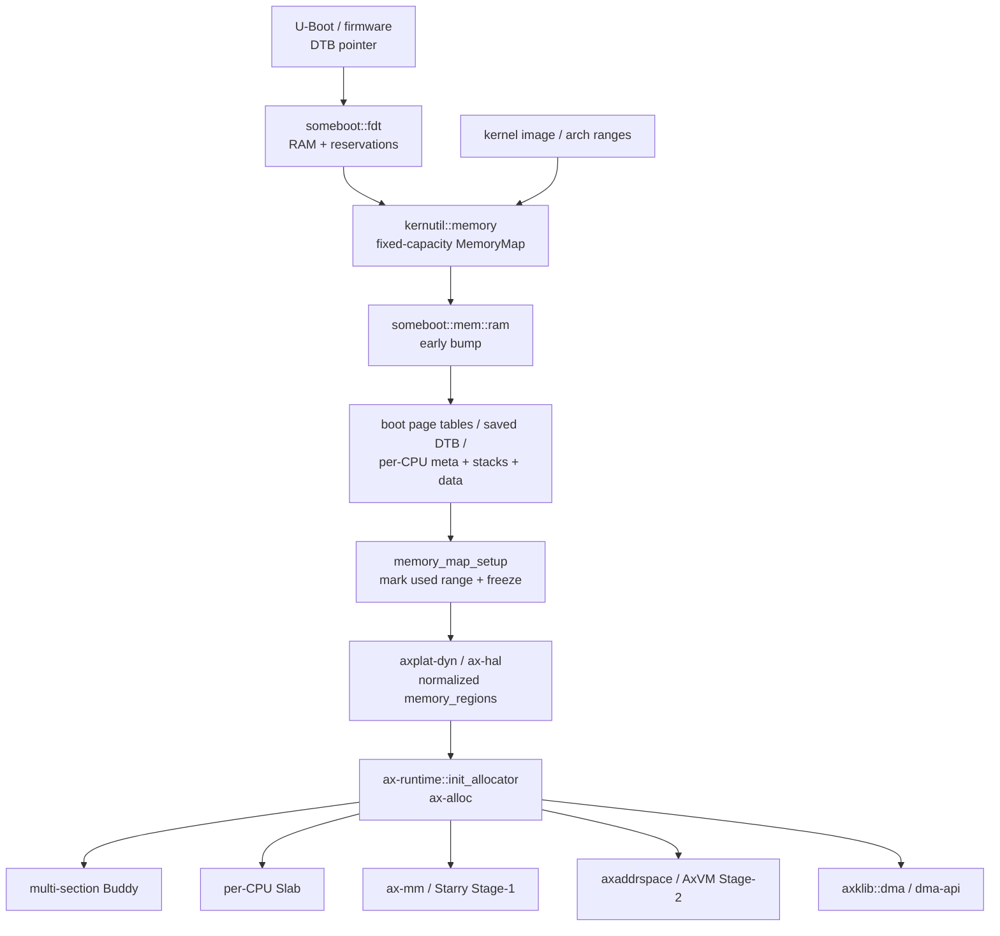
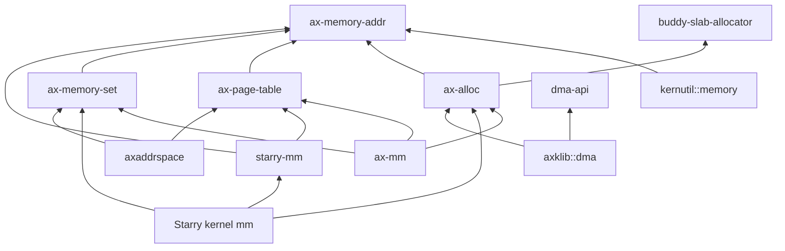

# 内存管理总体架构

TGOSKits 的内存管理采用“启动期事实发现、运行期统一分配、页表机制复用、系统策略并列”的结构。公共层只维护地址、物理页、页表和区间事务等机制；ArceOS、StarryOS 与 Axvisor 分别实现内核地址空间、Linux 兼容虚拟内存和 Guest Stage-2 策略。

## 1. 架构边界

内存组件按资源所有权而不是按操作系统名称分层。这样可以让嵌入式配置裁剪不需要的策略，同时避免 StarryOS 和 Axvisor 复制底层页分配或页表实现。

### 1.1 公共机制

公共机制只处理跨系统稳定的事实和不变量，不解释 Linux syscall、Guest 生命周期或设备驱动策略。下表列出当前公共核心及其唯一职责。

| 组件 | 主要职责 | 不负责的内容 |
| --- | --- | --- |
| `ax-memory-addr` | Host 物理地址、虚拟地址、地址范围与页对齐 | 分配、映射策略、Guest 地址语义 |
| `kernutil::memory` | 启动期固定容量 `MemoryDescriptor` 与区间合并 | 运行期页分配、动态 VMA |
| `ax-alloc` | 页、内核堆、`GlobalAlloc`、zone 与用量统计的公共入口 | 回收、阻塞、VFS callback、Linux overcommit |
| `buddy-slab-allocator` | 多物理段 Buddy、per-CPU Slab、跨 CPU 释放 | 公共 API、用途策略、DMA domain |
| `ax-page-table` | PTE、Stage-1、Stage-2、boot 页表机制 | 物理页来源、VMA 策略、IOMMU domain |
| `ax-memory-set` | VMA 元数据和 map/unmap/protect 事务 | 特定页表格式、COW、syscall ABI |

这些组件均以 `no_std` 为基本边界。`buddy-slab-allocator` 是 `ax-alloc` 的实现依赖，不应成为普通消费者绕过 `ax-alloc` 的第二公共入口。

### 1.2 策略与适配层

策略层拥有各自领域的不变量，并通过公共机制完成工作。当前三条主要路径是 ArceOS 的 `ax-mm`、StarryOS 的 `starry-mm` 加 kernel backend，以及 Axvisor 的 `axaddrspace`。

| 策略或适配组件 | 所属领域 | 当前边界 |
| --- | --- | --- |
| `someboot` | 启动 | 解析固件内存、early bump、boot 页表、全 CPU 启动栈预分配 |
| `ax-hal` / `ax-runtime` | ArceOS 接线 | 规范化平台内存区、初始化 `ax-alloc`、初始化本 CPU Slab |
| `ax-mm` | ArceOS | 内核/用户 Stage-1 地址空间、线性和按需分配 backend、MMIO 映射 |
| `starry-mm` | StarryOS 公共策略 | RSS/VSS、commit、COW 计数、文件 capability、故障结果与有界回收策略 |
| Starry kernel `mm` | StarryOS OS glue | Linux VMA/backend、页表操作、VFS/page-cache adapter、syscall/errno/signal 接线 |
| `axaddrspace` | Axvisor | Guest physical address space、Guest RAM、Stage-2 映射策略 |
| `dma-api` / `axklib::dma` | 设备能力 | 设备约束、DMA ownership、allocator/cache 平台适配 |

`starry-mm` 当前不是完整 Linux `mm` 的独立实现。公共策略已经提取，但具体 COW/file/shared backend 与页表游标仍位于 `os/StarryOS/kernel/src/mm/aspace/`，这是现状边界而不是额外的一套公共内存核心。

## 2. 端到端数据流

系统从固件提供的物理内存事实出发，依次经过启动期占用裁剪、运行期分配器接管，再由不同地址空间或设备能力消费。整个流程没有把多段内存强行拼成一个连续地址区。

### 2.1 启动到运行期

下图描述动态平台使用 `someboot` 时的主要交接。箭头表示事实或资源所有权的传递，不表示所有组件之间存在 Rust crate 直接依赖。

启动 bump 使用的区间在冻结前被重新标记为 `Reserved`，因此不会再次进入 Buddy。运行期每个 `Free` 物理段作为独立 section 加入分配器，连续页分配不能跨越段边界。

### 2.2 运行期请求路径

运行期请求先按资源类型选择公共能力，再进入具体策略。普通 byte allocation、显式页分配、虚拟映射和 DMA 的入口不同，但最终物理 RAM 均由 `ax-alloc` 管理。

| 请求 | 公共入口 | 实现路径 | 所有权结束条件 |
| --- | --- | --- | --- |
| 小对象 | Rust allocator / `GlobalAlloc` | `ax-alloc` → per-CPU Slab | byte allocation 被释放 |
| 大对象 | Rust allocator / `GlobalAlloc` | `ax-alloc` → Buddy pages | byte allocation 被释放 |
| 显式物理页 | `alloc_pages(PageRequest, UsageKind)` | `ax-alloc` → Buddy section | `GlobalPage::drop` 或 raw 对称释放 |
| Stage-1 页表页 | `PageFrameProvider` adapter | `ax-mm`/Starry adapter → `ax-alloc` | 页表层级销毁 |
| Guest RAM | `NestedPageTableOps::alloc_frame` | `axaddrspace`/AxVM → `ax-alloc` | Guest unmap 或 VM teardown |
| DMA buffer | `DeviceDma` RAII API | `dma-api` → `axklib::dma` → `ax-alloc` | 最后一个 owner 被消费或 Drop |

`PageFrameProvider` 只隔离“页从哪里来”，不会在 `ax-page-table` 内触发回收。Linux 缺页的有界 clean-page reclaim 位于 Starry 地址空间外层，失败后最多重新尝试一次。

## 3. 核心不变量

内存安全和性能依赖少量可审计的不变量。组件拆分的目标是让这些不变量只在一个位置维护，而不是增加调用层数。

### 3.1 所有权不变量

每个可释放物理页在任一时刻只能属于 Buddy free list、Slab backing 或一个 live owner。不同资源使用显式 token 或 RAII 类型避免重复释放。

| 资源 | 所有者或状态来源 | 关键类型 |
| --- | --- | --- |
| 普通页 / DMA32 页 | `ax-alloc` 内部 Buddy section | `PageRequest`、`GlobalPage` |
| Slab backing 页 | owner CPU 的 Slab | `SlabPageHeader`、remote-free stack |
| VMA 与 PTE 变更 | 地址空间事务 | `MappingOperation`、`MappingPlan`、`CommitState` |
| Starry COW 页 | Starry backend 与引用状态 | `CowFrameReferences`、`MemoryAccounting` |
| DMA allocation/map | `dma-api` RAII owner | `DmaAllocHandle`、`DmaMapHandle`、`DmaAllocation` |

`DmaAllocHandle` 和 `DmaMapHandle` 是按值消费的 backend token，不实现 `Copy` 或 `Clone`。`GlobalPage` 记录原始 zone 和 usage，Drop 时返回对应 Buddy section 并更新同一统计表。

### 3.2 上下文与并发不变量

Buddy 采用单个非抢占自旋锁，per-CPU Slab 将小对象热路径留在本 CPU，跨 CPU free 使用 `SlabPageHeader::remote_free` 的无锁栈。当前设计不引入 NUMA、page migration、compaction 或完整 Linux PCP。

| 上下文 | 允许的内存路径 | 禁止或应预分配的路径 |
| --- | --- | --- |
| early boot | checked bump、boot 页表、固定容量 metadata | 调度等待、回收、文件 I/O |
| 普通内核线程 | Slab、Buddy、地址空间事务 | 持 allocator 锁调用 VFS/reclaim |
| IRQ / RT critical | 固定池或已经预留的 ring/descriptor | 通用堆、Buddy、Slab 扩容、回收 |
| Starry 用户缺页 | backend fault、外层一次有界 clean-page reclaim | IRQ 上下文 fault、无限重试 |
| Guest fault | `axaddrspace` 按需 Guest RAM | 隐式 Host reclaim callback |

当前不提供没有生产消费者的通用 RT guard；IRQ 和 RT 路径由具体组件预分配固定对象，并通过路径审计与测试保证不进入通用分配器。

## 4. 组件依赖

依赖方向以底层机制不反向依赖上层策略为准。尤其是 `ax-page-table` 不依赖 `ax-alloc`，`dma-api` 不拥有全局 allocator，`starry-mm` 不反向依赖 Starry kernel/VFS/task/signal 实现。

### 4.1 公共层依赖

公共层依赖关系保持窄接口。下面的图只展示内存主线，省略日志、错误类型和同步原语等辅助依赖。

这里的 `starry-mm → ax-page-table` 只复用共享页大小等 Stage-1 类型；具体页表修改仍通过 Starry kernel backend 完成。Stage-2 只由虚拟化消费者启用。

### 4.2 Feature 裁剪

公共 crate 的 feature 表达实际链接能力，不把“系统 profile 名称”伪装成已经存在的 Cargo feature。当前关键 feature 如下。

| Crate | Feature | 链接或行为 |
| --- | --- | --- |
| `ax-alloc` | `global-allocator` | 注册 Rust 全局分配器 |
| `ax-alloc` | `smp` | 启用 SMP/per-CPU Slab 所需支持 |
| `ax-alloc` | `tracking` | 启用分配跟踪 |
| `ax-page-table` | `stage1` / `stage2` / `boot` | 分别链接 Host、Guest 或启动页表入口 |
| `ax-page-table` | `copy-from` | 启用 Stage-1 页表复制能力 |
| `starry-mm` | `starry-strict-commit` | 将 overcommit admission 切换为 Strict |

`embedded-default`、`starry` 和 `hypervisor` 是配置组合概念，不是当前 `ax-alloc/Cargo.toml` 中的 feature。系统配置应组合真实 feature，文档和构建脚本不得依赖不存在的名字。

## 5. 维护归属

内存改动必须落在拥有相应不变量的组件和文档中，避免同一规则在多个页面形成不同版本。本节规定机制变更与系统策略变更的权威说明位置。

### 5.1 机制变更

固件交接、分配、栈、地址翻译和区间事务属于公共机制。修改这些行为时，应更新对应权威页面中的源码锚点、不变量和验证条件。

| 变更领域 | 权威文档 | 必须同步的内容 |
| --- | --- | --- |
| 固件与多段 RAM | [启动内存](./boot-memory.md) | 内存图、保留区、bump 状态和运行时交接 |
| 页与堆 | [运行时分配器](./runtime-allocator.md) | Buddy/Slab、zone、统计和上下文约束 |
| 栈 | [栈管理](./stacks.md) | CPU0、per-CPU、任务栈和 guard page |
| 地址翻译 | [页表核心](./page-table.md) | entry、Stage-1、Stage-2、boot 和 TLB |
| 区间事务 | [地址空间](./address-space.md) | VMA split、prepare/commit/rollback 和故障注入 |

机制页面只描述公共所有权和执行规则，不应写入 Starry syscall、具体 DMA 设备或 Guest 生命周期策略。

### 5.2 策略变更

Linux VM、设备 DMA 和三套系统的组合方式属于消费策略。修改这些行为时，应在对应页面记录能力边界，并在测试页面登记可执行的验证入口。

| 变更领域 | 权威文档 | 必须同步的内容 |
| --- | --- | --- |
| Linux 兼容 VM | [StarryOS 内存](./starry-mm.md) | VMA、COW、RSS/VSS、commit 和 fault/reclaim |
| 设备内存 | [DMA 内存](./dma.md) | mask/domain、coherent/streaming 和 RAII owner |
| 系统接线 | [系统集成](./integration.md) | ArceOS、StarryOS、Axvisor 的依赖与启动顺序 |
| 验收约束 | [测试与限制](./testing.md) | 故障注入、性能指标、静态检查和当前限制 |

维护时应先更新行为真正所属的页面，再检查交叉链接和源码名称。规划中的能力只有在源码、feature 和测试都存在后才能写入“当前实现”。
