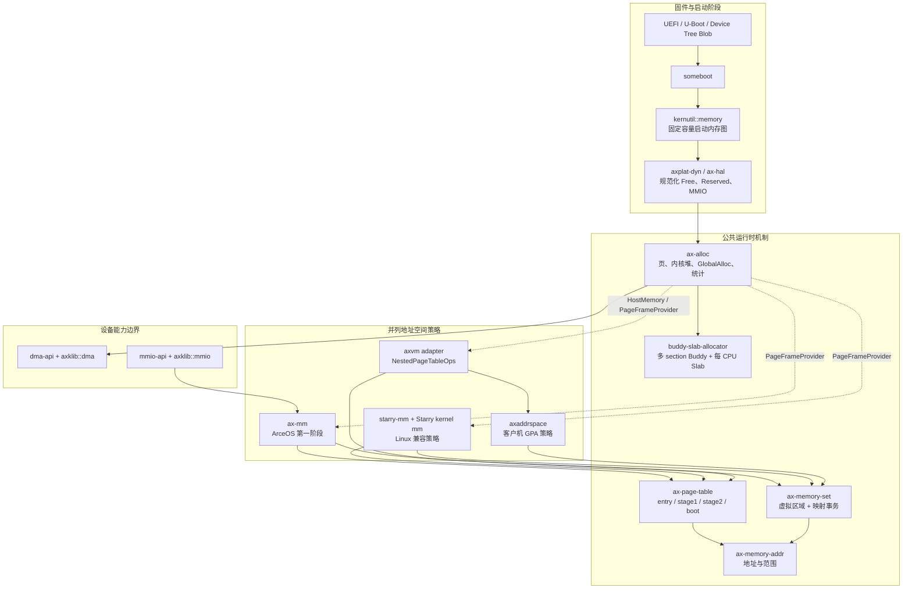
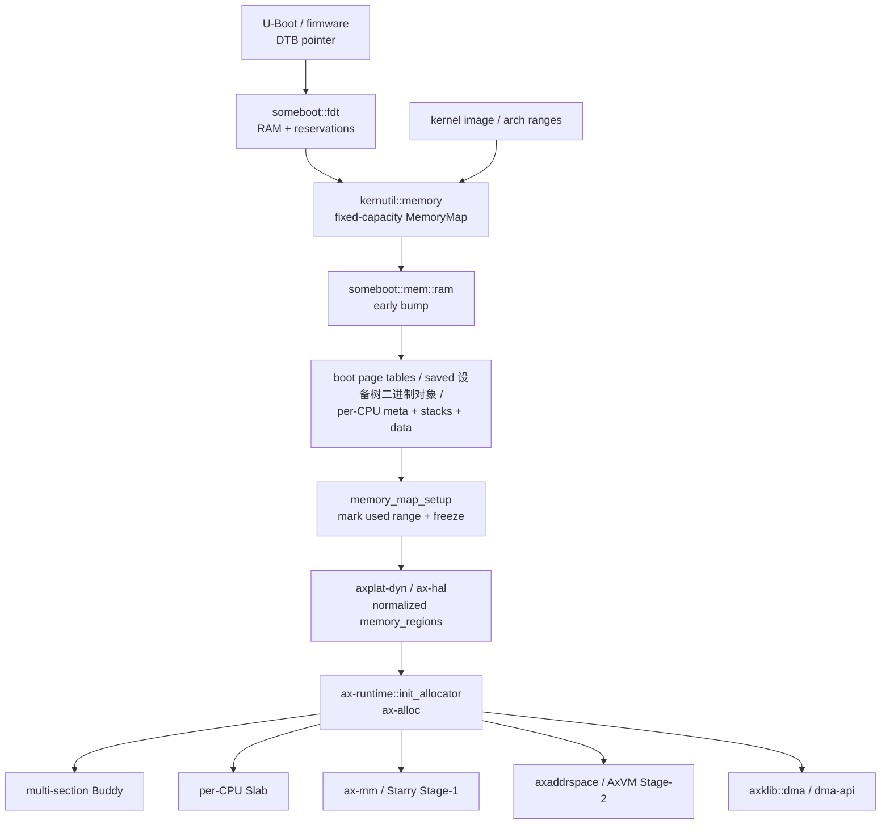
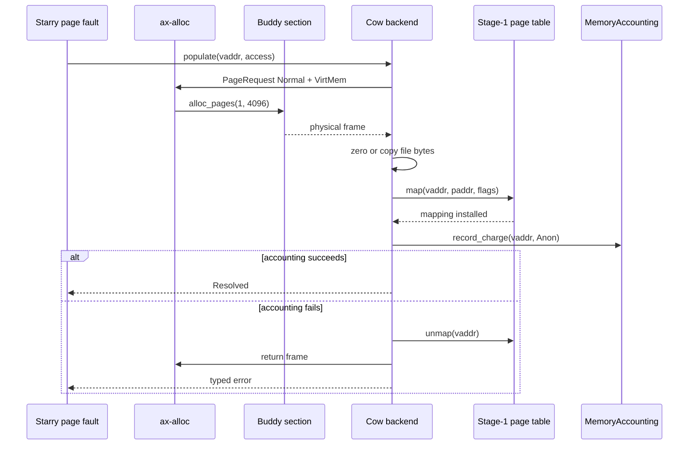

# 内存管理总体架构

TGOSKits 的内存管理采用“启动期事实发现、运行期统一分配、页表机制复用、系统策略并列”的结构。公共层只维护地址、物理页、页表和区间事务等机制；ArceOS、StarryOS 与 Axvisor 分别实现内核地址空间、Linux 兼容虚拟内存和客户机第二阶段地址转换策略。

## 1. 架构边界

内存组件按资源所有权而不是按操作系统名称分层。这样可以让嵌入式配置裁剪不需要的策略，同时避免 StarryOS 和 Axvisor 复制底层页分配或页表实现。

下图是源码级总体架构。纵向箭头表示所有权或能力向下传递，横向并列的 `ax-mm`、StarryOS memory management 和 `axaddrspace` 分别维护 ArceOS、Linux 兼容环境和客户机的策略，不形成彼此包装关系。



源码目录和关键调用链见[内存管理源码结构](./source-map.md)，客户机 GPA 策略和 AxVM adapter 见[Axvisor 客户机地址空间设计与实现](./axaddrspace.md)，各架构的地址转换、页表根、页表项和失效差异见[多架构内存实现](./architecture-support.md)，锁类型和顺序见[内存管理锁与并发](./concurrency.md)。

### 1.1 层级职责

总体架构只区分四类职责：启动层发布可信物理区间，公共机制层维护分配和地址翻译，策略层解释系统语义，设备能力层隔离驱动与操作系统实现。具体 crate、源码目录和公共类型由[内存管理源码结构](./source-map.md)统一索引，不在本章重复列举。

| 层级 | 维护的不变量 | 代表性边界 |
| --- | --- | --- |
| 启动事实 | RAM、保留区和启动占用不重叠 | `MemoryDescriptor`、early allocator freeze |
| 公共机制 | 页恰好属于一个 owner，映射事务全成或回滚 | `GlobalPage`、`PageFrameProvider`、`MemorySet` |
| 系统策略 | ArceOS、Linux 进程和客户机分别解释映射与回收 | `ax-mm`、Starry memory management、`axaddrspace` |
| 设备能力 | 驱动只消费已验证的 DMA 或寄存器映射能力 | `DeviceDma`、`Mmio` |

层级数量由需要维护的不变量决定。只做转发、别名或重复统计的 facade 不构成独立层；拥有不同地址类型、释放协议或回滚语义的 adapter 则不能为减少调用层数而合并。

### 1.2 唯一入口

同一种资源只有一个公共入口：物理页和内核堆进入 `ax-alloc`，页表帧由 `PageFrameProvider` 注入，虚拟区域事务由 `MemorySet` 持有，Linux commit 与常驻集记账由 `starry-mm` 维护，DMA 和内存映射输入输出分别进入其设备能力接口。

`buddy-slab-allocator` 只是 `ax-alloc` 的算法实现，不能成为普通消费者的第二入口；`starry-mm` 也不是 ArceOS `ax-mm` 的包装层。具体依赖方向和禁止的反向依赖只在[内存管理源码结构](./source-map.md#2-依赖方向)维护。

## 2. 端到端数据流

系统从固件提供的物理内存事实出发，依次经过启动期占用裁剪、运行期分配器接管，再由不同地址空间或设备能力消费。整个流程没有把多段内存强行拼成一个连续地址区。

### 2.1 启动到运行期

下图描述动态平台使用 `someboot` 时的主要交接。箭头表示事实或资源所有权的传递，不表示所有组件之间存在 Rust crate 直接依赖。



启动 bump 使用的区间在冻结前被重新标记为 `Reserved`，因此不会再次进入 Buddy。运行期每个 `Free` 物理段作为独立 section 加入分配器，连续页分配不能跨越段边界。

### 2.2 运行期请求路径

运行期请求先按资源类型选择公共能力，再进入具体策略。普通 byte allocation、显式页分配、虚拟映射和 DMA 的入口不同，但最终物理 RAM 均由 `ax-alloc` 管理。

| 请求 | 公共入口 | 实现路径 | 所有权结束条件 |
| --- | --- | --- | --- |
| 小对象 | Rust allocator / `GlobalAlloc` | `ax-alloc` → per-CPU Slab | byte allocation 被释放 |
| 大对象 | Rust allocator / `GlobalAlloc` | `ax-alloc` → Buddy pages | byte allocation 被释放 |
| 显式物理页 | `alloc_pages(PageRequest, UsageKind)` | `ax-alloc` → Buddy section | `GlobalPage::drop` 或 raw 对称释放 |
| Stage-1 页表页 | `PageFrameProvider` adapter | `ax-mm`/Starry adapter → `ax-alloc` | 页表层级销毁 |
| Guest RAM | `NestedPageTableOps::alloc_frame` | `axaddrspace`/AxVM → `ax-alloc` | 客户机解除映射或虚拟机销毁 |
| DMA buffer | `DeviceDma` 资源获取即初始化 API | `dma-api` → `axklib::dma` → `ax-alloc` | 最后一个 owner 被消费或 Drop |

`PageFrameProvider` 只隔离“页从哪里来”，不会在 `ax-page-table` 内触发回收。Linux 缺页的有界 clean-page reclaim 位于 Starry 地址空间外层，失败后最多重新尝试一次。

## 3. 一致性保证

内存安全和性能依赖少量可审计的一致性条件。组件拆分的目标是让这些条件只在一个位置维护，而不是增加调用层数。

### 3.1 所有权一致性

每个可释放物理页在任一时刻只能属于 Buddy free list、Slab backing 或一个 live owner。不同资源使用显式 token 或资源获取即初始化类型避免重复释放。

| 资源 | 所有者或状态来源 | 关键类型 |
| --- | --- | --- |
| 普通页 / DMA32 页 | `ax-alloc` 内部 Buddy section | `PageRequest`、`GlobalPage` |
| Slab backing 页 | owner CPU 的 Slab | `SlabPageHeader`、remote-free stack |
| 虚拟内存区域与页表项变更 | 地址空间事务 | `MappingOperation`、`MappingPlan`、`CommitState` |
| Starry 写时复制页 | Starry backend 与引用状态 | `CowFrameReferences`、`MemoryAccounting` |
| DMA allocation/map | `dma-api` 资源获取即初始化 owner | `DmaAllocHandle`、`DmaMapHandle`、`DmaAllocation` |

`DmaAllocHandle` 和 `DmaMapHandle` 是按值消费的 backend token，不实现 `Copy` 或 `Clone`。`GlobalPage` 记录原始 zone 和 usage，Drop 时返回对应 Buddy section 并更新同一统计表。

### 3.2 上下文与并发约束

Buddy 采用单个非抢占自旋锁，per-CPU Slab 将小对象热路径留在本 CPU，跨 CPU free 使用 `SlabPageHeader::remote_free` 的无锁栈。当前设计不引入非统一内存访问、page migration、compaction 或完整 Linux 每处理器页缓存。

| 上下文 | 允许的内存路径 | 禁止或应预分配的路径 |
| --- | --- | --- |
| early boot | checked bump、boot 页表、固定容量 metadata | 调度等待、回收、文件 I/O |
| 普通内核线程 | Slab、Buddy、地址空间事务 | 持 allocator 锁调用虚拟文件系统/reclaim |
| 中断请求 / 实时 critical | 固定池或已经预留的 ring/descriptor | 通用堆、Buddy、Slab 扩容、回收 |
| Starry 用户缺页 | backend fault、外层一次有界 clean-page reclaim | 中断请求上下文 fault、无限重试 |
| Guest fault | `axaddrspace` 按需 Guest RAM | 隐式 Host reclaim callback |

当前不提供没有生产消费者的通用实时 guard；中断请求和实时路径由具体组件预分配固定对象，并保持不进入通用分配器的路径约束。

## 4. 端到端实例

一个物理地址从固件描述进入系统后，会先后经历“事实分类、启动占用、运行时所有权、虚拟映射或设备可见性”四类状态。下面使用两段不连续 RAM 展开这条路径；地址是用于说明算法的确定性输入，所有区间均采用半开形式 `[start, end)`。

### 4.1 多段内存交接

假设固件报告两个 RAM bank，内核被加载到第一个 bank，第二个 bank 中存在设备固件保留区。`someboot::fdt::memory::init_memory_map()` 先把两个 bank 都登记为 `Free`，随后 `MemoryMapExt::merge_add()` 用 `KImage` 和 `Reserved` 覆盖相交的 Free 子区间。

| 输入事实 | 地址范围 | 大小 | 初始类型 |
| --- | --- | ---: | --- |
| RAM bank 0 | `0x4000_0000..0x4800_0000` | 128 MiB | `Free` |
| kernel image | `0x4000_0000..0x40c0_0000` | 12 MiB | `KImage` |
| RAM bank 1 | `0x8000_0000..0x9000_0000` | 256 MiB | `Free` |
| device firmware | `0x8800_0000..0x8820_0000` | 2 MiB | `Reserved` |

覆盖完成后，内存图不把物理 hole `0x4800_0000..0x8000_0000` 表示成任何 RAM。最终直接映射尚未建立，`select_early_ram()` 先应用架构早期地址上限和计算所得启动工作集，再选择物理起点最低的合格 Free 子区间，因此本例选择 bank 0 中紧随内核镜像的区间；该选择不会改变其他 Free 段的类型。x86_64 的候选区间必须位于 4 GiB 以下，以保证应用处理器能在 32 位启动阶段装载 CR3。

```text
0x4000_0000                                                     0x4800_0000
    |--- KImage 12 MiB ---|---------------- Free 116 MiB ----------------|

0x4800_0000                                                     0x8000_0000
    |------------------------- physical hole -------------------------|

0x8000_0000                                                     0x9000_0000
    |----------- Free 128 MiB -----------| Rsv 2 MiB |-- Free 126 MiB --|
                                         0x8800_0000  0x8820_0000
```

假设 boot 页表、设备树二进制对象副本和四个 CPU 区域共占用 `0x40c0_0000..0x4100_0000`，`memory_map_setup()` 会把这一前缀发布为 `Reserved` 并冻结 bump。运行时最终看到三个 Free 描述符，而不是一个伪连续 heap。

| 运行时 Free section 候选 | 大小 | 处理方式 |
| --- | ---: | --- |
| `0x4100_0000..0x4800_0000` | 112 MiB | `global_add_memory()` |
| `0x8000_0000..0x8800_0000` | 128 MiB | 最大段，优先 `global_init()` |
| `0x8820_0000..0x9000_0000` | 126 MiB | `global_add_memory()` |

`ax-runtime::init_allocator()` 实际会重新扫描全部 `MemRegionFlags::FREE` 区域并选择最大段。因此本例中 `0x8000_0000..0x8800_0000` 的 128 MiB 是首个 section，另两个合法段随后加入。early arena 按启动阶段可访问性选择，运行时初始化段按容量选择，两者的约束不同。

### 4.2 页所有权变化

假设 Starry 缺页路径请求一个匿名 4 KiB 页。物理页从 Buddy free list 移出后，先由 `GlobalPage` 或 backend 临时所有，再写入页表项并转移给写时复制 frame owner；虚拟内存区域只描述虚拟范围，不直接拥有 Buddy free-list 节点。



这里的回滚顺序是安全要求：只有页表项成功删除后才能归还 frame，否则 CPU 仍可能通过旧 translation 访问已经重新分配的物理页。连续预读一次填充多页时，`CowBackend::rollback_fault_run()` 逆序撤销此前成功的页，并同步删除对应常驻内存集大小 charge。

## 5. 主流实现依据

TGOSKits 采用区间描述、分配器与页表策略分离的结构，不要求为每个固件物理页建立软件对象。这个选择同时适用于嵌入式实时配置、Linux 兼容的 StarryOS 和需要第二阶段地址转换的 Axvisor，但三类系统使用的上层策略不同。

### 5.1 通用操作系统

Linux 启动期使用 `memblock` 保存物理内存与保留区间，而不是为每个 4 KiB 页创建启动描述符；`MEMBLOCK_NOMAP` 还能把区间保留在物理内存图中，同时明确排除直接映射。建立 x86_64 直接映射时，内核按地址对齐、范围和属性选择允许的最大页尺寸。虚拟内存修改则依赖虚拟内存区域锁、页表锁、操作内的预留和失败清理，不为每次大范围新映射保存一份空页表项快照。参见 Linux 的 [boot-time memory management](https://docs.kernel.org/6.14/core-api/boot-time-mm.html)、[`memblock_mark_nomap`](https://docs.kernel.org/6.14/core-api/boot-time-mm.html#c.memblock_mark_nomap)、[process address locks](https://docs.kernel.org/7.1/mm/process_addrs.html) 和 [x86_64 direct-map implementation](https://github.com/torvalds/linux/blob/master/arch/x86/mm/init_64.c)。

| 关键设计 | Linux | TGOSKits 当前实现 | TGOSKits 约束 |
| --- | --- | --- | --- |
| 启动物理内存表示 | `memblock` 区间 | 固定容量 `MemoryDescriptor` 区间 | 保持区间表示，不按基础页展开 |
| 分配排除 | reserved ranges | `Reserved`、`KImage`、`PerCpuData`、`Mmio` | 必须在 Buddy 接管前完成 |
| 直接映射排除 | 独立 `MEMBLOCK_NOMAP` | 没有独立标志，`Reserved` 当前通常仍进入映射清单 | 平台必须准确分类；不可访问区间不能只依赖笼统 `Reserved` |
| 大范围映射 | 最大安全页尺寸 | 页表核心支持大页，ArceOS linear 当前禁用 | 启用前必须处理属性边界和局部修改语义 |
| 新 Map 失败恢复 | 操作内清理已建部分 | backend 清理已建前缀 | Map prepare 不保存逐基础页空快照 |
| Unmap/Protect 恢复 | 锁与操作专用状态 | 当前保存逐 4 KiB 旧映射 | 超大范围仍需容量测试或紧凑撤销表示 |

StarryOS 兼容 Linux 用户态语义，不等于复制 Linux 的全部服务器级物理内存子系统。写时复制、文件映射、常驻内存集大小、提交记账和缺页结果属于 Starry 策略；非统一内存访问、内存压缩、页迁移和通用内存不足终止器不进入公共嵌入式分配器。

### 5.2 实时操作系统

Zephyr 在启用内存管理单元的配置中提供虚拟内存映射，同时使用 heap/multi-heap 表示不同内存来源；FreeRTOS、RT-Thread 和 ThreadX 的典型配置更直接地使用一个或多个 heap、固定块池或字节池。它们通常没有 Linux 式通用虚拟内存区域事务，也不会为了一个巨大固件保留范围构造数百万项恢复快照。参见 Zephyr 的 [virtual memory](https://docs.zephyrproject.org/latest/kernel/memory_management/virtual_memory.html) 与 [heap](https://docs.zephyrproject.org/latest/kernel/memory_management/heap.html)、FreeRTOS 的 [memory management](https://www.freertos.org/Documentation/02-Kernel/02-Kernel-features/09-Memory-management/01-Memory-management)、RT-Thread 的 [memory management](https://www.rt-thread.io/document/site/programming-manual/memory/memory/) 和 ThreadX 的 [memory block pools](https://github.com/eclipse-threadx/rtos-docs/blob/main/rtos-docs/threadx/chapter3.md#memory-block-pools)。

| 系统 | 物理或堆内存组织 | 确定性机制 | 与 TGOSKits 的对应关系 |
| --- | --- | --- | --- |
| Zephyr | system heap、多个 heap；可选虚拟内存 | 固定容量对象与按配置启用能力 | 多段 Buddy、固定池和按 feature 裁剪页表 |
| FreeRTOS | `heap_1` 至 `heap_5` 或应用自定义分配器 | 静态分配、简单 heap；`heap_2` 属于旧方案，通常优先 `heap_4` | hard-real-time 路径预分配，通用路径使用单一 `ax-alloc` 入口 |
| RT-Thread | heap、小内存算法、Slab 或内存池 | 对象池和配置化 allocator | per-CPU Slab 加板级专用固定池 |
| ThreadX | byte pool 与固定大小 block pool | block pool 提供固定大小、可预测分配 | 中断和实时关键路径使用专用固定池 |

TGOSKits 没有增加通用 pool manager。只有驱动描述符、中断事件或实时请求已经证明存在固定上限和延迟要求时，所属组件才建立专用池；普通页、内核 heap、Starry 用户页和 Guest RAM 继续通过 `ax-alloc` 统一统计和回收所有权。
