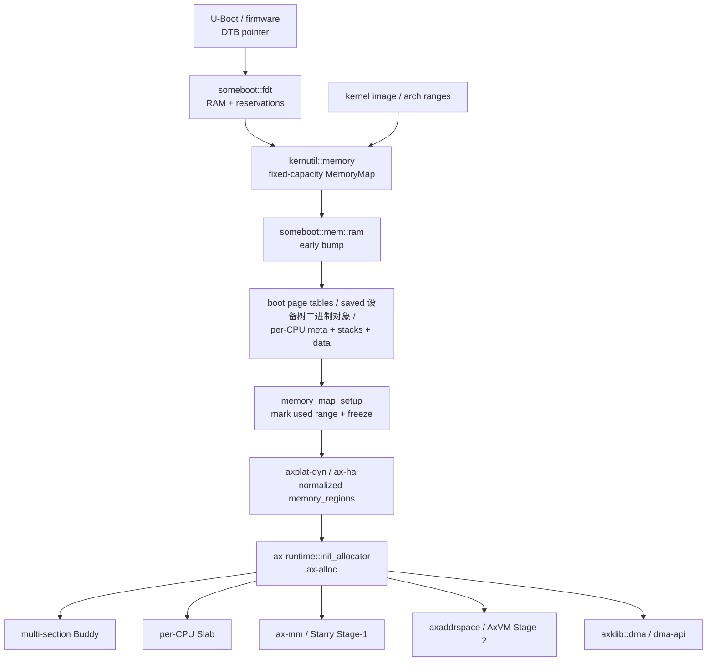
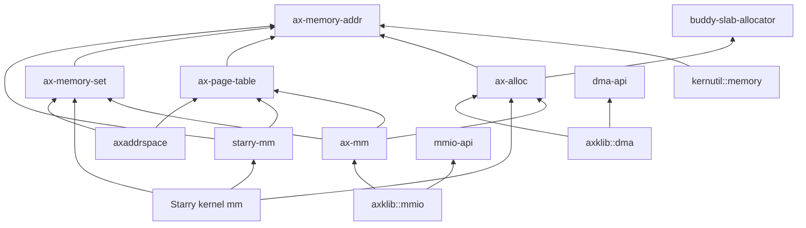
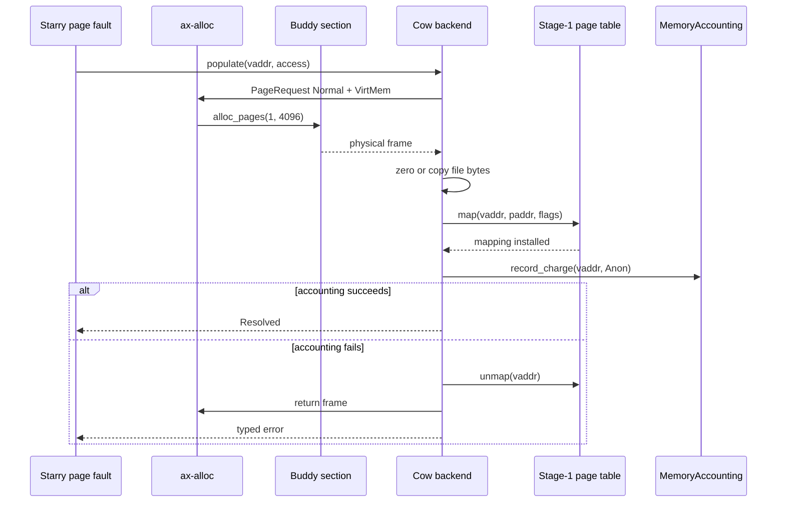

# 内存管理总体架构

TGOSKits 的内存管理采用“启动期事实发现、运行期统一分配、页表机制复用、系统策略并列”的结构。公共层只维护地址、物理页、页表和区间事务等机制；ArceOS、StarryOS 与 Axvisor 分别实现内核地址空间、Linux 兼容虚拟内存和客户机第二阶段地址转换策略。本文档集只直接使用 DMA、CPU、MMU、MMIO、RAM 和 API 等通用缩写，其他领域术语按第 7 节的全称和中文名称使用。

## 1. 架构边界

内存组件按资源所有权而不是按操作系统名称分层。这样可以让嵌入式配置裁剪不需要的策略，同时避免 StarryOS 和 Axvisor 复制底层页分配或页表实现。

### 1.1 公共机制

公共机制只处理跨系统稳定的事实和不变量，不解释 Linux syscall、Guest 生命周期或设备驱动策略。下表列出当前公共核心及其唯一职责。

| 组件 | 主要职责 | 不负责的内容 |
| --- | --- | --- |
| `ax-memory-addr` | Host 物理地址、虚拟地址、地址范围与页对齐 | 分配、映射策略、Guest 地址语义 |
| `kernutil::memory` | 启动期固定容量 `MemoryDescriptor` 与区间合并 | 运行期页分配、动态虚拟内存区域 |
| `ax-alloc` | 页、内核堆、`GlobalAlloc`、zone 与用量统计的公共入口 | 回收、阻塞、虚拟文件系统 callback、Linux overcommit |
| `buddy-slab-allocator` | 多物理段 Buddy、per-CPU Slab、跨 CPU 释放 | 公共 API、用途策略、DMA domain |
| `ax-page-table` | 页表项、Stage-1、Stage-2、boot 页表机制 | 物理页来源、虚拟内存区域策略、输入输出内存管理单元 domain |
| `ax-memory-set` | 虚拟内存区域元数据和 map/unmap/protect 事务 | 特定页表格式、写时复制、syscall 应用程序二进制接口 |

这些组件均以 `no_std` 为基本边界。`buddy-slab-allocator` 是 `ax-alloc` 的实现依赖，不应成为普通消费者绕过 `ax-alloc` 的第二公共入口。

### 1.2 策略与适配层

策略层拥有各自领域的不变量，并通过公共机制完成工作。当前三条主要路径是 ArceOS 的 `ax-mm`、StarryOS 的 `starry-mm` 加 kernel backend，以及 Axvisor 的 `axaddrspace`。

| 策略或适配组件 | 所属领域 | 当前边界 |
| --- | --- | --- |
| `someboot` | 启动 | 解析固件内存、early bump、boot 页表、全 CPU 启动栈预分配 |
| `ax-hal` / `ax-runtime` | ArceOS 接线 | 规范化平台内存区、初始化 `ax-alloc`、初始化本 CPU Slab |
| `ax-mm` | ArceOS | 内核/用户 Stage-1 地址空间、线性和按需分配 backend、MMIO 映射 |
| `starry-mm` | StarryOS 公共策略 | 常驻内存集大小/虚拟内存大小、commit、写时复制计数、文件 capability、故障结果与有界回收策略 |
| Starry kernel `mm` | StarryOS OS glue | Linux 虚拟内存区域/backend、页表操作、虚拟文件系统/page-cache adapter、syscall/errno/signal 接线 |
| `axaddrspace` | Axvisor | Guest physical address space、Guest RAM、Stage-2 映射策略 |
| `dma-api` / `axklib::dma` | 设备能力 | 设备约束、DMA ownership、allocator/cache 平台适配 |
| `mmio-api` / `axklib::mmio` | 设备能力 | MMIO 寄存器映射、易失性访问与平台地址空间适配 |

`starry-mm` 当前不是完整 Linux `mm` 的独立实现。公共策略已经提取，但具体写时复制/file/shared backend 与页表游标仍位于 `os/StarryOS/kernel/src/mm/aspace/`，这是现状边界而不是额外的一套公共内存核心。

## 2. 端到端数据流

系统从固件提供的物理内存事实出发，依次经过启动期占用裁剪、运行期分配器接管，再由不同地址空间或设备能力消费。整个流程没有把多段内存强行拼成一个连续地址区。

### 2.1 启动到运行期

下图描述动态平台使用 `someboot` 时的主要交接。箭头表示事实或资源所有权的传递，不表示所有组件之间存在 Rust crate 直接依赖。



启动 bump 使用的区间在冻结前被重新标记为 `Reserved`，因此不会再次进入 Buddy。运行期每个 `Free` 物理段作为独立 section 加入分配器，连续页分配不能跨越段边界。

### 2.2 运行期请求路径

运行期请求先按资源类型选择公共能力，再进入具体策略。普通 byte allocation、显式页分配、虚拟映射和 DMA 的入口不同，但最终物理 RAM 均由 `ax-alloc` 管理。

| 请求 | 公共入口 | 实现路径 | 所有权结束条件 |
| --- | --- | --- | --- |
| 小对象 | Rust allocator / `GlobalAlloc` | `ax-alloc` → per-CPU Slab | byte allocation 被释放 |
| 大对象 | Rust allocator / `GlobalAlloc` | `ax-alloc` → Buddy pages | byte allocation 被释放 |
| 显式物理页 | `alloc_pages(PageRequest, UsageKind)` | `ax-alloc` → Buddy section | `GlobalPage::drop` 或 raw 对称释放 |
| Stage-1 页表页 | `PageFrameProvider` adapter | `ax-mm`/Starry adapter → `ax-alloc` | 页表层级销毁 |
| Guest RAM | `NestedPageTableOps::alloc_frame` | `axaddrspace`/AxVM → `ax-alloc` | 客户机解除映射或虚拟机销毁 |
| DMA buffer | `DeviceDma` 资源获取即初始化 API | `dma-api` → `axklib::dma` → `ax-alloc` | 最后一个 owner 被消费或 Drop |

`PageFrameProvider` 只隔离“页从哪里来”，不会在 `ax-page-table` 内触发回收。Linux 缺页的有界 clean-page reclaim 位于 Starry 地址空间外层，失败后最多重新尝试一次。

## 3. 核心不变量

内存安全和性能依赖少量可审计的不变量。组件拆分的目标是让这些不变量只在一个位置维护，而不是增加调用层数。

### 3.1 所有权不变量

每个可释放物理页在任一时刻只能属于 Buddy free list、Slab backing 或一个 live owner。不同资源使用显式 token 或资源获取即初始化类型避免重复释放。

| 资源 | 所有者或状态来源 | 关键类型 |
| --- | --- | --- |
| 普通页 / DMA32 页 | `ax-alloc` 内部 Buddy section | `PageRequest`、`GlobalPage` |
| Slab backing 页 | owner CPU 的 Slab | `SlabPageHeader`、remote-free stack |
| 虚拟内存区域与页表项变更 | 地址空间事务 | `MappingOperation`、`MappingPlan`、`CommitState` |
| Starry 写时复制页 | Starry backend 与引用状态 | `CowFrameReferences`、`MemoryAccounting` |
| DMA allocation/map | `dma-api` 资源获取即初始化 owner | `DmaAllocHandle`、`DmaMapHandle`、`DmaAllocation` |

`DmaAllocHandle` 和 `DmaMapHandle` 是按值消费的 backend token，不实现 `Copy` 或 `Clone`。`GlobalPage` 记录原始 zone 和 usage，Drop 时返回对应 Buddy section 并更新同一统计表。

### 3.2 上下文与并发不变量

Buddy 采用单个非抢占自旋锁，per-CPU Slab 将小对象热路径留在本 CPU，跨 CPU free 使用 `SlabPageHeader::remote_free` 的无锁栈。当前设计不引入非统一内存访问、page migration、compaction 或完整 Linux 每处理器页缓存。

| 上下文 | 允许的内存路径 | 禁止或应预分配的路径 |
| --- | --- | --- |
| early boot | checked bump、boot 页表、固定容量 metadata | 调度等待、回收、文件 I/O |
| 普通内核线程 | Slab、Buddy、地址空间事务 | 持 allocator 锁调用虚拟文件系统/reclaim |
| 中断请求 / 实时 critical | 固定池或已经预留的 ring/descriptor | 通用堆、Buddy、Slab 扩容、回收 |
| Starry 用户缺页 | backend fault、外层一次有界 clean-page reclaim | 中断请求上下文 fault、无限重试 |
| Guest fault | `axaddrspace` 按需 Guest RAM | 隐式 Host reclaim callback |

当前不提供没有生产消费者的通用 实时 guard；中断请求和 实时 路径由具体组件预分配固定对象，并通过路径审计与测试保证不进入通用分配器。

## 4. 组件依赖

依赖方向以底层机制不反向依赖上层策略为准。尤其是 `ax-page-table` 不依赖 `ax-alloc`，`dma-api` 不拥有全局 allocator，`starry-mm` 不反向依赖 Starry kernel/虚拟文件系统/task/signal 实现。

### 4.1 公共层依赖

公共层依赖关系保持窄接口。下面的图只展示内存主线，省略日志、错误类型和同步原语等辅助依赖。



这里的 `starry-mm → ax-page-table` 只复用共享页大小等第一阶段类型；具体页表修改仍通过 Starry kernel backend 完成。第二阶段代码只由虚拟化消费者启用。`mmio-api` 不依赖 `ax-mm`，实际映射由 `axklib::mmio` 经运行时能力进入 `ax-mm::iomap()`。

### 4.2 功能裁剪

公共 crate 的 feature 表达实际链接能力，不把“系统 profile 名称”伪装成已经存在的 Cargo feature。当前关键 feature 如下。

| Crate | Feature | 链接或行为 |
| --- | --- | --- |
| `ax-alloc` | `global-allocator` | 注册 Rust 全局分配器 |
| `ax-alloc` | `smp` | 启用 多核/per-CPU Slab 所需支持 |
| `ax-alloc` | `tracking` | 启用分配跟踪 |
| `ax-page-table` | `stage1` / `stage2` / `boot` | 分别链接 Host、Guest 或启动页表入口 |
| `ax-page-table` | `copy-from` | 启用 Stage-1 页表复制能力 |
| `starry-mm` | `starry-strict-commit` | 将 overcommit admission 切换为 Strict |

`embedded-default`、`starry` 和 `hypervisor` 是配置组合概念，不是当前 `memory/ax-alloc/Cargo.toml` 中的 feature。系统配置应组合真实 feature，文档和构建脚本不得依赖不存在的名字。

## 5. 维护归属

内存改动必须落在拥有相应不变量的组件和文档中，避免同一规则在多个页面形成不同版本。本节规定机制变更与系统策略变更的权威说明位置。

### 5.1 机制变更

固件交接、分配、栈、地址翻译和区间事务属于公共机制。修改这些行为时，应更新对应权威页面中的源码锚点、不变量和验证条件。

| 变更领域 | 权威文档 | 必须同步的内容 |
| --- | --- | --- |
| 固件与多段 RAM | [启动内存](./boot-memory.md) | 内存图、保留区、bump 状态和运行时交接 |
| 页与堆 | [运行时分配器](./runtime-allocator.md) | Buddy/Slab、zone、统计和上下文约束 |
| 栈 | [栈管理](./stacks.md) | CPU0、per-CPU、任务栈和 guard page |
| 设备寄存器映射 | [MMIO 映射](./mmio.md) | 设备窗口、页属性、易失性访问和映射生命周期 |
| 地址翻译 | [页表核心](./page-table.md) | entry、Stage-1、Stage-2、boot 和地址转换后备缓冲区 |
| 区间事务 | [地址空间](./address-space.md) | 虚拟内存区域 split、prepare/commit/rollback 和故障注入 |

机制页面只描述公共所有权和执行规则，不应写入 Starry syscall、具体 DMA 设备或 Guest 生命周期策略。

### 5.2 策略变更

Linux 虚拟内存、设备 DMA 和三套系统的组合方式属于消费策略。修改这些行为时，应在对应页面记录能力边界，并在测试页面登记可执行的验证入口。

| 变更领域 | 权威文档 | 必须同步的内容 |
| --- | --- | --- |
| Linux 兼容虚拟内存 | [StarryOS 内存](./starry-mm.md) | 虚拟内存区域、写时复制、常驻内存集大小/虚拟内存大小、commit 和 fault/reclaim |
| 设备内存 | [DMA 内存](./dma.md) | mask/domain、coherent/streaming 和资源获取即初始化 owner |
| 系统接线 | [系统集成](./integration.md) | ArceOS、StarryOS、Axvisor 的依赖与启动顺序 |
| 验收约束 | [测试与限制](./testing.md) | 故障注入、性能指标、静态检查和当前限制 |

维护时应先更新行为真正所属的页面，再检查交叉链接和源码名称。规划中的能力只有在源码、feature 和测试都存在后才能写入“当前实现”。

## 6. 端到端实例

一个物理地址从固件描述进入系统后，会先后经历“事实分类、启动占用、运行时所有权、虚拟映射或设备可见性”四类状态。下面使用两段不连续 RAM 展开这条路径；地址是用于说明算法的确定性输入，所有区间均采用半开形式 `[start, end)`。

### 6.1 多段内存交接

假设固件报告两个 RAM bank，内核被加载到第一个 bank，第二个 bank 中存在设备固件保留区。`someboot::fdt::memory::init_memory_map()` 先把两个 bank 都登记为 `Free`，随后 `MemoryMapExt::merge_add()` 用 `KImage` 和 `Reserved` 覆盖相交的 Free 子区间。

| 输入事实 | 地址范围 | 大小 | 初始类型 |
| --- | --- | ---: | --- |
| RAM bank 0 | `0x4000_0000..0x4800_0000` | 128 MiB | `Free` |
| kernel image | `0x4020_0000..0x40e0_0000` | 12 MiB | `KImage` |
| RAM bank 1 | `0x8000_0000..0x9000_0000` | 256 MiB | `Free` |
| device firmware | `0x8800_0000..0x8820_0000` | 2 MiB | `Reserved` |

覆盖完成后，内存图不把物理 hole `0x4800_0000..0x8000_0000` 表示成任何 RAM。`select_early_ram()` 比较剩余 Free 描述符的大小，选择 bank 1 的较大子段作为 early bump arena；该选择不会改变其他 Free 段的类型。

```text
0x4000_0000                                                     0x4800_0000
    |------ Free 2 MiB ------| KImage 12 MiB |---- Free 114 MiB ----|

0x4800_0000                                                     0x8000_0000
    |------------------------- physical hole -------------------------|

0x8000_0000                                                     0x9000_0000
    |----------- Free 128 MiB -----------| Rsv 2 MiB |-- Free 126 MiB --|
                                         0x8800_0000  0x8820_0000
```

假设 boot 页表、设备树二进制对象 副本和四个 CPU 区域共占用 `0x8000_0000..0x8024_0000`，`memory_map_setup()` 会把这一前缀发布为 `Reserved` 并冻结 bump。运行时最终看到四个 Free 描述符，而不是一个伪连续 heap。

| 运行时 Free section 候选 | 大小 | 处理方式 |
| --- | ---: | --- |
| `0x4000_0000..0x4020_0000` | 2 MiB | 作为后续 Buddy section；metadata 后可能无足够 managed heap，需检查 `managed_bytes()` |
| `0x40e0_0000..0x4800_0000` | 114 MiB | `global_add_memory()` |
| `0x8024_0000..0x8800_0000` | 125.75 MiB | 最大段，优先 `global_init()` |
| `0x8820_0000..0x9000_0000` | 126 MiB | 实际比上一段更大时成为初始化段；选择以代码扫描结果为准 |

`ax-runtime::init_allocator()` 实际会重新扫描全部 `MemRegionFlags::FREE` 区域并选择最大段。因此本例中 `0x8820_0000..0x9000_0000` 的 126 MiB 是首个 section，`0x8024_0000..0x8800_0000` 和 bank 0 的合法段随后加入。表格刻意保留这一比较，避免把“early bump 最大段”和“冻结后 runtime 最大段”误认为必然相同。

### 6.2 页所有权变化

假设 Starry 缺页路径请求一个匿名 4 KiB 页。物理页从 Buddy free list 移出后，先由 `GlobalPage` 或 backend 临时所有，再写入页表项并转移给写时复制 frame owner；虚拟内存区域只描述虚拟范围，不直接拥有 Buddy free-list 节点。



这里的回滚顺序是安全要求：只有页表项成功删除后才能归还 frame，否则 CPU 仍可能通过旧 translation 访问已经重新分配的物理页。连续预读一次填充多页时，`CowBackend::rollback_fault_run()` 逆序撤销此前成功的页，并同步删除对应常驻内存集大小 charge。

### 6.3 关键调用链

维护者定位问题时应沿资源流而不是沿 crate 名称猜测。下面的调用链给出从启动内存到三类消费者的具体源码锚点，其中箭头左侧函数负责建立下一层的输入不变量。

| 资源流 | 关键调用链 |
| --- | --- |
| 固件 RAM | `init_memory_map()` → `add_memory_descriptor()` → `MemoryMapExt::merge_add()` |
| early boot | `early_init()` → `select_early_ram()` → `ram::init()` → `alloc_percpu()` |
| runtime allocator | `init_allocator()` → `global_init()` / `global_add_memory()` → `GlobalAllocator::init()` / `add_region()` |
| Stage-1 页表页 | `PagingHandlerImpl::alloc_frame()` → `ax_alloc::alloc_pages(..., PageTable)` |
| Starry anonymous fault | `AddrSpace::handle_page_fault()` → `Backend::populate()` → `CowBackend::alloc_new_at()` |
| Guest RAM | `axaddrspace::Backend::Alloc` → `NestedPageTableOps::alloc_frame()` |
| DMA | `DeviceDma` → `KlibDma::alloc_for_layout()` → `dma_alloc_pages()` |

同一个底层页分配入口并不意味着相同策略。`UsageKind` 记录用途，具体释放者则由页表 owner、写时复制 owner、Guest backend 或 DMA 资源获取即初始化 owner决定；任何新路径都必须能指出唯一的最终释放动作。

## 7. 术语约定

内存文档以中文名称表达设计含义，只为跨源码、硬件手册或外部规范检索保留必要缩写。源码类型、Cargo feature、命令和路径保持原名，不能为了翻译而改写代码符号。

### 7.1 通用缩写

DMA、CPU、MMU、MMIO、RAM 和 API 在本项目目标读者范围内属于通用缩写，正文可以直接使用。每个缩写仍有固定含义，不能把 DMA 内存、MMIO 寄存器窗口或普通 RAM 混为同一资源。

| 缩写 | 英文全称 | 中文名称 |
| --- | --- | --- |
| DMA | Direct Memory Access | 直接内存访问 |
| CPU | Central Processing Unit | 中央处理器 |
| MMU | Memory Management Unit | 内存管理单元 |
| MMIO | Memory-Mapped Input/Output | 内存映射输入输出 |
| RAM | Random-Access Memory | 随机存取内存 |
| API | Application Programming Interface | 应用程序编程接口 |
| OS | Operating System | 操作系统 |

图中的空间有限时可以只写这些缩写，图前后的正文必须补足资源来源、地址类型和生命周期，不能让缩写代替设计约束。

### 7.2 领域术语

领域术语第一次出现时采用“英文全称（中文名称，缩写）”，后续优先使用中文名称。需要与源码符号或外部规范逐字对应时，可以在中文名称后保留缩写。

| 缩写 | 英文全称 | 中文名称 |
| --- | --- | --- |
| NUMA | Non-Uniform Memory Access | 非统一内存访问 |
| RAII | Resource Acquisition Is Initialization | 资源获取即初始化 |
| COW | Copy-on-Write | 写时复制 |
| PTE | Page Table Entry | 页表项 |
| TLB | Translation Lookaside Buffer | 地址转换后备缓冲区 |
| VMA | Virtual Memory Area | 虚拟内存区域 |
| RSS | Resident Set Size | 常驻内存集大小 |
| VSS | Virtual Memory Size | 虚拟内存大小 |
| IOMMU | Input-Output Memory Management Unit | 输入输出内存管理单元 |
| IOVA | Input-Output Virtual Address | 输入输出虚拟地址 |
| IOTLB | Input-Output Translation Lookaside Buffer | 输入输出地址转换后备缓冲区 |
| LRU | Least Recently Used | 最近最少使用 |
| PCP | Per-CPU Page Cache | 每处理器页缓存 |
| BSP | Bootstrap Processor / Board Support Package | 引导处理器 / 板级支持包；必须按上下文写明中文含义 |
| AP | Application Processor | 应用处理器 |
| IRQ | Interrupt Request | 中断请求 |
| RTOS | Real-Time Operating System | 实时操作系统 |
| ABI | Application Binary Interface | 应用程序二进制接口 |
| VFS | Virtual File System | 虚拟文件系统 |
| HAL | Hardware Abstraction Layer | 硬件抽象层 |
| PA / VA | Physical Address / Virtual Address | 物理地址 / 虚拟地址 |
| OOM killer | Out-of-Memory Killer | 内存不足终止器 |
| RT | Real-Time | 实时 |
| SMP | Symmetric Multiprocessing | 对称多处理；正文按语义写作“多核” |
| IPI | Inter-Processor Interrupt | 处理器间中断 |
| NPT | Nested Page Table | 嵌套页表 |
| ISR | Interrupt Service Routine | 中断服务程序 |
| FDT | Flattened Device Tree | 扁平设备树 |
| DTB | Device Tree Blob | 设备树二进制对象 |
| MPU | Memory Protection Unit | 内存保护单元 |
| SMMU | System Memory Management Unit | 系统内存管理单元 |
| GPA / HPA / IPA | Guest / Host / Intermediate Physical Address | 客户机 / 主机 / 中间物理地址 |
| VM | Virtual Memory / Virtual Machine | 虚拟内存 / 虚拟机；必须按上下文写明中文含义 |

`PteConfig`、`TlbInvalidator`、`CowFrameReferences` 等代码符号不翻译。正文描述这些符号承担的职责时，分别使用页表项配置、地址转换后备缓冲区失效器和写时复制页引用，保证不阅读源码也能理解设计。
