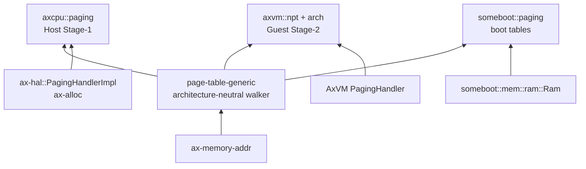
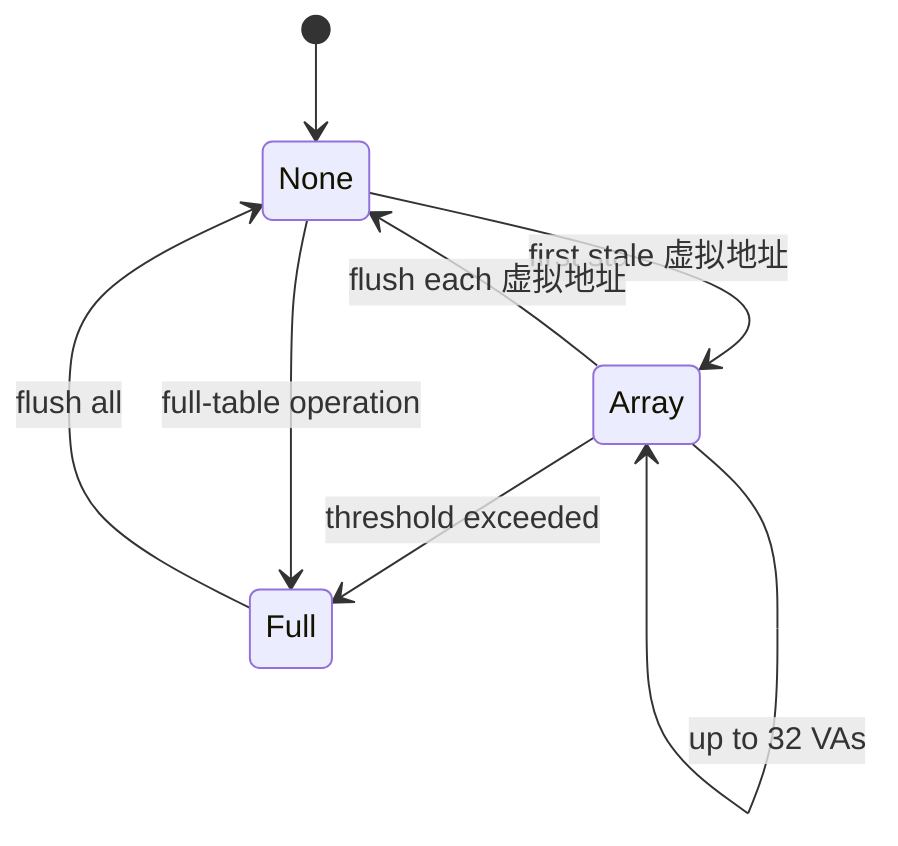

# 页表分层与实现

页表不再由一个同时识别全部架构和执行阶段的 crate 统一实现。代码按执行上下文归属：`axcpu::paging` 拥有主机第一阶段页表，`axvm` 拥有客户机第二阶段页表适配，`someboot` 拥有启动页表适配；`page-table-generic` 只保留不含 `target_arch` 分支的遍历算法和页帧能力接口。Virtual Memory Area（虚拟内存区域，VMA）和物理页回收策略仍由上层持有。

## 1. 组件结构

主机页表与 CPU 寄存器、页表项格式和地址转换后备缓冲区失效指令直接相关，因此位于 `components/axcpu`。第二阶段页表只服务虚拟机，位于 `virtualization/axvm`。启动页表依赖 early bump 和启动地址布局，位于 `platforms/someboot`。只有递归建表、遍历、映射和页帧来源约束可被三个上下文复用。

### 1.1 所有权边界

| 所有者 | 主要源码 | 主要类型 | 消费者 |
| --- | --- | --- | --- |
| `page-table-generic` | `memory/page-table-generic/src/` | `PageFrameProvider`、`PageTable`、`TableMeta`、`PageTableEntry`、`PteConfig` | `axcpu`、`axvm`、`someboot` |
| `axcpu::paging` | `components/axcpu/src/paging/` | `PageTable32/64`、cursor、`PagingMetaData`、`GenericPTE`、`TlbInvalidator`、架构页表项 | `ax-hal`、`ax-mm`、StarryOS |
| `axvm` | `virtualization/axvm/src/arch/*/`、`src/npt.rs` | 第二阶段页表项、几何、失效实现、`GenericNestedPageTable` | Axvisor、`axaddrspace` adapter |
| `someboot` | `platforms/someboot/src/arch/*/paging*` | 启动页表项、几何、寄存器启用流程 | 动态平台启动 |

`page-table-generic` 没有 `stage1`、`stage2` 或 `boot` feature，也不包含架构页表项。关闭虚拟化或动态启动时，相应 adapter 不会因为公共内存 crate 而进入镜像。

### 1.2 依赖边界

公共算法只依赖地址类型和固定开销容器，不依赖 `ax-alloc`。启动 provider 使用 bump arena，主机运行时 provider 使用 Buddy，第二阶段 provider 使用 AxVM 的主机页能力，测试使用模拟 frame source。只服务主机页表的地址转换后备缓冲区 scope 和 invalidator 位于 `axcpu::paging`，不扩大公共核心接口。



frame provider 是能力注入，不是 allocator facade。页表层收到 `None` 时返回 `PagingError::NoMemory`，不会注册 reclaim callback 或重试。

## 2. 公共类型

公共类型只描述共享算法所需的 frame ownership、页表项中性配置、几何和失效能力。主机专用权限位和架构页表项属于 `axcpu::paging`。

### 2.1 页帧来源

`PageFrameProvider` 要求 `Clone + Sync + Send + 'static`，默认 frame size 为 4 KiB。单 frame 方法是最低能力，多 frame 方法允许需要对齐的 root table allocation。

```rust
pub trait PageFrameProvider: Clone + Sync + Send + 'static {
    const FRAME_SIZE: usize = 0x1000;

    fn alloc_frame(&self) -> Option<PhysAddr>;
    fn alloc_frames(&self, num: usize, align: usize) -> Option<PhysAddr>;
    fn dealloc_frame(&self, paddr: PhysAddr);
    fn dealloc_frames(&self, paddr: PhysAddr, num: usize);
    fn phys_to_virt(&self, paddr: PhysAddr) -> VirtAddr;
}
```

运行时 `os/arceos/modules/axhal/src/paging.rs::PagingHandlerImpl` 使用 `MemoryZone::Normal` 和 `UsageKind::PageTable`。启动期 `Ram` provider 从 early bump 分配且不逐 frame 释放。AxVM 的 `GenericFrameAllocator` 则把调用转交给 `PagingHandler`。

### 2.2 页表项配置与错误

`PteConfig` 是公共 walker 使用的中性配置，`PageTableEntry` 把它转换为第二阶段或启动期的硬件条目。主机第一阶段使用 `axcpu::paging::GenericPTE` 和 `MappingFlags`，不要求公共核心理解主机页表位布局。

| 类型 | 表达内容 | 不表达的内容 |
| --- | --- | --- |
| `MemAttributes` | Normal、PerCpu、Device、Uncached | DMA coherence 协议 |
| `PteConfig` | paddr、valid、huge、directory 与通用 flags | frame allocation policy |
| `PagingError` | NoMemory、NotMapped、alignment、conflict、hierarchy 等 | syscall errno 与 signal |
| `axcpu::paging::MappingFlags` | 主机页表 read/write/execute/user/device/uncached 位 | 虚拟内存区域 pathname、写时复制 owner |

上层在 OS 边界把 `PagingError` 转为 `AxError` 或领域错误。页表实现不直接返回 Linux errno，也不记录虚拟内存区域 metadata。

`PteConfig` 与架构位编码无关，AxVM 和 someboot 的 adapter 都通过它表达“页表项应该是什么样”。该结构允许调用方按字段比较编码前后的语义，避免公共 walker 读取架构 bitfield。

```rust
#[derive(Default, Debug, Clone, Copy, PartialEq, Eq)]
pub struct PteConfig {
    pub paddr: PhysAddr,
    pub valid: bool,
    pub read: bool,
    pub writable: bool,
    pub executable: bool,
    pub lower: bool,
    pub dirty: bool,
    pub global: bool,
    pub is_dir: bool,
    pub huge: bool,
    pub mem_attr: MemAttributes,
}
```

`MemAttributes` 使用枚举，是因为一次映射只能选择 Normal、PerCpu、Device 或 Uncached 之一。组合权限只存在于具体上下文：主机使用 `axcpu::paging::MappingFlags`，AxVM 将 `axvm_types::MappingFlags` 转换为 `PteConfig`，someboot 直接为启动映射构造 `PteConfig`。

## 3. 主机页表

`axcpu::paging` 面向 Host CPU 地址空间，按 pointer width 选择 `PageTable32` 或 `PageTable64`。架构 metadata 决定层数、物理/虚拟地址宽度、地址类型和地址转换后备缓冲区 invalidator。

### 3.1 架构元数据

`PagingMetaData` 将固定架构事实集中在类型参数中。当前公共 `PageSize` 支持 4 KiB、1 MiB、2 MiB 和 1 GiB，具体架构只会使用硬件允许的组合。

| 架构 metadata | 层数/地址形态 | 地址转换后备缓冲区 scope |
| --- | --- | --- |
| `A64PagingMetaData` | 4 层、48-bit 虚拟地址/物理地址 | `HardwareBroadcast` |
| `Sv39MetaData` | 3 层、39-bit 虚拟地址 | `Local` |
| `Sv48MetaData` | 4 层、48-bit 虚拟地址 | `Local` |
| `X64PagingMetaData` | x86_64 4-level Host 表 | `Local` |
| `LA64MetaData` | LoongArch64 Host 表 | `Local` |
| `A32PagingMetaData` | 32-bit ARM 表 | `Local` |

`vaddr_is_valid()` 在创建或查询映射时拒绝超出架构宽度的地址。AArch64 对高地址执行显式 sign-extension 棡查。

### 3.2 游标与批量失效

主机页表 cursor 集中 `map`、`remap`、`protect`、`unmap`、region 操作和可选 `copy_from`。cursor 记录失效请求，在显式 `flush()` 或 Drop 时统一执行。



`SMALL_FLUSH_THRESHOLD` 当前为 32。新 map 通常没有旧 translation 需要失效；unmap、remap、protect 和 copy 等修改会按实际操作记录地址或升级为 full flush。

### 3.3 区域页尺寸选择

`components/axcpu/src/paging/bits64.rs::map_region()` 在 `allow_huge=true` 时按从大到小的顺序选择叶子页尺寸。每一步都要求虚拟地址、物理地址和剩余长度满足该页尺寸的对齐与容量条件；任一条件不满足就下降一级。

| 候选页尺寸 | 选择条件 | 单个页表项覆盖范围 |
| --- | --- | ---: |
| 1 GiB | 架构支持，虚拟地址与物理地址均 1 GiB 对齐，剩余长度不少于 1 GiB | 1 GiB |
| 2 MiB | 架构支持，虚拟地址与物理地址均 2 MiB 对齐，剩余长度不少于 2 MiB | 2 MiB |
| 4 KiB | 基础页对齐 | 4 KiB |

算法允许同一请求由不同页尺寸拼接。例如一个起点仅 4 KiB 对齐的范围会先用基础页映射到 2 MiB 边界，再使用 2 MiB 或 1 GiB 页，末尾不足大页的部分再退回基础页。调用方必须在权限、缓存属性或所有权发生变化的边界拆分请求，不能用一个大页跨越属性不同的物理区间。

各执行上下文决定是否启用大页。当前主要调用点的策略如下。

| 消费者路径 | `allow_huge` | 当前原因或结果 |
| --- | --- | --- |
| `someboot` 启动映射 | `true` | 尽量缩小启动页表并减少遍历层级 |
| `axaddrspace` Guest linear | `true` | 已知连续 Host 物理范围可使用大页 |
| `ax-mm` ArceOS linear | `false` | 当前范围 backend 以 4 KiB 基础页执行局部操作 |
| `ax-mm` allocation-backed | `false` | 物理页可能不连续，按基础页拥有和回收 |

因此“页表核心支持 1 GiB/2 MiB 页”不等于“内核直接映射已经使用大页”。大范围映射的性能评估必须记录实际生成的各尺寸页表项数量。

## 4. 地址转换后备缓冲区一致性

页表项修改与地址转换后备缓冲区 shootdown 是同一个正确性协议的两部分。公共接口描述 invalidator scope，`axcpu` 提供本地架构操作，系统层负责保证所有可能运行该地址空间的 CPU 都观察到失效。

### 4.1 失效范围

`TlbInvalidator<A>` 提供 `const SCOPE`、`invalidate(Option<A>)` 和批量 `invalidate_list(&[A])`。`Some(vaddr)` 表示单地址，`None` 表示全部；scope 明确硬件操作能覆盖的 CPU 范围。默认批量实现逐地址执行，运行时 adapter 可覆盖为一次远程处理器间中断批处理。

| `TlbScope` | 含义 | 当前示例 |
| --- | --- | --- |
| `Local` | 只失效当前 CPU | RISC-V `sfence.vma`、x86、LoongArch 本地操作 |
| `HardwareBroadcast` | 架构指令广播到 shareable domain | AArch64 `tlbi ...is` |
| `RemoteIpi` | invalidator 自身完成 remote 处理器间中断 | 接口支持，当前 Stage-1 架构实现未使用 |

AArch64 `A64TlbInvalidator` 使用 inner-shareable TLBI，并在汇编序列中执行 DSB/ISB。其他 local-only 架构需要系统 处理器间中断 配合。

### 4.2 多核 启动检查

`axcpu::paging::smp_invalidation_available<M>()` 检查 metadata 的 invalidator scope。`ax-mm::init_memory_management()` 调用 `ax_hal::paging::validate_smp_invalidation()`；多 CPU 且既无硬件 broadcast 又未启用 `ax-hal/ipi` 时会 assert 失败。是否使用远程处理器间中断由 `ax-hal::paging::RuntimeTlbInvalidator` 的类型配置表达，而不是额外布尔参数。

| 运行配置 | 是否允许多 CPU Stage-1 |
| --- | --- |
| AArch64 hardware broadcast | 允许，即使页表层不依赖软件 处理器间中断 |
| local-only 架构 + `ax-hal/ipi` | 允许，由上层 shootdown 协议覆盖 remote CPU |
| local-only 架构、无 处理器间中断、CPU 数大于 1 | 初始化失败 |
| 单 CPU | 允许 local invalidation |

该检查保证 capability 存在，但每个共享地址空间的具体 remote shootdown 时序仍由调用方负责。不能因为 cursor 在 Drop 时 local flush 就认为跨 CPU 一致性自动完成。

### 4.3 启动阶段切换

非 AArch64 多核 在引导处理器初始化 runtime page table 时，处理器间中断 callback 尚未发布可用。`ax-hal` 因此把 remote shootdown 分为两个明确阶段：

| 阶段 | 行为 | 安全依据 |
| --- | --- | --- |
| primary 处理器间中断 ready 之前 | 只刷新 boot CPU 本地地址转换后备缓冲区 | secondary CPU 尚未运行 runtime address space |
| primary 调用 `mark_current_cpu_ready()` 之后 | `enable_remote_tlb_shootdown()` 以 Release 发布，后续修改同步通知 ready CPU | secondary CPU 在发布 ready 前先装载 kernel root 并执行 full local flush |

shootdown 读取 enable 状态使用 Acquire。已 ready CPU 的 处理器间中断 错误是不可恢复的一致性故障；尚未 ready 的 CPU 返回 `CpuOffline` 时可以跳过，因为其 ready 发布前必定执行全量本地失效。AArch64 始终使用 inner-shareable hardware broadcast，不进入该软件开关。

## 5. AArch64 内存属性

AArch64 页表项的 `AttrIndx` 必须与对应执行级的 Memory Attribute Indirection Register（内存属性间接寄存器，MAIR）slot 完全一致。运行时布局位于 `axcpu::paging::entry::aarch64::MemAttrLayout`，启动布局位于 `someboot` 的 AArch64 paging 模块；两者数值一致，但不建立反向 crate 依赖。

### 5.1 属性槽位

当前布局包含 Device-nGnRE、Normal write-back 和 Normal non-cacheable 三个 slot。`MAIR_VALUE` 与这些 index 在同一类型中定义。

| 属性 | `AttrIndx` | MAIR byte | 使用场景 |
| --- | --- | --- | --- |
| Device-nGnRE | 0 | `0x04` | MMIO/device mapping |
| Normal write-back | 1 | `0xff` | 普通 RAM、页表、内核代码和数据 |
| Normal non-cacheable | 2 | `0x44` | uncached mapping |

`MemAttrLayout::MAIR_VALUE` 当前为 `0x44ff04`。`A64PTE` 从 `MappingFlags::DEVICE` 或 `UNCACHED` 选择对应 index，并为 Normal 类型添加 shareability bits。

### 5.2 写寄存器与编码消费

运行时寄存器写入和运行时页表项引用 `axcpu` 内的同一个 layout；启动寄存器写入和启动页表项引用 `someboot` 内的同一个 layout。修改 slot 时必须同时验证两个执行上下文，但不能为了共享三个常量而让 `someboot` 依赖完整 `axcpu`。

| 消费位置 | 使用内容 |
| --- | --- |
| `components/axcpu/src/aarch64/init.rs` | 写 `MAIR_EL1` |
| `platforms/someboot/src/arch/aarch64/el1/mod.rs` | boot EL1 MAIR |
| `platforms/someboot/src/arch/aarch64/el2/mod.rs` | boot EL2 MAIR |
| `platforms/someboot/src/arch/aarch64/paging/pte.rs` | boot 页表项 index encode/decode |
| `components/axcpu/src/paging/entry/arch/aarch64.rs` | Stage-1 `A64PTE` encode/decode |

DMA cache maintenance 不能仅靠把页表项改为 uncached 代替。coherent/streaming ownership 和同步时序属于 `dma-api` 与平台 cache adapter。

## 6. 客户机与启动页表

第二阶段和 boot 需要可变层数、可变 base page size和不同 entry 格式，因此复用 `page-table-generic` 的递归 engine。几何和硬件页表项分别由 `axvm` 与 `someboot` 定义，两者不共享策略代码。

### 6.1 可变几何

`TableMeta` 通过常量描述 entry 类型、base page size、每级 index bits、最大 block level 和是否严格检查地址宽度。engine 由这些常量计算每一级 mapping size。

```rust
pub trait TableMeta: Sync + Send + Clone + Copy + 'static {
    type P: PageTableEntry;
    const PAGE_SIZE: usize;
    const LEVEL_BITS: &[usize];
    const MAX_BLOCK_LEVEL: usize;
    const STRICT_ADDRESS_WIDTH: bool = false;
    fn flush(vaddr: Option<VirtAddr>);
}
```

`MapConfig` 提供虚拟地址、物理地址、size、页表项 template、`allow_huge` 和 `flush`。递归 mapper 只有在 level、剩余大小及虚拟地址/物理地址对齐都满足时才创建 block mapping。

`PageTable<T, A>` 与 `PageTableRef<T, A>` 通过泛型 `T: TableMeta` 描述几何，使同一份递归 mapper 代码可同时服务第二阶段与 boot。下表列出每个 `TableMeta` 决定的一致性条件；具体架构在所属 crate 中提供这些常量。

| `TableMeta` 常量 | 含义 | 决定的行为 |
| --- | --- | --- |
| `PAGE_SIZE` | base page 字节数 | leaf entry 的最小粒度 |
| `LEVEL_BITS: &[usize]` | 每级 index 位数（root 在前） | 计算每级 table 大小和 mapping size |
| `MAX_BLOCK_LEVEL` | 允许 block/huge mapping 的最深 level | 控制递归何时停在 block entry |
| `STRICT_ADDRESS_WIDTH` | 是否严格拒绝超宽地址 | 影响 `vaddr_is_valid()` 行为 |
| `flush(vaddr)` | flush callback | 由架构 invalidator 实现 |

`TableMeta::flush()` 的默认实现可以是空操作；AArch64 hardware-broadcast 与 x86/RISC-V/LoongArch local-only 的差异由具体 adapter 注入，flexible engine 本身不区分架构。

### 6.2 所有权差异

`PageTable<T, A>` 拥有 root frame 并在 Drop 时递归释放；`PageTableRef<T, A>` 引用已有 root，用于接管硬件或固件已建立的表。两者都保留 provider 以完成 frame 地址转换与释放。

| 类型或模块 | root ownership | 典型用途 |
| --- | --- | --- |
| `PageTable` | 拥有并递归释放 | 新建 Guest nested page table |
| `PageTableRef` | 引用既有 root | 固件/硬件表接管或临时操作 |
| `axvm::GenericNestedPageTable` | 由虚拟机生命周期决定 | 客户机中间物理地址或客户机物理地址 → 主机物理地址 |
| `someboot` boot table | early bump 整体保留 | 建立启动 direct map、kernel map |

boot provider 的 deallocation no-op 意味着递归 Drop 不会把页面返回运行时 Buddy；这是 early arena 整体保留语义。Stage-2 runtime provider 则必须真正对称释放页表 frame。

## 7. 消费与审计入口

公共核心只提供机械算法，实际安全性还取决于所属上下文的页表项、provider、地址空间外层同步和架构寄存器初始化。修改公共 API 时必须逐条检查直接消费者。

### 7.1 消费矩阵

当前 workspace 依赖按所有者组合，不再使用统一页表 crate 的阶段 feature。

| 执行路径 | 所有者 | Provider/adapter |
| --- | --- | --- |
| ArceOS / StarryOS Host | `axcpu::paging` | `PagingHandlerImpl` → `ax-alloc` |
| StarryOS fork/copy | `axcpu/copy-from` | Host runtime page provider |
| 动态平台启动 | `someboot` | `Ram` early bump provider |
| Axvisor Guest | `axvm` | `PagingHandler` / nested ops adapter |
| 公共递归算法 | `page-table-generic` | 由上述三个所有者注入 |

ArceOS/Starry production tree 不应直接依赖 `axvm` 的第二阶段实现；Axvisor 也不应通过公共核心链接 `someboot` 的启动 adapter。

### 7.2 源码检查点

以下文件覆盖页表分层后的关键一致性条件。对应的页表项往返转换、映射、查询、解除映射和地址转换后备缓冲区刷新范围用例集中在[内存管理测试与验收](./testing.md)。

| 源码 | 审计重点 |
| --- | --- |
| `memory/page-table-generic/src/common.rs` | provider、error 和页表项 neutral config |
| `components/axcpu/src/paging/entry/` | 主机架构位布局和 `MappingFlags` round-trip |
| `components/axcpu/src/paging/bits32.rs` | 32-bit cursor、region operation、flush batching |
| `components/axcpu/src/paging/bits64.rs` | 64-bit cursor、huge page、copy、flush batching |
| `memory/page-table-generic/src/` | variable geometry、recursive map/unmap/walk/drop |
| `os/arceos/modules/axhal/src/paging.rs` | runtime provider 与 多核 capability check |
| `virtualization/axvm/src/arch/*/` | 第二阶段 geometry、entry 和失效实现 |
| `platforms/someboot/src/arch/*/paging*` | boot geometry、entry 和启用时序 |

页帧分配失败、huge mapping 下继续下钻、地址宽度 overflow、已有 mapping conflict、部分 subtree 回收以及 cursor Drop flush 的验收项见[内存管理测试与验收](./testing.md)。

## 8. 地址翻译实例

页表行为应从地址位划分、页表页来源和失效范围三个维度同时分析。只看到 `map()` 成功并不能证明 provider ownership 或 多核 地址转换后备缓冲区一致性正确。

### 8.1 四级页表遍历

以 64-bit 四级、每级 9-bit index、4 KiB base page 为例，虚拟地址 `0xffff_8000_1234_5000` 的索引为 L4=`0x100`、L3=`0x000`、L2=`0x091`、L1=`0x145`，页内 offset 为 0。`PagingMetaData` 决定层数和地址宽度，cursor 按架构 metadata 提取这些字段。

```text
63                              48 47       39 38       30 29       21 20       12 11        0
+--------------------------------+-----------+-----------+-----------+-----------+------------+
| canonical sign extension       | L4 0x100  | L3 0x000  | L2 0x091  | L1 0x145  | offset 0x0 |
+--------------------------------+-----------+-----------+-----------+-----------+------------+
```

若 L4、L3 已存在而 L2 指向空 entry，映射 4 KiB 页需要为 L1 table 申请一个 frame，再写最终 leaf 页表项。任何中间 frame allocation 返回 `None` 都转换为 `PagingError::NoMemory`，已经临时建立但未链接的 frame 必须释放。


如果目标使用 2 MiB mapping，leaf 停在 L2，虚拟地址、物理地址和 size 都必须 2 MiB 对齐；query 返回该 block 的 base 物理地址，再加 `PageSize::align_offset(vaddr)` 得到最终物理地址。已有 huge entry 下不能静默创建更低一级 table，否则会破坏原映射。

### 8.2 页帧来源交接

`PageFrameProvider` 的接口已在 2.1 节定义，本节只比较不同实现的所有权结果。页表算法既不知道 `MemoryZone`，也不知道 boot bump 或 Guest owner。

三个典型 provider 对同一个“需要一页 L1 table”的请求有不同所有权结果。

| Provider | 分配动作 | `dealloc_frame()` | 生命周期 |
| --- | --- | --- | --- |
| `someboot::mem::ram::Ram` | checked early bump | no-op | used prefix整体 Reserved |
| `ax-hal::PagingHandlerImpl` | `Normal × PageTable` | 返回 `ax-alloc` | Stage-1 table owner |
| AxVM 主机页提供者 | 主机页 API | 返回主机分配器 | 虚拟机或嵌套页表所有者 |

因此 boot table 的 Drop 不能用于判断物理页已回收到 Buddy；相反，runtime provider 的 owned `PageTable` 若未对称释放每个子表 frame 就是泄漏。

### 8.3 映射与失效顺序

假设 cursor 连续 protect 20 个 4 KiB 页。每次修改将虚拟地址加入固定容量 `ArrayVec`，cursor flush 时逐地址调用 invalidator；若修改 40 页，第 33 个地址使状态升级为 `Full`，后续不再记录单地址。

```text
0 addresses       TlbFlusher::None
1..32 addresses   TlbFlusher::Array([va0, ..., vaN])
33+ addresses     TlbFlusher::Full
flush/drop        invalidate_list(...) 或 invalidate(None)，随后回到 None
```

固定阈值避免页表修改为了记录 flush 又申请 heap。单地址列表和 full flush 的选择只优化本次 invalidator 调用，不能改变 `TlbScope`。

```rust
pub const fn smp_invalidation_available<M: PagingMetaData>() -> bool {
    matches!(
        M::Tlb::SCOPE,
        TlbScope::HardwareBroadcast | TlbScope::RemoteIpi
    )
}
```

在 RISC-V、x86_64 或 LoongArch64 等 local-only 实现中，shared kernel mapping 的 unmap 还需要上层 处理器间中断 等待远端 CPU 完成失效。AArch64 inner-shareable TLBI 由硬件覆盖 shareable domain，但仍必须保留架构要求的 DSB/ISB 顺序。

### 8.4 客户机映射实例

假设 Guest 客户机物理地址 `0x4000_0000..0x4020_0000` 映射到 Host 物理地址 `0x9000_0000..0x9020_0000`。当 `allow_huge=true` 且 geometry 允许 2 MiB block 时，flexible mapper可以生成一个 block entry；任一端不对齐时必须下降到 base-page entries。

| 客户机物理地址 | 主机物理地址 | 大小 | 选择 |
| --- | --- | ---: | --- |
| `0x4000_0000` | `0x9000_0000` | 2 MiB | 可使用 2 MiB block |
| `0x4000_1000` | `0x9000_0000` | 2 MiB | 客户机物理地址 未对齐，降级或返回 alignment error |
| `0x4000_0000` | `0x9000_1000` | 2 MiB | 主机物理地址 未对齐，降级或返回 alignment error |
| `0x4000_0000` | `0x9000_0000` | 12 KiB | 使用三个 4 KiB leaf |

Stage-2 entry 只描述 Guest translation，不拥有 Guest RAM policy。allocation-backed Guest RAM 由 `axaddrspace` backend 保存并在成功 unmap 或 teardown 时释放；linear Guest mapping 删除 entry 时不能释放调用方传入的 Host 物理地址。

### 8.5 大范围直接映射

假设虚拟地址和物理地址都按 1 GiB 对齐，整个 12 GiB 区间具有相同权限与缓存属性。允许大页时，`axcpu::paging::PageTable64::map_region()` 可以用 12 个 1 GiB 叶子项完成映射；禁止大页时需要 3,145,728 个 4 KiB 叶子项。

| 映射方式 | 叶子项数量 | 仅 4 KiB 叶子页表存储 | 地址转换后备缓冲区覆盖 |
| --- | ---: | ---: | --- |
| 1 GiB 页 | 12 | 不需要 4 KiB 叶子表 | 每项覆盖 1 GiB |
| 2 MiB 页 | 6,144 | 不需要 4 KiB 叶子表 | 每项覆盖 2 MiB |
| 4 KiB 页 | 3,145,728 | 约 24 MiB | 每项覆盖 4 KiB |

这里的 24 MiB 是 `3,145,728 × 8` 字节的叶子页表项存储，不含少量上级页表。大页通常还能降低地址转换后备缓冲区压力和启动映射时间，但只适用于物理连续、虚拟连续且属性一致的范围；局部 unmap、protect 或写时复制会要求拆分大页或拒绝基础页操作。

页尺寸优化不能代替固件区间分类。固件私有窗口、PCI 地址空洞或不允许 CPU 访问的保留区应先从普通直接映射中排除；只有确定需要 CPU 映射的 RAM 才进入上述尺寸选择。当前 ArceOS linear 直接映射仍传入 `allow_huge=false`，所以表中的 1 GiB 结果是 `axcpu::paging` 已经具备、但该消费路径尚未启用的能力。
